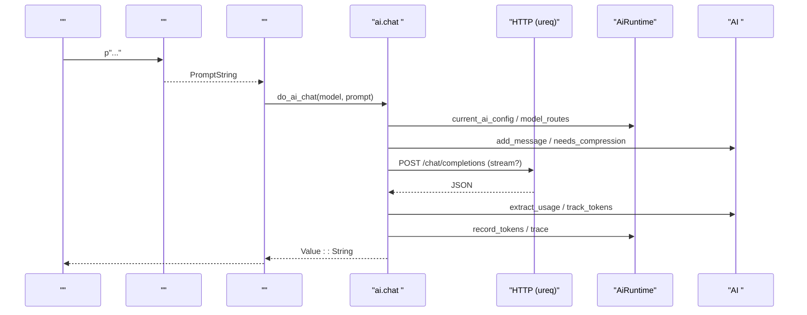
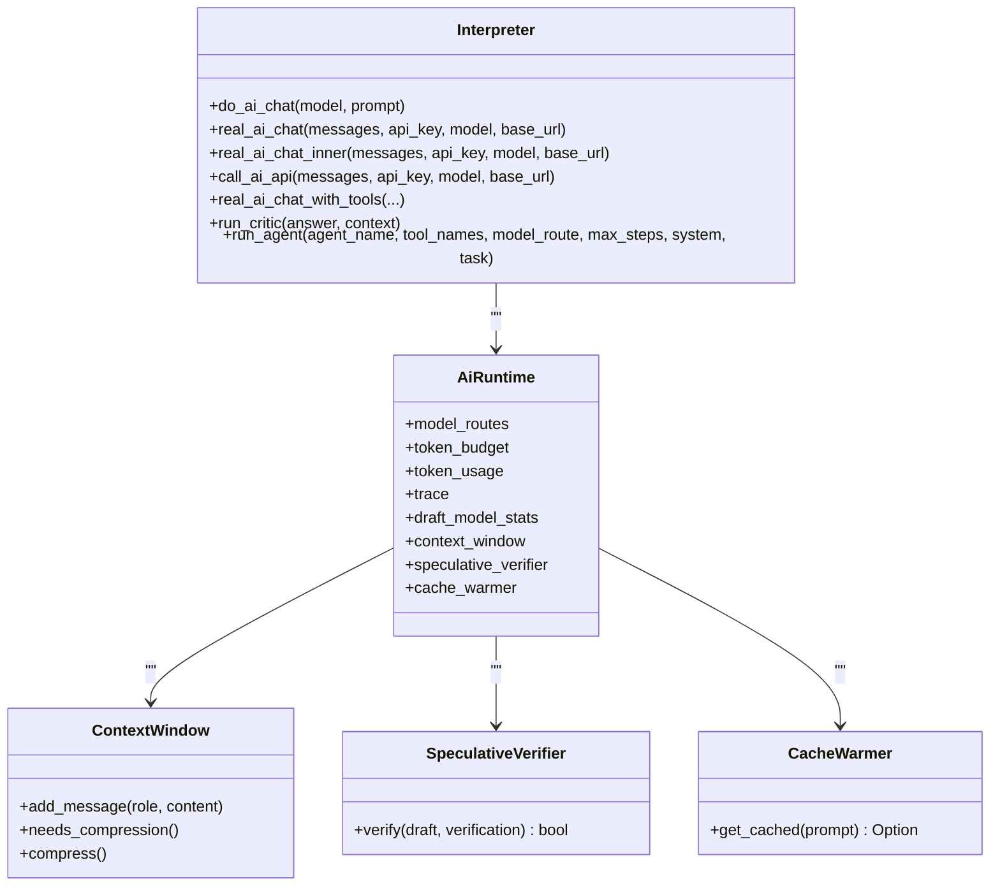
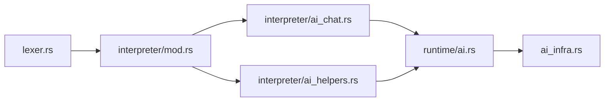

# AI 

<cite>
****   
- [README.md](file://README.md)
- [lexer.rs](file://src/lexer.rs)
- [interpreter/mod.rs](file://src/interpreter/mod.rs)
- [interpreter/ai_chat.rs](file://src/interpreter/ai_chat.rs)
- [interpreter/ai_helpers.rs](file://src/interpreter/ai_helpers.rs)
- [runtime/ai.rs](file://src/runtime/ai.rs)
- [ai_infra.rs](file://src/ai_infra.rs)
- [builtins.rs](file://src/interpreter/builtins.rs)
</cite>

## 
1. [](#)
2. [](#)
3. [](#)
4. [](#)
5. [](#)
6. [](#)
7. [](#)
8. [](#)
9. [](#)
10. [](#)

## 
Mora  AI-native  LLM HTTP/MCP  Agent  AI 
- p"..."  AI 
-  AI ai.chatai.embedai.criticai.retry
- 
- Token  Token 
-  OpenAI  API 


## 
 AI 
-  p"..." 
-  ai.chatai.criticai.retryai.embed 
- AiRuntime Token 
- AI 

```mermaid
graph TB
Lexer["<br/> p\"...\" "] --> Parser[""]
Parser --> Interpreter["<br/> AI "]
Interpreter --> AiRuntime[" AiRuntime<br/>//"]
Interpreter --> Infra["AI <br/>//"]
AiRuntime --> Infra
```


- [lexer.rs:538-729](file://src/lexer.rs#L538-L729)
- [interpreter/mod.rs:1-200](file://src/interpreter/mod.rs#L1-L200)
- [runtime/ai.rs:1-121](file://src/runtime/ai.rs#L1-L121)
- [ai_infra.rs:1-122](file://src/ai_infra.rs#L1-L122)


- [README.md:1-338](file://README.md#L1-L338)
- [lexer.rs:538-729](file://src/lexer.rs#L538-L729)
- [interpreter/mod.rs:1-200](file://src/interpreter/mod.rs#L1-L200)

## 
- p"..."  PromptString  AI 
-  AI 
  - ai.chat/ token/system 
  - ai.critic
  - ai.retry + jitter
  - ai.embed/ v1.0 
-  AiRuntimeToken Trace
- AI 


- [README.md:149-181](file://README.md#L149-L181)
- [interpreter/ai_chat.rs:15-57](file://src/interpreter/ai_chat.rs#L15-L57)
- [interpreter/ai_helpers.rs:107-162](file://src/interpreter/ai_helpers.rs#L107-L162)
- [interpreter/builtins.rs:834-852](file://src/interpreter/builtins.rs#L834-L852)
- [runtime/ai.rs:15-40](file://src/runtime/ai.rs#L15-L40)
- [ai_infra.rs:61-122](file://src/ai_infra.rs#L61-L122)

## 
 Mora  AI  p"..."  HTTP Token 




- [lexer.rs:538-729](file://src/lexer.rs#L538-L729)
- [interpreter/ai_chat.rs:151-212](file://src/interpreter/ai_chat.rs#L151-L212)
- [interpreter/ai_helpers.rs:107-162](file://src/interpreter/ai_helpers.rs#L107-L162)
- [runtime/ai.rs:42-53](file://src/runtime/ai.rs#L42-L53)
- [ai_infra.rs:84-122](file://src/ai_infra.rs#L84-L122)

## 

### p"..." 
-  p  p" {name}"
-  'p'  '"'  prompt_string_from  string_from  PromptString 
-  AI  ai.chat 

```mermaid
flowchart TD
Start([""]) --> Detect[" p\"...\" "]
Detect --> || Parse["prompt_string_from "]
Detect --> || Next["/"]
Parse --> Escape[""]
Escape --> ControlCheck[""]
ControlCheck --> Emit[" PromptString "]
Emit --> End([""])
```


- [lexer.rs:538-729](file://src/lexer.rs#L538-L729)


- [lexer.rs:538-729](file://src/lexer.rs#L538-L729)

###  AI ai.chat
- do_ai_chat Mock current_ai_config effective_model 
- real_ai_chat → real_ai_chat_inner
  -  messages JSON temperature/max_tokens/system 
  -  draft_model  + 
  - max_tokens > 1000  stream:true
  -  model+messages 
  -  + jitter/429/5xx 
  - Token extract_usage  usagetrack_tokens 
  - infra.recorder  web.fetch  ai.chat 




- [interpreter/ai_chat.rs:15-57](file://src/interpreter/ai_chat.rs#L15-L57)
- [interpreter/ai_chat.rs:151-212](file://src/interpreter/ai_chat.rs#L151-L212)
- [interpreter/ai_chat.rs:274-573](file://src/interpreter/ai_chat.rs#L274-L573)
- [runtime/ai.rs:15-40](file://src/runtime/ai.rs#L15-L40)
- [ai_infra.rs:61-122](file://src/ai_infra.rs#L61-L122)


- [interpreter/ai_chat.rs:15-57](file://src/interpreter/ai_chat.rs#L15-L57)
- [interpreter/ai_chat.rs:151-212](file://src/interpreter/ai_chat.rs#L151-L212)
- [interpreter/ai_chat.rs:274-573](file://src/interpreter/ai_chat.rs#L274-L573)
- [interpreter/ai_helpers.rs:107-162](file://src/interpreter/ai_helpers.rs#L107-L162)
- [interpreter/ai_helpers.rs:166-192](file://src/interpreter/ai_helpers.rs#L166-L192)
- [interpreter/ai_helpers.rs:198-242](file://src/interpreter/ai_helpers.rs#L198-L242)
- [interpreter/mod.rs:64-111](file://src/interpreter/mod.rs#L64-L111)

###  AI ai.critic
-  AI “”
- 
  -  OPENAI_API_KEY ai.chat  score/verdict/issues/suggestion
  - Mock 
-  Dict hallucination_check 


- [interpreter/ai_chat.rs:706-768](file://src/interpreter/ai_chat.rs#L706-L768)
- [interpreter/ai_helpers.rs:244-339](file://src/interpreter/ai_helpers.rs#L244-L339)

###  AI ai.retry
-  mini-swe-agent tenacity 
- attempts > 0backoff_ms
- attempts  <= 0 


- [interpreter/builtins.rs:834-852](file://src/interpreter/builtins.rs#L834-L852)

###  AI ai.embed
- v0.04 “ v1.0 ”/
-  web.fetch  API


- [README.md:149-181](file://README.md#L149-L181)
- [interpreter/mod.rs:747-821](file://src/interpreter/mod.rs#L747-L821)

### 
- SSE read_next_sse_token  data:  event/id/retry  choices[0].delta.content [DONE]
-  max_tokens > 1000  stream:true SSE 


- [interpreter/ai_helpers.rs:198-242](file://src/interpreter/ai_helpers.rs#L198-L242)
- [interpreter/ai_chat.rs:482-493](file://src/interpreter/ai_chat.rs#L482-L493)

### 
- is_retryable_error 4295xx  true
- exponential backoff + jitter
- AI_READ_TIMEOUT_SECSHTTP_READ/WRITE_TIMEOUT_SECS  AI  Web 


- [interpreter/mod.rs:64-111](file://src/interpreter/mod.rs#L64-L111)
- [interpreter/ai_chat.rs:503-572](file://src/interpreter/ai_chat.rs#L503-L572)
- [interpreter/mod.rs:46-49](file://src/interpreter/mod.rs#L46-L49)

### 
- route  fast/deep 
- AiRuntime.model_routes ai.chat  current_ai_config  route  model/base_url/api_key
- OPENAI_API_KEYMORA_AI_MODELMORA_AI_BASE_URL 


- [README.md:229-237](file://README.md#L229-L237)
- [interpreter/ai_chat.rs:770-800](file://src/interpreter/ai_chat.rs#L770-L800)
- [interpreter/mod.rs:22-33](file://src/interpreter/mod.rs#L22-L33)
- [runtime/ai.rs:15-40](file://src/runtime/ai.rs#L15-L40)

###  Token 
- Token extract_usage  usage  prompt_tokens/completion_tokenstrack_tokens  Trace
- token_budget.per_call token_budget.total 
- observe trace/span  record_tokens 


- [interpreter/ai_helpers.rs:107-162](file://src/interpreter/ai_helpers.rs#L107-L162)
- [README.md:241-253](file://README.md#L241-L253)

###  OpenAI  API 
- POST /chat/completionsAuthorization: Bearer {api_key}Content-Type: application/json
- base_url  OpenAI 
- modelmessagestemperaturemax_tokenssystemstream 
- choices[0].message.content  text completionsusage  Token 


- [interpreter/ai_chat.rs:446-501](file://src/interpreter/ai_chat.rs#L446-L501)
- [interpreter/ai_helpers.rs:166-192](file://src/interpreter/ai_helpers.rs#L166-L192)

## 
- lexer.rs  p"..."  PromptString 
- interpreter/*  AI 
- runtime/ai.rs  AiRuntime  Trace
- ai_infra.rs 




- [lexer.rs:538-729](file://src/lexer.rs#L538-L729)
- [interpreter/mod.rs:1-200](file://src/interpreter/mod.rs#L1-L200)
- [interpreter/ai_chat.rs:15-57](file://src/interpreter/ai_chat.rs#L15-L57)
- [interpreter/ai_helpers.rs:1-30](file://src/interpreter/ai_helpers.rs#L1-L30)
- [runtime/ai.rs:15-40](file://src/runtime/ai.rs#L15-L40)
- [ai_infra.rs:1-30](file://src/ai_infra.rs#L1-L30)


- [lexer.rs:538-729](file://src/lexer.rs#L538-L729)
- [interpreter/mod.rs:1-200](file://src/interpreter/mod.rs#L1-L200)
- [interpreter/ai_chat.rs:15-57](file://src/interpreter/ai_chat.rs#L15-L57)
- [interpreter/ai_helpers.rs:1-30](file://src/interpreter/ai_helpers.rs#L1-L30)
- [runtime/ai.rs:15-40](file://src/runtime/ai.rs#L15-L40)
- [ai_infra.rs:1-30](file://src/ai_infra.rs#L1-L30)

## 
- draft_model  + 
-  stream:true
-  model+messages  LRU 
- 
-  + jitter 


- [interpreter/ai_chat.rs:323-394](file://src/interpreter/ai_chat.rs#L323-L394)
- [interpreter/ai_chat.rs:482-493](file://src/interpreter/ai_chat.rs#L482-L493)
- [interpreter/ai_chat.rs:427-444](file://src/interpreter/ai_chat.rs#L427-L444)
- [ai_infra.rs:84-122](file://src/ai_infra.rs#L84-L122)

## 
-  API Key Mock 
- /is_retryable_error 
- HTTP 4xx/5xx429/5xx  4xx 
- Token track_tokens 
- SSE read_next_sse_token  data:  finish_reason  EOF 


- [interpreter/ai_chat.rs:25-43](file://src/interpreter/ai_chat.rs#L25-L43)
- [interpreter/mod.rs:80-111](file://src/interpreter/mod.rs#L80-L111)
- [interpreter/ai_chat.rs:541-572](file://src/interpreter/ai_chat.rs#L541-L572)
- [interpreter/ai_helpers.rs:125-162](file://src/interpreter/ai_helpers.rs#L125-L162)
- [interpreter/ai_helpers.rs:198-242](file://src/interpreter/ai_helpers.rs#L198-L242)

## 
Mora  AI  LLM p"..." ai.chat/critic/retry/embed Token OpenAI  API 

## 
- OPENAI_API_KEYMORA_AI_MODELMORA_AI_BASE_URLMORA_EMBED_MODELMORA_NO_TYPECK
- observe trace/spanrecord_tokens 
- VS CodeNeovimHelixSublimeVimEmacs 


- [README.md:182-191](file://README.md#L182-L191)
- [README.md:241-253](file://README.md#L241-L253)
- [README.md:300-313](file://README.md#L300-L313)