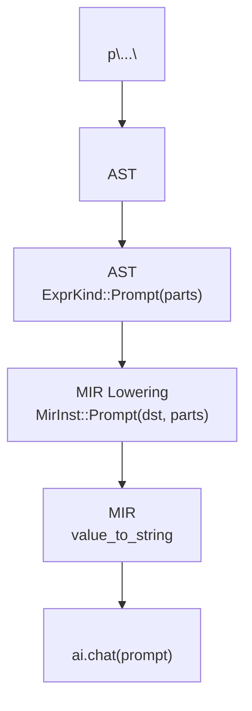
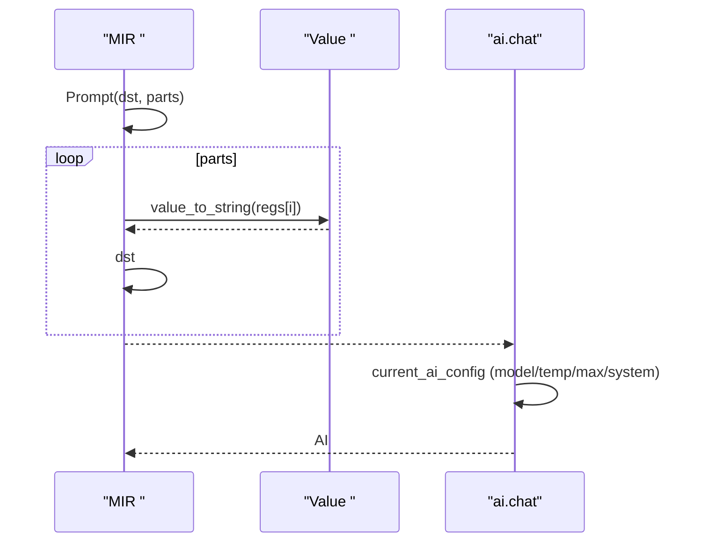
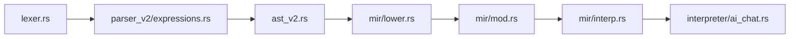

# AI 

<cite>
****   
- [lexer.rs](file://src/lexer.rs)
- [expressions.rs](file://src/parser_v2/expressions.rs)
- [mod.rs](file://src/parser_v2/mod.rs)
- [ast_v2.rs](file://src/ast_v2.rs)
- [lower.rs](file://src/mir/lower.rs)
- [mod.rsMIR ](file://src/mir/mod.rs)
- [interp.rsMIR ](file://src/mir/interp.rs)
- [ai_chat.rs](file://src/interpreter/ai_chat.rs)
- [dispatch.rs](file://src/interpreter/dispatch.rs)
- [eval_demo.mora](file://examples/_legacy/eval_demo.mora)
</cite>

## 
1. [](#)
2. [](#)
3. [](#)
4. [](#)
5. [](#)
6. [](#)
7. [](#)
8. [](#)
9. [](#)
10. [](#)

## 
 Mora  AI  p"..." AST/MIR 

## 
p"..." 
-  p"..."  PromptString 
- “ + ” AST 
-  MIR  Prompt 
-  ai.chat  AI 




- [lexer.rs:538-543](file://src/lexer.rs#L538-L543)
- [expressions.rs:414-429](file://src/parser_v2/expressions.rs#L414-L429)
- [ast_v2.rs:142-145](file://src/ast_v2.rs#L142-L145)
- [lower.rs:163-172](file://src/mir/lower.rs#L163-L172)
- [mod.rsMIR :68-70](file://src/mir/mod.rs#L68-L70)
- [interp.rsMIR :116-124](file://src/mir/interp.rs#L116-L124)


- [lexer.rs:538-543](file://src/lexer.rs#L538-L543)
- [expressions.rs:414-429](file://src/parser_v2/expressions.rs#L414-L429)
- [ast_v2.rs:142-145](file://src/ast_v2.rs#L142-L145)
- [lower.rs:163-172](file://src/mir/lower.rs#L163-L172)
- [mod.rsMIR :68-70](file://src/mir/mod.rs#L68-L70)
- [interp.rsMIR :116-124](file://src/mir/interp.rs#L116-L124)

## 
-  'p'  '"'  prompt_string_from  PromptString  token 
-  PromptString  {expr} parse_format_string “ + ” ExprKind::Prompt { parts }
- AST ExprKind::Prompt  parts  NodeId
- MIR lower_expr  ExprKind::Prompt  lower  parts MirInst::Prompt(dst, parts) dst parts 
- MIR  Prompt  parts  Value  dst AI
- AI  ai.chat(...) with  current_ai_configmodeltemperaturemax_tokenssystem 


- [lexer.rs:538-543](file://src/lexer.rs#L538-L543)
- [lexer.rs:681-743](file://src/lexer.rs#L681-L743)
- [expressions.rs:414-429](file://src/parser_v2/expressions.rs#L414-L429)
- [mod.rs:580-649](file://src/parser_v2/mod.rs#L580-L649)
- [ast_v2.rs:142-145](file://src/ast_v2.rs#L142-L145)
- [lower.rs:163-172](file://src/mir/lower.rs#L163-L172)
- [mod.rsMIR :68-70](file://src/mir/mod.rs#L68-L70)
- [interp.rsMIR :116-124](file://src/mir/interp.rs#L116-L124)

## 
 AI  p"..." 

```mermaid
sequenceDiagram
participant Src as ""
participant Lex as ""
participant Par as ""
participant Ast as "AST"
participant Mir as "MIR "
participant Run as "MIR "
participant AI as "AI (ai.chat)"
Src->>Lex :  p"..."
Lex-->>Par : PromptString 
Par->>Ast :  ExprKind : : Prompt(parts)
Ast->>Mir : lower_expr -> MirInst : : Prompt(dst, parts)
Mir-->>Run :  MIR 
Run->>Run :  Prompt <br/>value_to_string 
Run-->>Src : 
Src->>AI : ai.chat()
AI-->>Src :  AI 
```


- [lexer.rs:538-543](file://src/lexer.rs#L538-L543)
- [expressions.rs:414-429](file://src/parser_v2/expressions.rs#L414-L429)
- [lower.rs:163-172](file://src/mir/lower.rs#L163-L172)
- [mod.rsMIR :68-70](file://src/mir/mod.rs#L68-L70)
- [interp.rsMIR :116-124](file://src/mir/interp.rs#L116-L124)
- [ai_chat.rs:16-56](file://src/interpreter/ai_chat.rs#L16-L56)

## 

### p"..." 
-  'p'  '"'  prompt_string_from
-  \n\t\r\\\" 
-  Error 


- [lexer.rs:538-543](file://src/lexer.rs#L538-L543)
- [lexer.rs:681-743](file://src/lexer.rs#L681-L743)

###  AST 
- has_format_interpolation  {expr}
- parse_format_string  {}“”“”
- AST  NodeId ExprKind::Prompt { parts }

```mermaid
flowchart TD
Start([""]) --> Scan[""]
Scan --> IsOpen{" '{' ?"}
IsOpen --> || AppendLit[""]
IsOpen --> || CheckEsc{" '{{' ?"}
CheckEsc --> || PushEsc[" '{' "] --> Scan
CheckEsc --> || ParseExpr[" '}'"]
ParseExpr --> Recur[" NodeId"]
Recur --> AddPart[" parts "]
AppendLit --> EndCheck{"?"}
AddPart --> EndCheck
EndCheck --> || Scan
EndCheck --> || BuildPrompt[" ExprKind::Prompt(parts)"]
BuildPrompt --> End([""])
```


- [mod.rs:580-649](file://src/parser_v2/mod.rs#L580-L649)
- [expressions.rs:414-429](file://src/parser_v2/expressions.rs#L414-L429)


- [mod.rs:580-649](file://src/parser_v2/mod.rs#L580-L649)
- [expressions.rs:414-429](file://src/parser_v2/expressions.rs#L414-L429)

### AST  MIR 
- AST ExprKind::Prompt { parts }  NodeId
- MIR MirInst::Prompt(dst, parts)  parts  dst

```mermaid
classDiagram
class ExprKind {
+Literal
+Variable
+Binary
+Pipe
+Call
+MethodCall
+Index
+Closure
+Match
+DynTrait
+Prompt{ parts : Vec<NodeId> }
+Grouping
+List
+Dict
}
class MirInst {
+Define
+Assign
+Expr
+Prompt(dst : Reg, parts : Vec<Reg>)
+Pipe
+MethodCall
+MatchExpr
+Closure
+DynTrait
+...
}
ExprKind --> MirInst : "lowering "
```


- [ast_v2.rs:142-145](file://src/ast_v2.rs#L142-L145)
- [mod.rsMIR :68-70](file://src/mir/mod.rs#L68-L70)
- [lower.rs:163-172](file://src/mir/lower.rs#L163-L172)


- [ast_v2.rs:142-145](file://src/ast_v2.rs#L142-L145)
- [mod.rsMIR :68-70](file://src/mir/mod.rs#L68-L70)
- [lower.rs:163-172](file://src/mir/lower.rs#L163-L172)

### 
- MIR  Prompt  parts  value_to_string  Value 
-  AI ai.chat ai.chat  current_ai_config  modeltemperaturemax_tokenssystem “”




- [interp.rsMIR :116-124](file://src/mir/interp.rs#L116-L124)
- [interp.rsMIR :729-739](file://src/mir/interp.rs#L729-L739)
- [ai_chat.rs:16-56](file://src/interpreter/ai_chat.rs#L16-L56)


- [interp.rsMIR :116-124](file://src/mir/interp.rs#L116-L124)
- [interp.rsMIR :729-739](file://src/mir/interp.rs#L729-L739)
- [ai_chat.rs:16-56](file://src/interpreter/ai_chat.rs#L16-L56)

### 
-  {expr} {{}} 
-  \n\t\r\\\" 
- 
  - compose_prompt prompt 
  - tail N 
  - compress / crush_json JSON  token 
  - batch_chat AI


- [mod.rs:580-649](file://src/parser_v2/mod.rs#L580-L649)
- [lexer.rs:681-743](file://src/lexer.rs#L681-L743)
- [dispatch.rs:240-267](file://src/interpreter/dispatch.rs#L240-L267)

### 
- 
  - p"..."  {expr} 
  - p"..."  Prompt 
  -  AI
- 
  -  prompt
  -  if/for 
  -  for 
  - compress/crush_json/tail 


- [expressions.rs:414-429](file://src/parser_v2/expressions.rs#L414-L429)
- [mod.rs:580-649](file://src/parser_v2/mod.rs#L580-L649)

## 
- 
  - lexer.rs  PromptString 
  - parser_v2/expressions.rs  mod.rs  PromptString  AST
  - ast_v2.rs  ExprKind::Prompt
  - mir/lower.rs  AST  MIR 
  - mir/mod.rs  MirInst::Prompt
  - mir/interp.rs  Prompt 
  - interpreter/ai_chat.rs  ai.chat  current_ai_config 




- [lexer.rs:538-543](file://src/lexer.rs#L538-L543)
- [expressions.rs:414-429](file://src/parser_v2/expressions.rs#L414-L429)
- [ast_v2.rs:142-145](file://src/ast_v2.rs#L142-L145)
- [lower.rs:163-172](file://src/mir/lower.rs#L163-L172)
- [mod.rsMIR :68-70](file://src/mir/mod.rs#L68-L70)
- [interp.rsMIR :116-124](file://src/mir/interp.rs#L116-L124)
- [ai_chat.rs:16-56](file://src/interpreter/ai_chat.rs#L16-L56)


- [lexer.rs:538-543](file://src/lexer.rs#L538-L543)
- [expressions.rs:414-429](file://src/parser_v2/expressions.rs#L414-L429)
- [ast_v2.rs:142-145](file://src/ast_v2.rs#L142-L145)
- [lower.rs:163-172](file://src/mir/lower.rs#L163-L172)
- [mod.rsMIR :68-70](file://src/mir/mod.rs#L68-L70)
- [interp.rsMIR :116-124](file://src/mir/interp.rs#L116-L124)
- [ai_chat.rs:16-56](file://src/interpreter/ai_chat.rs#L16-L56)

## 
- 
  -  p"..."  Prompt 
  -  has_format_interpolation 
- 
  -  MIR 
  -  compress/crush_json  token 
- 
  - ai.chat  prompt 
  -  prompt_hash 


- [mod.rs:580-649](file://src/parser_v2/mod.rs#L580-L649)
- [ai_chat.rs:152-212](file://src/interpreter/ai_chat.rs#L152-L212)

## 
- 
  -  p"..." Error 
  -  '{'/'}'
  - 
- 
  - 
  - 
  -  AI  current_ai_config 


- [lexer.rs:681-743](file://src/lexer.rs#L681-L743)
- [mod.rs:580-649](file://src/parser_v2/mod.rs#L580-L649)

## 
p"..."  Mora “——”AST/MIR AI 

## 
-  p"..."  {var} 
-  if/else 
-  for 
-  compress/crush_json/tail 
-  batch_chat 
- 
  - [eval_demo.mora](file://examples/_legacy/eval_demo.mora)


- [eval_demo.mora:45-46](file://examples/_legacy/eval_demo.mora#L45-L46)