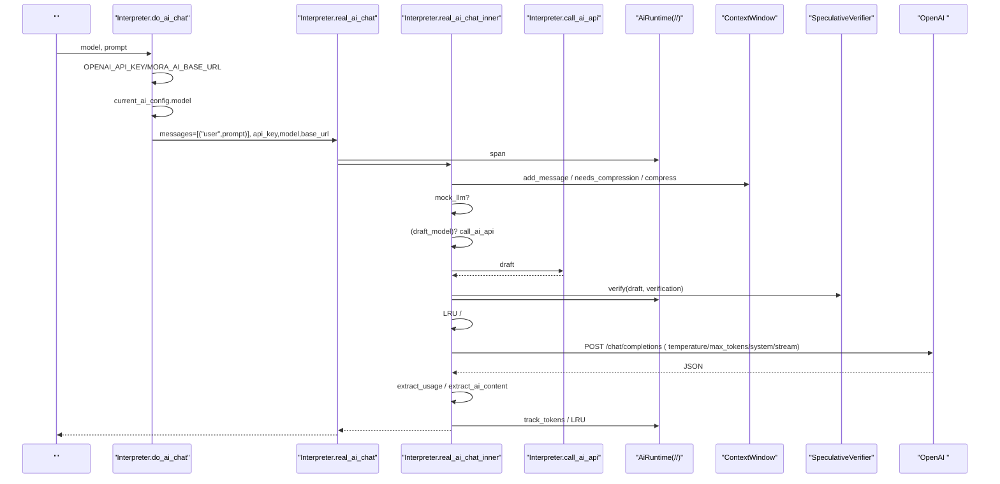
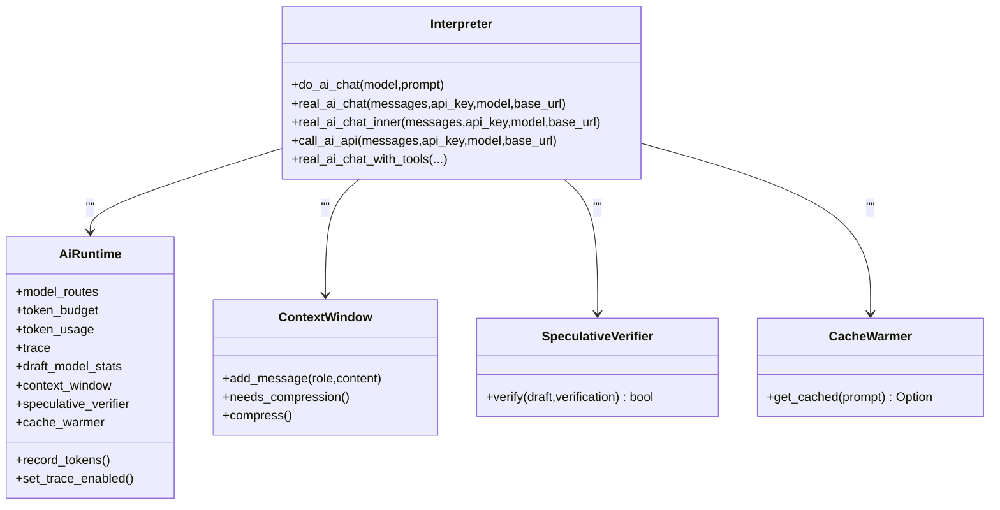

# AI 

<cite>
****
- [src/interpreter/mod.rs](file://src/interpreter/mod.rs)
- [src/interpreter/ai_chat.rs](file://src/interpreter/ai_chat.rs)
- [src/interpreter/ai_helpers.rs](file://src/interpreter/ai_helpers.rs)
- [src/runtime/ai.rs](file://src/runtime/ai.rs)
- [src/ai_infra.rs](file://src/ai_infra.rs)
</cite>

## 
1. [](#)
2. [](#)
3. [](#)
4. [](#)
5. [](#)
6. [](#)
7. [](#)
8. [](#)
9. [](#)
10. [](#)

## 
 Mora  AI  do_ai_chat real_ai_chat  real_ai_chat_inner HTTP role/contenttemperaturemax_tokenssystem prompt OpenAI  API 

## 
AI 
- HTTP 
-  AI 
- 

```mermaid
graph TB
subgraph ""
A["do_ai_chat<br/>"] --> B["real_ai_chat<br/>/"]
B --> C["real_ai_chat_inner<br/>///"]
C --> D["call_ai_api<br/> HTTP "]
C --> E["real_ai_chat_with_tools<br/>"]
end
subgraph ""
R["AiRuntime<br/>///"]
end
subgraph ""
I1["ContextWindow<br/>"]
I2["SpeculativeVerifier<br/>"]
I3["CacheWarmer<br/>"]
end
A --> R
B --> R
C --> R
C --> I1
C --> I2
C --> I3
```


- [src/interpreter/ai_chat.rs:16-57](file://src/interpreter/ai_chat.rs#L16-L57)
- [src/interpreter/ai_chat.rs:152-212](file://src/interpreter/ai_chat.rs#L152-L212)
- [src/interpreter/ai_chat.rs:275-573](file://src/interpreter/ai_chat.rs#L275-L573)
- [src/interpreter/ai_chat.rs:215-271](file://src/interpreter/ai_chat.rs#L215-L271)
- [src/interpreter/ai_chat.rs:576-704](file://src/interpreter/ai_chat.rs#L576-L704)
- [src/runtime/ai.rs:16-40](file://src/runtime/ai.rs#L16-L40)
- [src/ai_infra.rs:62-122](file://src/ai_infra.rs#L62-L122)
- [src/ai_infra.rs:166-219](file://src/ai_infra.rs#L166-L219)
- [src/ai_infra.rs:222-251](file://src/ai_infra.rs#L222-L251)


- [src/interpreter/mod.rs:1-50](file://src/interpreter/mod.rs#L1-L50)
- [src/interpreter/ai_chat.rs:16-57](file://src/interpreter/ai_chat.rs#L16-L57)
- [src/interpreter/ai_chat.rs:152-212](file://src/interpreter/ai_chat.rs#L152-L212)
- [src/interpreter/ai_chat.rs:275-573](file://src/interpreter/ai_chat.rs#L275-L573)
- [src/interpreter/ai_chat.rs:215-271](file://src/interpreter/ai_chat.rs#L215-L271)
- [src/interpreter/ai_chat.rs:576-704](file://src/interpreter/ai_chat.rs#L576-L704)
- [src/runtime/ai.rs:16-40](file://src/runtime/ai.rs#L16-L40)
- [src/ai_infra.rs:62-122](file://src/ai_infra.rs#L62-L122)
- [src/ai_infra.rs:166-219](file://src/ai_infra.rs#L166-L219)
- [src/ai_infra.rs:222-251](file://src/ai_infra.rs#L222-L251)

## 
- do_ai_chat
- real_ai_chat span token 
- real_ai_chat_innermock_llmHTTP 
- call_ai_api HTTP 
- real_ai_chat_with_tools tool_calls 
- AiRuntimeAI 
- ai_infra


- [src/interpreter/ai_chat.rs:16-57](file://src/interpreter/ai_chat.rs#L16-L57)
- [src/interpreter/ai_chat.rs:152-212](file://src/interpreter/ai_chat.rs#L152-L212)
- [src/interpreter/ai_chat.rs:275-573](file://src/interpreter/ai_chat.rs#L275-L573)
- [src/interpreter/ai_chat.rs:215-271](file://src/interpreter/ai_chat.rs#L215-L271)
- [src/interpreter/ai_chat.rs:576-704](file://src/interpreter/ai_chat.rs#L576-L704)
- [src/runtime/ai.rs:16-40](file://src/runtime/ai.rs#L16-L40)
- [src/ai_infra.rs:62-122](file://src/ai_infra.rs#L62-L122)
- [src/ai_infra.rs:166-219](file://src/ai_infra.rs#L166-L219)
- [src/ai_infra.rs:222-251](file://src/ai_infra.rs#L222-L251)

## 
 do_ai_chat  HTTP 




- [src/interpreter/ai_chat.rs:16-57](file://src/interpreter/ai_chat.rs#L16-L57)
- [src/interpreter/ai_chat.rs:152-212](file://src/interpreter/ai_chat.rs#L152-L212)
- [src/interpreter/ai_chat.rs:275-573](file://src/interpreter/ai_chat.rs#L275-L573)
- [src/interpreter/ai_chat.rs:215-271](file://src/interpreter/ai_chat.rs#L215-L271)
- [src/runtime/ai.rs:16-40](file://src/runtime/ai.rs#L16-L40)
- [src/ai_infra.rs:62-122](file://src/ai_infra.rs#L62-L122)
- [src/ai_infra.rs:166-219](file://src/ai_infra.rs#L166-L219)

## 

### do_ai_chat 
- 
  -  API Key  Base URL Mock 
  -  prompt  messages = [("user", prompt)]
  -  current_ai_config.modelwith  model
  -  real_ai_chat 
- 
  -  current_ai_config 
  - Mock 


- [src/interpreter/ai_chat.rs:16-57](file://src/interpreter/ai_chat.rs#L16-L57)
- [src/interpreter/mod.rs:238-255](file://src/interpreter/mod.rs#L238-L255)

### real_ai_chat 
- 
  - 
  -  span/
  - Token / token recorder
  -  real_ai_chat_inner 
- 
  - 
  - /


- [src/interpreter/ai_chat.rs:152-212](file://src/interpreter/ai_chat.rs#L152-L212)

### real_ai_chat_inner 
- 
  - add_messageneeds_compressioncompress
  - Mock  current_ai_config.mock_responses 
  -  draft_model
  -  max_tokens > 1000  stream=true
  - LRU  + 
  - HTTP  JSON model/messages/temperature/max_tokens/system/stream POST /chat/completions
  -  + jitter4295xx 
  - extract_usage  usageextract_ai_content  content
  -  LRU 
- 
  -  serde  JSON 
  - 


- [src/interpreter/ai_chat.rs:275-573](file://src/interpreter/ai_chat.rs#L275-L573)
- [src/interpreter/ai_helpers.rs:108-123](file://src/interpreter/ai_helpers.rs#L108-L123)
- [src/interpreter/ai_helpers.rs:166-192](file://src/interpreter/ai_helpers.rs#L166-L192)
- [src/interpreter/mod.rs:64-111](file://src/interpreter/mod.rs#L64-L111)

### call_ai_api 
- 
  - model/messagesPOST  /chat/completions
  -  4xx/5xx 
  - extract_ai_content  content
- 
  - 
  - 


- [src/interpreter/ai_chat.rs:215-271](file://src/interpreter/ai_chat.rs#L215-L271)
- [src/interpreter/ai_helpers.rs:166-192](file://src/interpreter/ai_helpers.rs#L166-L192)

### real_ai_chat_with_tools 
- 
  -  messages  tools JSONfunction schema
  -  tool_calls handler tool 
  - 
- 
  -  OpenAI function calling 


- [src/interpreter/ai_chat.rs:576-704](file://src/interpreter/ai_chat.rs#L576-L704)
- [src/interpreter/ai_helpers.rs:18-58](file://src/interpreter/ai_helpers.rs#L18-L58)

### AiRuntime 
- 
  - model_routes→
  - token_budget/token_usage
  - trace
  - draft_model_stats
  - context_window/speculative_verifier/cache_warmer
- 
  - record_tokens token 
  - set_trace_enabled/


- [src/runtime/ai.rs:16-40](file://src/runtime/ai.rs#L16-L40)
- [src/runtime/ai.rs:42-53](file://src/runtime/ai.rs#L42-L53)

### ai_infra 
- ContextWindow token 
- SpeculativeVerifier“VERIFIED”
- CacheWarmer
- 


- [src/ai_infra.rs:62-122](file://src/ai_infra.rs#L62-L122)
- [src/ai_infra.rs:166-219](file://src/ai_infra.rs#L166-L219)
- [src/ai_infra.rs:222-251](file://src/ai_infra.rs#L222-L251)

## 
- 
  - ai_chat.rs  AI  ai_helpers.rs JSON /SSE critic 
  - runtime/ai.rs  AiRuntime  ai_chat.rs 
  - ai_infra.rs  AiRuntime 
- 
  - ureqHTTP 
  - OPENAI_API_KEYMORA_AI_BASE_URLMORA_AI_MODEL 
- 
  -  JSON  \"
  -  4xx  429 




- [src/interpreter/ai_chat.rs:16-57](file://src/interpreter/ai_chat.rs#L16-L57)
- [src/interpreter/ai_chat.rs:152-212](file://src/interpreter/ai_chat.rs#L152-L212)
- [src/interpreter/ai_chat.rs:275-573](file://src/interpreter/ai_chat.rs#L275-L573)
- [src/interpreter/ai_chat.rs:215-271](file://src/interpreter/ai_chat.rs#L215-L271)
- [src/interpreter/ai_chat.rs:576-704](file://src/interpreter/ai_chat.rs#L576-L704)
- [src/runtime/ai.rs:16-40](file://src/runtime/ai.rs#L16-L40)
- [src/ai_infra.rs:62-122](file://src/ai_infra.rs#L62-L122)
- [src/ai_infra.rs:166-219](file://src/ai_infra.rs#L166-L219)
- [src/ai_infra.rs:222-251](file://src/ai_infra.rs#L222-L251)


- [src/interpreter/mod.rs:1-50](file://src/interpreter/mod.rs#L1-L50)
- [src/interpreter/ai_chat.rs:16-57](file://src/interpreter/ai_chat.rs#L16-L57)
- [src/interpreter/ai_chat.rs:152-212](file://src/interpreter/ai_chat.rs#L152-L212)
- [src/interpreter/ai_chat.rs:275-573](file://src/interpreter/ai_chat.rs#L275-L573)
- [src/interpreter/ai_chat.rs:215-271](file://src/interpreter/ai_chat.rs#L215-L271)
- [src/interpreter/ai_chat.rs:576-704](file://src/interpreter/ai_chat.rs#L576-L704)
- [src/runtime/ai.rs:16-40](file://src/runtime/ai.rs#L16-L40)
- [src/ai_infra.rs:62-122](file://src/ai_infra.rs#L62-L122)
- [src/ai_infra.rs:166-219](file://src/ai_infra.rs#L166-L219)
- [src/ai_infra.rs:222-251](file://src/ai_infra.rs#L222-L251)

## 
- 
  - 
  - 
  - LRU 
  -  stream=true
- 
  -  + jitter4295xx 
  - AI 
  - 


- [src/interpreter/ai_chat.rs:275-573](file://src/interpreter/ai_chat.rs#L275-L573)
- [src/interpreter/mod.rs:64-111](file://src/interpreter/mod.rs#L64-L111)
- [src/interpreter/mod.rs:46-49](file://src/interpreter/mod.rs#L46-L49)

## 
- 
  -  API Key Mock 
  - / network error  timeout MORA_AI_RETRY_MAX  MORA_AI_RETRY_BASE_MS 
  - 4xx  429 Base URL 
  -  extract_ai_content  choices[0].message.content
- 
  -  AiRuntime.set_trace_enabled(true) 
  -  max_tokens
  -  LRU 
  -  JSON  content 


- [src/interpreter/ai_chat.rs:16-57](file://src/interpreter/ai_chat.rs#L16-L57)
- [src/interpreter/ai_chat.rs:152-212](file://src/interpreter/ai_chat.rs#L152-L212)
- [src/interpreter/ai_chat.rs:275-573](file://src/interpreter/ai_chat.rs#L275-L573)
- [src/interpreter/ai_helpers.rs:166-192](file://src/interpreter/ai_helpers.rs#L166-L192)
- [src/interpreter/mod.rs:64-111](file://src/interpreter/mod.rs#L64-L111)

## 
Mora  AI  do_ai_chat  real_ai_chat  real_ai_chat_inner HTTP  AiRuntime  ai_infra  OpenAI  API with  temperaturemax_tokenssystem prompt 

## 

### 
- role/content 
  - user
  - assistant content tool_calls
  - tooltool_call_id + content
- 
  -  messages 
- 
  -  real_ai_chat_with_tools  tool_calls  handler


- [src/interpreter/mod.rs:344-365](file://src/interpreter/mod.rs#L344-L365)
- [src/interpreter/ai_helpers.rs:18-58](file://src/interpreter/ai_helpers.rs#L18-L58)
- [src/interpreter/ai_chat.rs:576-704](file://src/interpreter/ai_chat.rs#L576-L704)

### 
- temperature
- max_tokens
- system
- 
  -  current_ai_configwith 
  - MORA_AI_MODELOPENAI_API_KEYMORA_AI_BASE_URL
- 
  - MORA_AI_RETRY_MAXMORA_AI_RETRY_BASE_MS
  - HTTP_READ_TIMEOUT_SECSHTTP_WRITE_TIMEOUT_SECSAI_READ_TIMEOUT_SECS


- [src/interpreter/mod.rs:238-255](file://src/interpreter/mod.rs#L238-L255)
- [src/interpreter/mod.rs:28-33](file://src/interpreter/mod.rs#L28-L33)
- [src/interpreter/mod.rs:46-49](file://src/interpreter/mod.rs#L46-L49)
- [src/interpreter/mod.rs:64-111](file://src/interpreter/mod.rs#L64-L111)
- [src/interpreter/ai_chat.rs:462-478](file://src/interpreter/ai_chat.rs#L462-L478)

###  OpenAI  API 
- 
  -  Base URL  OpenAI v1  MORA_AI_BASE_URL 
  - /chat/completions
- 
  -  MORA_AI_MODEL  current_ai_config.model 
  -  OpenAI Chat Completions 


- [src/interpreter/mod.rs:28-33](file://src/interpreter/mod.rs#L28-L33)
- [src/interpreter/ai_chat.rs:480-501](file://src/interpreter/ai_chat.rs#L480-L501)

### 
- 
  -  do_ai_chat model  prompt
- 
  -  messages  user/assistant/tool  real_ai_chat
- 
  -  max_tokens  stream=true SSE read_next_sse_token delta.content


- [src/interpreter/ai_chat.rs:16-57](file://src/interpreter/ai_chat.rs#L16-L57)
- [src/interpreter/ai_chat.rs:275-573](file://src/interpreter/ai_chat.rs#L275-L573)
- [src/interpreter/ai_helpers.rs:202-242](file://src/interpreter/ai_helpers.rs#L202-L242)