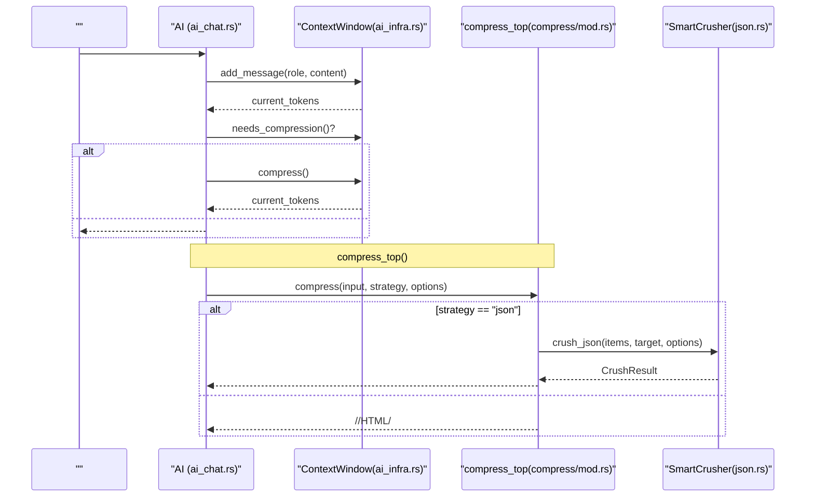
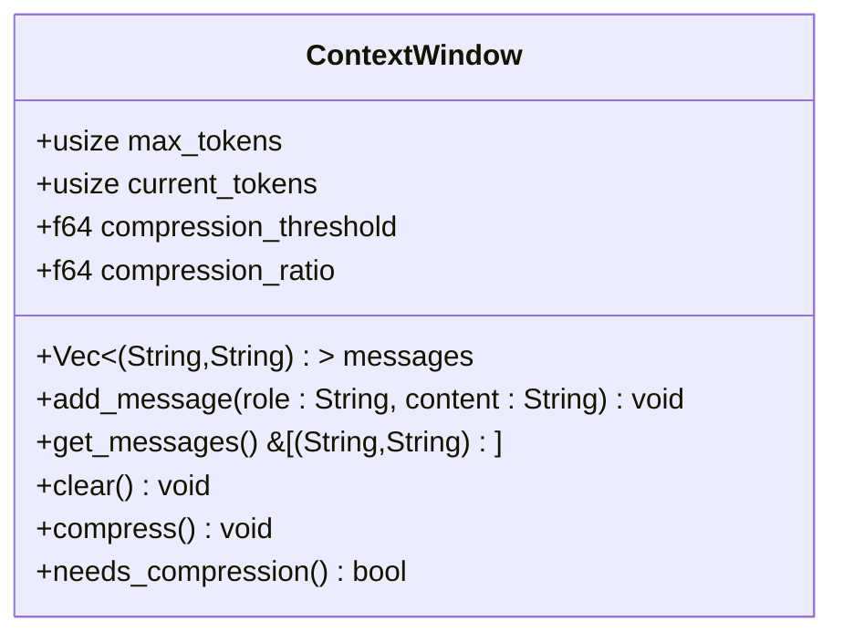
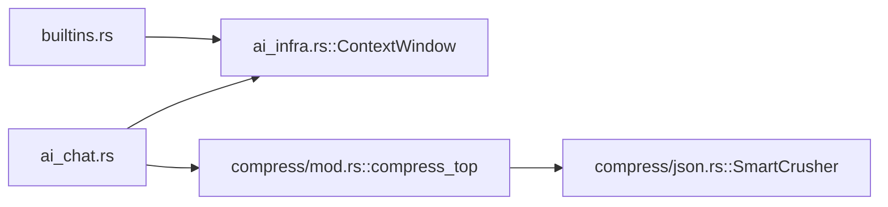

# 

<cite>
****   
- [ai_infra.rs](file://src/ai_infra.rs)
- [ai_chat.rs](file://src/interpreter/ai_chat.rs)
- [builtins.rs](file://src/interpreter/builtins.rs)
- [compress/mod.rs](file://src/compress/mod.rs)
- [compress/json.rs](file://src/compress/json.rs)
- [compress_demo.mora](file://examples/compress_demo.mora)
- [compress_smart_demo.mora](file://examples/compress_smart_demo.mora)
- [compact_demo.mora](file://examples/compact_demo.mora)
</cite>

## 
1. [](#)
2. [](#)
3. [](#)
4. [](#)
5. [](#)
6. [](#)
7. [](#)
8. [](#)
9. [](#)
10. [](#)

## 
 Mora “” ContextWindow Token 

## 

- AI ContextWindow 
- AI 
-  compress() JSONHTML
-  compress()  SmartCrusher 

```mermaid
graph TB
subgraph "AI "
CW["ContextWindow<br/>ai_infra.rs"]
end
subgraph ""
Chat["AI <br/>ai_chat.rs"]
Builtin["<br/>builtins.rs"]
end
subgraph ""
Top["compress_top()<br/>compress/mod.rs"]
JSON["SmartCrusher<br/>compress/json.rs"]
end
subgraph ""
Demo1["compress_demo.mora"]
Demo2["compress_smart_demo.mora"]
Demo3["compact_demo.mora"]
end
Chat --> CW
Chat --> Top
Top --> JSON
Builtin --> CW
Demo1 --> Top
Demo2 --> Top
Demo3 --> Top
```

**** 
- [ai_infra.rs:61-122](file://src/ai_infra.rs#L61-L122)
- [ai_chat.rs:286-296](file://src/interpreter/ai_chat.rs#L286-L296)
- [compress/mod.rs:241-309](file://src/compress/mod.rs#L241-L309)
- [compress/json.rs:1-112](file://src/compress/json.rs#L1-L112)

****
- [ai_infra.rs:61-122](file://src/ai_infra.rs#L61-L122)
- [compress/mod.rs:241-309](file://src/compress/mod.rs#L241-L309)

## 
- ContextWindow Token 
- compress_top auto/head_tail/summary/lossless/json 
- SmartCrusherjson.rs JSON 


- Token 
- JSON/HTML/Code/Log/Text

****
- [ai_infra.rs:61-122](file://src/ai_infra.rs#L61-L122)
- [compress/mod.rs:241-309](file://src/compress/mod.rs#L241-L309)
- [compress/json.rs:1-112](file://src/compress/json.rs#L1-L112)

## 
 AI 
-  Token  4096 Token  0 0.8  0.5
-  add_message  Token  max_tokens 
-  current_tokens  max_tokens × compression_threshold  compress() compression_ratio  Token
- clear()  Token 



**** 
- [ai_chat.rs:286-296](file://src/interpreter/ai_chat.rs#L286-L296)
- [ai_infra.rs:84-122](file://src/ai_infra.rs#L84-L122)
- [compress/mod.rs:241-309](file://src/compress/mod.rs#L241-L309)
- [compress/json.rs:1-112](file://src/compress/json.rs#L1-L112)

## 

### ContextWindow 
- 
  - max_tokens 4096
  - current_tokens Token 
  - messages [(role, content)]
  - compression_threshold 0.8
  - compression_ratio 0.5
- 
  - add_message Token 
  - get_messages
  - clear Token
  - compress Token
  - needs_compression


- add_message  O(k)k 
- compress  O(m)m  Token 
- Token  content.len()/4 



**** 
- [ai_infra.rs:61-122](file://src/ai_infra.rs#L61-L122)

****
- [ai_infra.rs:61-122](file://src/ai_infra.rs#L61-L122)

### 
- Interpreter  ContextWindow
- real_ai_chat  messages  context_window.add_message current_tokens
-  needs_compression  compress 
-  clear

```mermaid
flowchart TD
Start([" real_ai_chat"]) --> AddMsg[" add_message(role,content)"]
AddMsg --> CheckThreshold{"current_tokens > max_tokens * threshold ?"}
CheckThreshold --> || BuildReq[""]
CheckThreshold --> || Compress[" compress() "]
Compress --> Recalc[" current_tokens"]
Recalc --> BuildReq
BuildReq --> End([""])
```

**** 
- [ai_chat.rs:286-296](file://src/interpreter/ai_chat.rs#L286-L296)
- [ai_infra.rs:106-122](file://src/ai_infra.rs#L106-L122)

****
- [ai_chat.rs:286-296](file://src/interpreter/ai_chat.rs#L286-L296)
- [ai_infra.rs:106-122](file://src/ai_infra.rs#L106-L122)

### 
- compression_ratio
- 
  -  rolesystem/user/assistant
  - 
  - TopN+ TimeSeries+ SmartSample
-  compress() “” compress_top("auto") 

[]

### 
- compress_top(input, strategy, options)
  - "json" SmartCrusher JSON 
  - "auto"ContentRouter json/code/html/log/text
  - "head_tail"/"summary"/"lossless"
- SmartCrusherjson.rs
  - Id/Score/Temporal/Error/Anomaly/Constant/Generic
  - TopScores/TimeSeries/Clustered/Uniform/Generic
  - topn/timeseries/cluster_sample/smart_sample/lossless
  - keep_errors/keep_outliers/keep_boundary
  - json/markdown_kv/csv_schema

```mermaid
flowchart TD
In[" Value"] --> Strategy{"strategy ?"}
Strategy --> |"json"| JSONPath["crush_json(items, target, options)"]
Strategy --> |"auto"| Router["ContentRouter.sniff()"]
Strategy --> |"head_tail|summary|lossless"| TextComp["TextSubCompressor.compress()"]
JSONPath --> Out[""]
Router --> Selected[" SubCompressor"]
Selected --> Out
TextComp --> Out
```

**** 
- [compress/mod.rs:241-309](file://src/compress/mod.rs#L241-L309)
- [compress/json.rs:1-112](file://src/compress/json.rs#L1-L112)

****
- [compress/mod.rs:241-309](file://src/compress/mod.rs#L241-L309)
- [compress/json.rs:1-112](file://src/compress/json.rs#L1-L112)

###  API
- ContextWindow 
  - max_tokens 4096
  - compression_threshold 0.8
  - compression_ratio 0.5
- compress_top CompressOptions
  - strategyauto/topn/timeseries/cluster/lossless/smart_sample/head_tail
  - max_bytes/target_ratio
  - head_pct/tail_pct
  - k_first/k_last
  - lossless_min_savings_ratio
  - preserve_errors/preserve_outliers/preserve_ids
  - recursive Value 
  - output_formatjson/markdown_kv/csv_schema

****
- [ai_infra.rs:61-122](file://src/ai_infra.rs#L61-L122)
- [compress/mod.rs:14-64](file://src/compress/mod.rs#L14-L64)

## 
- ai_chat.rs  ai_infra.rs  ContextWindow 
- compress/mod.rs  json.rs  SmartCrusher 
- builtins.rs  ai.context.trim/context.info 



**** 
- [ai_chat.rs:286-296](file://src/interpreter/ai_chat.rs#L286-L296)
- [compress/mod.rs:241-309](file://src/compress/mod.rs#L241-L309)
- [compress/json.rs:1-112](file://src/compress/json.rs#L1-L112)
- [builtins.rs:5035-5070](file://src/interpreter/builtins.rs#L5035-L5070)

****
- [ai_chat.rs:286-296](file://src/interpreter/ai_chat.rs#L286-L296)
- [compress/mod.rs:241-309](file://src/compress/mod.rs#L241-L309)
- [compress/json.rs:1-112](file://src/compress/json.rs#L1-L112)
- [builtins.rs:5035-5070](file://src/interpreter/builtins.rs#L5035-L5070)

## 
- Token content.len()/4 
- threshold=0.8 /
- 
  - "auto"  sniff 
  - SmartCrusher  JSON 
- compress()  messages 
- 
  -  max_tokens  compression_threshold
  -  "auto"  "json"  preserve_errors/outliers 
  -  current_tokens  messages 

[]

## 
- 
  -  compression_ratio  0.6-0.7
  -  compression_threshold 
- Token 
  - 
- compress_top 
  -  strategy 
- JSON 
  -  List  JSON 

****
- [compress/mod.rs:241-309](file://src/compress/mod.rs#L241-L309)
- [compress/json.rs:1-112](file://src/compress/json.rs#L1-L112)

## 
Mora  ContextWindow  compress_top  SmartCrusher “ + ”

[]

## 
- 
  - ContextWindowmax_tokenscompression_thresholdcompression_ratio
  - CompressOptionsstrategymax_bytestarget_ratiohead_pcttail_pctk_firstk_lastlossless_min_savings_ratiopreserve_errorspreserve_outlierspreserve_idsrecursiveoutput_format
- 
  - [compress_demo.mora](file://examples/compress_demo.mora)
  - SmartCrusher [compress_smart_demo.mora](file://examples/compress_smart_demo.mora)
  - [compact_demo.mora](file://examples/compact_demo.mora)

****
- [compress_demo.mora:1-26](file://examples/compress_demo.mora#L1-L26)
- [compress_smart_demo.mora:1-47](file://examples/compress_smart_demo.mora#L1-L47)
- [compact_demo.mora:1-28](file://examples/compact_demo.mora#L1-L28)