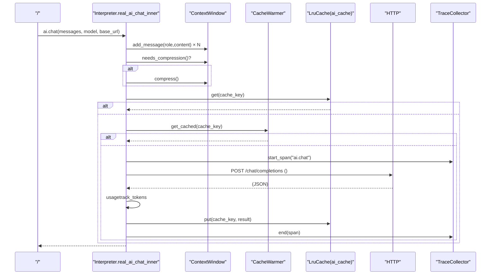
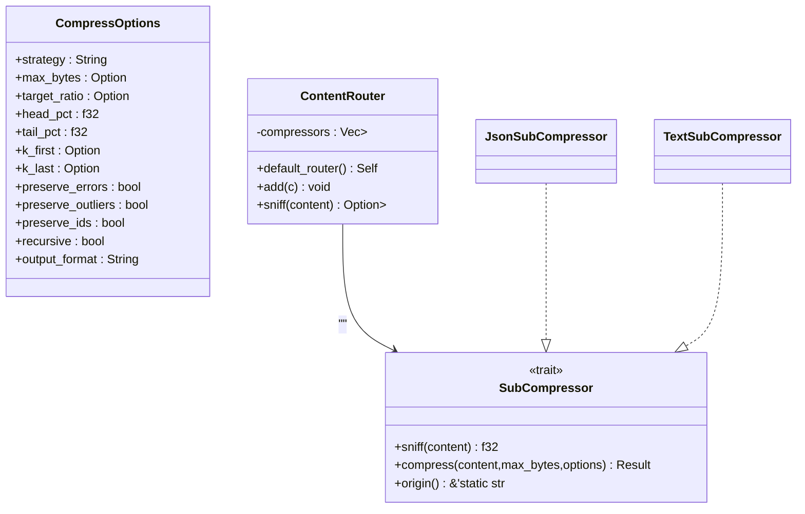
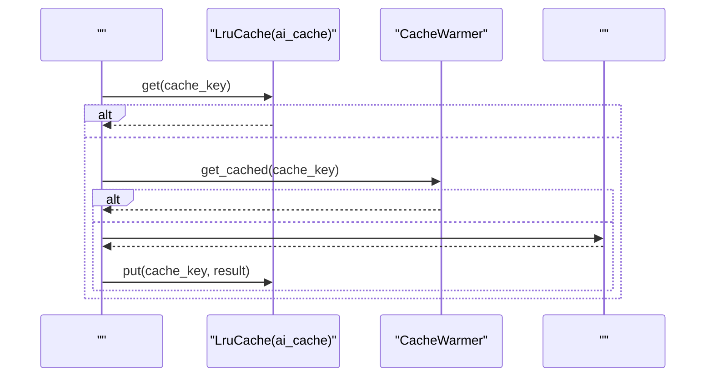
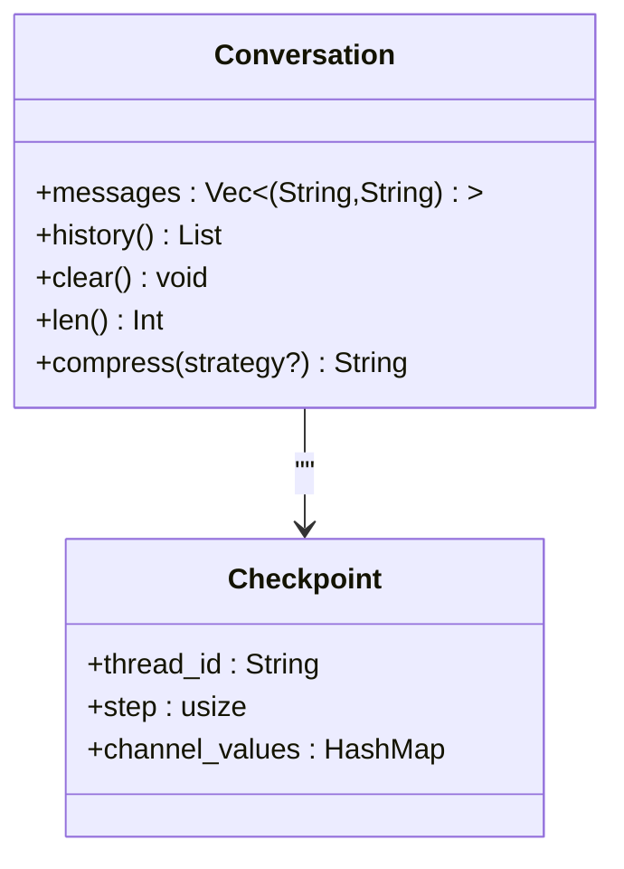
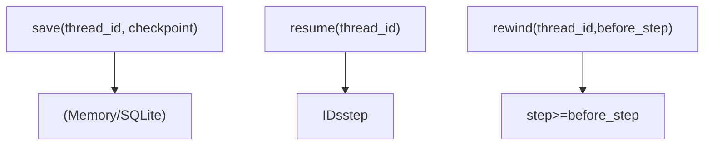
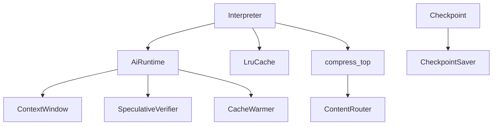

# 

<cite>
****   
- [ai.rs](file://src/runtime/ai.rs)
- [ai_chat.rs](file://src/interpreter/ai_chat.rs)
- [dispatch.rs](file://src/interpreter/dispatch.rs)
- [mod.rs](file://src/interpreter/mod.rs)
- [ai_infra.rs](file://src/ai_infra.rs)
- [mod.rs](file://src/compress/mod.rs)
- [json.rs](file://src/compress/json.rs)
- [compact_demo.mora](file://examples/compact_demo.mora)
- [mod.rs](file://src/checkpoint/mod.rs)
- [memory.rs](file://src/checkpoint/memory.rs)
- [sqlite.rsSQLite](file://src/checkpoint/sqlite.rs)
- [orchestrate_v2.rs](file://src/interpreter/orchestrate_v2.rs)
</cite>

## 
1. [](#)
2. [](#)
3. [](#)
4. [](#)
5. [](#)
6. [](#)
7. [](#)
8. [](#)
9. [](#)
10. [](#)

## 
 Mora  AI 
- Token 
- 
- LRU 
-  AI 
- 
- 
- 

## 
Mora 
-  AI 
-  AI  Token 
- 
- 
- 

```mermaid
graph TB
subgraph ""
AiRuntime["AiRuntime<br/>AI"]
CtxWin["ContextWindow<br/>"]
SpecVer["SpeculativeVerifier<br/>"]
CacheWarm["CacheWarmer<br/>"]
end
subgraph ""
DoChat["do_ai_chat / real_ai_chat_inner<br/>AI"]
DispatchConv["Conversation.dispatch<br/>/"]
LruCache["LruCache<br/>LRU()"]
end
subgraph ""
CompressTop["compress_top<br/>"]
Router["ContentRouter<br/>"]
JsonSC["JsonSubCompressor<br/>JSON"]
TextSC["TextSubCompressor<br/>"]
end
subgraph ""
Checkpoint["Checkpoint<br/>"]
MemSaver["MemorySaver<br/>"]
SqliteSaver["SqliteSaver<br/>SQLite"]
end
AiRuntime --> CtxWin
AiRuntime --> SpecVer
AiRuntime --> CacheWarm
DoChat --> CtxWin
DoChat --> LruCache
DoChat --> CacheWarm
DispatchConv --> CompressTop
CompressTop --> Router
Router --> JsonSC
Router --> TextSC
Checkpoint --> MemSaver
Checkpoint --> SqliteSaver
```


- [ai.rs:1-121](file://src/runtime/ai.rs#L1-L121)
- [ai_chat.rs:1-800](file://src/interpreter/ai_chat.rs#L1-L800)
- [mod.rs:150-200](file://src/interpreter/mod.rs#L150-L200)
- [mod.rs:241-309](file://src/compress/mod.rs#L241-L309)
- [json.rs:1142-1185](file://src/compress/json.rs#L1142-L1185)
- [mod.rs:312-346](file://src/checkpoint/mod.rs#L312-L346)
- [memory.rs:1-46](file://src/checkpoint/memory.rs#L1-L46)
- [sqlite.rsSQLite:51-291](file://src/checkpoint/sqlite.rs#L51-L291)


- [ai.rs:1-121](file://src/runtime/ai.rs#L1-L121)
- [ai_chat.rs:1-800](file://src/interpreter/ai_chat.rs#L1-L800)
- [mod.rs:150-200](file://src/interpreter/mod.rs#L150-L200)
- [mod.rs:241-309](file://src/compress/mod.rs#L241-L309)
- [json.rs:1142-1185](file://src/compress/json.rs#L1142-L1185)
- [mod.rs:312-346](file://src/checkpoint/mod.rs#L312-L346)
- [memory.rs:1-46](file://src/checkpoint/memory.rs#L1-L46)
- [sqlite.rsSQLite:51-291](file://src/checkpoint/sqlite.rs#L51-L291)

## 
- AiRuntimeToken Trace
- ContextWindow Token
- LruCache LRU  AI 
- CacheWarmer
- compress_top  ContentRouter
- Checkpoint  Saver SQLite 


- [ai.rs:1-121](file://src/runtime/ai.rs#L1-L121)
- [ai_infra.rs:61-122](file://src/ai_infra.rs#L61-L122)
- [mod.rs:150-200](file://src/interpreter/mod.rs#L150-L200)
- [mod.rs:241-309](file://src/compress/mod.rs#L241-L309)
- [mod.rs:285-346](file://src/checkpoint/mod.rs#L285-L346)

## 
 AI HTTP Token 




- [ai_chat.rs:275-573](file://src/interpreter/ai_chat.rs#L275-L573)
- [ai_infra.rs:84-122](file://src/ai_infra.rs#L84-L122)
- [mod.rs:150-200](file://src/interpreter/mod.rs#L150-L200)

## 

### 
-  add_message  token  current_tokens
-  current_tokens  max_tokens  clear 
- needs_compression compress  tokens

```mermaid
flowchart TD
Start([" add_message"]) --> Append["tokens"]
Append --> CheckCap{"current_tokens > max_tokens ?"}
CheckCap --> || EvictOldest["tokens"]
EvictOldest --> CheckCap
CheckCap --> || End([""])
```


- [ai_infra.rs:84-122](file://src/ai_infra.rs#L84-L122)


- [ai_infra.rs:61-122](file://src/ai_infra.rs#L61-L122)

### 
- compress_top  strategy 
- ContentRouter  sniffjson/code/html/log/text
- JSON JsonSubCompressor  content  JSON  SmartCrusher 
- TextSubCompressor  head_tailsummarylossless 




- [mod.rs:14-84](file://src/compress/mod.rs#L14-L84)
- [mod.rs:86-134](file://src/compress/mod.rs#L86-L134)
- [json.rs:1142-1185](file://src/compress/json.rs#L1142-L1185)


- [mod.rs:241-309](file://src/compress/mod.rs#L241-L309)
- [json.rs:1142-1185](file://src/compress/json.rs#L1142-L1185)
- [compact_demo.mora:1-28](file://examples/compact_demo.mora#L1-L28)

### LRU 
- LruCacheArc<Mutex<>> capget 
- cache_key  model  messages 
- CacheWarmer  queue  cache
-  LruCache LruCache




- [ai_chat.rs:427-538](file://src/interpreter/ai_chat.rs#L427-L538)
- [ai_infra.rs:221-251](file://src/ai_infra.rs#L221-L251)
- [mod.rs:150-200](file://src/interpreter/mod.rs#L150-L200)


- [ai_chat.rs:427-538](file://src/interpreter/ai_chat.rs#L427-L538)
- [ai_infra.rs:221-251](file://src/ai_infra.rs#L221-L251)
- [mod.rs:150-200](file://src/interpreter/mod.rs#L150-L200)

### 
- Conversation  history/clear/len/compress 
-  thread_id 




- [dispatch.rs:862-886](file://src/interpreter/dispatch.rs#L862-L886)
- [mod.rs:31-60](file://src/checkpoint/mod.rs#L31-L60)


- [dispatch.rs:862-886](file://src/interpreter/dispatch.rs#L862-L886)
- [mod.rs:31-60](file://src/checkpoint/mod.rs#L31-L60)

### 
- Checkpoint  stepchannel_valueschannel_versionsversions_seenpending_sends  JSON 
- MemorySaverSqliteSaver CheckpointSaver trait
- resume rewind “”




- [mod.rs:312-346](file://src/checkpoint/mod.rs#L312-L346)
- [memory.rs:29-46](file://src/checkpoint/memory.rs#L29-L46)
- [sqlite.rsSQLite:51-291](file://src/checkpoint/sqlite.rs#L51-L291)


- [mod.rs:312-346](file://src/checkpoint/mod.rs#L312-L346)
- [memory.rs:1-46](file://src/checkpoint/memory.rs#L1-L46)
- [sqlite.rsSQLite:51-291](file://src/checkpoint/sqlite.rs#L51-L291)
- [orchestrate_v2.rs:1015-1094](file://src/interpreter/orchestrate_v2.rs#L1015-L1094)

### 
- TraceCollector ai.chat  span/
- Token AiRuntime.record_tokens  input/output tokensreal_ai_chat_inner  usage  track
- is_retryable_error 4295xxretry_sleep_ms +


- [ai_chat.rs:152-212](file://src/interpreter/ai_chat.rs#L152-L212)
- [ai_chat.rs:524-538](file://src/interpreter/ai_chat.rs#L524-L538)
- [ai.rs:42-53](file://src/runtime/ai.rs#L42-L53)
- [mod.rs:80-111](file://src/interpreter/mod.rs#L80-L111)

## 
-  AiRuntime  ContextWindowSpeculativeVerifierCacheWarmer AI 
-  Interpreter  real_ai_chat_inner  Token  AiRuntime
-  compress_top  API ContentRouter 
-  trait 




- [ai.rs:1-121](file://src/runtime/ai.rs#L1-L121)
- [ai_chat.rs:275-573](file://src/interpreter/ai_chat.rs#L275-L573)
- [mod.rs:241-309](file://src/compress/mod.rs#L241-L309)
- [mod.rs:285-346](file://src/checkpoint/mod.rs#L285-L346)


- [ai.rs:1-121](file://src/runtime/ai.rs#L1-L121)
- [ai_chat.rs:275-573](file://src/interpreter/ai_chat.rs#L275-L573)
- [mod.rs:241-309](file://src/compress/mod.rs#L241-L309)
- [mod.rs:285-346](file://src/checkpoint/mod.rs#L285-L346)

## 
-  max_tokens  compression_threshold
-  LruCache 
-  is_retryable_error  retry_sleep_ms 
-  head_tail  summary  token 
-  max_tokens  stream 

[]

## 
-  is_retryable_error  retry_sleep_ms  MORA_AI_RETRY_BASE_MS 
- API  trace span  4xx/5xx 
-  cache_key  LruCache 
-  ContextWindow.max_tokens  compression_ratio compress
-  MemorySaver/SqliteSaver  save/load  thread_id  checkpoint_id 


- [ai_chat.rs:541-572](file://src/interpreter/ai_chat.rs#L541-L572)
- [mod.rs:80-111](file://src/interpreter/mod.rs#L80-L111)
- [mod.rs:312-346](file://src/checkpoint/mod.rs#L312-L346)

## 
Mora  AiRuntime  ContextWindow  LruCache  CacheWarmer  compress_top  ContentRouter  Checkpoint 

[]

## 
- compact_demo.mora  compress 
- stress_tests  LruCache 


- [compact_demo.mora:1-28](file://examples/compact_demo.mora#L1-L28)
- [stress_tests.rs:265-372](file://src/stress_tests.rs#L265-L372)