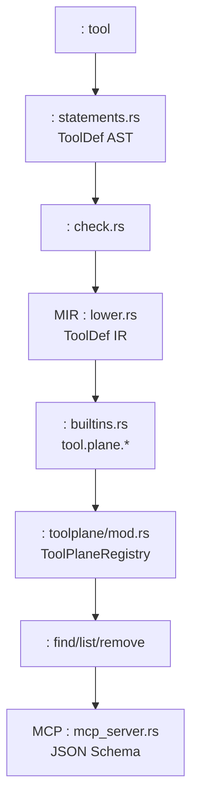
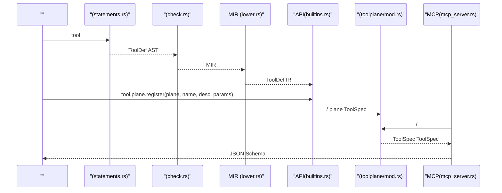
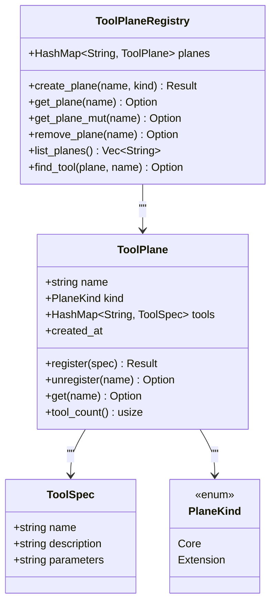
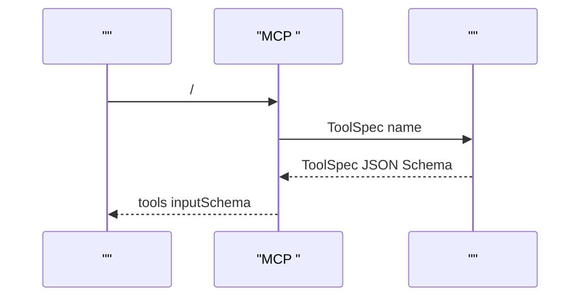

# 

<cite>
****
- [ast_v2.rs](file://src/ast_v2.rs)
- [statements.rs](file://src/parser_v2/statements.rs)
- [check.rs](file://src/typeck/check.rs)
- [lower.rs](file://src/mir/lower.rs)
- [mod.rstoolplane](file://src/toolplane/mod.rs)
- [builtins.rs](file://src/interpreter/builtins.rs)
- [mcp_server.rs](file://src/mcp_server.rs)
- [dispatch.rs](file://src/interpreter/dispatch.rs)
</cite>

## 
1. [](#)
2. [](#)
3. [](#)
4. [](#)
5. [](#)
6. [](#)
7. [](#)
8. [](#)
9. [](#)
10. [](#)

## 
 Mora “”
- ToolDef 
-  ASTMIR 
-  Plane /
- 
-  MCP 
- 

## 
“”
-  AST tool  ToolDef 
- 
- MIR  ToolDef  IR
-  tool.plane.*  plane 
-  plane + name  schema
- MCP  JSON Schema 




- [statements.rs:1-800](file://src/parser_v2/statements.rs#L1-L800)
- [check.rs:484-522](file://src/typeck/check.rs#L484-L522)
- [lower.rs:484-522](file://src/mir/lower.rs#L484-L522)
- [mod.rstoolplane:1-166](file://src/toolplane/mod.rs#L1-L166)
- [builtins.rs:1343-1402](file://src/interpreter/builtins.rs#L1343-L1402)
- [mcp_server.rs:337-374](file://src/mcp_server.rs#L337-L374)


- [ast_v2.rs:286-294](file://src/ast_v2.rs#L286-L294)
- [statements.rs:1-800](file://src/parser_v2/statements.rs#L1-L800)
- [check.rs:484-522](file://src/typeck/check.rs#L484-L522)
- [lower.rs:484-522](file://src/mir/lower.rs#L484-L522)
- [mod.rstoolplane:1-166](file://src/toolplane/mod.rs#L1-L166)
- [builtins.rs:1343-1402](file://src/interpreter/builtins.rs#L1343-L1402)
- [mcp_server.rs:337-374](file://src/mcp_server.rs#L337-L374)

## 
- ToolDefAST 
  - 
  - 
- ToolSpec
  - JSON Schema 
  - “”
- ToolPlane
  - 
- ToolPlaneRegistry
  - 
-  APItool.plane.create/register/unregister/find/list_tools/list
  - 


- [ast_v2.rs:286-294](file://src/ast_v2.rs#L286-L294)
- [mod.rstoolplane:46-149](file://src/toolplane/mod.rs#L46-L149)
- [builtins.rs:1343-1402](file://src/interpreter/builtins.rs#L1343-L1402)

## 





- [statements.rs:1-800](file://src/parser_v2/statements.rs#L1-L800)
- [check.rs:484-522](file://src/typeck/check.rs#L484-L522)
- [lower.rs:484-522](file://src/mir/lower.rs#L484-L522)
- [builtins.rs:1343-1402](file://src/interpreter/builtins.rs#L1343-L1402)
- [mod.rstoolplane:107-149](file://src/toolplane/mod.rs#L107-L149)
- [mcp_server.rs:337-374](file://src/mcp_server.rs#L337-L374)

## 

### ToolDef 
- 
- 
-  IDE 
-  AST 
- 

 MIR 


- [ast_v2.rs:286-294](file://src/ast_v2.rs#L286-L294)

### 
- “”
- 
- 

```mermaid
flowchart TD
Start([" check_tool_def_stmt"]) --> PushScope[""]
PushScope --> ForEachParam[" (name, hint?)"]
ForEachParam --> BuildTy{"hint ?"}
BuildTy --> || FromHint[" hint "]
BuildTy --> || AnyType[" Union([]) "]
FromHint --> DefineVar[""]
AnyType --> DefineVar
DefineVar --> SetReturnHint[""]
SetReturnHint --> CheckBody[""]
CheckBody --> PopScope[""]
PopScope --> RegisterSig[""]
RegisterSig --> End([""])
```


- [check.rs:484-522](file://src/typeck/check.rs#L484-L522)


- [check.rs:484-522](file://src/typeck/check.rs#L484-L522)

### MIR  IR 
-  ToolDef  IR  MirInst::ToolDef
-  exported 


- [lower.rs:484-522](file://src/mir/lower.rs#L484-L522)

### 
- PlaneCore Extension/
- ToolPlaneRegistry  ToolPlane
- tool.plane.create / register / unregister / list / list_tools / find
- find_tool(plane, name)  ToolSpec




- [mod.rstoolplane:21-149](file://src/toolplane/mod.rs#L21-L149)


- [mod.rstoolplane:1-166](file://src/toolplane/mod.rs#L1-L166)
- [builtins.rs:1343-1402](file://src/interpreter/builtins.rs#L1343-L1402)

###  MCP 
-  find  planenamedescriptionparameters
- MCP  ToolSpec.parameters  JSON Schema
-  -> MCP  ->  -> 




- [mcp_server.rs:337-374](file://src/mcp_server.rs#L337-L374)
- [builtins.rs:1426-1458](file://src/interpreter/builtins.rs#L1426-L1458)


- [mcp_server.rs:337-374](file://src/mcp_server.rs#L337-L374)
- [builtins.rs:1426-1458](file://src/interpreter/builtins.rs#L1426-L1458)

### 
-  MCP  tokio 
-  HTTP/MCP  panic


- [dispatch.rs:1-1074](file://src/interpreter/dispatch.rs#L1-L1074)

## 
-  lexer/token  ToolDef AST
-  AST 
- MIR  AST IR
-  API 
- MCP 

```mermaid
graph LR
Lexer[""] --> Parser["(statements.rs)"]
Parser --> AST["AST(ToolDef)"]
AST --> TypeCheck["(check.rs)"]
TypeCheck --> MIR["MIR (lower.rs)"]
Builtins["API(builtins.rs)"] --> Registry["(toolplane/mod.rs)"]
Registry --> MCP["MCP(mcp_server.rs)"]
```


- [statements.rs:1-800](file://src/parser_v2/statements.rs#L1-L800)
- [check.rs:484-522](file://src/typeck/check.rs#L484-L522)
- [lower.rs:484-522](file://src/mir/lower.rs#L484-L522)
- [mod.rstoolplane:1-166](file://src/toolplane/mod.rs#L1-L166)
- [builtins.rs:1343-1402](file://src/interpreter/builtins.rs#L1343-L1402)
- [mcp_server.rs:337-374](file://src/mcp_server.rs#L337-L374)


- [statements.rs:1-800](file://src/parser_v2/statements.rs#L1-L800)
- [check.rs:484-522](file://src/typeck/check.rs#L484-L522)
- [lower.rs:484-522](file://src/mir/lower.rs#L484-L522)
- [mod.rstoolplane:1-166](file://src/toolplane/mod.rs#L1-L166)
- [builtins.rs:1343-1402](file://src/interpreter/builtins.rs#L1343-L1402)
- [mcp_server.rs:337-374](file://src/mcp_server.rs#L337-L374)

## 
-  HashMap O(1) 
- 
- JSON Schema 
-  plane

[]

## 
- ToolPlane.register 
- tool.plane.register  create 
- MCP  JSON Schema  parameters  JSON
- tool.plane 


- [mod.rstoolplane:74-97](file://src/toolplane/mod.rs#L74-L97)
- [builtins.rs:1343-1402](file://src/interpreter/builtins.rs#L1343-L1402)
- [mcp_server.rs:337-374](file://src/mcp_server.rs#L337-L374)

## 
Mora  ToolDef  MIR  MCP 

[]

## 

### 
- 
- “”
-  JSON Schema  MCP 


- [ast_v2.rs:286-294](file://src/ast_v2.rs#L286-L294)
- [check.rs:484-522](file://src/typeck/check.rs#L484-L522)
- [mcp_server.rs:337-374](file://src/mcp_server.rs#L337-L374)

### 
- 
- 


- [ast_v2.rs:286-294](file://src/ast_v2.rs#L286-L294)

### 
- 
-  JSON Schema 


- [check.rs:484-522](file://src/typeck/check.rs#L484-L522)
- [mcp_server.rs:337-374](file://src/mcp_server.rs#L337-L374)

### 
- 
-  tokio  runtime


- [dispatch.rs:1-1074](file://src/interpreter/dispatch.rs#L1-L1074)

### 
-  planeCore Extension /
-  description  JSON Schema
- 
-  MCP  JSON Schema 


- [mod.rstoolplane:1-166](file://src/toolplane/mod.rs#L1-L166)
- [builtins.rs:1343-1402](file://src/interpreter/builtins.rs#L1343-L1402)
- [mcp_server.rs:337-374](file://src/mcp_server.rs#L337-L374)

### 
-  create plane  register 
-  JSON  MCP  schema
- 
- 


- [mod.rstoolplane:112-121](file://src/toolplane/mod.rs#L112-L121)
- [mcp_server.rs:337-374](file://src/mcp_server.rs#L337-L374)
- [check.rs:484-522](file://src/typeck/check.rs#L484-L522)