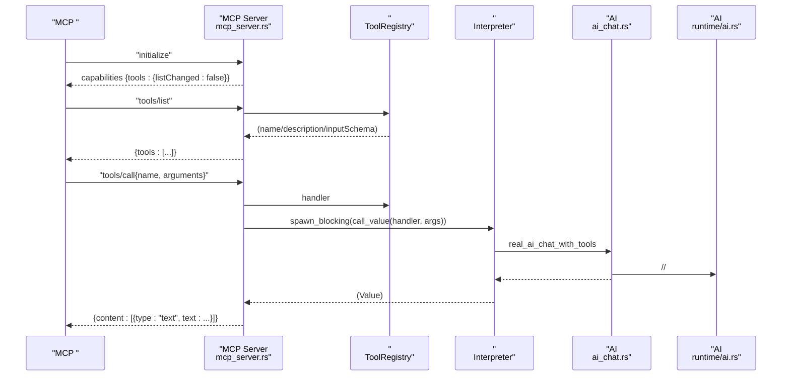
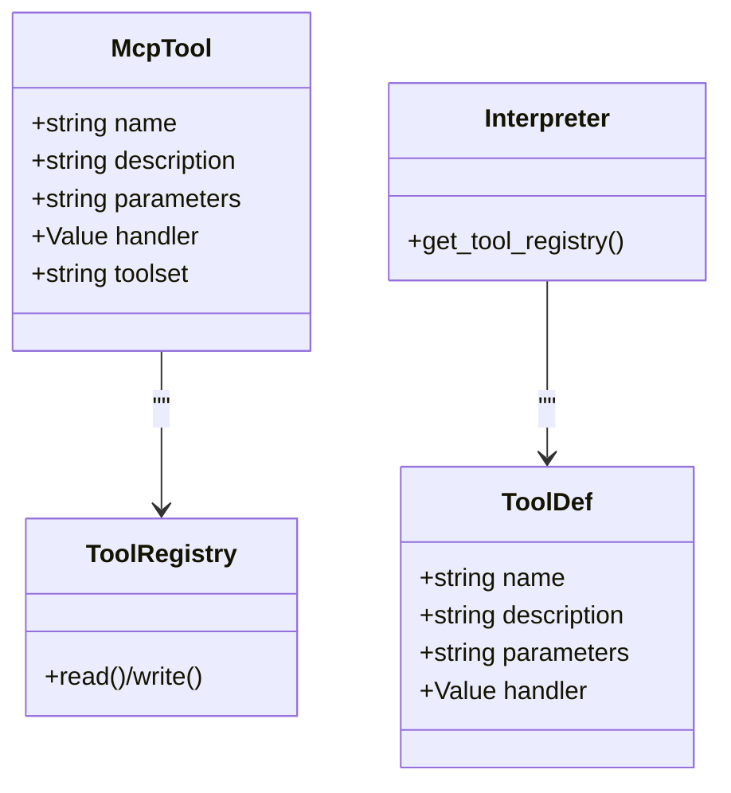
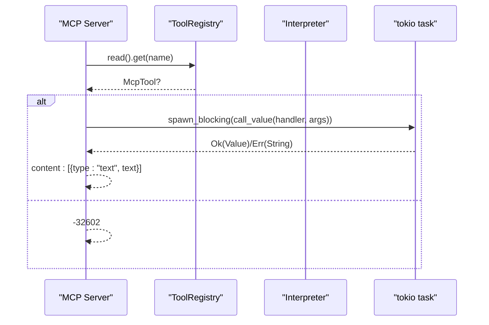
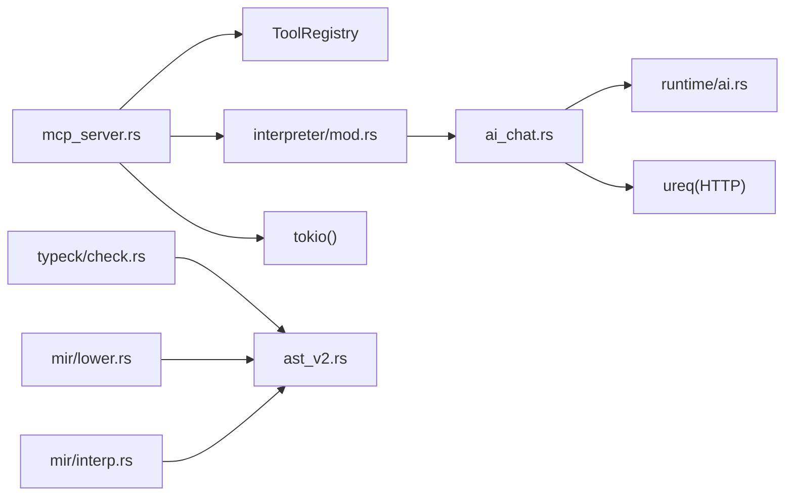

# 

<cite>
****   
- [ai_chat.rs](file://src/interpreter/ai_chat.rs)
- [mcp_server.rs](file://src/mcp_server.rs)
- [mod.rs](file://src/interpreter/mod.rs)
- [dispatch.rs](file://src/interpreter/dispatch.rs)
- [ai.rs](file://src/runtime/ai.rs)
- [registry.rs](file://src/runtime/registry.rs)
- [check.rs](file://src/typeck/check.rs)
- [ast_v2.rs](file://src/ast_v2.rs)
- [lower.rsMIR ](file://src/mir/lower.rs)
- [interp.rsMIR ](file://src/mir/interp.rs)
- [builtins.rs](file://src/interpreter/builtins.rs)
- [mcp_server_demo.mora](file://examples/mcp_server_demo.mora)
</cite>

## 
1. [](#)
2. [](#)
3. [](#)
4. [](#)
5. [](#)
6. [](#)
7. [](#)
8. [](#)
9. [](#)
10. [](#)

## 
 Mora  MCPModel Context Protocol real_ai_chat_with_tools  MCP 

## 
“”
-  AI real_ai_chat_with_tools 
- MCP ServerJSON-RPC over stdio tools/list  tools/call
- AiRuntimeRegistryRuntime 
-  AST/MIRToolDef  MIR 
- 

```mermaid
graph TB
subgraph ""
A["AI <br/>ai_chat.rs"]
B["<br/>dispatch.rs"]
C["<br/>interpreter/mod.rs"]
end
subgraph "MCP "
D["MCP Server <br/>mcp_server.rs"]
end
subgraph ""
E["AI ///<br/>runtime/ai.rs"]
F["trait/mock/ccr/memory<br/>runtime/registry.rs"]
end
subgraph ""
G["AST  ToolDef<br/>ast_v2.rs"]
H[" tool <br/>typeck/check.rs"]
I["MIR <br/>mir/lower.rs, mir/interp.rs"]
end
subgraph ""
J["/<br/>interpreter/builtins.rs"]
end
A --> C
A --> E
B --> C
D --> C
D --> A
H --> G
I --> G
J --> C
```


- [ai_chat.rs:575-704](file://src/interpreter/ai_chat.rs#L575-L704)
- [mcp_server.rs:245-420](file://src/mcp_server.rs#L245-L420)
- [mod.rs:314-366](file://src/interpreter/mod.rs#L314-L366)
- [ai.rs:16-40](file://src/runtime/ai.rs#L16-L40)
- [registry.rs:14-37](file://src/runtime/registry.rs#L14-L37)
- [ast_v2.rs:286-294](file://src/ast_v2.rs#L286-L294)
- [check.rs:484-522](file://src/typeck/check.rs#L484-L522)
- [lower.rsMIR :487-512](file://src/mir/lower.rs#L487-L512)
- [interp.rsMIR :298-302](file://src/mir/interp.rs#L298-L302)
- [builtins.rs:16-200](file://src/interpreter/builtins.rs#L16-L200)


- [ai_chat.rs:575-704](file://src/interpreter/ai_chat.rs#L575-L704)
- [mcp_server.rs:245-420](file://src/mcp_server.rs#L245-L420)
- [mod.rs:314-366](file://src/interpreter/mod.rs#L314-L366)
- [ai.rs:16-40](file://src/runtime/ai.rs#L16-L40)
- [registry.rs:14-37](file://src/runtime/registry.rs#L14-L37)
- [ast_v2.rs:286-294](file://src/ast_v2.rs#L286-L294)
- [check.rs:484-522](file://src/typeck/check.rs#L484-L522)
- [lower.rsMIR :487-512](file://src/mir/lower.rs#L487-L512)
- [interp.rsMIR :298-302](file://src/mir/interp.rs#L298-L302)
- [builtins.rs:16-200](file://src/interpreter/builtins.rs#L16-L200)

## 
- 
  - ToolDef namedescriptionparametersJSON Schema handler
  - ChatMessage/ToolCall tool_calls 
- MCP 
  - McpToolMCP name/description/parameters/handler/toolset
  - ToolRegistry HashMap<String, McpTool>
  - ToolsetConfig toolset 
- 
  - AiRuntimetoken /trace
  - RegistryRuntimetrait/impl/mock/ccr/memory 
-  IR
  - AST ToolDef MIR  tool 


- [mod.rs:314-366](file://src/interpreter/mod.rs#L314-L366)
- [mcp_server.rs:22-74](file://src/mcp_server.rs#L22-L74)
- [ai.rs:16-40](file://src/runtime/ai.rs#L16-L40)
- [registry.rs:14-37](file://src/runtime/registry.rs#L14-L37)
- [ast_v2.rs:286-294](file://src/ast_v2.rs#L286-L294)
- [check.rs:484-522](file://src/typeck/check.rs#L484-L522)
- [lower.rsMIR :487-512](file://src/mir/lower.rs#L487-L512)

## 
 MCP  JSON-RPC 




- [mcp_server.rs:245-420](file://src/mcp_server.rs#L245-L420)
- [ai_chat.rs:575-704](file://src/interpreter/ai_chat.rs#L575-L704)
- [ai.rs:16-40](file://src/runtime/ai.rs#L16-L40)

## 

### real_ai_chat_with_tools 
-  tool_calls  tool 
- 
  -  messages JSON  tools JSON name/description/parameters
  -  POST /chat/completions model/messages/tools  temperature/max_tokens/system 
  -  usageinput/output token  content/tool_calls
  -  tool_calls content
  -  tool_calls assistant  messages tool_call
    -  handler
    -  argumentsJSON  Value json_to_value
    -  call_value(handler, [args_dict]) tool 
    -  tool tool_call_id + content
  -  max_rounds=10 
- 
  - HTTP  >=400 
  - 
  -  ureq Agent  timeout_global/timeout_send_body 
- 
  -  input/output token  token 
  -  AiRuntime.trace  span  AI 

```mermaid
flowchart TD
Start([" real_ai_chat_with_tools"]) --> BuildMsg[" messages JSON"]
BuildMsg --> BuildTools[" tools JSON"]
BuildTools --> SendReq["POST /chat/completions"]
SendReq --> ParseResp{"HTTP < 400 ?"}
ParseResp --> || ErrHttp[" HTTP "]
ParseResp --> || Extract[" usage/content/tool_calls"]
Extract --> HasCalls{" tool_calls?"}
HasCalls --> || ReturnContent[" content"]
HasCalls --> || AppendAssistant[" assistant "]
AppendAssistant --> LoopTools[" tool_calls"]
LoopTools --> FindHandler{" handler ?"}
FindHandler --> || ToolErr[" 'not found' "]
FindHandler --> || CallHandler["call_value(handler, [args_dict])"]
CallHandler --> WrapResult[""]
ToolErr --> AppendTool[" tool "]
WrapResult --> AppendTool
AppendTool --> NextRound{" tool_calls?"}
NextRound --> || LoopTools
NextRound --> || CheckRounds{"?"}
CheckRounds --> || MaxExceeded[" 'max rounds exceeded'"]
CheckRounds --> || SendReq
```


- [ai_chat.rs:575-704](file://src/interpreter/ai_chat.rs#L575-L704)


- [ai_chat.rs:575-704](file://src/interpreter/ai_chat.rs#L575-L704)

### 
- 
  -  tool_registryHashMap<String, ToolDef>ToolDef  name/description/parameters/handler
  - MCP  ToolRegistryArc<RwLock<HashMap<String, McpTool>>>McpTool  name/description/parameters/handler/toolset
- 
  - AST  ToolDef name/description/params/return_type/body/exported
  -  tool  hint body 
- MIR 
  - lower.rs  ToolDef  MirInst::ToolDef
  - interp.rs  ToolDef  AST 




- [mod.rs:314-366](file://src/interpreter/mod.rs#L314-L366)
- [mcp_server.rs:22-74](file://src/mcp_server.rs#L22-L74)
- [ast_v2.rs:286-294](file://src/ast_v2.rs#L286-L294)
- [check.rs:484-522](file://src/typeck/check.rs#L484-L522)
- [lower.rsMIR :487-512](file://src/mir/lower.rs#L487-L512)
- [interp.rsMIR :298-302](file://src/mir/interp.rs#L298-L302)


- [mod.rs:314-366](file://src/interpreter/mod.rs#L314-L366)
- [mcp_server.rs:22-74](file://src/mcp_server.rs#L22-L74)
- [ast_v2.rs:286-294](file://src/ast_v2.rs#L286-L294)
- [check.rs:484-522](file://src/typeck/check.rs#L484-L522)
- [lower.rsMIR :487-512](file://src/mir/lower.rs#L487-L512)
- [interp.rsMIR :298-302](file://src/mir/interp.rs#L298-L302)

### MCP 
- JSON-RPC 2.0 over stdin/stdout LSP transport  Content-Length framing
-  capabilities.tools.listChanged=falseserverInfo 
- tools/list  ToolRegistry name/description/inputSchemaparameters  JSON Schema
- tools/call
  -  params.name  params.arguments
  -  -32602
  -  arguments JSON  Mora Value
  -  tokio::task::spawn_blocking  call_value
  -  MCP content text 
  -  -32603 




- [mcp_server.rs:331-420](file://src/mcp_server.rs#L331-L420)


- [mcp_server.rs:245-420](file://src/mcp_server.rs#L245-L420)

### 
- 
  - HTTP  2xx
  - 
  - 
- 
  - web.fetchtimeout_global  timeout_send_body /
  - ai.chatAI_READ_TIMEOUT_SECS  HTTP_WRITE_TIMEOUT_SECS
- AI 
  -  + jitterbase_ms * 2^attempt + jitter
  - 4295xx
  - 

```mermaid
flowchart TD
Enter([" AI "]) --> RetryLoop{"attempt <= max_retries ?"}
RetryLoop --> || FailMax[" 'retry loop exited'"]
RetryLoop --> || Sleep[" sleep = base*2^attempt + jitter"]
Sleep --> Post["POST /chat/completions"]
Post --> Resp{"status < 400 ?"}
Resp --> || Success[" usage/content "]
Resp --> || Classify["(429/5xx/)"]
Classify --> Retryable{"?"}
Retryable --> || RetryLoop
Retryable --> || FailErr[""]
```


- [mod.rs:64-111](file://src/interpreter/mod.rs#L64-L111)
- [ai_chat.rs:275-573](file://src/interpreter/ai_chat.rs#L275-L573)


- [mod.rs:64-111](file://src/interpreter/mod.rs#L64-L111)
- [ai_chat.rs:275-573](file://src/interpreter/ai_chat.rs#L275-L573)

## 
- 
  - MCP Server  ToolRegistry  Interpreter spawn_blocking 
  - AI  AiRuntime
  -  IR  ToolDef 
- 
  - ureqHTTP 
  - tokioMCP 
  - LSP JSONJSON  Content-Length 




- [mcp_server.rs:245-420](file://src/mcp_server.rs#L245-L420)
- [ai_chat.rs:575-704](file://src/interpreter/ai_chat.rs#L575-L704)
- [ai.rs:16-40](file://src/runtime/ai.rs#L16-L40)
- [check.rs:484-522](file://src/typeck/check.rs#L484-L522)
- [ast_v2.rs:286-294](file://src/ast_v2.rs#L286-L294)
- [lower.rsMIR :487-512](file://src/mir/lower.rs#L487-L512)
- [interp.rsMIR :298-302](file://src/mir/interp.rs#L298-L302)


- [mcp_server.rs:245-420](file://src/mcp_server.rs#L245-L420)
- [ai_chat.rs:575-704](file://src/interpreter/ai_chat.rs#L575-L704)
- [ai.rs:16-40](file://src/runtime/ai.rs#L16-L40)
- [check.rs:484-522](file://src/typeck/check.rs#L484-L522)
- [ast_v2.rs:286-294](file://src/ast_v2.rs#L286-L294)
- [lower.rsMIR :487-512](file://src/mir/lower.rs#L487-L512)
- [interp.rsMIR :298-302](file://src/mir/interp.rs#L298-L302)

## 
- 
  - MCP  spawn_blocking  tokio 
-  IO
  - 
- 
  - AI 
- 
  - 

[]

## 
- 
  - MCP  ToolRegistry  name 
  -  tool  parameters JSON Schema  arguments 
  -  spawn_blocking 
  - / HTTP  API KeyBase URL
- 
  -  traceAiRuntime.set_trace_enabled
  -  MCP  initialize/tools/list 
  -  AI  retry 429/5xx/


- [mcp_server.rs:331-420](file://src/mcp_server.rs#L331-L420)
- [ai_chat.rs:275-573](file://src/interpreter/ai_chat.rs#L275-L573)
- [ai.rs:42-53](file://src/runtime/ai.rs#L42-L53)

## 
Mora “ + MCP  + ”AST/MIR  AI MCP 

[]

## 

### 
-  tool namedescription hint hintbody
-  JSON Schema  MCP  inputSchema 
- 


- [ast_v2.rs:286-294](file://src/ast_v2.rs#L286-L294)
- [check.rs:484-522](file://src/typeck/check.rs#L484-L522)

### 
- 
-  file.*web.fetch
-  MCP  examples/mcp_server_demo.mora 


- [builtins.rs:16-200](file://src/interpreter/builtins.rs#L16-L200)
- [mcp_server_demo.mora:1-17](file://examples/mcp_server_demo.mora#L1-L17)

### 
- file.read_text/file.write_text/file.exists/file.list/file.mkdir/file.remove 
- web.fetchGET  URL
-  SQL  MCP 


- [builtins.rs:16-200](file://src/interpreter/builtins.rs#L16-L200)
- [ai_chat.rs:59-140](file://src/interpreter/ai_chat.rs#L59-L140)