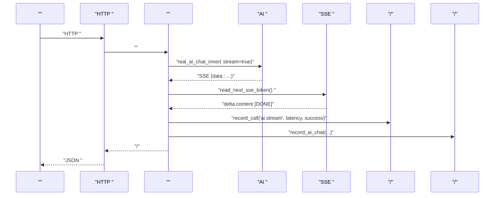
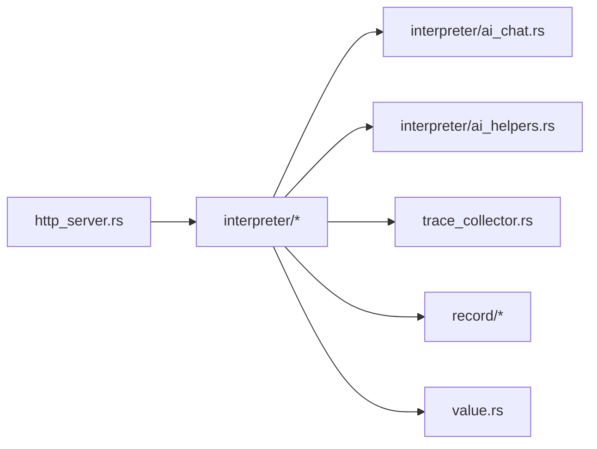

# 

<cite>
****   
- [src/main.rs](file://src/main.rs)
- [src/http_server.rs](file://src/http_server.rs)
- [src/interpreter/ai_chat.rs](file://src/interpreter/ai_chat.rs)
- [src/interpreter/ai_helpers.rs](file://src/interpreter/ai_helpers.rs)
- [src/value.rs](file://src/value.rs)
- [src/trace_collector.rs](file://src/trace_collector.rs)
- [src/record/analysis.rs](file://src/record/analysis.rs)
- [src/record/diff.rs](file://src/record/diff.rs)
</cite>

## 
1. [](#)
2. [](#)
3. [](#)
4. [](#)
5. [](#)
6. [](#)
7. [](#)
8. [](#)
9. [](#)
10. [](#)
11. [](#)
12. [](#)
13. [](#)

## 
 Mora  AI 
- SSE  token 
- 
- 
- 
- 
- 

## 

- HTTP 
-  AI  SSE
-  Reader 
-  Token 
-  AI 

```mermaid
graph TB
Client[""] --> HTTP["HTTP <br/>http_server.rs"]
HTTP --> Interp["<br/>interpreter/*"]
Interp --> AI["AI  SSE <br/>ai_chat.rs / ai_helpers.rs"]
AI --> Net["HTTP (ureq)"]
Interp --> Trace["<br/>trace_collector.rs"]
Interp --> Rec["/<br/>record/*"]
Interp --> Val["(Value/Stream)<br/>value.rs"]
```


- [src/http_server.rs:72-112](file://src/http_server.rs#L72-L112)
- [src/interpreter/ai_chat.rs:142-212](file://src/interpreter/ai_chat.rs#L142-L212)
- [src/interpreter/ai_helpers.rs:198-242](file://src/interpreter/ai_helpers.rs#L198-L242)
- [src/value.rs:189-193](file://src/value.rs#L189-L193)
- [src/trace_collector.rs:138-162](file://src/trace_collector.rs#L138-L162)
- [src/record/analysis.rs:94-134](file://src/record/analysis.rs#L94-L134)


- [src/main.rs:26-261](file://src/main.rs#L26-L261)
- [src/http_server.rs:72-112](file://src/http_server.rs#L72-L112)

## 
-  Stream BufReader 
- SSE  data:  delta.content [DONE] 
-  max_tokens  stream=true
-  ai.chat/ai.stream  Token 
-  web.fetch  ai.chat 


- [src/value.rs:189-193](file://src/value.rs#L189-L193)
- [src/interpreter/ai_helpers.rs:198-242](file://src/interpreter/ai_helpers.rs#L198-L242)
- [src/interpreter/ai_chat.rs:482-493](file://src/interpreter/ai_chat.rs#L482-L493)
- [src/trace_collector.rs:138-162](file://src/trace_collector.rs#L138-L162)
- [src/record/analysis.rs:94-134](file://src/record/analysis.rs#L94-L134)

## 
Mora “HTTP  +  + AI SSE  + /”HTTP AI  SSE  token StreamReader 




- [src/http_server.rs:145-223](file://src/http_server.rs#L145-L223)
- [src/interpreter/ai_chat.rs:142-212](file://src/interpreter/ai_chat.rs#L142-L212)
- [src/interpreter/ai_helpers.rs:198-242](file://src/interpreter/ai_helpers.rs#L198-L242)
- [src/trace_collector.rs:138-162](file://src/trace_collector.rs#L138-L162)
- [src/record/analysis.rs:94-134](file://src/record/analysis.rs#L94-L134)

## 

### 
- Value::Stream  StreamReader  done 
- StreamReader  BufReader<Box<dyn Read + Send + Sync>> 
- read_next_sse_token  event/id/retry  data  JSON  choices[0].delta.content [DONE] 

```mermaid
classDiagram
class Value {
+Stream{ reader, done }
}
class StreamReader {
+new(reader)
+lock() MutexGuard
}
class Interpreter {
+read_next_sse_token(reader) Result<Option<String>, String>
}
Value --> StreamReader : ""
Interpreter --> StreamReader : ""
```


- [src/value.rs:189-193](file://src/value.rs#L189-L193)
- [src/value.rs:14-28](file://src/value.rs#L14-L28)
- [src/interpreter/ai_helpers.rs:198-242](file://src/interpreter/ai_helpers.rs#L198-L242)


- [src/value.rs:189-193](file://src/value.rs#L189-L193)
- [src/value.rs:14-28](file://src/value.rs#L14-L28)
- [src/interpreter/ai_helpers.rs:198-242](file://src/interpreter/ai_helpers.rs#L198-L242)

### 
-  current_ai_config.max_tokens  1000 ",\"stream\":true"
-  real_ai_chat_inner 

```mermaid
flowchart TD
Start([" real_ai_chat_inner"]) --> CheckCfg[" current_ai_config.max_tokens"]
CheckCfg --> UseStream{"max_tokens > 1000 ?"}
UseStream -- "" --> InsertStream[" stream=true"]
UseStream -- "" --> SkipStream[""]
InsertStream --> BuildAgent[" ureq Agent "]
SkipStream --> BuildAgent
BuildAgent --> End([""])
```


- [src/interpreter/ai_chat.rs:482-493](file://src/interpreter/ai_chat.rs#L482-L493)


- [src/interpreter/ai_chat.rs:482-493](file://src/interpreter/ai_chat.rs#L482-L493)

### HTTP 
- HTTP  spawn_blocking 
-  HTTP  JSON SSE  handler  send_response
- 


- [src/http_server.rs:145-223](file://src/http_server.rs#L145-L223)
- [src/http_server.rs:396-418](file://src/http_server.rs#L396-L418)

### 
- TraceCollector  ai.chat/ai.stream  Token 
- SpanHandle RAII  spanend_error 
- 


- [src/trace_collector.rs:138-162](file://src/trace_collector.rs#L138-L162)
- [src/trace_collector.rs:189-204](file://src/trace_collector.rs#L189-L204)

### 
- record_ai_chat/web_fetch  .mora/recordings/*.jsonl
-  list/stats/timeline/export/diff/snapshot 
-  response


- [src/main.rs:425-487](file://src/main.rs#L425-L487)
- [src/main.rs:489-541](file://src/main.rs#L489-L541)
- [src/record/analysis.rs:94-134](file://src/record/analysis.rs#L94-L134)
- [src/record/diff.rs:1-44](file://src/record/diff.rs#L1-L44)

## 
- http_server.rs  interpreter  lsp/json 
- interpreter/ai_chat.rs  ai_infraAiRuntimetrace_collectorrecord 
- ai_helpers.rs  SSE  mock 
- value.rs  Stream  StreamReader




- [src/http_server.rs:72-112](file://src/http_server.rs#L72-L112)
- [src/interpreter/ai_chat.rs:142-212](file://src/interpreter/ai_chat.rs#L142-L212)
- [src/interpreter/ai_helpers.rs:198-242](file://src/interpreter/ai_helpers.rs#L198-L242)
- [src/trace_collector.rs:138-162](file://src/trace_collector.rs#L138-L162)
- [src/value.rs:189-193](file://src/value.rs#L189-L193)


- [src/http_server.rs:72-112](file://src/http_server.rs#L72-L112)
- [src/interpreter/ai_chat.rs:142-212](file://src/interpreter/ai_chat.rs#L142-L212)
- [src/interpreter/ai_helpers.rs:198-242](file://src/interpreter/ai_helpers.rs#L198-L242)
- [src/trace_collector.rs:138-162](file://src/trace_collector.rs#L138-L162)
- [src/value.rs:189-193](file://src/value.rs#L189-L193)

## 
- max_tokens > 1000 
- read_next_sse_token 
- StreamReader  BufReader
- HTTP  tokio spawn_blocking 
- TraceCollector 


- [src/interpreter/ai_chat.rs:482-493](file://src/interpreter/ai_chat.rs#L482-L493)
- [src/interpreter/ai_helpers.rs:198-242](file://src/interpreter/ai_helpers.rs#L198-L242)
- [src/value.rs:14-28](file://src/value.rs#L14-L28)
- [src/http_server.rs:72-112](file://src/http_server.rs#L72-L112)
- [src/trace_collector.rs:138-162](file://src/trace_collector.rs#L138-L162)

## 
- is_retryable_error 429  5xxretry_sleep_ms 
- AI 
- 


- [src/interpreter/mod.rs:80-111](file://src/interpreter/mod.rs#L80-L111)
- [src/interpreter/ai_chat.rs:503-573](file://src/interpreter/ai_chat.rs#L503-L573)
- [src/main.rs:464-486](file://src/main.rs#L464-L486)

## 
- HTTP  tokio  accept 
-  spawn_blocking 
- SSE read_next_sse_token  token 
- 


- [src/http_server.rs:98-107](file://src/http_server.rs#L98-L107)
- [src/interpreter/ai_helpers.rs:198-242](file://src/interpreter/ai_helpers.rs#L198-L242)
- [src/trace_collector.rs:138-162](file://src/trace_collector.rs#L138-L162)

## 

- 
  -  POST /chat  messages ai.chat 
  -  token  HTTP  SSE 
  - [src/http_server.rs:145-223](file://src/http_server.rs#L145-L223)[src/interpreter/ai_chat.rs:142-212](file://src/interpreter/ai_chat.rs#L142-L212)
- 
  - 
  -  TraceCollector 
  - [src/trace_collector.rs:138-162](file://src/trace_collector.rs#L138-L162)
- 
  -  batch/window 
  - 
  - [src/record/analysis.rs:94-134](file://src/record/analysis.rs#L94-L134)

## 
- web.fetch  ai.chat token 
- replay 
- diff 
- snapshot 


- [src/main.rs:425-487](file://src/main.rs#L425-L487)
- [src/main.rs:489-541](file://src/main.rs#L489-L541)
- [src/record/analysis.rs:94-134](file://src/record/analysis.rs#L94-L134)
- [src/record/diff.rs:1-44](file://src/record/diff.rs#L1-L44)

## 
- get_spans_json/export_otel_json  OpenTelemetry 
- metrics_json Token 
- record stats 
- record diff 


- [src/trace_collector.rs:189-204](file://src/trace_collector.rs#L189-L204)
- [src/trace_collector.rs:206-221](file://src/trace_collector.rs#L206-L221)
- [src/main.rs:634-678](file://src/main.rs#L634-L678)
- [src/record/diff.rs:1-44](file://src/record/diff.rs#L1-L44)

## 
Mora  SSE 