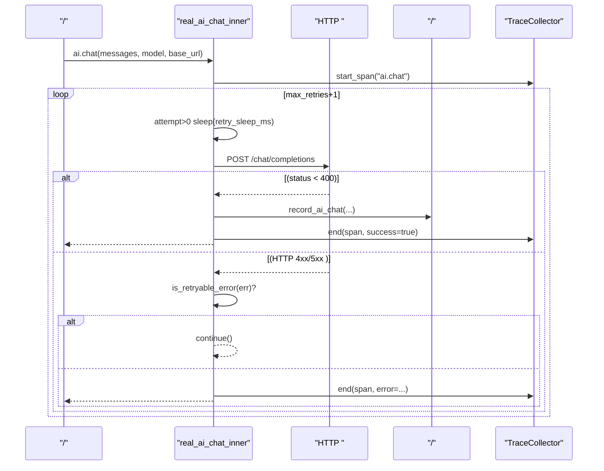
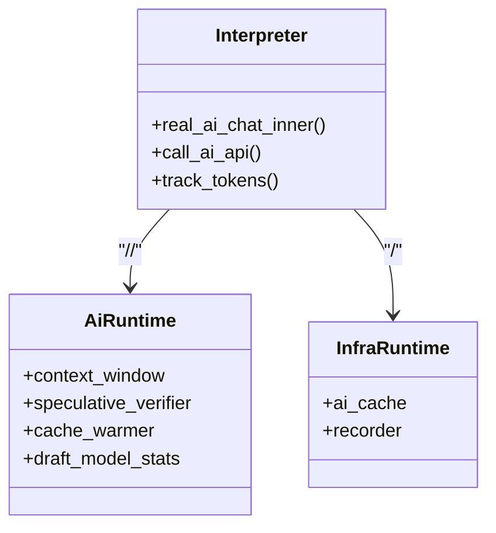
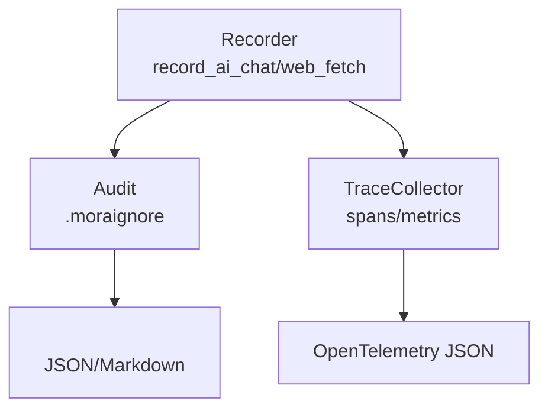
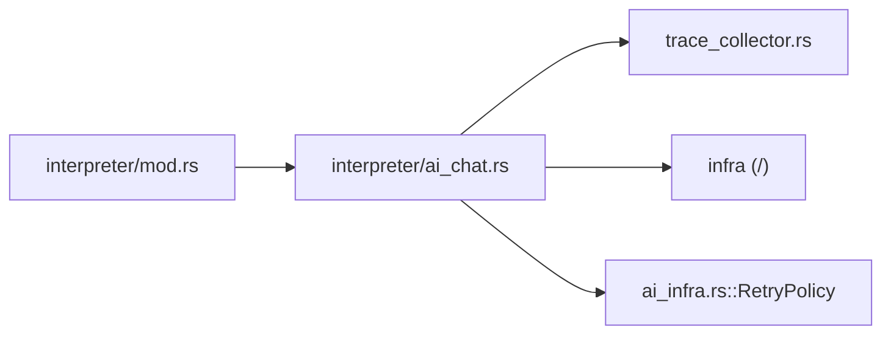

# 

<cite>
****   
- [ai_infra.rs](file://src/ai_infra.rs)
- [interpreter/mod.rs](file://src/interpreter/mod.rs)
- [interpreter/ai_chat.rs](file://src/interpreter/ai_chat.rs)
- [trace_collector.rs](file://src/trace_collector.rs)
- [main.rs](file://src/main.rs)
- [record/audit.rs](file://src/record/audit.rs)
- [record/tests.rs](file://src/record/tests.rs)
</cite>

## 
1. [](#)
2. [](#)
3. [](#)
4. [](#)
5. [](#)
6. [](#)
7. [](#)
8. [](#)
9. [](#)
10. [](#)

## 
 Mora  AI 
- 
- 
- 
- 
- 
- API 
- 

## 
 AI 
- AI HTTP 
- AI 
- Trace/Metrics 
- 

```mermaid
graph TB
subgraph ""
A["ai_chat.rs<br/>real_ai_chat_inner"] --> B["mod.rs<br/>is_retryable_error / retry_sleep_ms"]
A --> C["ai_infra.rs<br/>RetryPolicy()"]
end
subgraph ""
D["trace_collector.rs<br/>TraceCollector"]
end
subgraph ""
E["main.rs<br/>record/audit "]
F["record/audit.rs<br/>IgnoreRule/"]
G["record/tests.rs<br/>"]
end
A --> D
E --> F
E --> G
```


- [interpreter/ai_chat.rs:275-573](file://src/interpreter/ai_chat.rs#L275-L573)
- [interpreter/mod.rs:80-111](file://src/interpreter/mod.rs#L80-L111)
- [ai_infra.rs:726-783](file://src/ai_infra.rs#L726-L783)
- [trace_collector.rs:1-269](file://src/trace_collector.rs#L1-L269)
- [main.rs:867-914](file://src/main.rs#L867-L914)
- [record/audit.rs:71-108](file://src/record/audit.rs#L71-L108)
- [record/tests.rs:503-592](file://src/record/tests.rs#L503-L592)


- [interpreter/ai_chat.rs:1-800](file://src/interpreter/ai_chat.rs#L1-L800)
- [interpreter/mod.rs:1-800](file://src/interpreter/mod.rs#L1-L800)
- [ai_infra.rs:1-784](file://src/ai_infra.rs#L1-L784)
- [trace_collector.rs:1-269](file://src/trace_collector.rs#L1-L269)
- [main.rs:867-914](file://src/main.rs#L867-L914)
- [record/audit.rs:71-108](file://src/record/audit.rs#L71-L108)
- [record/tests.rs:503-592](file://src/record/tests.rs#L503-L592)

## 
-  AI “ + ”
-  HTTP 4295xx
- 
-  TraceCollector 


- [interpreter/ai_chat.rs:503-573](file://src/interpreter/ai_chat.rs#L503-L573)
- [interpreter/mod.rs:80-111](file://src/interpreter/mod.rs#L80-L111)
- [ai_infra.rs:726-783](file://src/ai_infra.rs#L726-L783)
- [trace_collector.rs:1-269](file://src/trace_collector.rs#L1-L269)
- [main.rs:867-914](file://src/main.rs#L867-L914)
- [record/audit.rs:71-108](file://src/record/audit.rs#L71-L108)

## 
 AI 




- [interpreter/ai_chat.rs:503-573](file://src/interpreter/ai_chat.rs#L503-L573)
- [interpreter/mod.rs:80-111](file://src/interpreter/mod.rs#L80-L111)
- [trace_collector.rs:1-269](file://src/trace_collector.rs#L1-L269)

## 

### 
- 
  -  MORA_AI_RETRY_MAX  3 4 
  -  MORA_AI_RETRY_BASE_MS  1000ms
- 
  - “ + ” n  base * 2^n
  -  ±20%
- 
  - RetryPolicy  next_delay()  should_retry_for_error() backoff_factormax_delay_ms 

```mermaid
flowchart TD
Start([""]) --> ReadCfg["<br/>MORA_AI_RETRY_MAX / MORA_AI_RETRY_BASE_MS"]
ReadCfg --> Loop{"attempt <= max_retries ?"}
Loop --> || ExitErr[""]
Loop --> || SleepIfNeed{"attempt > 0 ?"}
SleepIfNeed --> || CalcSleep["exp = base * 2^attempt<br/>jitter = exp/5<br/>offset ∈ [-jitter, jitter]"]
CalcSleep --> DoSleep["sleep(exp + offset)"]
SleepIfNeed --> || CallAPI[" HTTP "]
DoSleep --> CallAPI
CallAPI --> Resp{"status < 400 ?"}
Resp --> || Success["//<br/>"]
Resp --> || ErrType[""]
ErrType --> Retryable{"is_retryable_error(err) ?"}
Retryable --> || Loop
Retryable --> || ExitErr
```


- [interpreter/ai_chat.rs:503-573](file://src/interpreter/ai_chat.rs#L503-L573)
- [interpreter/mod.rs:80-111](file://src/interpreter/mod.rs#L80-L111)
- [ai_infra.rs:726-783](file://src/ai_infra.rs#L726-L783)


- [interpreter/ai_chat.rs:503-573](file://src/interpreter/ai_chat.rs#L503-L573)
- [interpreter/mod.rs:80-111](file://src/interpreter/mod.rs#L80-L111)
- [ai_infra.rs:726-783](file://src/ai_infra.rs#L726-L783)

### 
- “network error” HTTP  Transport 
- HTTP 
  - 429
  - 5xx
  -  4xx
- 
  - //
  - 429  “rate limit”
  - 500/502/503
  - 400/401/403
  - 

```mermaid
flowchart TD
In[" err"] --> CheckNet{" 'network error' ?"}
CheckNet --> || Retryable[""]
CheckNet --> || ParseCode[" HTTP "]
ParseCode --> Code429{"== 429 ?"}
Code429 --> || Retryable
Code429 --> || Code5xx{"500..599 ?"}
Code5xx --> || Retryable
Code5xx --> || NotRetryable[""]
```


- [interpreter/mod.rs:80-111](file://src/interpreter/mod.rs#L80-L111)
- [ai_infra.rs:726-783](file://src/ai_infra.rs#L726-L783)


- [interpreter/mod.rs:80-111](file://src/interpreter/mod.rs#L80-L111)
- [ai_infra.rs:726-783](file://src/ai_infra.rs#L726-L783)

### 
- 
  - Mock  API Key 
  - 
- 
  - “/”
- 
  -  LRU 
  - 




- [interpreter/ai_chat.rs:275-573](file://src/interpreter/ai_chat.rs#L275-L573)
- [ai_infra.rs:1-784](file://src/ai_infra.rs#L1-L784)


- [interpreter/ai_chat.rs:275-573](file://src/interpreter/ai_chat.rs#L275-L573)
- [ai_infra.rs:1-784](file://src/ai_infra.rs#L1-L784)

### 
- 
  - HTTP “network error”
  - 
- 
  - 
  - 


- [interpreter/ai_chat.rs:503-573](file://src/interpreter/ai_chat.rs#L503-L573)
- [interpreter/mod.rs:80-111](file://src/interpreter/mod.rs#L80-L111)

### 
- 
  - MORA_AI_RETRY_MAX 3
  - MORA_AI_RETRY_BASE_MS 1000
- 
  - RetryPolicy.max_retriesbase_delay_msmax_delay_msbackoff_factor 
  - should_retry_for_error 


- [interpreter/mod.rs:64-78](file://src/interpreter/mod.rs#L64-L78)
- [ai_infra.rs:726-783](file://src/ai_infra.rs#L726-L783)

### 
- 
  - HTTP “network error connecting to ...”
  - is_retryable_error 
- API 
  - HTTP 429 
  - is_retryable_error 
- 
  - HTTP 5xx 
  - is_retryable_error 


- [interpreter/ai_chat.rs:503-573](file://src/interpreter/ai_chat.rs#L503-L573)
- [interpreter/mod.rs:80-111](file://src/interpreter/mod.rs#L80-L111)

### 
- 
  - AI  Web token 
  -  .moraignore 
- 
  - TraceCollector  span token  OpenTelemetry JSON 




- [interpreter/ai_chat.rs:152-212](file://src/interpreter/ai_chat.rs#L152-L212)
- [main.rs:867-914](file://src/main.rs#L867-L914)
- [record/audit.rs:71-108](file://src/record/audit.rs#L71-L108)
- [trace_collector.rs:1-269](file://src/trace_collector.rs#L1-L269)


- [interpreter/ai_chat.rs:152-212](file://src/interpreter/ai_chat.rs#L152-L212)
- [main.rs:867-914](file://src/main.rs#L867-L914)
- [record/audit.rs:71-108](file://src/record/audit.rs#L71-L108)
- [record/tests.rs:503-592](file://src/record/tests.rs#L503-L592)
- [trace_collector.rs:1-269](file://src/trace_collector.rs#L1-L269)

## 
- 
  - ai_chat.rs  mod.rs 
  - ai_chat.rs  trace_collector.rs 
  - ai_chat.rs  infra 
- 
  - ai_infra.rs  RetryPolicy 




- [interpreter/mod.rs:80-111](file://src/interpreter/mod.rs#L80-L111)
- [interpreter/ai_chat.rs:503-573](file://src/interpreter/ai_chat.rs#L503-L573)
- [ai_infra.rs:726-783](file://src/ai_infra.rs#L726-L783)
- [trace_collector.rs:1-269](file://src/trace_collector.rs#L1-L269)


- [interpreter/mod.rs:80-111](file://src/interpreter/mod.rs#L80-L111)
- [interpreter/ai_chat.rs:503-573](file://src/interpreter/ai_chat.rs#L503-L573)
- [ai_infra.rs:726-783](file://src/ai_infra.rs#L726-L783)
- [trace_collector.rs:1-269](file://src/trace_collector.rs#L1-L269)

## 
- 
  -  10 
  -  RetryPolicy 
- 
  -  LRU 
- 
  - 

[]

## 
- 
  -  MORA_AI_RETRY_MAX  MORA_AI_RETRY_BASE_MS 
  - 
  -  TraceCollector  spans/metrics 
- 
  -  TraceCollector  OpenTelemetry JSON
  -  .moraignore 


- [interpreter/mod.rs:64-78](file://src/interpreter/mod.rs#L64-L78)
- [main.rs:867-914](file://src/main.rs#L867-L914)
- [record/audit.rs:71-108](file://src/record/audit.rs#L71-L108)
- [trace_collector.rs:1-269](file://src/trace_collector.rs#L1-L269)

## 
Mora  AI 
- 
- 
- 
- 
- 

[]

## 
- 
  - 
  - 
  - 
  - 

[]