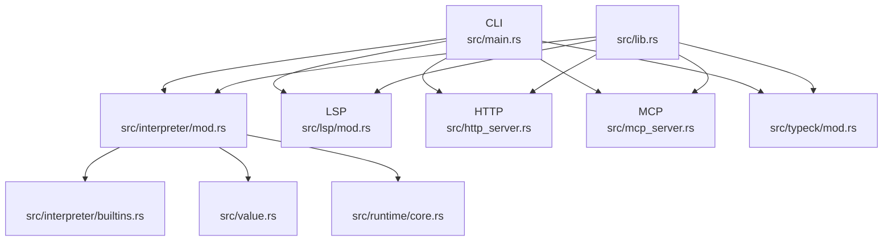
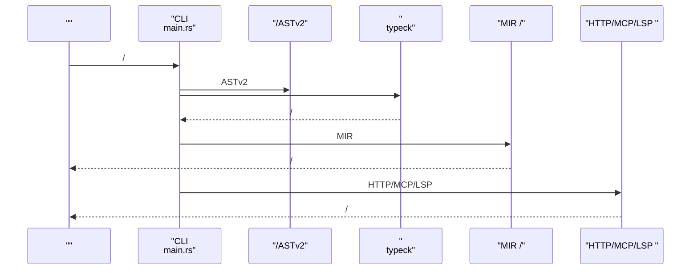
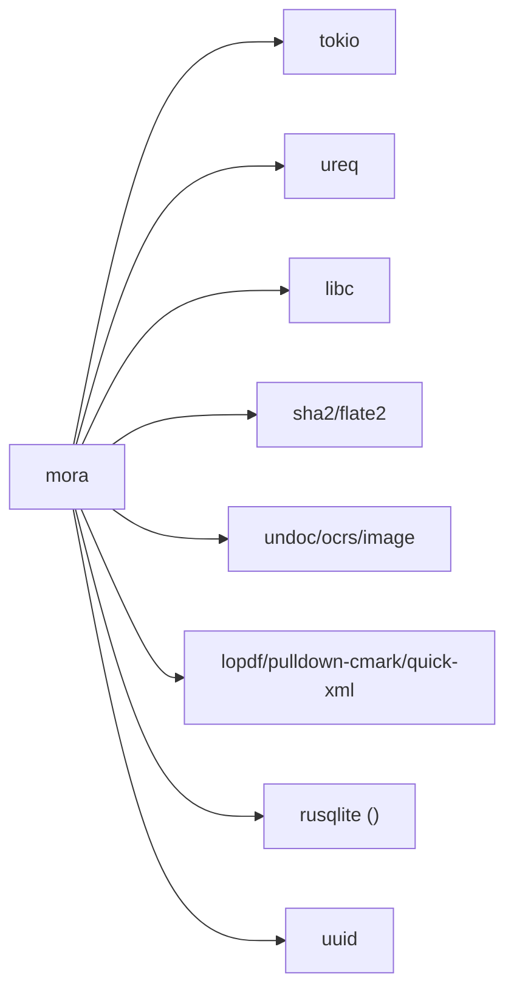

# API 

<cite>
****   
- [README.md](file://README.md)
- [Cargo.toml](file://Cargo.toml)
- [src/lib.rs](file://src/lib.rs)
- [src/main.rs](file://src/main.rs)
- [src/interpreter/mod.rs](file://src/interpreter/mod.rs)
- [src/interpreter/builtins.rs](file://src/interpreter/builtins.rs)
- [src/http_server.rs](file://src/http_server.rs)
- [src/mcp_server.rs](file://src/mcp_server.rs)
- [src/lsp/mod.rs](file://src/lsp/mod.rs)
- [src/lsp/providers/mod.rs](file://src/lsp/providers/mod.rs)
- [src/typeck/mod.rs](file://src/typeck/mod.rs)
- [src/value.rs](file://src/value.rs)
- [src/runtime/core.rs](file://src/runtime/core.rs)
</cite>

## 
1. 
2. 
3. 
4. 
5. 
6. 
7. 
8. 
9. 
10. 

## 
 API  Mora 
- 
- 
- 
- CLI 
- LSP 
- HTTP  MCP 
- 
- 

Mora  AI-native AI HTTP/MCP  Agent 

## 
 CLI  LSP 

- [src/main.rs:1-120](file://src/main.rs#L1-L120)
- [src/interpreter/mod.rs:1-120](file://src/interpreter/mod.rs#L1-L120)
- [src/lsp/mod.rs:1-23](file://src/lsp/mod.rs#L1-L23)
- [src/http_server.rs:1-120](file://src/http_server.rs#L1-L120)
- [src/mcp_server.rs:1-120](file://src/mcp_server.rs#L1-L120)
- [src/typeck/mod.rs:1-120](file://src/typeck/mod.rs#L1-L120)
- [src/lib.rs:1-55](file://src/lib.rs#L1-L55)

- [src/lib.rs:1-55](file://src/lib.rs#L1-L55)
- [src/main.rs:1-120](file://src/main.rs#L1-L120)

## 
- 
  - AI 
  -  MIR 
- 
  -  ai/web/json/file/memory/bus/sandbox/schedule/ccr/mock/exec/toolplane/skill/plan/mora 
  -  Value
- 
  - ResultUnionTrait/Concrete 
- 
  - HTTP  JSON 
  - MCP JSON-RPC over stdiotools/list  tools/call 
- LSP 
  -  hover/completion/definition/references/formatting/folding/semanticTokens/documentSymbol/rename/diagnostics 

- [src/interpreter/mod.rs:214-440](file://src/interpreter/mod.rs#L214-L440)
- [src/interpreter/builtins.rs:1-120](file://src/interpreter/builtins.rs#L1-L120)
- [src/typeck/mod.rs:35-112](file://src/typeck/mod.rs#L35-L112)
- [src/http_server.rs:1-120](file://src/http_server.rs#L1-L120)
- [src/mcp_server.rs:1-120](file://src/mcp_server.rs#L1-L120)
- [src/lsp/mod.rs:1-23](file://src/lsp/mod.rs#L1-L23)

## 
Mora  → / → ASTv2 →  → MIR lowering →  HTTP/MCP/LSP 

- [src/main.rs:370-405](file://src/main.rs#L370-L405)
- [src/typeck/mod.rs:1-120](file://src/typeck/mod.rs#L1-L120)
- [src/interpreter/mod.rs:655-734](file://src/interpreter/mod.rs#L655-L734)
- [src/http_server.rs:70-108](file://src/http_server.rs#L70-L108)
- [src/mcp_server.rs:117-199](file://src/mcp_server.rs#L117-L199)

## 

###  API
“”

- file.* 
  - read_text(path: string) -> string
  - write_text(path: string, content: string) -> nil
  - append_text(path: string, content: string) -> nil
  - read_bytes(path: string) -> string(hex)
  - write_bytes(path: string, hex: string) -> nil
  - exists(path: string) -> bool
  - is_file(path: string) -> bool
  - is_dir(path: string) -> bool
  - size(path: string) -> number
  - list(path: string) -> list<string>
  - mkdir(path: string) -> nil
  - mkdir_all(path: string) -> nil
  - remove(path: string) -> nil
  - remove_all(path: string) -> nil
  - rename(from: string, to: string) -> nil
  - copy(from: string, to: string) -> nil
  - touch(path: string) -> nil
  - cwd() -> string
  - chdir(path: string) -> nil
  - home_dir() -> string
  - join(parts...) -> string
  - abs(path: string) -> string
  - basename(path: string) -> string
  - dirname(path: string) -> string
  - extname(path: string) -> string
  - 

- web.* HTTP 
  - fetch(url: string, options?: dict) -> dict
  -  ureq  HTTP 

- json.* JSON 
  - parse(text: string) -> any
  - stringify(value: any) -> string

- memory.* /
  - store/recall/search/forget/clear/list/len 

- agent.* Agent 
  - create(name, config) -> agent
  - run(task) -> result
  - critic(text[, ctx]) -> evaluation

- bus.* 
  - emit(event: string, payload?: any) -> nil
  - off(pattern: string) -> nil
  - count() -> number
  - subscribe(pattern: string) -> number(token)
  - publish(topic: string, payload?: any) -> number

- sandbox.* 
  - mode() -> string(permissive|strict|custom)
  - check_builtin(name: string) -> bool
  - check_path(path: string) -> bool
  - key(capabilities...) -> number(token_id)
  - check_call(token_id: number, capability: string) -> bool
  - revoke(token_id: number) -> bool
  - token_count() -> number
  - audit_emit(actor: string, action: string, target?: string, payload?: string) -> bool
  - audit_flush() -> bool
  - audit_verify() -> bool|string
  - containerize(backend: string, mounts?: list<string>, network?: string, cpu_cores?: number, memory_mb?: number, image?: string) -> number
  - container_exec(cmd: string, args...) -> dict{exit_code, stdout, stderr, elapsed_ms}
  - container_info() -> dict|nil
  - container_clear() -> bool

- schedule.* 
  - add(name: string, kind: string("every"|"at"), message: string, interval_s?: number, at_epoch?: number) -> string(id)
  - list() -> list<dict{id,name,kind,message,interval_s,at_epoch}>

- exec.* 
  - 

- tool.plane.* ToolPlane 
  -  Core/Extension 

- skill.* 
  -  MoraSkillSpec 

- plan.* 
  -  pi-agent 

- mora.* 
  - refine / list-plans 

- ai.* AI 
  - chat/create/stream/critic “”

- 
  - let text = file.read_text("data.txt")
  - print(len(text))
-  JSON 
  - let obj = {status: "ok"}
  - file.write_text("out.json", json.stringify(obj))
-  HTTP 
  - let resp = web.fetch("https://example.com/api")
  - print(resp.body)

- [src/interpreter/builtins.rs:16-257](file://src/interpreter/builtins.rs#L16-L257)
- [src/interpreter/builtins.rs:259-328](file://src/interpreter/builtins.rs#L259-L328)
- [src/interpreter/builtins.rs:331-725](file://src/interpreter/builtins.rs#L331-L725)
- [src/interpreter/builtins.rs:727-800](file://src/interpreter/builtins.rs#L727-L800)
- [src/interpreter/mod.rs:373-440](file://src/interpreter/mod.rs#L373-L440)
- [src/value.rs:43-115](file://src/value.rs#L43-L115)

### 
- OPENAI_API_KEY AI  mock 
- MORA_AI_MODEL
- MORA_AI_BASE_URLAPI 
- MORA_EMBED_MODELEmbedding 
- MORA_NO_TYPECK 1 
- MORA_AI_RETRY_MAXAI  3
- MORA_AI_RETRY_BASE_MS 1000
- MORA_CORS_ORIGINHTTP  CORS  *

- [README.md:182-191](file://README.md#L182-L191)
- [src/interpreter/mod.rs:22-33](file://src/interpreter/mod.rs#L22-L33)
- [src/interpreter/mod.rs:64-111](file://src/interpreter/mod.rs#L64-L111)
- [src/http_server.rs:404-418](file://src/http_server.rs#L404-L418)

### CLI 
- 
  - mora <file.mora>
  - mora --repl REPL
  - mora --check <file>
  - mora --version/-v
  - mora --help/-h
- //
  - mora record <file.mora> <name> AI/HTTP  .mora/recordings/<name>.jsonl
  - mora replay <file.mora> <name>
  - mora diff <a> <b>
  - mora record list
  - mora record stats <name>
  - mora record timeline <name>
  - mora record export <name> [--format jsonl|md] [--output <file>]
  - mora record audit <name> [--policy <file>]
  - mora record report <name> [--note <text>] [--verify <cmd>] [--output <file>]
- 
  - mora snapshot <file.mora> <name> [--update]
- MCP 
  - mora mcp tool-list
  - mora mcp tool-search <q>
  - mora mcp toolsets
- 
  - mora install <url> URL  .mora  vendor 

- [src/main.rs:26-261](file://src/main.rs#L26-L261)
- [src/main.rs:407-800](file://src/main.rs#L407-L800)

### LSP 
- initialize  capabilities
  - textDocumentSyncfull sync
  - hover/task 
  - completion +  + task + builtin
  - definition
  - references
  - documentSymbol
  - documentFormatting + documentRangeFormatting
  - rename
  - semanticTokens
  - foldingRangeif/for/task 
  - publishDiagnostics
- 
  - JSON-RPC Content-Length  JSON /

- [README.md:276-298](file://README.md#L276-L298)
- [src/lsp/mod.rs:1-23](file://src/lsp/mod.rs#L1-L23)
- [src/lsp/providers/mod.rs:1-23](file://src/lsp/providers/mod.rs#L1-L23)

### HTTP  API 
- 
  -  serve as http on port N do ... end 
-  req
  - method: string
  - path: string
  - query: dictquery string 
  - body: dict/list/string JSON 
  - headers: dict<string,string>
  - params: dict<string,string> :id 
- 
  - handler  dict application/json
- 
  - 
  -  :param 
- 
  -  30s
  -  60s 504
  -  404
  -  500
- CORS
  -  MORA_CORS_ORIGIN 

- [src/http_server.rs:1-120](file://src/http_server.rs#L1-L120)
- [src/http_server.rs:145-223](file://src/http_server.rs#L145-L223)
- [src/http_server.rs:225-343](file://src/http_server.rs#L225-L343)
- [src/http_server.rs:349-418](file://src/http_server.rs#L349-L418)

### MCP  API 
- 
  - JSON-RPC 2.0 over stdin/stdout Content-Length 
- 
  - initialize capabilities.tools.listChanged=falseserverInfo.name/version
- 
  - tools/listname/description/inputSchema
  - tools/call name  arguments  content text 
- 
  -  -32601
  -  -32602
  -  -32603

- [src/mcp_server.rs:1-120](file://src/mcp_server.rs#L1-L120)
- [src/mcp_server.rs:243-329](file://src/mcp_server.rs#L243-L329)
- [src/mcp_server.rs:331-466](file://src/mcp_server.rs#L331-L466)

### 
- 
  - string/char/int/float/bool/nil
  - list<T>/dict<K,V>/result<T,E>/union(T1|T2|...)
  - ai_config/ai_result/ai_error/ai_module/router/http_request/http_response/mcp_server
  - trait/concrete/trait_object/compose/partial/atom/macro/prompt_section/document
- 
  - 
  - 
  - / task  Any Union
  -  MORA_NO_TYPECK=1 

- [src/typeck/mod.rs:35-112](file://src/typeck/mod.rs#L35-L112)
- [src/typeck/mod.rs:162-255](file://src/typeck/mod.rs#L162-L255)
- [src/typeck/mod.rs:284-349](file://src/typeck/mod.rs#L284-L349)
- [src/typeck/mod.rs:408-505](file://src/typeck/mod.rs#L408-L505)

### 
- Value 
  - niltasktoolclosurebuiltinconversationstreamagentroutermcp_servercomposepartialatommacroprompt_sectiondocument 
- Environment
  - 
- BuiltinKind
  - 

- [src/value.rs:142-200](file://src/value.rs#L142-L200)
- [src/value.rs:43-115](file://src/value.rs#L43-L115)
- [src/runtime/core.rs:14-47](file://src/runtime/core.rs#L14-L47)

## 
- 
  -  build.rs  MORAGIT_VERSION
- 
  - tokioHTTP/MCP 
  - ureq HTTP 
  - libcSO_REUSEADDR
  - flate2sha2undococrsimagelopdfpulldown-cmarkquick-xmlrusqliteuuid 
- 
  - checkpoint-sqlite SQLite 
  - jit LLVM JITinkwell

- [Cargo.toml:1-102](file://Cargo.toml#L1-L102)

- [Cargo.toml:1-102](file://Cargo.toml#L1-L102)
- [src/lib.rs:1-55](file://src/lib.rs#L1-L55)

## 
- 
  - v0.52+  MIR 
- 
  - HTTP/MCP  tokio  60s 
- 
  - HTTP  4 
-  JSON
  -  JSON Value 

[]

## 
- 
  - Type error at line N: ...
  - MORA_NO_TYPECK=1
- 
  - Runtime error (MIR): ...
  - 
- HTTP 
  - 
  -  60s
  - 
- MCP 
  - 
  -  arguments  inputSchema
- //
  -  .mora/recordings 
  -  diff 

- [src/main.rs:370-405](file://src/main.rs#L370-L405)
- [src/http_server.rs:110-143](file://src/http_server.rs#L110-L143)
- [src/mcp_server.rs:243-329](file://src/mcp_server.rs#L243-L329)

## 
Mora  AI  CLIHTTP/MCP  LSP Agent 

[]

## 

### 
- HTTP
  - 404
  - 500
  - 504
- MCP
  - -32601Method not found
  - -32602Missing params
  - -32603Tool execution error
- 
  - TypeError /

- [src/http_server.rs:340-418](file://src/http_server.rs#L340-L418)
- [src/mcp_server.rs:422-430](file://src/mcp_server.rs#L422-L430)
- [src/typeck/mod.rs:408-505](file://src/typeck/mod.rs#L408-L505)

### 
- v0.04 
  -  ai.xxx/memory.xxx  p"" with tool AiError 
- v0.50 
  - HTTP/MCP  tokio 
- v0.52 
  -  MIR 
- v0.53
  -  ureq  3.3 edition 2024  MSRV 1.85

- [README.md:149-181](file://README.md#L149-L181)
- [README.md:192-228](file://README.md#L192-L228)
- [Cargo.toml:1-102](file://Cargo.toml#L1-L102)