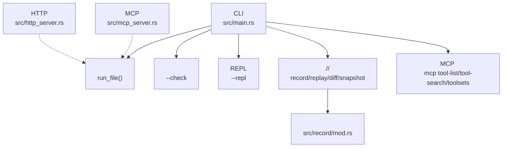
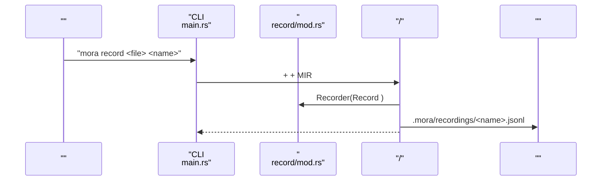
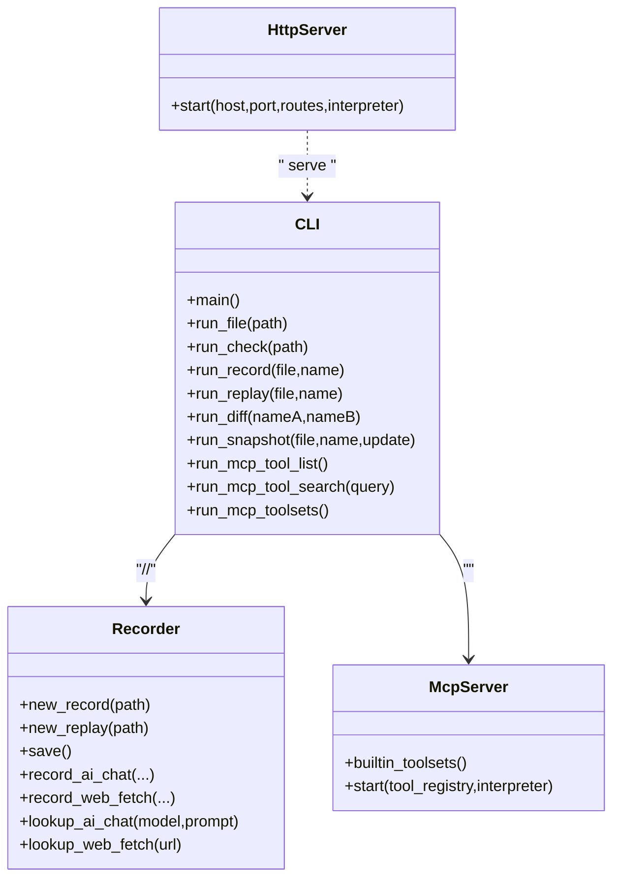

# CLI 

<cite>
****   
- [src/main.rs](file://src/main.rs)
- [README.md](file://README.md)
- [src/record/mod.rs](file://src/record/mod.rs)
- [src/http_server.rs](file://src/http_server.rs)
- [src/mcp_server.rs](file://src/mcp_server.rs)
</cite>

## 
1. 
2. 
3. 
4. 
5. 
6. 
7. 
8. 
9. 
10. 

## 
 Mora CLI  mora runrecordreplaydiffsnapshotmcp 

## 
CLI //HTTP/MCP 

- [src/main.rs:26-261](file://src/main.rs#L26-L261)
- [src/record/mod.rs:1-315](file://src/record/mod.rs#L1-L315)
- [src/http_server.rs:1-200](file://src/http_server.rs#L1-L200)
- [src/mcp_server.rs:1-124](file://src/mcp_server.rs#L1-L200)

- [src/main.rs:26-261](file://src/main.rs#L26-L261)
- [README.md:1-338](file://README.md#L1-L338)

## 
- CLI 
- // JSONL 
- MCP 
- HTTP 

- [src/main.rs:26-261](file://src/main.rs#L26-L261)
- [src/record/mod.rs:1-315](file://src/record/mod.rs#L1-L315)
- [src/mcp_server.rs:1-124](file://src/mcp_server.rs#L1-L200)
- [src/http_server.rs:1-200](file://src/http_server.rs#L1-L200)

## 
CLI  REPL// diffstatstimelineexportauditreport  snapshot 

- [src/main.rs:424-487](file://src/main.rs#L424-L487)
- [src/record/mod.rs:129-236](file://src/record/mod.rs#L129-L236)

## 

### 
- 
  - `mora --version` / `mora -v`
  - `mora --help` / `mora -h`
  - 

- [src/main.rs:26-68](file://src/main.rs#L26-L68)

### 
- 
  - `mora <file.mora>`
  - `mora run <file.mora>`
- 
  -  →  AST v2 →  →  MIR →  →  main task
- 
  - 2
  - 1

- [src/main.rs:370-405](file://src/main.rs#L370-L405)

### 
- 
  - `mora --check <file.mora>`
- 
  - 
- 
  - 0
  - 2

- [src/main.rs:999-1014](file://src/main.rs#L999-L1014)

###  REPL
- 
  - `mora --repl`
- 
  - 

- [src/main.rs:1016-1019](file://src/main.rs#L1016-L1019)

### 
- 
  - `mora install <url>`
- 
  -  URL  vendor 
- 
  -  curl  wget

- [src/main.rs:263-308](file://src/main.rs#L263-L308)

### ///
- 
  - `mora record <file.mora> <name>`
  -  +  +  →  Recorder(Record ) →  →  JSONL  `.mora/recordings/<name>.jsonl`
- 
  - `mora replay <file.mora> <name>`
  -  (kind, key) 
- 
  - `mora diff <name-a> <name-b>`
  - 
- 
  - `mora record list`
  - 
- 
  - `mora record stats <name>`
  - token 
- 
  - `mora record export <name> [--format jsonl|md] [--output <file>]`
  -  JSONL  Markdown
- 
  - `mora record audit <name> [--policy <file>]`
  - 
- 
  - `mora record report <name> [--note <text>] [--verify <cmd>] [--output <file>]`
  - 
- 
  - `mora record timeline <name>`
  - tokens
- 
  - `mora snapshot <file.mora> <name> [--update]`
  -  --update 

- [src/main.rs:103-235](file://src/main.rs#L103-L235)
- [src/main.rs:424-595](file://src/main.rs#L424-L595)
- [src/main.rs:603-705](file://src/main.rs#L603-L705)
- [src/main.rs:720-842](file://src/main.rs#L720-L842)
- [src/main.rs:844-948](file://src/main.rs#L844-L948)
- [src/record/mod.rs:1-315](file://src/record/mod.rs#L1-L315)

### MCP 
- 
  - `mora mcp tool-list`
  - 
- 
  - `mora mcp tool-search <query>`
  - 
- 
  - `mora mcp toolsets`
  - 

- [src/main.rs:1021-1106](file://src/main.rs#L1021-L1106)
- [src/mcp_server.rs:76-115](file://src/mcp_server.rs#L76-L115)

### serve 
- 
  -  `serve as http on port N do ... end`  HTTP  `serve as mcp` 
  - 
- 
  -  4 

- [src/http_server.rs:1-200](file://src/http_server.rs#L1-L200)
- [README.md:196-228](file://README.md#L196-L228)

## 
- CLI 
  - AST v2
  - MIR 
  - RecorderJSONL 
  - MCP 
- 
  - HTTP 
  - MCP JSON-RPC over stdin/stdout

- [src/main.rs:26-261](file://src/main.rs#L26-L261)
- [src/record/mod.rs:108-236](file://src/record/mod.rs#L108-L236)
- [src/http_server.rs:70-143](file://src/http_server.rs#L70-L143)
- [src/mcp_server.rs:76-124](file://src/mcp_server.rs#L76-L124)

- [src/main.rs:26-261](file://src/main.rs#L26-L261)
- [src/record/mod.rs:108-236](file://src/record/mod.rs#L108-L236)
- [src/http_server.rs:70-143](file://src/http_server.rs#L70-L143)
- [src/mcp_server.rs:76-124](file://src/mcp_server.rs#L76-L124)

## 
- 
  -  JSONL  .gz 
- 
  - `--format jsonl` JSONL
  - `--format md`Markdown 
- 
  - AI/HTTP/Note Token ///
- 
  - Tokens
- 
  - 

- [src/record/mod.rs:207-236](file://src/record/mod.rs#L207-L236)
- [src/main.rs:634-678](file://src/main.rs#L634-L678)
- [src/main.rs:680-705](file://src/main.rs#L680-L705)
- [src/main.rs:916-948](file://src/main.rs#L916-L948)
- [src/main.rs:720-842](file://src/main.rs#L720-L842)

## 
- 
  - 0
  - 1MIR I/O 
  - 2
- 
  -  name  record `.mora/recordings/` 
  - HTTP 
  -  `mora --check` 
  - 
- 
  - OPENAI_API_KEY mock  API
  - MORA_AI_MODELAI 
  - MORA_AI_BASE_URLAPI 
  - MORA_EMBED_MODELEmbedding 
  - MORA_NO_TYPECK 1 

- [src/main.rs:370-405](file://src/main.rs#L370-L405)
- [src/main.rs:424-487](file://src/main.rs#L424-L487)
- [src/main.rs:488-541](file://src/main.rs#L488-L541)
- [src/main.rs:542-595](file://src/main.rs#L542-L595)
- [src/main.rs:720-842](file://src/main.rs#L720-L842)
- [README.md:182-191](file://README.md#L182-L191)
- [src/http_server.rs:110-143](file://src/http_server.rs#L110-L143)

## 
Mora CLI  MCP  CI  AI 

## 
- 
  -  `mora --check`  `mora run` 
  -  `mora record <file> <name>` CI  `mora replay` 
  -  `mora diff` 
  -  `mora record stats/timeline/export/report/audit` 
  -  `mora snapshot`  `--update` 
- 
  -  JSONL Markdown 
  - 
- 
  -  `serve as http`  `serve as mcp`
  - 
- 
  -  `mora record audit` 
  -  CI 

- [src/main.rs:103-235](file://src/main.rs#L103-L235)
- [src/main.rs:603-705](file://src/main.rs#L603-L705)
- [src/main.rs:720-842](file://src/main.rs#L720-L842)
- [src/main.rs:844-948](file://src/main.rs#L844-L948)
- [src/http_server.rs:1-200](file://src/http_server.rs#L1-L200)
- [README.md:196-228](file://README.md#L196-L228)