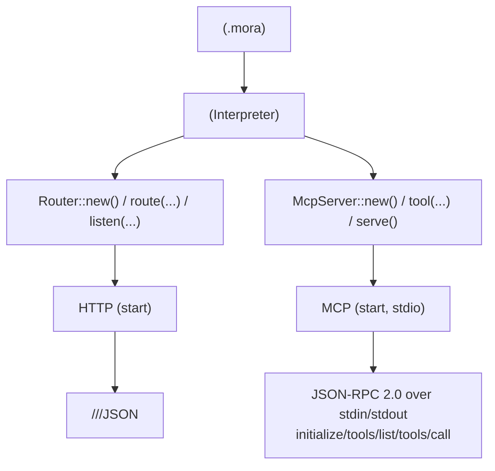
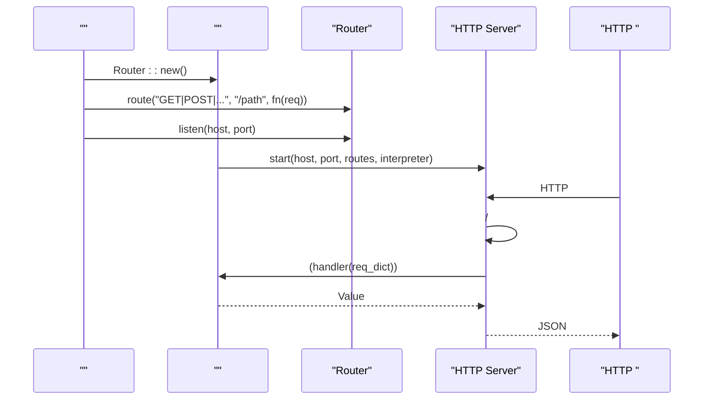
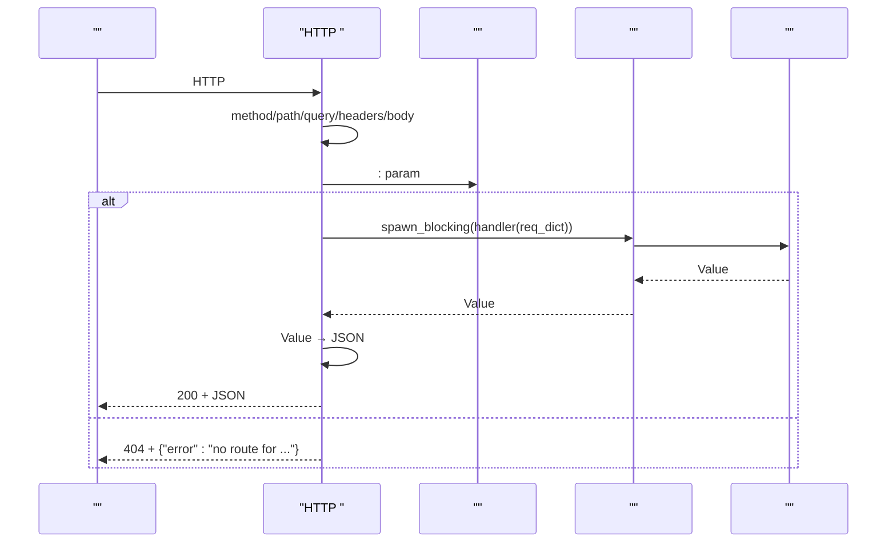
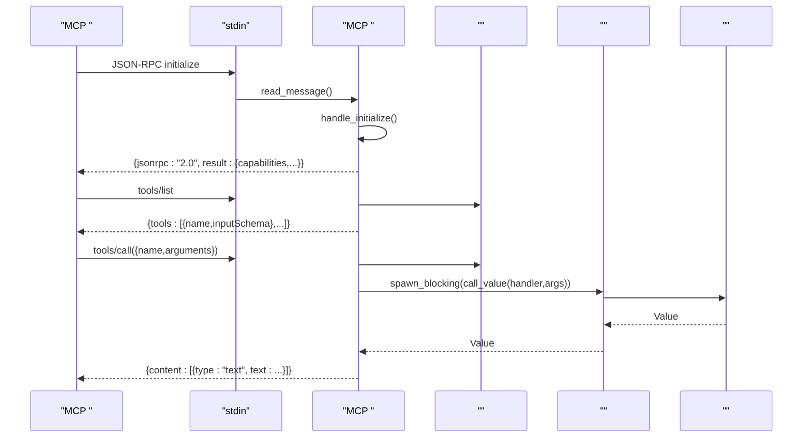
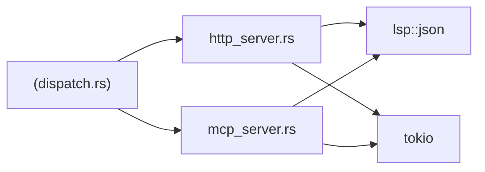

# HTTP/MCP 

<cite>
****   
- [src/http_server.rs](file://src/http_server.rs)
- [src/mcp_server.rs](file://src/mcp_server.rs)
- [src/interpreter/dispatch.rs](file://src/interpreter/dispatch.rs)
- [src/main.rs](file://src/main.rs)
- [examples/_legacy/http_server_demo.mora](file://examples/_legacy/http_server_demo.mora)
- [examples/_legacy/bench_server.mora](file://examples/_legacy/bench_server.mora)
- [examples/_legacy/observe_route_server_demo.mora](file://examples/_legacy/observe_route_server_demo.mora)
- [examples/mcp_server_demo.mora](file://examples/mcp_server_demo.mora)
- [README.md](file://README.md)
</cite>

## 
1. 
2. 
3. 
4. 
5. 
6. 
7. 
8. 
9. 
10. [ WebSocket](#-websocket)
11. 
12. 
13. 
14. 

## 
 Mora  HTTP  MCP  API 
- RESTful API JSON 
- MCPModel Context Protocol
- CORS
- 
-  WebSocket 
- 
- 

## 
HTTP  MCP  API 

- [src/interpreter/dispatch.rs:1011-1074](file://src/interpreter/dispatch.rs#L1011-L1074)
- [src/http_server.rs:70-108](file://src/http_server.rs#L70-L108)
- [src/mcp_server.rs:117-199](file://src/mcp_server.rs#L117-L199)

- [src/lib.rs:1-55](file://src/lib.rs#L1-L55)
- [README.md:192-228](file://README.md#L192-L228)

## 
- HTTP 
  - +→Mora 
  - HeadersBody
  -  :param 
  -  60s 
  - CORS Access-Control-Allow-Origin
- MCP 
  - JSON-RPC 2.0 over stdin/stdout
  - name + schema(JSON Schema ) + handler
  -  toolset 
  - tools/list → tools/call

- [src/http_server.rs:24-68](file://src/http_server.rs#L24-L68)
- [src/http_server.rs:70-108](file://src/http_server.rs#L70-L108)
- [src/http_server.rs:145-223](file://src/http_server.rs#L145-L223)
- [src/http_server.rs:349-418](file://src/http_server.rs#L349-L418)
- [src/mcp_server.rs:22-74](file://src/mcp_server.rs#L22-L74)
- [src/mcp_server.rs:117-199](file://src/mcp_server.rs#L117-L199)
- [src/mcp_server.rs:243-329](file://src/mcp_server.rs#L243-L329)
- [src/mcp_server.rs:331-420](file://src/mcp_server.rs#L331-L420)

## 
HTTP  MCP  API  TCP  stdio

- [src/interpreter/dispatch.rs:1011-1036](file://src/interpreter/dispatch.rs#L1011-L1036)
- [src/http_server.rs:70-108](file://src/http_server.rs#L70-L108)
- [src/http_server.rs:145-223](file://src/http_server.rs#L145-L223)

## 

### HTTP  API 
- 
  -  API 
  - [examples/_legacy/http_server_demo.mora](file://examples/_legacy/http_server_demo.mora)
- 
  - router.route("METHOD", "PATH", handler)
  -  "/users/:id"
  - router.listen("127.0.0.1", 3000)
- 
  - req["method"], req["path"], req["query"], req["headers"], req["body"] JSON , req["params"]
- 
  -  application/json; charset=utf-8
  - 200 + JSON 
  - 404 + {"error":"..."}
  - 500 + {"error":"handler error: ..."}
  - 504 + {"error":"handler timeout after 60s"}
- 
  -  60s spawn_blocking 
  -  30s 
- CORS
  -  MORA_CORS_ORIGIN  Access-Control-Allow-Origin "*"
- 
  -  N+1..N+3 4 

/
- URL 
  -  METHOD +  PATH
  -  :param 
- 
  - Content-Length  Body
  -  req["headers"] 
- 
  -  JSON  Value
- 
  - JSON  Value 

- [examples/_legacy/http_server_demo.mora:1-44](file://examples/_legacy/http_server_demo.mora#L1-L44)
- [examples/_legacy/bench_server.mora:1-34](file://examples/_legacy/bench_server.mora#L1-L34)
- [examples/_legacy/observe_route_server_demo.mora:1-28](file://examples/_legacy/observe_route_server_demo.mora#L1-L28)
- [src/http_server.rs:24-68](file://src/http_server.rs#L24-L68)
- [src/http_server.rs:145-223](file://src/http_server.rs#L145-L223)
- [src/http_server.rs:349-418](file://src/http_server.rs#L349-L418)

#### HTTP 

- [src/http_server.rs:145-223](file://src/http_server.rs#L145-L223)
- [src/http_server.rs:349-418](file://src/http_server.rs#L349-L418)

### MCP  API 
- 
  -  McpServer::new()  serve()
  - [examples/mcp_server_demo.mora](file://examples/mcp_server_demo.mora)
- 
  - mcp.tool(name, schema_json_string, handler)
  -  ai/json/file/web/default 
- 
  - JSON-RPC 2.0 over stdin/stdoutContent-Length 
  - 
    - initialize capabilitiestools.listChanged=falseserverInfo
    - tools/list inputSchema
    - tools/call arguments  Mora Value content 
- 
  - -32601
  - /-32602
  - / panic-32603

- [examples/mcp_server_demo.mora:1-17](file://examples/mcp_server_demo.mora#L1-L17)
- [src/mcp_server.rs:22-74](file://src/mcp_server.rs#L22-L74)
- [src/mcp_server.rs:117-199](file://src/mcp_server.rs#L117-L199)
- [src/mcp_server.rs:243-329](file://src/mcp_server.rs#L243-L329)
- [src/mcp_server.rs:331-420](file://src/mcp_server.rs#L331-L420)

#### MCP 

- [src/mcp_server.rs:243-329](file://src/mcp_server.rs#L243-L329)
- [src/mcp_server.rs:331-420](file://src/mcp_server.rs#L331-L420)

###  API
- Router 
  - new()
  - route(method, path, handler)
  - listen(host, port) HTTP 
- McpServer 
  - new() MCP 
  - tool(name, schema, handler)
  - serve() MCP stdio

- [src/interpreter/dispatch.rs:1011-1074](file://src/interpreter/dispatch.rs#L1011-L1074)

## 
- HTTP 
  - tokio  IO
  -  Interpreter  Value 
  - LSP JSON  JSON 
- MCP 
  - tokio  IOstdin/stdout
  -  Interpreter  Value 
  - LSP JSON  JSON 
- 
  -  Router/McpServer  Rust 

- [src/interpreter/dispatch.rs:1011-1074](file://src/interpreter/dispatch.rs#L1011-L1074)
- [src/http_server.rs:1-23](file://src/http_server.rs#L1-L23)
- [src/mcp_server.rs:1-21](file://src/mcp_server.rs#L1-L21)

- [src/interpreter/dispatch.rs:1011-1074](file://src/interpreter/dispatch.rs#L1011-L1074)
- [src/http_server.rs:1-23](file://src/http_server.rs#L1-L23)
- [src/mcp_server.rs:1-21](file://src/mcp_server.rs#L1-L21)

## 
-  tokioaccept  spawn 
- spawn_blocking 
- 
  -  30s 
  -  60s  504
- 
-  JSON  JSON 

- [src/http_server.rs:70-108](file://src/http_server.rs#L70-L108)
- [src/http_server.rs:145-223](file://src/http_server.rs#L145-L223)
- [README.md:192-228](file://README.md#L192-L228)

## 
- 
  -  127.0.0.1
  -  "0.0.0.0:3000"
- CORS 
  -  MORA_CORS_ORIGIN  "*"
  - 
- 
  - 
  -  Authorization/Bearer Token 
  - 

- [src/interpreter/dispatch.rs:1017-1021](file://src/interpreter/dispatch.rs#L1017-L1021)
- [src/http_server.rs:404-418](file://src/http_server.rs#L404-L418)

## 
- HTTP
  - 404
  - 500 panic
  - 504
  -  {"error":"..."}
- MCP
  - -32601
  - -32602
  - -32603 panic

- [src/http_server.rs:188-223](file://src/http_server.rs#L188-L223)
- [src/mcp_server.rs:256-293](file://src/mcp_server.rs#L256-L293)
- [src/mcp_server.rs:352-420](file://src/mcp_server.rs#L352-L420)

##  WebSocket
-  HTTP  WebSocket
-  SSE/WebSocket

- [src/http_server.rs:396-418](file://src/http_server.rs#L396-L418)

## 
- 
  -  Nginx/Traefik/Envoy  TLS 
- 
  - /
- 
  - 
  -  /health
- 
  - 
  -  CORS 
  -  IP WAF

- [README.md:192-228](file://README.md#L192-L228)
- [src/http_server.rs:110-143](file://src/http_server.rs#L110-L143)

## 
- 
  - Tracespan  AI 
  - MetricsToken 
  - JSON  OpenTelemetry Collector
- CLI 
  - record/replay/diff/stats/timeline/export 
- 
  -  observe trace/otel endpoint span  metrics 
  -  Prometheus/Grafana QPSP99Token 

- [src/main.rs:1021-1106](file://src/main.rs#L1021-L1106)
- [README.md:241-254](file://README.md#L241-L254)

## 
- 
  - 
- 
  -  METHOD  PATH 
  - 
- 
  - 
- CORS 
  -  MORA_CORS_ORIGIN 
- MCP 
  -  toolset  tools/list 
- 
  -  [serve]/[mcp] 

- [src/http_server.rs:70-108](file://src/http_server.rs#L70-L108)
- [src/http_server.rs:145-223](file://src/http_server.rs#L145-L223)
- [src/mcp_server.rs:117-199](file://src/mcp_server.rs#L117-L199)

## 
Mora  HTTP  MCP  API CORS  CLI 