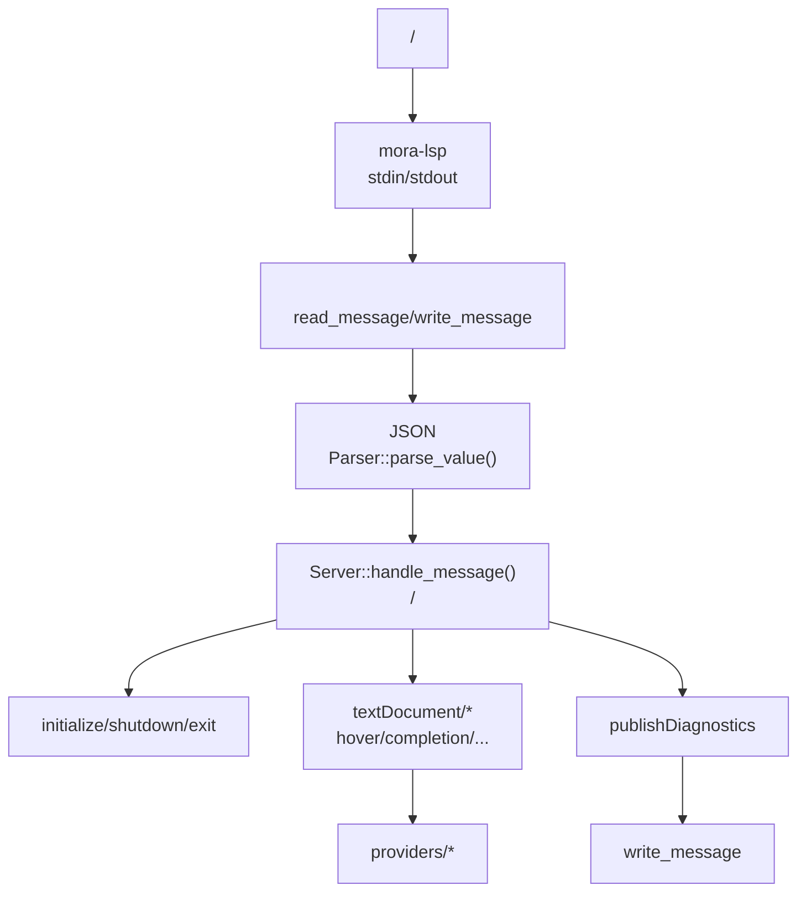
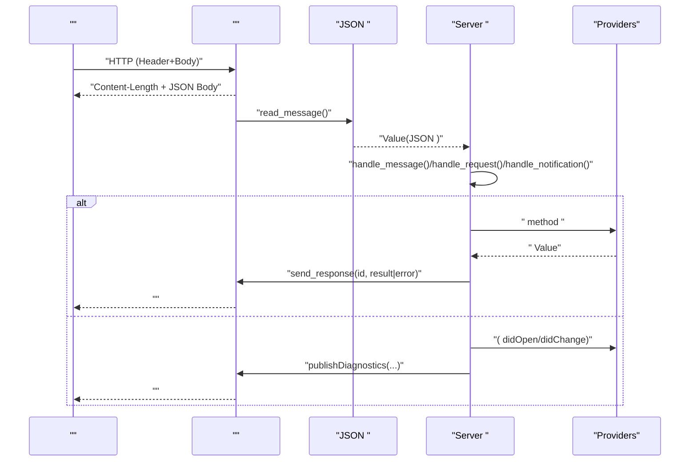
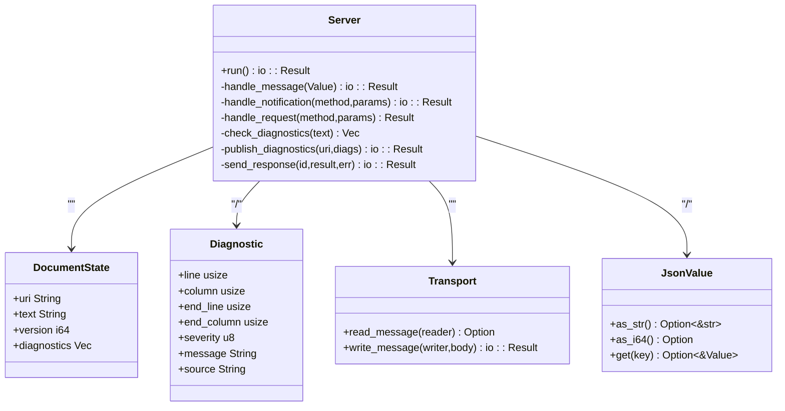
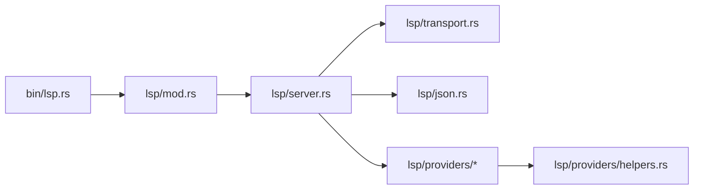

# LSP 

<cite>
****   
- [src/bin/lsp.rs](file://src/bin/lsp.rs)
- [src/lsp/mod.rs](file://src/lsp/mod.rs)
- [src/lsp/server.rs](file://src/lsp/server.rs)
- [src/lsp/transport.rs](file://src/lsp/transport.rs)
- [src/lsp/json.rs](file://src/lsp/json.rs)
- [src/lsp/providers/mod.rs](file://src/lsp/providers/mod.rs)
- [src/lsp/providers/completion.rs](file://src/lsp/providers/completion.rs)
- [src/lsp/providers/hover.rs](file://src/lsp/providers/hover.rs)
- [src/lsp/providers/definition.rs](file://src/lsp/providers/definition.rs)
- [src/lsp/providers/references.rs](file://src/lsp/providers/references.rs)
- [src/lsp/providers/symbols.rs](file://src/lsp/providers/symbols.rs)
- [src/lsp/providers/formatting.rs](file://src/lsp/providers/formatting.rs)
- [src/lsp/providers/rename.rs](file://src/lsp/providers/rename.rs)
- [src/lsp/providers/semantic.rs](file://src/lsp/providers/semantic.rs)
- [src/lsp/providers/folding.rs](file://src/lsp/providers/folding.rs)
- [src/lsp/providers/helpers.rs](file://src/lsp/providers/helpers.rs)
</cite>

## 
1. [](#)
2. [](#)
3. [](#)
4. [](#)
5. [](#)
6. [](#)
7. [](#)
8. [](#)
9. [](#)
10. [](#)

## 
 Mora  LSPLanguage Server Protocol JSON-RPC  LSP 

Mora LSP  JSON-RPC 2.0  Content-Length  + UTF-8 JSON body  HTTP JSON 

## 
LSP  src/lsp 
- src/bin/lsp.rs
- src/lsp/mod.rs
- Content-Length src/lsp/transport.rs
- JSON Value  Parsersrc/lsp/json.rs
- src/lsp/server.rs
- src/lsp/providers/*




- [src/bin/lsp.rs:1-25](file://src/bin/lsp.rs#L1-L25)
- [src/lsp/mod.rs:1-23](file://src/lsp/mod.rs#L1-L23)
- [src/lsp/transport.rs:1-102](file://src/lsp/transport.rs#L1-L102)
- [src/lsp/json.rs:1-440](file://src/lsp/json.rs#L1-L440)
- [src/lsp/server.rs:1-547](file://src/lsp/server.rs#L1-L547)


- [src/bin/lsp.rs:1-25](file://src/bin/lsp.rs#L1-L25)
- [src/lsp/mod.rs:1-23](file://src/lsp/mod.rs#L1-L23)

## 
-  transport
  - read_message header  Content-Length body
  - write_message Content-Length  JSON body flush
- JSON  json
  - Value null/bool/number/string/array/object
  - Parser LSP 
  - DisplayBTreeMap
-  server
  -  →  →  → 
  - uri → 
  - capabilities textDocumentSynccompletionProviderhoverProviderdefinitionProviderreferencesProviderdocumentSymbolProviderformatting/rangeFormattingrenamefoldingRangesemanticTokensProvider
  -  typeck  LSP Diagnostic  publishDiagnostics 
- Providers
  - completion/hover/definition/references/documentSymbol/formatting/rename/semanticTokens/foldingRange 


- [src/lsp/transport.rs:1-102](file://src/lsp/transport.rs#L1-L102)
- [src/lsp/json.rs:1-440](file://src/lsp/json.rs#L1-L440)
- [src/lsp/server.rs:1-547](file://src/lsp/server.rs#L1-L547)
- [src/lsp/providers/mod.rs:1-23](file://src/lsp/providers/mod.rs#L1-L23)

## 





- [src/lsp/server.rs:59-106](file://src/lsp/server.rs#L59-L106)
- [src/lsp/server.rs:203-225](file://src/lsp/server.rs#L203-L225)
- [src/lsp/server.rs:417-471](file://src/lsp/server.rs#L417-L471)
- [src/lsp/transport.rs:14-75](file://src/lsp/transport.rs#L14-L75)
- [src/lsp/json.rs:150-165](file://src/lsp/json.rs#L150-L165)

## 

### JSON-RPC over stdin/stdout
- 
  -  HTTP Content-Length: N\r\n\r\n<N bytes UTF-8 JSON>
  - 
  -  flush
- 
  -  Content-Length  InvalidData
  - UTF-8  InvalidData
- 
  - /


- [src/lsp/transport.rs:1-102](file://src/lsp/transport.rs#L1-L102)

### JSON 
- Value 
  -  LSP null
  -  get/as_str/as_i64/as_object/as_array 
- 
  - 
  - 
- 
  -  BTreeMap 
  - 


- [src/lsp/json.rs:1-440](file://src/lsp/json.rs#L1-L440)

### 
- 
  - run()  handle_message()
  -  id  notification id 
- capabilities
  - textDocumentSyncopenClose/change(save)/save
  - hoverProvidercompletionProviderdefinitionProviderreferencesProviderdocumentSymbolProviderdocumentFormattingProviderdocumentRangeFormattingProviderrenameProviderfoldingRangeProvider
  - semanticTokensProvider tokenTypes  tokenModifiers full
- 
  -  uri→diagnostics 
  - didOpen/didChange/didSave  diagnostics
- 
  -  typeck  1-based  LSP 0-based
  - message  expected/actual/hint
- 
  -  -32603

```mermaid
flowchart TD
Start([""]) --> Parse[" JSON  Value"]
Parse --> HasId{" id?"}
HasId --  --> Notification["handle_notification(method,params)"]
HasId --  --> Request["handle_request(method,params)"]
Notification --> End([""])
Request --> Resp{"?"}
Resp --  --> SendOk["send_response(id,result)"]
Resp --  --> SendErr["send_response(id,error)"]
SendOk --> End
SendErr --> End
```


- [src/lsp/server.rs:59-106](file://src/lsp/server.rs#L59-L106)
- [src/lsp/server.rs:203-225](file://src/lsp/server.rs#L203-L225)
- [src/lsp/server.rs:473-500](file://src/lsp/server.rs#L473-L500)


- [src/lsp/server.rs:1-547](file://src/lsp/server.rs#L1-L547)

### 

- 
  - initialize capabilities
  - initialized
  - shutdown
  - exit
- 
  - textDocument/didOpen
  - textDocument/didChange
  - textDocument/didSave
  - textDocument/publishDiagnostics
- 
  - textDocument/hover/
  - textDocument/completion
  - textDocument/definition
  - textDocument/references
  - textDocument/documentSymbol
  - textDocument/formatting
  - textDocument/rangeFormatting
  - textDocument/rename
  - textDocument/semanticTokens/full/
  - textDocument/foldingRangeif/for/task 


- [src/lsp/server.rs:230-293](file://src/lsp/server.rs#L230-L293)
- [src/lsp/server.rs:108-201](file://src/lsp/server.rs#L108-L201)
- [src/lsp/server.rs:373-471](file://src/lsp/server.rs#L373-L471)

### 

#### completion
-  AST 
-  initialize 
- labelkinddetail


- [src/lsp/providers/completion.rs:1-79](file://src/lsp/providers/completion.rs#L1-L79)
- [src/lsp/providers/helpers.rs:40-49](file://src/lsp/providers/helpers.rs#L40-L49)

#### hover
-  let  task  Markdown 
-  contentsmarkdown range


- [src/lsp/providers/hover.rs:1-84](file://src/lsp/providers/hover.rs#L1-L84)

#### definition
-  Location URI + Range


- [src/lsp/providers/definition.rs:1-76](file://src/lsp/providers/definition.rs#L1-L76)

#### references
-  Location 


- [src/lsp/providers/references.rs:1-83](file://src/lsp/providers/references.rs#L1-L83)

#### documentSymbol
-  let/task  Variable/Function 


- [src/lsp/providers/symbols.rs:1-92](file://src/lsp/providers/symbols.rs#L1-L92)

#### formatting / rangeFormatting
- 2  then/end/for 
-  TextEdit range + newText


- [src/lsp/providers/formatting.rs:1-159](file://src/lsp/providers/formatting.rs#L1-L159)

#### rename
-  edits


- [src/lsp/providers/rename.rs:1-97](file://src/lsp/providers/rename.rs#L1-L97)

#### semanticTokens/full
-  AST
  - 
  - AST  function variable
-  delta  data 


- [src/lsp/providers/semantic.rs:1-138](file://src/lsp/providers/semantic.rs#L1-L138)

#### foldingRange
-  if/for/task  region 


- [src/lsp/providers/folding.rs:1-83](file://src/lsp/providers/folding.rs#L1-L83)

#### helpers
- position_to_offsetLSP 
- ident_at_offset
- parsed_doc_v2+ AST Arena
- collect_definitions_v2/collect_references_v2 AST 


- [src/lsp/providers/helpers.rs:1-219](file://src/lsp/providers/helpers.rs#L1-L219)

### 



- [src/lsp/server.rs:17-41](file://src/lsp/server.rs#L17-L41)
- [src/lsp/transport.rs:14-75](file://src/lsp/transport.rs#L14-L75)
- [src/lsp/json.rs:18-64](file://src/lsp/json.rs#L18-L64)

## 
- 
  - server  transport  json providers 
  - providers  helpers  AST 
  -  lsp::run
- 
  -  JSON 
  -  iocollectionssync 




- [src/bin/lsp.rs:1-25](file://src/bin/lsp.rs#L1-L25)
- [src/lsp/mod.rs:1-23](file://src/lsp/mod.rs#L1-L23)
- [src/lsp/server.rs:1-547](file://src/lsp/server.rs#L1-L547)
- [src/lsp/providers/mod.rs:1-23](file://src/lsp/providers/mod.rs#L1-L23)


- [src/lsp/providers/mod.rs:1-23](file://src/lsp/providers/mod.rs#L1-L23)

## 
- 
  - 
  -  IO
- 
  - + AST 
- 
  - didOpen/didChange/didSave 
- 
  -  + AST 
- 
  -  exit shutdown 
  - 

[]

## 
- 
  - “failed to parse incoming message” JSON  LSP 
  -  Content-Length InvalidData
  - “method not supported”
  -  -32603 message
- 
  -  didOpen/didChange  URI 
  -  0 
- 
  -  --version/--help
  -  stdout  publishDiagnostics 


- [src/lsp/server.rs:65-72](file://src/lsp/server.rs#L65-L72)
- [src/lsp/server.rs:223-224](file://src/lsp/server.rs#L223-L224)
- [src/lsp/server.rs:473-500](file://src/lsp/server.rs#L473-L500)
- [src/lsp/transport.rs:52-66](file://src/lsp/transport.rs#L52-L66)
- [src/bin/lsp.rs:6-24](file://src/bin/lsp.rs#L6-L24)

## 
Mora LSP  JSON-RPC ////////

[]

## 

### 
- 
  -  LSP  mora-lsp
- 
  - / JSON-RPC 2.0 
- 
  -  initialize  capabilities
  -  initialized 
- 
  - //
- 
  -  capabilities  completion triggerCharacters 


- [src/bin/lsp.rs:1-25](file://src/bin/lsp.rs#L1-L25)
- [src/lsp/server.rs:230-293](file://src/lsp/server.rs#L230-L293)
- [src/lsp/server.rs:108-201](file://src/lsp/server.rs#L108-L201)

### 
- VS Code
  -  settings.json  mora-lsp 
  -  URI 
- Neovim
  -  nvim-lspconfig  mora-lsp .mora 
- Emacs/Vim/Sublime/Helix
  -  editors 


- [editors/vscode/package.json](file://editors/vscode/package.json)
- [editors/neovim/lua/mora-lsp.lua](file://editors/neovim/lua/mora-lsp.lua)
- [editors/emacs/mora-mode.el](file://editors/emacs/mora-mode.el)
- [editors/vim/ftplugin/mora.vim](file://editors/vim/ftplugin/mora.vim)
- [editors/sublime/mora.sublime-settings](file://editors/sublime/mora.sublime-settings)
- [editors/helix/languages.toml](file://editors/helix/languages.toml)