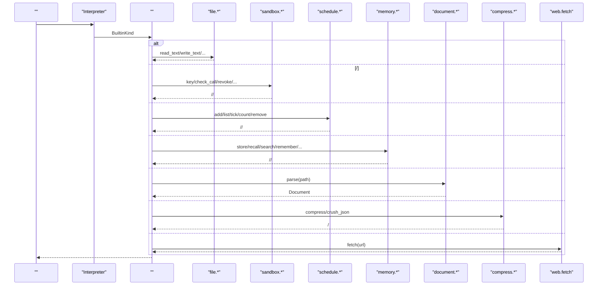
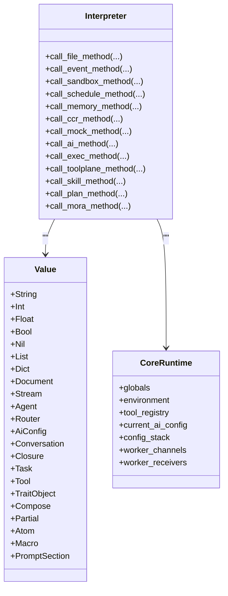

# 

<cite>
****   
- [builtins.rs](file://src/interpreter/builtins.rs)
- [value.rs](file://src/value.rs)
- [core.rs](file://src/runtime/core.rs)
- [mod.rs](file://src/document/mod.rs)
- [pdf.rs](file://src/document/backend/pdf.rs)
- [markdown.rs](file://src/document/backend/markdown.rs)
- [json.rs](file://src/compress/json.rs)
- [html.rs](file://src/compress/html.rs)
- [text.rs](file://src/compress/text.rs)
- [log.rs](file://src/compress/log.rs)
- [mod.rs](file://src/compress/mod.rs)
- [ai_chat.rs](file://src/interpreter/ai_chat.rs)
</cite>

## 
1. [](#)
2. [](#)
3. [](#)
4. [](#)
5. [](#)
6. [](#)
7. [](#)
8. [](#)
9. [](#)
10. [](#)

## 
 Mora  API  I/OAI 

## 
“”
- CCRMockAIExecToolPlaneSkillPlanMora 
- ValueBuiltinKindEnvironment 
- /JSON/HTML/
- PDF/Markdown/HTML  IR
- Web  ureq  GET 

```mermaid
graph TB
subgraph ""
B["<br/>call_*_method"]
V[" Value/BuiltinKind"]
C["CoreRuntime "]
end
subgraph ""
F["file.* "]
E["event bus.* "]
S["sandbox.* ///"]
Sch["schedule.* "]
Mem["memory.* "]
CCR["ccr.* "]
Mock["mock.* "]
AI["ai.* AI //DAG"]
Exec["exec.* "]
TP["tool.plane.* "]
Skill["skill.* "]
Plan["plan.* "]
Mora["mora.* /Refine"]
Doc["document.* "]
Comp["compress.* "]
Web["web.fetch "]
end
B --> F
B --> E
B --> S
B --> Sch
B --> Mem
B --> CCR
B --> Mock
B --> AI
B --> Exec
B --> TP
B --> Skill
B --> Plan
B --> Mora
B --> Doc
B --> Comp
V --> B
C --> B
Web --> B
```


- [builtins.rs:1-200](file://src/interpreter/builtins.rs#L1-L200)
- [value.rs:43-115](file://src/value.rs#L43-L115)
- [core.rs:14-47](file://src/runtime/core.rs#L14-L47)


- [builtins.rs:1-200](file://src/interpreter/builtins.rs#L1-L200)
- [value.rs:43-115](file://src/value.rs#L43-L115)
- [core.rs:14-47](file://src/runtime/core.rs#L14-L47)

## 
- Value BuiltinKind 
- CoreRuntimeAI Worker 
- Interpreter  call_*_method 


- [value.rs:43-115](file://src/value.rs#L43-L115)
- [value.rs:143-263](file://src/value.rs#L143-L263)
- [core.rs:14-47](file://src/runtime/core.rs#L14-L47)
- [builtins.rs:12-32](file://src/interpreter/builtins.rs#L12-L32)

## 





- [builtins.rs:16-256](file://src/interpreter/builtins.rs#L16-L256)
- [builtins.rs:331-724](file://src/interpreter/builtins.rs#L331-L724)
- [builtins.rs:728-816](file://src/interpreter/builtins.rs#L728-L816)
- [builtins.rs:1165-1299](file://src/interpreter/builtins.rs#L1165-L1299)
- [mod.rs:45-146](file://src/document/mod.rs#L45-L146)
- [mod.rs:241-270](file://src/compress/mod.rs#L241-L270)
- [ai_chat.rs:59-140](file://src/interpreter/ai_chat.rs#L59-L140)

## 

### file.* 
- ///////////
-  check_path 
- 
  - read_text(path) → string
  - write_text(path, content) → nil
  - append_text(path, content) → nil
  - read_bytes(path) → hex-string
  - write_bytes(path, hex) → nil
  - exists/is_file/is_dir(size) → bool/float
  - list(dir) → list[string]
  - mkdir/mkdir_all/remove/remove_all/rename/copy/touch → nil
  - cwd/chdir/home_dir/join/abs/basename/dirname/extname → string
- //IO 
- write_text/touch list size 
-  exists  read_text join/abs mkdir_all 


- [builtins.rs:16-256](file://src/interpreter/builtins.rs#L16-L256)

### event bus.* 
- emit/off/count/subscribe/publish
- 
  - emit(event, payload?) → nil
  - off(pattern) → nil
  - count() → number
  - subscribe(pattern) → token(number)
  - publish(topic, payload?) → pattern_count(number)
- /
- publish  emitsubscribe 


- [builtins.rs:259-328](file://src/interpreter/builtins.rs#L259-L328)

### sandbox.* ///
- /
- 
  - mode() → "permissive"/"strict"/"custom"
  - check_builtin(name) → bool
  - check_path(path) → bool
  - key(capabilities...) → token_id(number)
  - check_call(token_id, capability) → bool
  - revoke(token_id) → bool
  - token_count() → number
  - audit_emit(actor, action, target?, payload?) → bool
  - audit_flush() → bool
  - audit_verify() → bool|string(error)
  - containerize(backend, mounts?, network?, cpu_cores?, memory_mb?, image?) → container_hash(number)
  - container_exec(cmd, args...) → dict{exit_code, stdout, stderr, elapsed_ms}
  - container_info() → dict|nil
  - container_clear() → bool
- /docker 
- key check_call  generation audit containerize 
-  key  check_call  flush/verify


- [builtins.rs:331-724](file://src/interpreter/builtins.rs#L331-L724)

### schedule.* 
- //tick 
- 
  - add(name, kind("every"/"at"), message, interval_s?, at_epoch?) → id(string)
  - list() → list[dict{id,name,kind,message,interval_s,at_epoch}]
  - remove(id) → bool
  - tick(now) → list[string]
  - count() → number
- / kind
- message tick 


- [builtins.rs:728-816](file://src/interpreter/builtins.rs#L728-L816)

### ai.tokens / ai.* AI 
- ai.tokens
  - input/output/total/calls → number
- ai.retry(attempts, backoff_ms?, strategy?) → dict{attempts, backoff_ms, backoff, schedule}
- ai.role(name) → string
- ai.context.trim(threshold?) → dropped_tokens(number)
- ai.context.info() → dict{max_tokens,current_tokens,messages,compression_threshold}
- ai.dag(nodes, edges) → list[string]
- ai.heartbeat(path?) → dict{path,total,done,pending,completion_ratio,is_complete,items[]}
- attempts  > 0threshold  0.0-1.0nodes/edges 
- retry //context dag 


- [builtins.rs:819-1051](file://src/interpreter/builtins.rs#L819-L1051)

### ccr.* 
- put/get/len/marker/extract
- 
  - put(data:string) → hash(string)
  - get(hash:string) → string|nil
  - len() → int
  - marker(hash:string, size?:number) → string
  - extract(marker:string) → hash(string)|error
- data/hash/marker 
- marker  hash  size extract 


- [builtins.rs:1053-1107](file://src/interpreter/builtins.rs#L1053-L1107)

### mock.* 
- register/unregister/call/count/names/
- 
  - register(name, handler) → string
  - unregister(name) → nil
  - call(name, args?) → value
  - count() → number
  - names() → list[string]
- name/handler  call  nil
- handler names 


- [builtins.rs:1109-1162](file://src/interpreter/builtins.rs#L1109-L1162)

### memory.* 
-  + Markdown 
- 
  - store(key, value?) → nil
  - recall(key) → value|nil
  - search(query) → list[dict{key,value}]
  - forget(key)/clear() → nil
  - size() → number
  - remember(category, text) → bool
  - recall_markdown(category) → string
  - list_markdown() → list[string]
  - keys() → list[string]
  - save(path)/load(path) → bool
- /JSON / IO 
- remember  ~/.mora/memory/YYYY-MM-DD.md recall_markdown save/load  JSON 


- [builtins.rs:1165-1299](file://src/interpreter/builtins.rs#L1165-L1299)

### exec.* 
- exec.parallel(cmds, max_concurrent?, timeout_ms?) → list[dict{index,cmd,stdout,stderr,exit_code,pid,elapsed_ms,error?}]
- 
  -  + 
  - Unix setpgid / Windows CREATE_NEW_PROCESS_GROUP
  -  error 
- cmds max_concurrent timeout  number  nil
- 


- [builtins.rs:1306-1323](file://src/interpreter/builtins.rs#L1306-L1323)
- [builtins.rs:2146-2262](file://src/interpreter/builtins.rs#L2146-L2262)
- [builtins.rs:2265-2393](file://src/interpreter/builtins.rs#L2265-L2393)

### tool.plane.* 
- ////
- 
  - create(name, kind="extension"/"core") → bool
  - register(plane, tool, description, parameters) → bool
  - unregister(plane, tool) → bool
  - list() → list[string]
  - list_tools(plane) → list[string]
  - info(plane) → dict{name,kind,tool_count}|nil
  - find(plane, tool) → dict{plane,tool,description,parameters}|nil
  - remove(plane) → bool
- /


- [builtins.rs:1325-1466](file://src/interpreter/builtins.rs#L1325-L1466)

### skill.* 
- /
- 
  - list() → list[string]
  - find(name) → dict{name,description,trigger,body,source}|nil
  - load(path) → bool
  - install(name, content) → bool
  - uninstall(name) → bool
  - set_hub(path) → bool
  - refresh_hub() → number
- /
- install  namerefresh_hub  mora-public.json


- [builtins.rs:1468-1568](file://src/interpreter/builtins.rs#L1468-L1568)

### plan.* 
- //
- 
  - create(name, steps:[{id,text,status?}]) → name(string)
  - update(name, updates:[[id,status],...]) → bool
  - add(name, id, text) → bool
  - remove(name, id) → bool
  - list(name?) → list[string]|list[dict{id,text,status,emoji}]
  - info(name) → dict{name,total,done,pending,completion_ratio}
- steps/updates 
- status  Pendinginfo 


- [builtins.rs:1570-1760](file://src/interpreter/builtins.rs#L1570-L1760)

### mora.* /Refine
- refine / refine 
- 
  - refine(script_path, instruction) → dict(step fields)
  - refine_info(script_path, iteration?) → dict(step fields)
  - list_refines() → list[string]
- /session 
- refine  I/O


- [builtins.rs:1762-1839](file://src/interpreter/builtins.rs#L1762-L1839)

### document.* 
-  PDF/Markdown/HTML  Document 
- 
  - parse(path) → Document
- 
  - PDF origin/pages/size
  - Markdown blockstext 
  - HTML/text 
- 
- document.parse("./sample.pdf").metadata()["pages"]


- [mod.rs:45-146](file://src/document/mod.rs#L45-L146)
- [pdf.rs:33-140](file://src/document/backend/pdf.rs#L33-L140)
- [markdown.rs:38-72](file://src/document/backend/markdown.rs#L38-L72)

### compress.* 
- 
  - compress(input, strategy, options?) → string
    - strategies: "auto"/"head_tail"/"summary"/"lossless"/"json"
    - options: {strategy,max_bytes,target_ratio,head_pct,tail_pct,k_first,k_last,lossless_min_savings_ratio,preserve_errors,preserve_outliers,preserve_ids,recursive,output_format}
- crush_json(list_or_json_string, target?, options?) → CrushResult
  -  JSON 
- 
  - json/code/html/log/text  sniff 
-  JSON options 
- 
  - head_tail 
  - summary  mock LLM 
  - lossless  original_size 
  - html  script/style 
  - log  ERROR/FATAL 


- [mod.rs:46-84](file://src/compress/mod.rs#L46-L84)
- [mod.rs:190-270](file://src/compress/mod.rs#L190-L270)
- [json.rs:1108-1185](file://src/compress/json.rs#L1108-L1185)
- [html.rs:33-116](file://src/compress/html.rs#L33-L116)
- [text.rs:108-147](file://src/compress/text.rs#L108-L147)
- [log.rs:1-96](file://src/compress/log.rs#L1-L96)

### web.fetch 
- GET 
- 
  - fetch(url) → string|error
- URL  http(s) HTTP 4xx/5xx 
- ureq Agent  body  URL


- [ai_chat.rs:59-140](file://src/interpreter/ai_chat.rs#L59-L140)

## 
-  BuiltinKind 
-  Value 
- 
- 




- [builtins.rs:16-256](file://src/interpreter/builtins.rs#L16-L256)
- [value.rs:143-263](file://src/value.rs#L143-L263)
- [core.rs:14-47](file://src/runtime/core.rs#L14-L47)


- [builtins.rs:16-256](file://src/interpreter/builtins.rs#L16-L256)
- [value.rs:143-263](file://src/value.rs#L143-L263)
- [core.rs:14-47](file://src/runtime/core.rs#L14-L47)

## 
-  I/O mkdir_all  IO append_text list 
-  check_call  tokenrevoke  generation token 
-  max_concurrent  timeout
-  sniff crush_json html/log 
- PDF  OCR/Markdown/HTML 
- 

## 
-  sandbox.check_path 
-  key check_call  token_id  capability 
- audit_verify  audit_sink  flush 
-  containerize backend/image/network/mounts container_clear 
-  timeout_ms  max_concurrent PATH 
-  options  head_pct/tail_pct/max_bytes/target_ratio
- 


- [builtins.rs:331-724](file://src/interpreter/builtins.rs#L331-L724)
- [builtins.rs:2146-2262](file://src/interpreter/builtins.rs#L2146-L2262)
- [mod.rs:45-146](file://src/document/mod.rs#L45-L146)
- [mod.rs:190-270](file://src/compress/mod.rs#L190-L270)

## 
Mora AIAPI 

## 
- v0.25 interpreter/builtins.rs
- v0.34 event bussandboxschedulememoryccrmockai.tokens 
- v0.36 sandbox.check_path Display  panicNaN/Inf
- v0.37 string 
- v0.40EnvRef 
- v0.42.0sandbox.key/check_call/revoke/token_count 
- v0.42.1sandbox.audit_emit/audit_flush/audit_verify 
- v0.43.0exec.parallel 
- v0.43.1memory.remember/recall_markdown/list_markdown Markdown 
- v0.45.0ai.* retry/role/context/dag/heartbeat
- v0.46.0skill.* 
- v0.47.0ai.context.trim/info ai.dag 
- v0.48.0plan.* mora.* /refine
- v0.49.0revoke  generation token refine  I/O
- v0.51exec.parallel 
- v0.52CoreRuntime 
- 
  - compact(text)  v0.29  compress(text, strategy)
  -  stringly-typed  typed BuiltinKind