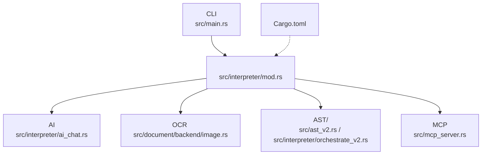
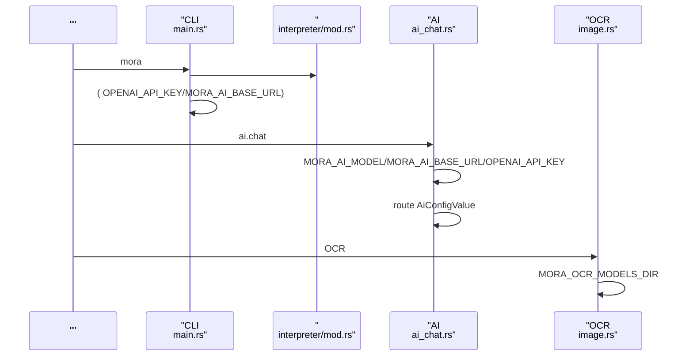

# 

<cite>
****
- [src/interpreter/mod.rs](file://src/interpreter/mod.rs)
- [src/interpreter/ai_chat.rs](file://src/interpreter/ai_chat.rs)
- [src/main.rs](file://src/main.rs)
- [src/document/backend/image.rs](file://src/document/backend/image.rs)
- [src/ast_v2.rs](file://src/ast_v2.rs)
- [src/interpreter/orchestrate_v2.rs](file://src/interpreter/orchestrate_v2.rs)
- [src/mcp_server.rs](file://src/mcp_server.rs)
- [Cargo.toml](file://Cargo.toml)
</cite>

## 
1. [](#)
2. [](#)
3. [](#)
4. [](#)
5. [](#)
6. [](#)
7. [](#)
8. [](#)
9. [](#)
10. [](#)

## 
 Mora “”
- 
-  AI OCR 
- 
- 
- 
- 
- 


-  TOML/JSON  with/route 
-  JSON/TOML  VSCodeHelix

## 

-  AI AI 
- CLI 
- OCR 
- AST observe/checkpoint/pregel 
- MCP 
- Cargo 




- [src/main.rs:334-355](file://src/main.rs#L334-L355)
- [src/interpreter/mod.rs:22-33](file://src/interpreter/mod.rs#L22-L33)
- [src/interpreter/ai_chat.rs:787-817](file://src/interpreter/ai_chat.rs#L787-L817)
- [src/document/backend/image.rs:24-35](file://src/document/backend/image.rs#L24-L35)
- [src/ast_v2.rs:51](file://src/ast_v2.rs#L51)
- [src/interpreter/orchestrate_v2.rs:36-44](file://src/interpreter/orchestrate_v2.rs#L36-L44)
- [src/mcp_server.rs:35-57](file://src/mcp_server.rs#L35-L57)
- [Cargo.toml:92-102](file://Cargo.toml#L92-L102)


- [src/main.rs:334-355](file://src/main.rs#L334-L355)
- [src/interpreter/mod.rs:22-33](file://src/interpreter/mod.rs#L22-L33)
- [src/interpreter/ai_chat.rs:787-817](file://src/interpreter/ai_chat.rs#L787-L817)
- [src/document/backend/image.rs:24-35](file://src/document/backend/image.rs#L24-L35)
- [src/ast_v2.rs:51](file://src/ast_v2.rs#L51)
- [src/interpreter/orchestrate_v2.rs:36-44](file://src/interpreter/orchestrate_v2.rs#L36-L44)
- [src/mcp_server.rs:35-57](file://src/mcp_server.rs#L35-L57)
- [Cargo.toml:92-102](file://Cargo.toml#L92-L102)

## 


- AI 
  - API Key Base URL 
  -  CLI  AI 
  - [src/interpreter/mod.rs:22-33](file://src/interpreter/mod.rs#L22-L33)

- AI 
  - 
  - AI  ai.chat 
  - [src/interpreter/mod.rs:64-78](file://src/interpreter/mod.rs#L64-L78)

- AI 
  - route  > 
  -  route  AiConfigValue
  - [src/interpreter/ai_chat.rs:787-817](file://src/interpreter/ai_chat.rs#L787-L817)

- OCR 
  -  OCR 
  - document  image 
  - [src/document/backend/image.rs:24-35](file://src/document/backend/image.rs#L24-L35)

- 
  - ObserveConfig/trace/metrics/otel
  - CheckpointConfig
  - PregelConfigPregel 
  - ToolsetConfigMCP 
  - 
    - [src/ast_v2.rs:51](file://src/ast_v2.rs#L51)
    - [src/ast_v2.rs:518](file://src/ast_v2.rs#L518)
    - [src/interpreter/orchestrate_v2.rs:36-44](file://src/interpreter/orchestrate_v2.rs#L36-L44)
    - [src/mcp_server.rs:35-57](file://src/mcp_server.rs#L35-L57)


- [src/interpreter/mod.rs:22-33](file://src/interpreter/mod.rs#L22-L33)
- [src/interpreter/mod.rs:64-78](file://src/interpreter/mod.rs#L64-L78)
- [src/interpreter/ai_chat.rs:787-817](file://src/interpreter/ai_chat.rs#L787-L817)
- [src/document/backend/image.rs:24-35](file://src/document/backend/image.rs#L24-L35)
- [src/ast_v2.rs:51](file://src/ast_v2.rs#L51)
- [src/ast_v2.rs:518](file://src/ast_v2.rs#L518)
- [src/interpreter/orchestrate_v2.rs:36-44](file://src/interpreter/orchestrate_v2.rs#L36-L44)
- [src/mcp_server.rs:35-57](file://src/mcp_server.rs#L35-L57)

## 
 CLI AI  OCR 




- [src/main.rs:334-355](file://src/main.rs#L334-L355)
- [src/interpreter/mod.rs:22-33](file://src/interpreter/mod.rs#L22-L33)
- [src/interpreter/ai_chat.rs:787-817](file://src/interpreter/ai_chat.rs#L787-L817)
- [src/document/backend/image.rs:24-35](file://src/document/backend/image.rs#L24-L35)

## 

### 
-  AI 
  - MORA_AI_MODEL
    - example-model
    - AI 
    - 
    - [src/interpreter/mod.rs:29-30](file://src/interpreter/mod.rs#L29-L30)
  - OPENAI_API_KEY
    -  mock 
    - CLI  AI 
    -  API 
    - [src/interpreter/mod.rs:31](file://src/interpreter/mod.rs#L31), [src/main.rs:334-355](file://src/main.rs#L334-L355)
  - MORA_AI_BASE_URL
    - https://api.openai.com/v1
    - AI 
    - 
    - [src/interpreter/mod.rs:32-33](file://src/interpreter/mod.rs#L32-L33)

- AI 
  - MORA_AI_RETRY_MAX
    - 3
    - AI 
    - 
    - [src/interpreter/mod.rs:67-72](file://src/interpreter/mod.rs#L67-L72)
  - MORA_AI_RETRY_BASE_MS
    - 1000
    - AI 
    -  + jitter
    - [src/interpreter/mod.rs:73-78](file://src/interpreter/mod.rs#L73-L78)

- OCR 
  - MORA_OCR_MODELS_DIR
    - Windows  %LOCALAPPDATA%\mora\ocr\
    - document  image 
    -  OCR 
    - [src/document/backend/image.rs:24-35](file://src/document/backend/image.rs#L24-L35)


- [src/interpreter/mod.rs:29-33](file://src/interpreter/mod.rs#L29-L33)
- [src/interpreter/mod.rs:67-78](file://src/interpreter/mod.rs#L67-L78)
- [src/document/backend/image.rs:24-35](file://src/document/backend/image.rs#L24-L35)
- [src/main.rs:334-355](file://src/main.rs#L334-L355)

### 
- AiConfigValuewith 
  - modeltemperaturemax_tokensbudgetper_callsystemmock_responsesspeculativedraft_modeltool_names
  -  with  AI 
  - [src/interpreter/mod.rs:240-255](file://src/interpreter/mod.rs#L240-L255)

- RouteConfig
  - modelbase_urlapi_keymax_tokenssystem 
  - //
  - [src/interpreter/mod.rs:293-300](file://src/interpreter/mod.rs#L293-L300)

- ObserveConfig/
  -  trace/metrics/otel 
  - [src/ast_v2.rs:51](file://src/ast_v2.rs#L51)

- CheckpointConfig
  - 
  - [src/ast_v2.rs:518](file://src/ast_v2.rs#L518)

- PregelConfigPregel 
  -  DAG/
  - [src/interpreter/orchestrate_v2.rs:36-44](file://src/interpreter/orchestrate_v2.rs#L36-L44)

- ToolsetConfigMCP 
  -  MCP 
  - [src/mcp_server.rs:35-57](file://src/mcp_server.rs#L35-L57)


- [src/interpreter/mod.rs:240-255](file://src/interpreter/mod.rs#L240-L255)
- [src/interpreter/mod.rs:293-300](file://src/interpreter/mod.rs#L293-L300)
- [src/ast_v2.rs:51](file://src/ast_v2.rs#L51)
- [src/ast_v2.rs:518](file://src/ast_v2.rs#L518)
- [src/interpreter/orchestrate_v2.rs:36-44](file://src/interpreter/orchestrate_v2.rs#L36-L44)
- [src/mcp_server.rs:35-57](file://src/mcp_server.rs#L35-L57)

### 
-  vs 
  -  route  route  model/base_url/api_key/max_tokens/system 
  - 
  - [src/interpreter/ai_chat.rs:787-817](file://src/interpreter/ai_chat.rs#L787-L817)

- with  AiConfigValue 
  - with  current_ai_config
  - [src/interpreter/mod.rs:240-255](file://src/interpreter/mod.rs#L240-L255)

```mermaid
flowchart TD
Start([""]) --> HasRoute{" route ?"}
HasRoute --> || UseRoute[" route  model/base_url/api_key "]
HasRoute --> || UseEnv[""]
UseRoute --> SetAiCfg[" current_ai_config(AiConfigValue)"]
UseEnv --> SetAiCfg
SetAiCfg --> End([""])
```


- [src/interpreter/ai_chat.rs:787-817](file://src/interpreter/ai_chat.rs#L787-L817)
- [src/interpreter/mod.rs:240-255](file://src/interpreter/mod.rs#L240-L255)


- [src/interpreter/ai_chat.rs:787-817](file://src/interpreter/ai_chat.rs#L787-L817)
- [src/interpreter/mod.rs:240-255](file://src/interpreter/mod.rs#L240-L255)

### 
- 
  -  with  route  AiConfigValue
  - 
  - [src/interpreter/mod.rs:240-255](file://src/interpreter/mod.rs#L240-L255), [src/interpreter/ai_chat.rs:787-817](file://src/interpreter/ai_chat.rs#L787-L817)

- 
  - 
  - [src/interpreter/mod.rs:22-33](file://src/interpreter/mod.rs#L22-L33)


- [src/interpreter/mod.rs:240-255](file://src/interpreter/mod.rs#L240-L255)
- [src/interpreter/ai_chat.rs:787-817](file://src/interpreter/ai_chat.rs#L787-L817)
- [src/interpreter/mod.rs:22-33](file://src/interpreter/mod.rs#L22-L33)

### 
- 
  - 
  - 
  - [src/main.rs:370-405](file://src/main.rs#L370-L405), [src/main.rs:721-800](file://src/main.rs#L721-L800)

- OCR 
  -  MORA_OCR_MODELS_DIR 
  - [src/document/backend/image.rs:376-397](file://src/document/backend/image.rs#L376-L397)


- [src/main.rs:370-405](file://src/main.rs#L370-L405)
- [src/main.rs:721-800](file://src/main.rs#L721-L800)
- [src/document/backend/image.rs:376-397](file://src/document/backend/image.rs#L376-L397)

### 
- 
  -  OPENAI_API_KEY
- 
  -  CI/CD  VaultKMS
  - 
- 
  -  agegpg
  - 
- 
  -  observe/span 

[]

### 
- 
  -  MORA_AI_MODEL  MORA_AI_BASE_URL 
  -  OPENAI_API_KEY  API 
  - [src/interpreter/mod.rs:29-33](file://src/interpreter/mod.rs#L29-L33), [src/main.rs:334-355](file://src/main.rs#L334-L355)

- 
  -  with  route  mock_responses/speculative/draft_model
  -  snapshot 
  - [src/interpreter/mod.rs:240-255](file://src/interpreter/mod.rs#L240-L255), [src/main.rs:721-800](file://src/main.rs#L721-L800)

- 
  -  OPENAI_API_KEYMORA_AI_BASE_URL
  -  MORA_AI_RETRY_MAX  MORA_AI_RETRY_BASE_MS 
  -  route /
  - [src/interpreter/mod.rs:67-78](file://src/interpreter/mod.rs#L67-L78), [src/interpreter/ai_chat.rs:787-817](file://src/interpreter/ai_chat.rs#L787-L817)


- [src/interpreter/mod.rs:29-33](file://src/interpreter/mod.rs#L29-L33)
- [src/main.rs:334-355](file://src/main.rs#L334-L355)
- [src/interpreter/mod.rs:240-255](file://src/interpreter/mod.rs#L240-L255)
- [src/main.rs:721-800](file://src/main.rs#L721-L800)
- [src/interpreter/mod.rs:67-78](file://src/interpreter/mod.rs#L67-L78)
- [src/interpreter/ai_chat.rs:787-817](file://src/interpreter/ai_chat.rs#L787-L817)

## 
- 
  - checkpoint-sqlite SQLite 
  - jit JIT SSA → LLVM IR → native
  - [Cargo.toml:92-102](file://Cargo.toml#L92-L102)

```mermaid
graph LR
A["Cargo.toml "] --> B["checkpoint-sqlite"]
A --> C["jit"]
B --> D[""]
C --> E["JIT "]
```


- [Cargo.toml:92-102](file://Cargo.toml#L92-L102)


- [Cargo.toml:92-102](file://Cargo.toml#L92-L102)

## 
- 
  -  MORA_AI_RETRY_MAX  MORA_AI_RETRY_BASE_MS
  - [src/interpreter/mod.rs:67-78](file://src/interpreter/mod.rs#L67-L78)

- OCR 
  -  OnceLock 
  - [src/document/backend/image.rs:24-35](file://src/document/backend/image.rs#L24-L35)

[]

## 
- CLI 
  -  OPENAI_API_KEY mock 
  - [src/main.rs:334-355](file://src/main.rs#L334-L355)

- OCR 
  -  ocr.load:  not found MORA_OCR_MODELS_DIR 
  - [src/document/backend/image.rs:376-397](file://src/document/backend/image.rs#L376-L397)

- 
  -  --check 
  - [src/main.rs:370-405](file://src/main.rs#L370-L405)


- [src/main.rs:334-355](file://src/main.rs#L334-L355)
- [src/document/backend/image.rs:376-397](file://src/document/backend/image.rs#L376-L397)
- [src/main.rs:370-405](file://src/main.rs#L370-L405)

## 
- Mora  with/route 
- AiConfigValue
- 

[]

## 
- 
  - Helix languages.toml LSP 
  - VSCode tsconfig.jsonTypeScript 
  - 
    - [editors/helix/languages.toml:1-21](file://editors/helix/languages.toml#L1-L21)
    - [editors/vscode/tsconfig.json:1-13](file://editors/vscode/tsconfig.json#L1-L13)


- [editors/helix/languages.toml:1-21](file://editors/helix/languages.toml#L1-L21)
- [editors/vscode/tsconfig.json:1-13](file://editors/vscode/tsconfig.json#L1-L13)