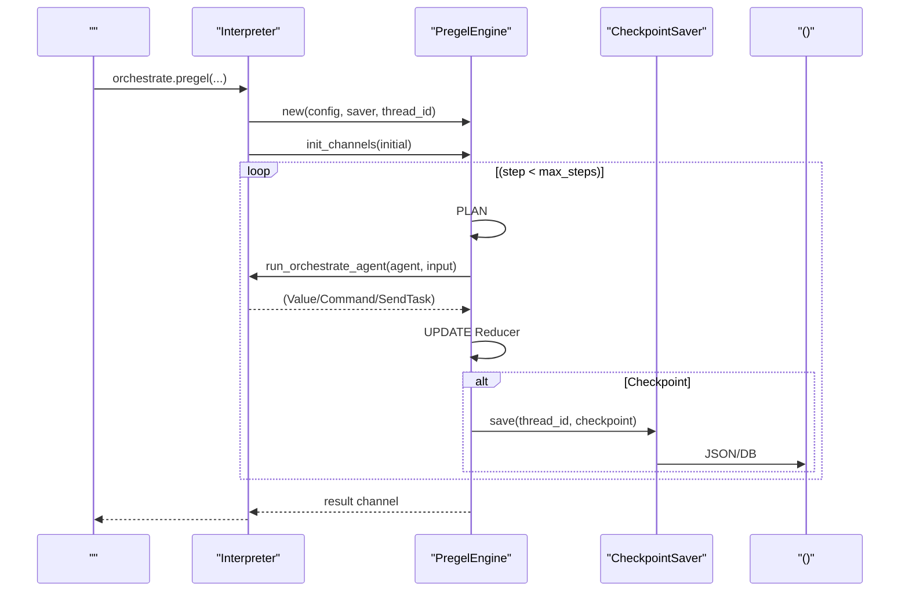
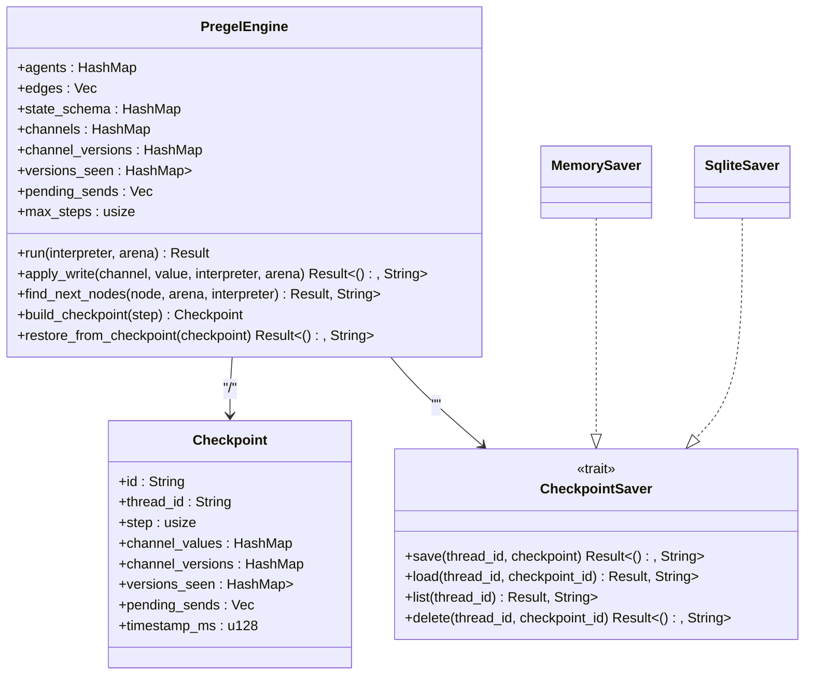
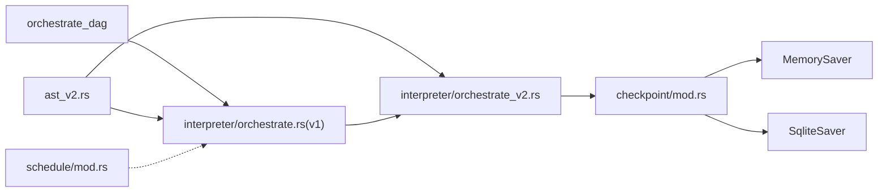

# DAG 

<cite>
****
- [orchestrate_dag/mod.rs](file://src/orchestrate_dag/mod.rs)
- [interpreter/orchestrate.rs](file://src/interpreter/orchestrate.rs)
- [interpreter/orchestrate_v2.rs](file://src/interpreter/orchestrate_v2.rs)
- [checkpoint/mod.rs](file://src/checkpoint/mod.rs)
- [ast_v2.rs](file://src/ast_v2.rs)
- [schedule/mod.rs](file://src/schedule/mod.rs)
- [runtime/orch.rs](file://src/runtime/orch.rs)
</cite>

## 
1. [](#)
2. [](#)
3. [](#)
4. [](#)
5. [](#)
6. [](#)
7. [](#)
8. [](#)
9. [](#)
10. [](#)

## 
 DAG
- 
- 
- 
- 
-  DAG 
- 
- 

“DAG”
-  DAG  Kahn 
- Pregel BSP  Agent Reducer 

## 
 DAG 
- orchestrate_dagDAG-as-data 
- interpreter/orchestrate*v1/v2
- checkpointPregel /SQLite 
- ast_v2 AST AgentEdgeStateChannelReducerKind 
- schedulecron-like DAG 
- runtime/orch

```mermaid
graph TB
subgraph ""
A["orchestrate_dag<br/>DAG "]
B["interpreter/orchestrate.rs<br/> v1 "]
C["interpreter/orchestrate_v2.rs<br/>Pregel BSP "]
D["checkpoint/mod.rs<br/>"]
E["ast_v2.rs<br/> AST "]
end
subgraph ""
F["schedule/mod.rs<br/>"]
G["runtime/orch.rs<br/>"]
end
A --> B
B --> C
C --> D
B --> E
C --> E
F -.-> B
G -.-> B
```


- [orchestrate_dag/mod.rs:1-119](file://src/orchestrate_dag/mod.rs#L1-L119)
- [interpreter/orchestrate.rs:102-133](file://src/interpreter/orchestrate.rs#L102-L133)
- [interpreter/orchestrate_v2.rs:189-358](file://src/interpreter/orchestrate_v2.rs#L189-L358)
- [checkpoint/mod.rs:285-306](file://src/checkpoint/mod.rs#L285-L306)
- [ast_v2.rs:457-544](file://src/ast_v2.rs#L457-L544)
- [schedule/mod.rs:49-148](file://src/schedule/mod.rs#L49-L148)
- [runtime/orch.rs:12-31](file://src/runtime/orch.rs#L12-L31)


- [orchestrate_dag/mod.rs:1-119](file://src/orchestrate_dag/mod.rs#L1-L119)
- [interpreter/orchestrate.rs:102-133](file://src/interpreter/orchestrate.rs#L102-L133)
- [interpreter/orchestrate_v2.rs:189-358](file://src/interpreter/orchestrate_v2.rs#L189-L358)
- [checkpoint/mod.rs:285-306](file://src/checkpoint/mod.rs#L285-L306)
- [ast_v2.rs:457-544](file://src/ast_v2.rs#L457-L544)
- [schedule/mod.rs:49-148](file://src/schedule/mod.rs#L49-L148)
- [runtime/orch.rs:12-31](file://src/runtime/orch.rs#L12-L31)

## 
- OrchestrateDagDAG  validatetopological_orderhas_cycle 
- PregelEngineBSP  channelschannel_versionsversions_seen PLAN -> EXEC -> UPDATE  Command/Send  Checkpoint 
- CheckpointSaver MemorySaver  SqliteSaver
- AST OrchestrateKindOrchestrateAgentOrchestrateEdgeStateChannelReducerKindCheckpointConfigInterruptPoint 
- Scheduler cron  Every/At  Job 


- [orchestrate_dag/mod.rs:17-119](file://src/orchestrate_dag/mod.rs#L17-L119)
- [interpreter/orchestrate_v2.rs:82-153](file://src/interpreter/orchestrate_v2.rs#L82-L153)
- [checkpoint/mod.rs:285-306](file://src/checkpoint/mod.rs#L285-L306)
- [ast_v2.rs:457-544](file://src/ast_v2.rs#L457-L544)
- [schedule/mod.rs:49-148](file://src/schedule/mod.rs#L49-L148)

## 
 Pregel BSP 




- [interpreter/orchestrate.rs:18-100](file://src/interpreter/orchestrate.rs#L18-L100)
- [interpreter/orchestrate_v2.rs:189-358](file://src/interpreter/orchestrate_v2.rs#L189-L358)
- [checkpoint/mod.rs:285-306](file://src/checkpoint/mod.rs#L285-L306)

## 

### DAG Kahn 
- 
  - 
  - Kahn BFS
  - has_cycle
- 
  -  O(V+E) O(V+E)
- 
  -  DAG 

```mermaid
flowchart TD
Start([" topological_order"]) --> Validate["validate(): /"]
Validate --> || InitInDegree[" in_degree  0"]
InitInDegree --> BuildEdges[" edges_by_from "]
BuildEdges --> SeedQueue[" in_degree==0 "]
SeedQueue --> Loop{"?"}
Loop --> || Pop[" n"] --> AppendOrder[" order"]
AppendOrder --> ForEachOut[" n  to"]
ForEachOut --> DecIn["in_degree[to] -= 1"]
DecIn --> ZeroCheck{"in_degree[to]==0 ?"}
ZeroCheck --> || Enqueue[" to"] --> Loop
ZeroCheck --> || Loop
Loop --> || CheckLen{"order.len()==nodes.len() ?"}
CheckLen --> || ReturnOK[" order"]
CheckLen --> || ErrCycle[": "]
```


- [orchestrate_dag/mod.rs:52-105](file://src/orchestrate_dag/mod.rs#L52-L105)


- [orchestrate_dag/mod.rs:28-119](file://src/orchestrate_dag/mod.rs#L28-L119)

### Pregel BSP 
- 
  - channels 
  - channel_versions  channel 
  - versions_seen[node][channel] 
- 
  - PLAN active_nodes  pending_sends 
  - EXEC agent Value/Command/SendTask
  - UPDATE state_schema  Reducer  channels channel_versions
  - CHECKPOINT step 
- 
  - Commandgoto update  channel
  - Send active_nodespending_sends
- HITL
  - Before/After 




- [interpreter/orchestrate_v2.rs:82-153](file://src/interpreter/orchestrate_v2.rs#L82-L153)
- [interpreter/orchestrate_v2.rs:189-358](file://src/interpreter/orchestrate_v2.rs#L189-L358)
- [checkpoint/mod.rs:41-60](file://src/checkpoint/mod.rs#L41-L60)
- [checkpoint/mod.rs:285-306](file://src/checkpoint/mod.rs#L285-L306)


- [interpreter/orchestrate_v2.rs:82-153](file://src/interpreter/orchestrate_v2.rs#L82-L153)
- [interpreter/orchestrate_v2.rs:189-358](file://src/interpreter/orchestrate_v2.rs#L189-L358)
- [checkpoint/mod.rs:285-306](file://src/checkpoint/mod.rs#L285-L306)

### AST 
- OrchestrateKindSequential / Graph / Loop / Pregel
- OrchestrateAgentnamewith_configtask_exprverify_expr
- OrchestrateEdgefromtoconditiondynamic
- StateChannelnametype_hintreducer
- ReducerKindLast / Append / Add / Merge(NodeId)
- CheckpointConfigsaverthread_id
- InterruptPointnode_namewhen(Before/After)


- [ast_v2.rs:457-544](file://src/ast_v2.rs#L457-L544)

###  v1 
- execute_orchestrate OrchestrateKind  v2(Pregel)  v1(Sequential/Graph/Loop)
- v1 Graph
- v1 Loop
- v1 Sequential Agent


- [interpreter/orchestrate.rs:102-133](file://src/interpreter/orchestrate.rs#L102-L133)
- [interpreter/orchestrate.rs:136-275](file://src/interpreter/orchestrate.rs#L136-L275)

### 
- Checkpoint step  SendTask 
- CheckpointSaverMemorySaver /SqliteSaver 
- rewind/resume“”“”


- [checkpoint/mod.rs:41-60](file://src/checkpoint/mod.rs#L41-L60)
- [checkpoint/mod.rs:285-306](file://src/checkpoint/mod.rs#L285-L306)
- [checkpoint/mod.rs:316-346](file://src/checkpoint/mod.rs#L316-L346)

###  DAG 
- JobKindEvery / At
- Scheduler//tick 
- 


- [schedule/mod.rs:26-47](file://src/schedule/mod.rs#L26-L47)
- [schedule/mod.rs:96-148](file://src/schedule/mod.rs#L96-L148)
- [schedule/mod.rs:174-208](file://src/schedule/mod.rs#L174-L208)

## 
- orchestrate_dag 
- interpreter/orchestrate.rs  AST  PregelEngine v1 
- interpreter/orchestrate_v2.rs  ASTCheckpointSaverInterpreter  Agent
- checkpoint MemorySaver/SqliteSaver 
- schedule 




- [orchestrate_dag/mod.rs:1-119](file://src/orchestrate_dag/mod.rs#L1-L119)
- [interpreter/orchestrate.rs:102-133](file://src/interpreter/orchestrate.rs#L102-L133)
- [interpreter/orchestrate_v2.rs:189-358](file://src/interpreter/orchestrate_v2.rs#L189-L358)
- [checkpoint/mod.rs:285-306](file://src/checkpoint/mod.rs#L285-L306)
- [schedule/mod.rs:49-148](file://src/schedule/mod.rs#L49-L148)


- [orchestrate_dag/mod.rs:1-119](file://src/orchestrate_dag/mod.rs#L1-L119)
- [interpreter/orchestrate.rs:102-133](file://src/interpreter/orchestrate.rs#L102-L133)
- [interpreter/orchestrate_v2.rs:189-358](file://src/interpreter/orchestrate_v2.rs#L189-L358)
- [checkpoint/mod.rs:285-306](file://src/checkpoint/mod.rs#L285-L306)
- [schedule/mod.rs:49-148](file://src/schedule/mod.rs#L49-L148)

## 
- 
  -  O(V+E) O(V+E)
- Pregel BSP
  - Reducer 
  - versions_seen
  - 
- 
  - Send  UPDATE 
- 
  -  max_steps  per-step “”

[]

## 
- 
  -  nodes  edges 
  - 
- Pregel 
  -  Command.goto 
  -  max_steps 
- Checkpoint 
  -  thread_id  saver 
  -  resume  step rewind 
- 
  -  add interval_s/at_epoch tick 


- [orchestrate_dag/mod.rs:97-105](file://src/orchestrate_dag/mod.rs#L97-L105)
- [interpreter/orchestrate_v2.rs:353-358](file://src/interpreter/orchestrate_v2.rs#L353-L358)
- [checkpoint/mod.rs:316-346](file://src/checkpoint/mod.rs#L316-L346)
- [schedule/mod.rs:96-148](file://src/schedule/mod.rs#L96-L148)

## 
- “ DAG ”“ BSP ”//
- Pregel  Reducer 
- 
- per-step 

[]

## 

### 
-  OrchestrateDag.topological_order Kahn 
- 

[]

### 
-  ENGINE  PLAN 
  - /
  -  max_parallel_per_step
  - CPU/IO/GPU
- 

[]

### 
- 
  - max_steps
  -  active_nodes 
- 
  -  PLAN  active_nodes 
  - 
  -  UPDATE 

[]

###  DAG 
- 
  -  OrchestrateEdge.condition  result  channels 
- 
  -  Command.goto  Send  Map/Reduce/FanOut/FanIn 
- 
  -  StateChannel  ReducerKindAppend/Add/Merge


- [ast_v2.rs:492-544](file://src/ast_v2.rs#L492-L544)
- [interpreter/orchestrate_v2.rs:367-401](file://src/interpreter/orchestrate_v2.rs#L367-L401)
- [interpreter/orchestrate_v2.rs:418-492](file://src/interpreter/orchestrate_v2.rs#L418-L492)

### 
- 
  - CheckpointSaverKV 
  - PregelEngine PLAN/UPDATE 
  - Interpreter.run_orchestrate_agent/
- 
  - 
  -  token/
  - OpenTelemetry/


- [checkpoint/mod.rs:285-306](file://src/checkpoint/mod.rs#L285-L306)
- [interpreter/orchestrate_v2.rs:189-358](file://src/interpreter/orchestrate_v2.rs#L189-L358)

### 
- 
  - /
  - Channel Reducer 
  - Checkpoint 
  - 
- 
  -  max_steps 
  -  Reducer 
  -  JSON /

[]