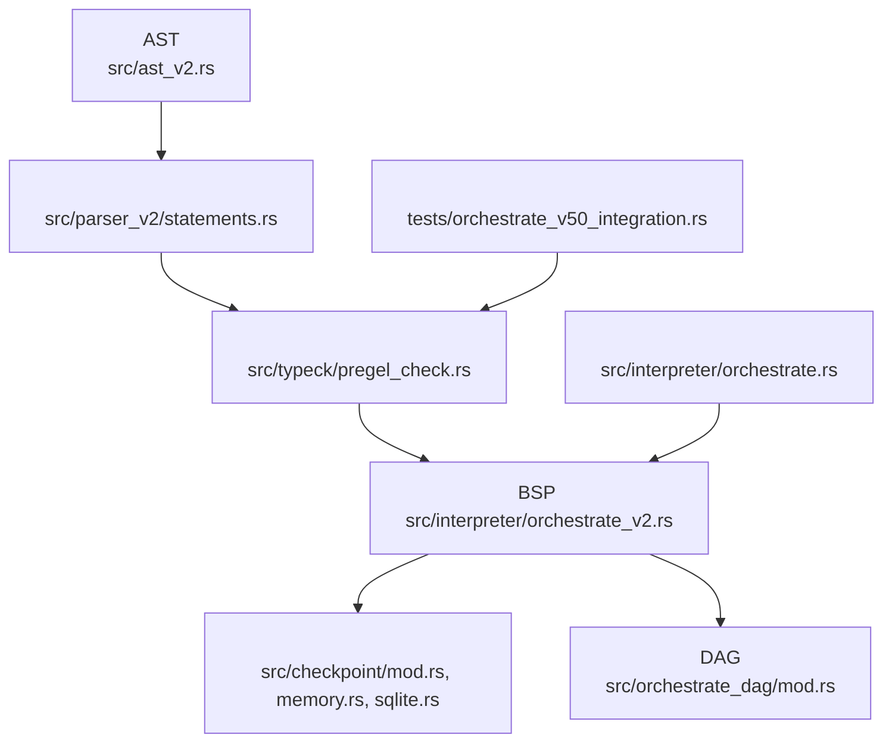
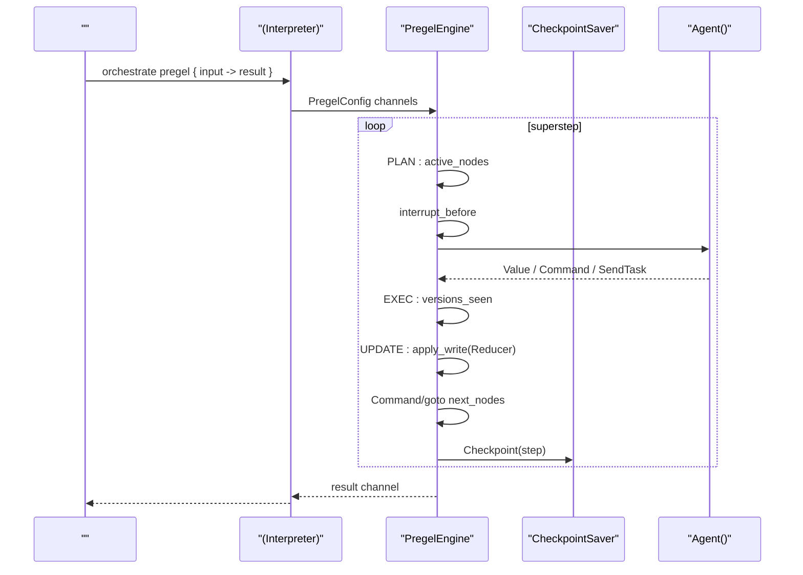
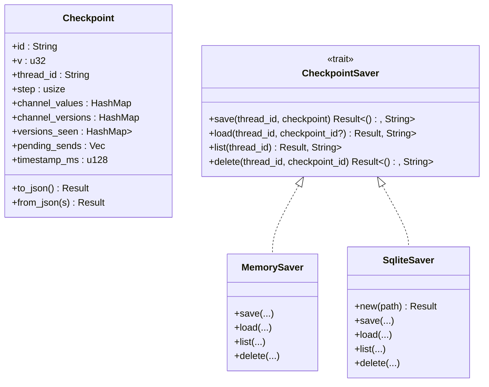

# Pregel BSP 

<cite>
****
- [src/lib.rs](file://src/lib.rs)
- [src/ast_v2.rs](file://src/ast_v2.rs)
- [src/parser_v2/statements.rs](file://src/parser_v2/statements.rs)
- [src/typeck/pregel_check.rs](file://src/typeck/pregel_check.rs)
- [src/orchestrate_dag/mod.rs](file://src/orchestrate_dag/mod.rs)
- [src/checkpoint/mod.rs](file://src/checkpoint/mod.rs)
- [src/checkpoint/memory.rs](file://src/checkpoint/memory.rs)
- [src/checkpoint/sqlite.rs](file://src/checkpoint/sqlite.rs)
- [src/interpreter/orchestrate_v2.rs](file://src/interpreter/orchestrate_v2.rs)
- [src/interpreter/orchestrate.rs](file://src/interpreter/orchestrate.rs)
- [tests/orchestrate_v50_integration.rs](file://tests/orchestrate_v50_integration.rs)
</cite>

## 
1. [](#)
2. [](#)
3. [](#)
4. [](#)
5. [](#)
6. [](#)
7. [](#)
8. [](#)
9. [](#)
10. [](#)

## 
 Mora  PregelBulk Synchronous Parallel
-  statenodechannelcheckpoint 
- 
- DAG 
- 
- 
- 
- 

## 
Pregel BSP  ASTDAG “ AST +  +  + BSP ”




- [src/ast_v2.rs:472-544](file://src/ast_v2.rs#L472-L544)
- [src/parser_v2/statements.rs:946-1145](file://src/parser_v2/statements.rs#L946-L1145)
- [src/typeck/pregel_check.rs:1-139](file://src/typeck/pregel_check.rs#L1-L139)
- [src/interpreter/orchestrate_v2.rs:82-153](file://src/interpreter/orchestrate_v2.rs#L82-L153)
- [src/checkpoint/mod.rs:1-66](file://src/checkpoint/mod.rs#L1-L66)
- [src/orchestrate_dag/mod.rs:1-119](file://src/orchestrate_dag/mod.rs#L1-L119)
- [src/interpreter/orchestrate.rs:1-36](file://src/interpreter/orchestrate.rs#L1-L36)
- [tests/orchestrate_v50_integration.rs:1-24](file://tests/orchestrate_v50_integration.rs#L1-L24)


- [src/lib.rs:1-55](file://src/lib.rs#L1-L55)

## 
- AST OrchestrateKind::PregelStateChannelReducerKindCheckpointConfigInterruptPointDynamicKind 
- orchestrate_statement  "pregel"  statecheckpointagentedgesinterrupt
- check_orchestrate_pregel  schema
- BSP PregelEngine  PLAN -> EXEC -> UPDATE  channelsCommand/Send 
- CheckpointSaver trait + MemorySaver/SqliteSaver  save/load/list/deleterewind/resume
- DAG OrchestrateDag  validate  topological_orderKahn 


- [src/ast_v2.rs:472-544](file://src/ast_v2.rs#L472-L544)
- [src/parser_v2/statements.rs:946-1145](file://src/parser_v2/statements.rs#L946-L1145)
- [src/typeck/pregel_check.rs:1-139](file://src/typeck/pregel_check.rs#L1-L139)
- [src/interpreter/orchestrate_v2.rs:82-153](file://src/interpreter/orchestrate_v2.rs#L82-L153)
- [src/checkpoint/mod.rs:1-66](file://src/checkpoint/mod.rs#L1-L66)
- [src/orchestrate_dag/mod.rs:1-119](file://src/orchestrate_dag/mod.rs#L1-L119)

## 
Pregel BSP  orchestrate 
-  orchestrate pregel ... end  AST 
-  state_schemaedgesinterrupt_pointscheckpoint 
- PLAN EXEC  agent //UPDATE  Reducer  channel




- [src/interpreter/orchestrate_v2.rs:190-358](file://src/interpreter/orchestrate_v2.rs#L190-L358)
- [src/checkpoint/mod.rs:285-306](file://src/checkpoint/mod.rs#L285-L306)


- [src/interpreter/orchestrate.rs:1-36](file://src/interpreter/orchestrate.rs#L1-L36)
- [src/interpreter/orchestrate_v2.rs:812-878](file://src/interpreter/orchestrate_v2.rs#L812-L878)

## 

### AST statenodechannelcheckpoint
- OrchestrateKind::Pregel  agentsedgesstate_schemacheckpointinterrupt_points
- StateChannel  channel  type_hintreducer 
- ReducerKind  lastappendaddmerge()
- CheckpointConfig  saver  thread_id 
- InterruptPoint  before/after 
- DynamicKind  map/reduce/fan_out/fan_in 

```mermaid
classDiagram
class OrchestrateKind {
<<enum>>
+Pregel
}
class OrchestrateAgent {
+name : String
+with_config : Option<Vec<(String, NodeId)>>
+task_expr : NodeId
+verify_expr : Option<NodeId>
}
class OrchestrateEdge {
+from : String
+to : String
+condition : Option<NodeId>
+dynamic : Option<DynamicKind>
}
class StateChannel {
+name : String
+type_hint : Option<String>
+reducer : ReducerKind
}
class ReducerKind {
<<enum>>
+Last
+Append
+Add
+Merge(NodeId)
}
class CheckpointConfig {
+saver : String
+thread_id : Option<NodeId>
}
class InterruptPoint {
+node_name : String
+when : InterruptWhen
}
class DynamicKind {
<<enum>>
+Map
+Reduce
+FanOut
+FanIn
}
OrchestrateKind --> OrchestrateAgent : ""
OrchestrateKind --> OrchestrateEdge : ""
OrchestrateKind --> StateChannel : ""
OrchestrateKind --> CheckpointConfig : ""
OrchestrateKind --> InterruptPoint : ""
StateChannel --> ReducerKind : ""
OrchestrateEdge --> DynamicKind : ""
```


- [src/ast_v2.rs:472-544](file://src/ast_v2.rs#L472-L544)


- [src/ast_v2.rs:472-544](file://src/ast_v2.rs#L472-L544)
- [src/parser_v2/statements.rs:946-1145](file://src/parser_v2/statements.rs#L946-L1145)

### orchestrate pregel 
- statecheckpointagentedgesinterrupt
- state  channel  hint@reducer(last/append/add/merge(...))
- checkpoint  saver  thread 
- agent  task(...)  verify(...)
- edges  from/to  condition/dynamic
- interrupt  before/after 


- [src/parser_v2/statements.rs:946-1145](file://src/parser_v2/statements.rs#L946-L1145)

### 
- 
  - state_schema  reducer  type_hint append  listadd  number
  - edge  @start/@exit 
  - checkpoint saver memory/sqlite/redis/postgres
  - interrupt_points 
  - Command goto  Send 
  - map/fan_out  reduce/fan_in
  - agent 
-  Vec<TypeError>  panic

```mermaid
flowchart TD
Start([""]) --> CollectAgents["(@start/@exit)"]
CollectAgents --> CheckSchema[" state_schema  reducer "]
CheckSchema --> CheckEdges[" edges "]
CheckEdges --> CheckCheckpoint[" checkpoint saver "]
CheckCheckpoint --> CheckInterrupts[" interrupt "]
CheckInterrupts --> CheckGotos[" Command goto "]
CheckGotos --> CheckSends[" Send "]
CheckSends --> CheckDynamic["(mapreduce/fan_in)"]
CheckDynamic --> CheckUnique[" agent "]
CheckUnique --> End([""])
```


- [src/typeck/pregel_check.rs:62-139](file://src/typeck/pregel_check.rs#L62-L139)


- [src/typeck/pregel_check.rs:1-139](file://src/typeck/pregel_check.rs#L1-L139)
- [tests/orchestrate_v50_integration.rs:1-24](file://tests/orchestrate_v50_integration.rs#L1-L24)

### BSP 
- 
  - channels 
  - channel_versions 
  - versions_seen[node][channel] 
- 
  - PLAN active_nodes  pending_sends 
  - EXEC agent writescommandssend_tasks versions_seen
  - UPDATE Reducer  command.goto  send_tasks
- 
  -  →  result channel
  - __command__ JSON →  goto/update/resume
  - __send__ JSON →  target/input  pending_sends

```mermaid
flowchart TD
S([" run()"]) --> Init[" step=0, active_nodes=['@start']"]
Init --> Loop{"active_nodes  step < max_steps?"}
Loop --> || Plan["PLAN:  to_execute"]
Plan --> Exec["EXEC: ,  writes/commands/sends"]
Exec --> Update["UPDATE: apply_write(Reducer),  next_nodes"]
Update --> CP[" Checkpoint(step)"]
CP --> Next["step += 1; active_nodes = next_nodes"]
Next --> Loop
Loop --> || Done[" result channel  Nil"]
```


- [src/interpreter/orchestrate_v2.rs:190-358](file://src/interpreter/orchestrate_v2.rs#L190-L358)


- [src/interpreter/orchestrate_v2.rs:82-153](file://src/interpreter/orchestrate_v2.rs#L82-L153)
- [src/interpreter/orchestrate_v2.rs:190-358](file://src/interpreter/orchestrate_v2.rs#L190-L358)

### 
- Checkpoint idvthread_idstepchannel_valueschannel_versionsversions_seenpending_sendstimestamp_ms
- CheckpointSaver trait  save/load/list/delete
- 
  - MemorySaverMutex
  - SqliteSaverSQLite  thread_id JSON 
- 
  - rewind(thread_id, before_step) >= before_step 
  - resume(thread_id)




- [src/checkpoint/mod.rs:34-66](file://src/checkpoint/mod.rs#L34-L66)
- [src/checkpoint/mod.rs:285-306](file://src/checkpoint/mod.rs#L285-L306)
- [src/checkpoint/memory.rs:1-84](file://src/checkpoint/memory.rs#L1-L84)
- [src/checkpoint/sqlite.rs:1-136](file://src/checkpoint/sqlite.rs#L1-L136)


- [src/checkpoint/mod.rs:1-66](file://src/checkpoint/mod.rs#L1-L66)
- [src/checkpoint/memory.rs:1-84](file://src/checkpoint/memory.rs#L1-L84)
- [src/checkpoint/sqlite.rs:1-136](file://src/checkpoint/sqlite.rs#L1-L136)

### DAG 
- OrchestrateDag  validate  topological_orderKahn  BFS
- 
- 

```mermaid
flowchart TD
VStart(["validate(nodes, edges)"]) --> DupCheck[""]
DupCheck --> EdgeCheck[""]
EdgeCheck --> Topo["topological_order():  + BFS"]
Topo --> Cycle{"?"}
Cycle --> || Err[""]
Cycle --> || Order[""]
```


- [src/orchestrate_dag/mod.rs:28-119](file://src/orchestrate_dag/mod.rs#L28-L119)


- [src/orchestrate_dag/mod.rs:1-119](file://src/orchestrate_dag/mod.rs#L1-L119)

### 
-  edges  from->to  condition  result 
-  Command  goto  interrupt before/after 
-  checkpoint  rewind  resume 
-  __send__  SendTask UPDATE  active_nodes


- [src/interpreter/orchestrate_v2.rs:366-401](file://src/interpreter/orchestrate_v2.rs#L366-L401)
- [src/interpreter/orchestrate_v2.rs:537-563](file://src/interpreter/orchestrate_v2.rs#L537-L563)
- [src/checkpoint/mod.rs:316-346](file://src/checkpoint/mod.rs#L316-L346)

## 
-  AST 
-  AST 
- BSP  ASTMIR 
-  JSON / Value 
- DAG  BSP 

```mermaid
graph LR
AST["AST "] --> Parser[""]
AST --> TypeCK[""]
Parser --> TypeCK
TypeCK --> Engine["BSP "]
Engine --> Checkpoint[""]
Checkpoint --> Mem["MemorySaver"]
Checkpoint --> Sqlite["SqliteSaver"]
Engine --> DAG["DAG "]
```


- [src/ast_v2.rs:472-544](file://src/ast_v2.rs#L472-L544)
- [src/parser_v2/statements.rs:946-1145](file://src/parser_v2/statements.rs#L946-L1145)
- [src/typeck/pregel_check.rs:1-139](file://src/typeck/pregel_check.rs#L1-L139)
- [src/interpreter/orchestrate_v2.rs:82-153](file://src/interpreter/orchestrate_v2.rs#L82-L153)
- [src/checkpoint/mod.rs:285-306](file://src/checkpoint/mod.rs#L285-L306)
- [src/orchestrate_dag/mod.rs:1-119](file://src/orchestrate_dag/mod.rs#L1-L119)


- [src/lib.rs:1-55](file://src/lib.rs#L1-L55)

## 
-  versions_seen
- Reducer append/add/last/merge merge 
- 
- __send__  UPDATE 
- CheckpointSaver trait  Redis/Postgres 

[]

## 
- 
  - append  list add  number 
  - Command goto/Send 
  -  map  reduce/fan_in
- 
  -  max_steps 
  - IO 
  -  thread_id 
- 
  -  interrupt before/after 
  -  rewind  resume 
  -  channels  versions_seen 


- [src/typeck/pregel_check.rs:145-276](file://src/typeck/pregel_check.rs#L145-L276)
- [src/interpreter/orchestrate_v2.rs:353-358](file://src/interpreter/orchestrate_v2.rs#L353-L358)
- [src/checkpoint/mod.rs:316-346](file://src/checkpoint/mod.rs#L316-L346)

## 
Mora  Pregel BSP  AST DAG CommandSendInterrupt

[]

## 
- orchestrate pregel { input -> result }
  - state: { channel_name: type_hint @reducer(...) }
  - checkpoint: saver[, thread: expr]
  - agent name: task(expr)[, verify(expr)]
  - edges: from -> to [if condition] [dynamic kind]
  - interrupt before/after node_name


- [src/parser_v2/statements.rs:946-1145](file://src/parser_v2/statements.rs#L946-L1145)