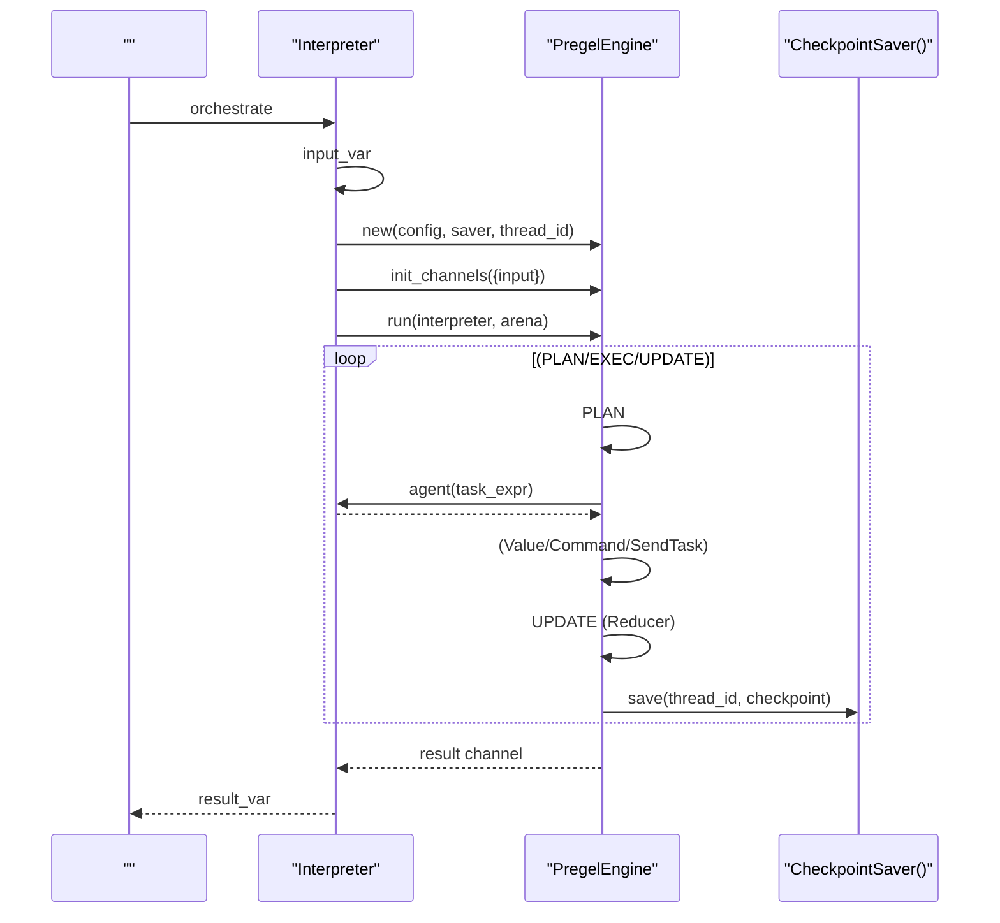
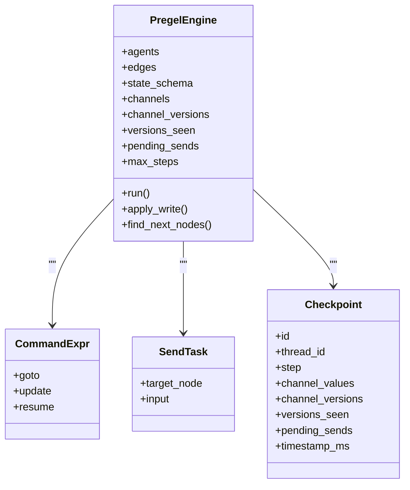

# Worker 

<cite>
****   
- [orchestrate.rs](file://src/interpreter/orchestrate.rs)
- [orchestrate_v2.rs](file://src/interpreter/orchestrate_v2.rs)
- [mod.rscheckpoint](file://src/checkpoint/mod.rs)
- [memory.rscheckpoint](file://src/checkpoint/memory.rs)
- [README.md](file://README.md)
</cite>

## 
1. [](#)
2. [](#)
3. [](#)
4. [](#)
5. [](#)
6. [](#)
7. [](#)
8. [](#)
9. [](#)
10. [](#)

## 
 Mora “Worker ” Agent Mora  v0.50  Pregel BSPBulk Synchronous Parallel“=Agent/Worker” Channel  Reducer  Checkpoint 

## 
 Worker 
-  orchestrate  Pregel 
- Pregel  BSP PLAN/EXEC/UPDATE Send 
-  Checkpoint 

```mermaid
graph TB
subgraph ""
ORCH["orchestrate.rs<br/>"]
V2["orchestrate_v2.rs<br/>Pregel "]
end
subgraph ""
CP_MOD["checkpoint/mod.rs<br/>Checkpoint "]
CP_MEM["checkpoint/memory.rs<br/>"]
end
ORCH --> V2
V2 --> CP_MOD
CP_MOD --> CP_MEM
```


- [orchestrate.rs:103-133](file://src/interpreter/orchestrate.rs#L103-L133)
- [orchestrate_v2.rs:190-358](file://src/interpreter/orchestrate_v2.rs#L190-L358)
- [mod.rscheckpoint:282-346](file://src/checkpoint/mod.rs#L282-L346)
- [memory.rscheckpoint:29-84](file://src/checkpoint/memory.rs#L29-L84)


- [orchestrate.rs:103-133](file://src/interpreter/orchestrate.rs#L103-L133)
- [orchestrate_v2.rs:190-358](file://src/interpreter/orchestrate_v2.rs#L190-L358)
- [mod.rscheckpoint:282-346](file://src/checkpoint/mod.rs#L282-L346)
- [memory.rscheckpoint:29-84](file://src/checkpoint/memory.rs#L29-L84)

## 
- Interpreter.execute_orchestrate / execute_orchestrate_v2
  -  AST  orchestrate  PregelConfig
- Pregel PregelEngine
  -  channelschannel_versionsversions_seen 
  -  PLAN/EXEC/UPDATE Command  Send 
  -  Interrupt before/after HITL 
- Checkpoint + CheckpointSaver
  - / rewind/resume
  -  MemorySaver  in-memory 


- [orchestrate.rs:103-133](file://src/interpreter/orchestrate.rs#L103-L133)
- [orchestrate_v2.rs:82-153](file://src/interpreter/orchestrate_v2.rs#L82-L153)
- [mod.rscheckpoint:34-90](file://src/checkpoint/mod.rs#L34-L90)
- [memory.rscheckpoint:11-27](file://src/checkpoint/memory.rs#L11-L27)

## 
 Pregel 




- [orchestrate.rs:103-133](file://src/interpreter/orchestrate.rs#L103-L133)
- [orchestrate_v2.rs:190-358](file://src/interpreter/orchestrate_v2.rs#L190-L358)
- [mod.rscheckpoint:282-346](file://src/checkpoint/mod.rs#L282-L346)
- [memory.rscheckpoint:29-84](file://src/checkpoint/memory.rs#L29-L84)

## 

### 
-  Pregel execute_orchestrate_v2  agents/edges/state_schema/checkpoint/interrupt_points PregelConfig 
-  Sequential/Graph/Loopexecute_orchestrate_v1 


- [orchestrate.rs:103-133](file://src/interpreter/orchestrate.rs#L103-L133)
- [orchestrate.rs:136-275](file://src/interpreter/orchestrate.rs#L136-L275)

### Pregel BSP 
- 
  - channels 
  - channel_versions  channel 
  - versions_seen[node][channel] 
- run
  - PLAN active_nodes  pending_sends  to_execute
  - EXEC versions_seen channels agent
  - UPDATE Reducer  channel_versions
  - Command.goto SendTask  active_nodes
  - 
- v0.51
  - before/after  false 

```mermaid
flowchart TD
Start([" run"]) --> Plan["PLAN: "]
Plan --> Exec["EXEC: <br/> versions_seen ->  ->  agent -> "]
Exec --> Update["UPDATE:  Reducer  ->  channel_versions"]
Update --> Next{" Command.goto  SendTask?"}
Next -- "" --> Active[" active_nodes"]
Next -- "" --> Static[""]
Static --> Active
Active --> Checkpoint[""]
Checkpoint --> Loop{"active_nodes  max_steps?"}
Loop -- "" --> Plan
Loop -- "" --> End([" result channel "])
```


- [orchestrate_v2.rs:190-358](file://src/interpreter/orchestrate_v2.rs#L190-L358)


- [orchestrate_v2.rs:82-153](file://src/interpreter/orchestrate_v2.rs#L82-L153)
- [orchestrate_v2.rs:190-358](file://src/interpreter/orchestrate_v2.rs#L190-L358)

### 
- 
  -  Value::String
  - JSON  "__command__" goto/update/resume
  - JSON  "__send__" target/input
- 
  -  edges[from,to,condition] 
  - Command.goto 
  - SendTask  active_nodes
- 
  - BSP  Reducer 
  - SendTask  UPDATE 




- [orchestrate_v2.rs:69-77](file://src/interpreter/orchestrate_v2.rs#L69-L77)
- [mod.rscheckpoint:34-90](file://src/checkpoint/mod.rs#L34-L90)
- [orchestrate_v2.rs:531-563](file://src/interpreter/orchestrate_v2.rs#L531-L563)


- [orchestrate_v2.rs:531-563](file://src/interpreter/orchestrate_v2.rs#L531-L563)
- [orchestrate_v2.rs:366-401](file://src/interpreter/orchestrate_v2.rs#L366-L401)
- [mod.rscheckpoint:34-90](file://src/checkpoint/mod.rs#L34-L90)

### 
- 
  - channels state_schema 
  - channel_versions channel 
  - versions_seen
- 
  -  versions_seen 
- 
  -  Mutex 
  - 
- Reducer 
  - last
  - append
  - add
  - merge(current, new) → merged


- [orchestrate_v2.rs:82-153](file://src/interpreter/orchestrate_v2.rs#L82-L153)
- [orchestrate_v2.rs:416-492](file://src/interpreter/orchestrate_v2.rs#L416-L492)
- [memory.rscheckpoint:11-27](file://src/checkpoint/memory.rs#L11-L27)

### 
- 
  - Reducer  Result 
- /
  - max_steps  1000
- 
  - before/after  false 


- [orchestrate_v2.rs:190-358](file://src/interpreter/orchestrate_v2.rs#L190-L358)
- [orchestrate_v2.rs:416-492](file://src/interpreter/orchestrate_v2.rs#L416-L492)

### 
-  WorkerAgent
  -  agent  with_config 
  - [orchestrate.rs:277-357](file://src/interpreter/orchestrate.rs#L277-L357)
- 
  - 
  -  "__command__"  JSON goto/update
  -  "__send__"  JSON
  - [orchestrate_v2.rs:531-563](file://src/interpreter/orchestrate_v2.rs#L531-L563)
-  Reducer
  -  state_schema  channel  reducer 
  - [orchestrate_v2.rs:132-136](file://src/interpreter/orchestrate_v2.rs#L132-L136)
- 
  -  checkpoint.saver  memory/sqlitesqlite  feature
  -  rewind/resume 
  - [orchestrate.rs:46-84](file://src/interpreter/orchestrate.rs#L46-L84)[mod.rscheckpoint:312-346](file://src/checkpoint/mod.rs#L312-L346)


- [orchestrate.rs:277-357](file://src/interpreter/orchestrate.rs#L277-L357)
- [orchestrate_v2.rs:531-563](file://src/interpreter/orchestrate_v2.rs#L531-L563)
- [orchestrate_v2.rs:132-136](file://src/interpreter/orchestrate_v2.rs#L132-L136)
- [orchestrate.rs:46-84](file://src/interpreter/orchestrate.rs#L46-L84)
- [mod.rscheckpoint:312-346](file://src/checkpoint/mod.rs#L312-L346)

## 
-  AST 
-  Interpreter  CheckpointSaver 
- 


- [orchestrate.rs:103-133](file://src/interpreter/orchestrate.rs#L103-L133)
- [orchestrate_v2.rs:190-358](file://src/interpreter/orchestrate_v2.rs#L190-L358)
- [mod.rscheckpoint:282-346](file://src/checkpoint/mod.rs#L282-L346)
- [memory.rscheckpoint:29-84](file://src/checkpoint/memory.rs#L29-L84)


- [orchestrate.rs:103-133](file://src/interpreter/orchestrate.rs#L103-L133)
- [orchestrate_v2.rs:190-358](file://src/interpreter/orchestrate_v2.rs#L190-L358)
- [mod.rscheckpoint:282-346](file://src/checkpoint/mod.rs#L282-L346)
- [memory.rscheckpoint:29-84](file://src/checkpoint/memory.rs#L29-L84)

## 
-  JSON  Command/Send  JSON
-  max_steps
-  Reducerappend/add 
-  I/O 
-  versions_seen 

## 
- 
  - 
  - Reducer  channel 
  -  feature  saver 
- 
  -  channels  channel_versions 
  -  rewind/resume
  -  before/after 


- [orchestrate_v2.rs:190-358](file://src/interpreter/orchestrate_v2.rs#L190-L358)
- [orchestrate_v2.rs:416-492](file://src/interpreter/orchestrate_v2.rs#L416-L492)
- [mod.rscheckpoint:312-346](file://src/checkpoint/mod.rs#L312-L346)

## 
Mora  Worker  Pregel BSP  Agent Channel  Reducer Command/Send Checkpont  AI 

## 
-  Worker 
  -  README  v0.19 Worker  v0.50 Pregel 
  - [README.md:115-116](file://README.md#L115-L116)[README.md:15](file://README.md#L15)


- [README.md:115-116](file://README.md#L115-L116)
- [README.md:15](file://README.md#L15)