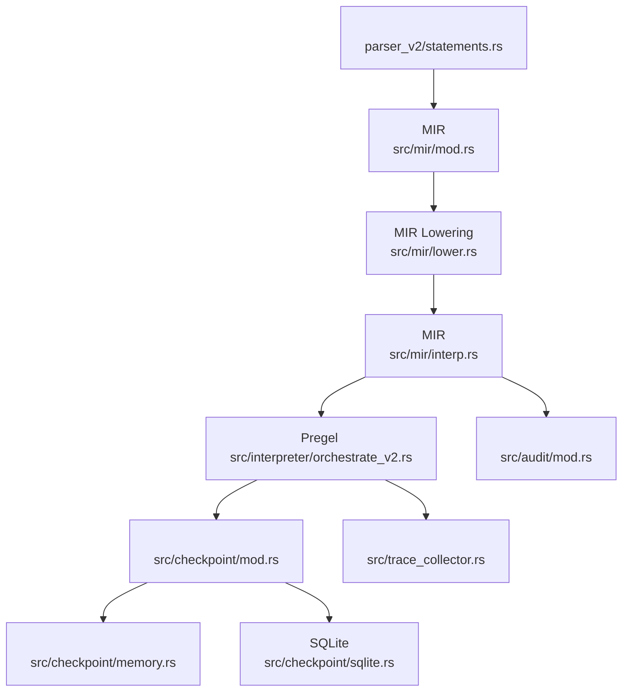
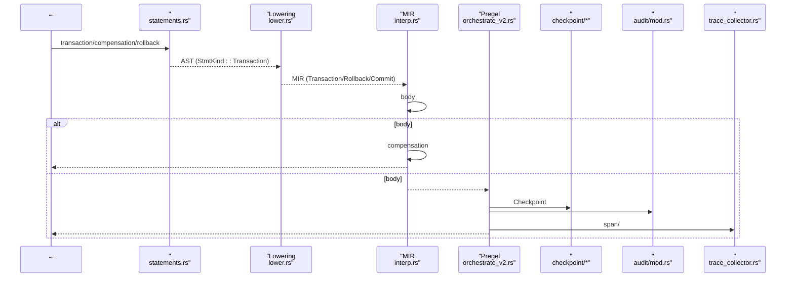
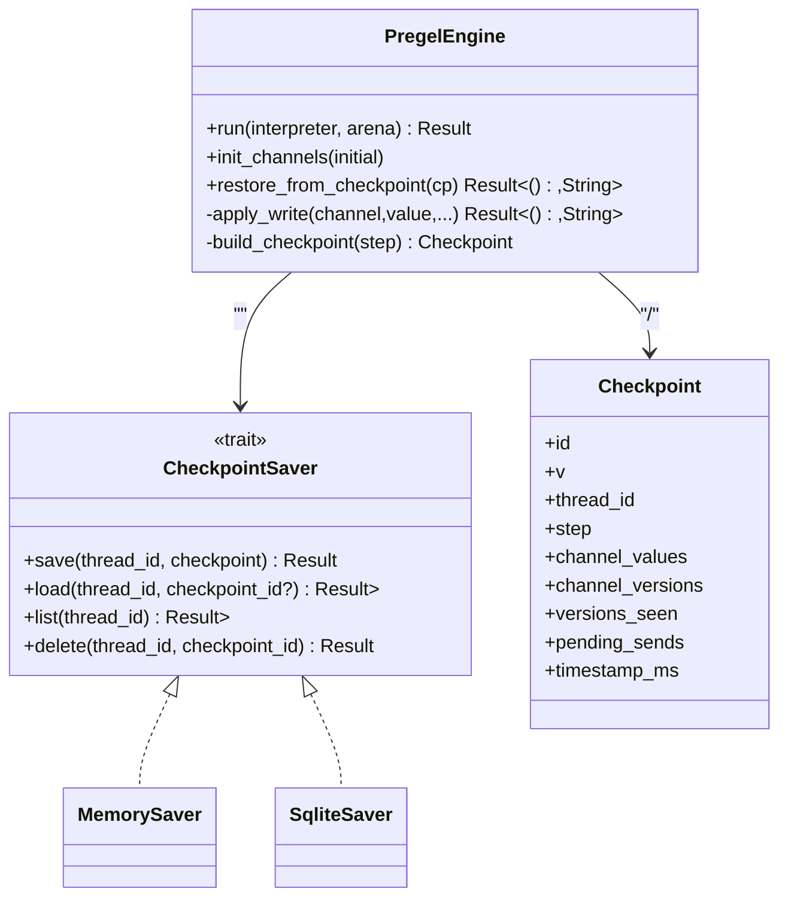
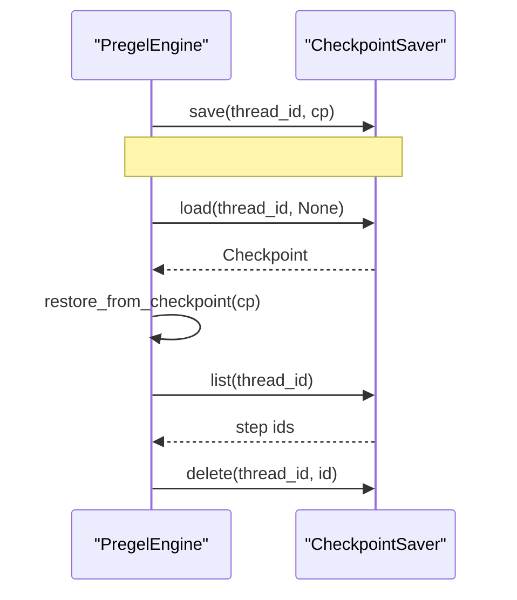
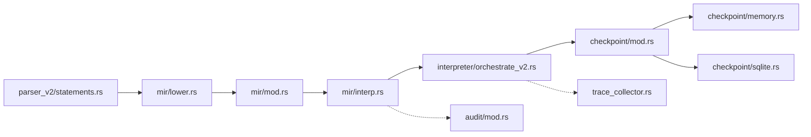

# 

<cite>
****   
- [src/mir/mod.rs](file://src/mir/mod.rs)
- [src/mir/lower.rs](file://src/mir/lower.rs)
- [src/mir/interp.rs](file://src/mir/interp.rs)
- [src/parser_v2/statements.rs](file://src/parser_v2/statements.rs)
- [src/interpreter/orchestrate.rs](file://src/interpreter/orchestrate.rs)
- [src/interpreter/orchestrate_v2.rs](file://src/interpreter/orchestrate_v2.rs)
- [src/checkpoint/mod.rs](file://src/checkpoint/mod.rs)
- [src/checkpoint/memory.rs](file://src/checkpoint/memory.rs)
- [src/checkpoint/sqlite.rs](file://src/checkpoint/sqlite.rs)
- [tests/tier0_replacement.rs](file://tests/tier0_replacement.rs)
- [src/ai_infra.rs](file://src/ai_infra.rs)
- [src/trace_collector.rs](file://src/trace_collector.rs)
- [src/audit/mod.rs](file://src/audit/mod.rs)
</cite>

## 
1. [](#)
2. [](#)
3. [](#)
4. [](#)
5. [](#)
6. [](#)
7. [](#)
8. [](#)
9. [](#)
10. [](#)

## 
 Mora 
- ACID 
- 
- 
- 
- 
- 
- 

## 
Mora “ → MIR  → ” Pregel BSP  Checkpoint 



**** 
- [src/parser_v2/statements.rs:415-452](file://src/parser_v2/statements.rs#L415-L452)
- [src/mir/mod.rs:170-201](file://src/mir/mod.rs#L170-L201)
- [src/mir/lower.rs:536-589](file://src/mir/lower.rs#L536-L589)
- [src/mir/interp.rs:322-354](file://src/mir/interp.rs#L322-L354)
- [src/interpreter/orchestrate_v2.rs:190-358](file://src/interpreter/orchestrate_v2.rs#L190-L358)
- [src/checkpoint/mod.rs:285-346](file://src/checkpoint/mod.rs#L285-L346)
- [src/checkpoint/memory.rs:29-84](file://src/checkpoint/memory.rs#L29-L84)
- [src/checkpoint/sqlite.rs:51-136](file://src/checkpoint/sqlite.rs#L51-L136)
- [src/audit/mod.rs:274-385](file://src/audit/mod.rs#L274-L385)
- [src/trace_collector.rs:60-100](file://src/trace_collector.rs#L60-L100)

****
- [src/parser_v2/statements.rs:415-452](file://src/parser_v2/statements.rs#L415-L452)
- [src/mir/mod.rs:170-201](file://src/mir/mod.rs#L170-L201)
- [src/mir/lower.rs:536-589](file://src/mir/lower.rs#L536-L589)
- [src/mir/interp.rs:322-354](file://src/mir/interp.rs#L322-L354)
- [src/interpreter/orchestrate_v2.rs:190-358](file://src/interpreter/orchestrate_v2.rs#L190-L358)
- [src/checkpoint/mod.rs:285-346](file://src/checkpoint/mod.rs#L285-L346)
- [src/checkpoint/memory.rs:29-84](file://src/checkpoint/memory.rs#L29-L84)
- [src/checkpoint/sqlite.rs:51-136](file://src/checkpoint/sqlite.rs#L51-L136)
- [src/audit/mod.rs:274-385](file://src/audit/mod.rs#L274-L385)
- [src/trace_collector.rs:60-100](file://src/trace_collector.rs#L60-L100)

## 
-  MIR 
  - transaction / compensation / rollback / commit
  - MIRTransaction(body, compensation)RollbackCommit
- 
  - body  compensation 
- 
  - Pregel BSP  Reducer  Channel Checkpoint
  -  rewind/resume  ID 
- 
  - TraceCollector 
  - AuditSink 

****
- [src/mir/mod.rs:170-201](file://src/mir/mod.rs#L170-L201)
- [src/mir/interp.rs:322-354](file://src/mir/interp.rs#L322-L354)
- [src/interpreter/orchestrate_v2.rs:190-358](file://src/interpreter/orchestrate_v2.rs#L190-L358)
- [src/checkpoint/mod.rs:285-346](file://src/checkpoint/mod.rs#L285-L346)
- [src/trace_collector.rs:60-100](file://src/trace_collector.rs#L60-L100)
- [src/audit/mod.rs:274-385](file://src/audit/mod.rs#L274-L385)

## 
 Mora 



**** 
- [src/parser_v2/statements.rs:415-452](file://src/parser_v2/statements.rs#L415-L452)
- [src/mir/lower.rs:536-589](file://src/mir/lower.rs#L536-L589)
- [src/mir/interp.rs:322-354](file://src/mir/interp.rs#L322-L354)
- [src/interpreter/orchestrate_v2.rs:190-358](file://src/interpreter/orchestrate_v2.rs#L190-L358)
- [src/checkpoint/mod.rs:285-346](file://src/checkpoint/mod.rs#L285-L346)
- [src/audit/mod.rs:274-385](file://src/audit/mod.rs#L274-L385)
- [src/trace_collector.rs:60-100](file://src/trace_collector.rs#L60-L100)

## 

### 
- 
  -  transaction  compensation  StmtKind::Transaction
- Lowering
  -  body  compensation  lower  MirFunction Transaction(body, compensation) 
  - rollback  Rollback commit 
- 
  -  body compensation
  -  rollback  compensation 

```mermaid
flowchart TD
Start([" Transaction"]) --> ExecBody[" body"]
ExecBody --> BodyOk{"body ?"}
BodyOk --> || ExitOK[""]
BodyOk --> || CloneEnv[""]
CloneEnv --> ExecComp[" compensation"]
ExecComp --> ReturnErr[""]
```

**** 
- [src/parser_v2/statements.rs:415-452](file://src/parser_v2/statements.rs#L415-L452)
- [src/mir/lower.rs:536-589](file://src/mir/lower.rs#L536-L589)
- [src/mir/interp.rs:322-354](file://src/mir/interp.rs#L322-L354)
- [tests/tier0_replacement.rs:136-155](file://tests/tier0_replacement.rs#L136-L155)

****
- [src/parser_v2/statements.rs:415-452](file://src/parser_v2/statements.rs#L415-L452)
- [src/mir/lower.rs:536-589](file://src/mir/lower.rs#L536-L589)
- [src/mir/interp.rs:322-354](file://src/mir/interp.rs#L322-L354)
- [tests/tier0_replacement.rs:136-155](file://tests/tier0_replacement.rs#L136-L155)

### BSP + Reducer
- Pregel PLAN → EXEC → UPDATE
  - PLAN
  - EXEC writescommandssend_tasks
  - UPDATE Reducer  channel
- 
  -  Checkpoint channel_valuesversions_seenpending_sends 
  -  rewind resume
  -  thread_id  id 
- HITL
  - before/after 



**** 
- [src/interpreter/orchestrate_v2.rs:190-358](file://src/interpreter/orchestrate_v2.rs#L190-L358)
- [src/checkpoint/mod.rs:285-346](file://src/checkpoint/mod.rs#L285-L346)
- [src/checkpoint/memory.rs:29-84](file://src/checkpoint/memory.rs#L29-L84)
- [src/checkpoint/sqlite.rs:51-136](file://src/checkpoint/sqlite.rs#L51-L136)

****
- [src/interpreter/orchestrate_v2.rs:190-358](file://src/interpreter/orchestrate_v2.rs#L190-L358)
- [src/checkpoint/mod.rs:285-346](file://src/checkpoint/mod.rs#L285-L346)
- [src/checkpoint/memory.rs:29-84](file://src/checkpoint/memory.rs#L29-L84)
- [src/checkpoint/sqlite.rs:51-136](file://src/checkpoint/sqlite.rs#L51-L136)

### 
- 
  -  body  compensation 
- 
  - orchestrate agent  verify  3  task
- 
  - RetryPolicy ///5xx
- 
  -  compensation 

```mermaid
flowchart TD
TStart([""]) --> TryBody[" body"]
TryBody --> Ok{"?"}
Ok --> || Commit["no-op"]
Ok --> || Comp[" compensation"]
Comp --> Rollback[""]
subgraph ""
VStart["verify "] --> VPass{"?"}
VPass --> || Next[""]
VPass --> || Retry["3"]
Retry --> VStart
end
subgraph ""
RP["RetryPolicy.should_retry_for_error()"] --> Decide{"?"}
Decide --> || Backoff[""]
Decide --> || Fail[""]
end
```

**** 
- [src/mir/interp.rs:322-354](file://src/mir/interp.rs#L322-L354)
- [src/interpreter/orchestrate.rs:322-351](file://src/interpreter/orchestrate.rs#L322-L351)
- [src/ai_infra.rs:737-783](file://src/ai_infra.rs#L737-L783)

****
- [src/mir/interp.rs:322-354](file://src/mir/interp.rs#L322-L354)
- [src/interpreter/orchestrate.rs:322-351](file://src/interpreter/orchestrate.rs#L322-L351)
- [src/ai_infra.rs:737-783](file://src/ai_infra.rs#L737-L783)

### 
- 
  - Pregel  Checkpoint
- 
  - resume thread_id 
  - rewind step >=  resume 
  - restore_from_checkpoint Checkpoint 
- 
  -  thread_id 



**** 
- [src/interpreter/orchestrate_v2.rs:494-525](file://src/interpreter/orchestrate_v2.rs#L494-L525)
- [src/checkpoint/mod.rs:316-346](file://src/checkpoint/mod.rs#L316-L346)
- [src/checkpoint/memory.rs:29-84](file://src/checkpoint/memory.rs#L29-L84)
- [src/checkpoint/sqlite.rs:51-136](file://src/checkpoint/sqlite.rs#L51-L136)

****
- [src/interpreter/orchestrate_v2.rs:494-525](file://src/interpreter/orchestrate_v2.rs#L494-L525)
- [src/checkpoint/mod.rs:316-346](file://src/checkpoint/mod.rs#L316-L346)
- [src/checkpoint/memory.rs:29-84](file://src/checkpoint/memory.rs#L29-L84)
- [src/checkpoint/sqlite.rs:51-136](file://src/checkpoint/sqlite.rs#L51-L136)

### 
- 
  -  transaction  compensation
  -  orchestrate Pregel  Reducer  Checkpoint 
- 
  -  compensation 
  -  Pregel  Command/Send  Checkpoint 

[]

### 
- 
  - Pregel BSP  Reducer 
- 
  - Last
  - Append
  - Add
  - Mergecurrent, new→ merged
- 
  - channel_versions versions_seen 

```mermaid
flowchart TD
Read[" channels "] --> Exec[" writes"]
Exec --> Reduce{" Reducer"}
Reduce --> |Last| ApplyLast[""]
Reduce --> |Append| ApplyAppend[""]
Reduce --> |Add| ApplyAdd[""]
Reduce --> |Merge| ApplyMerge[" merge_fn(current,new)"]
ApplyLast --> IncVer["channel_versions++"]
ApplyAppend --> IncVer
ApplyAdd --> IncVer
ApplyMerge --> IncVer
IncVer --> UpdateSeen[" versions_seen[node][channel]"]
```

**** 
- [src/interpreter/orchestrate_v2.rs:416-492](file://src/interpreter/orchestrate_v2.rs#L416-L492)

****
- [src/interpreter/orchestrate_v2.rs:416-492](file://src/interpreter/orchestrate_v2.rs#L416-L492)

### 
- TraceCollector
  -  spantoken  OTel JSON
- AuditSink
  -  SHA-256  JSONL  verify_chain 
- 
  - / actor/action/target/payload
  -  trace

****
- [src/trace_collector.rs:60-100](file://src/trace_collector.rs#L60-L100)
- [src/audit/mod.rs:274-385](file://src/audit/mod.rs#L274-L385)

## 
- 
  -  MIR 
- 
  - parser → mir/lower → mir/interp → orchestrate_v2 → checkpoint/*
  - audit  trace 



**** 
- [src/parser_v2/statements.rs:415-452](file://src/parser_v2/statements.rs#L415-L452)
- [src/mir/lower.rs:536-589](file://src/mir/lower.rs#L536-L589)
- [src/mir/mod.rs:170-201](file://src/mir/mod.rs#L170-L201)
- [src/mir/interp.rs:322-354](file://src/mir/interp.rs#L322-L354)
- [src/interpreter/orchestrate_v2.rs:190-358](file://src/interpreter/orchestrate_v2.rs#L190-L358)
- [src/checkpoint/mod.rs:285-346](file://src/checkpoint/mod.rs#L285-L346)
- [src/checkpoint/memory.rs:29-84](file://src/checkpoint/memory.rs#L29-L84)
- [src/checkpoint/sqlite.rs:51-136](file://src/checkpoint/sqlite.rs#L51-L136)
- [src/audit/mod.rs:274-385](file://src/audit/mod.rs#L274-L385)
- [src/trace_collector.rs:60-100](file://src/trace_collector.rs#L60-L100)

****
- []

## 
- Reducer 
  - Merge  UPDATE  I/O
- 
  - Checkpoint  channel  channel 
- 
  -  max_delay  max_retries
- 
  - MemorySaver/SqliteSaver 

[]

## 
- 
  -  transaction  compensation 
  -  rollback 
- 
  -  thread_id  list  rewind 
- 
  -  Reducer  versions_seen  channel_versions 
- 
  -  TraceCollector  AuditSink
  -  verify_chain 

****
- [tests/tier0_replacement.rs:136-155](file://tests/tier0_replacement.rs#L136-L155)
- [src/checkpoint/mod.rs:316-346](file://src/checkpoint/mod.rs#L316-L346)
- [src/interpreter/orchestrate_v2.rs:416-492](file://src/interpreter/orchestrate_v2.rs#L416-L492)
- [src/audit/mod.rs:333-377](file://src/audit/mod.rs#L333-L377)
- [src/trace_collector.rs:169-204](file://src/trace_collector.rs#L169-L204)

## 
Mora “/ + Pregel BSP + Checkpoint + ” Reducer 

[]

## 
- 
  - transaction 
  - compensation /
  - 
  - Reducer
  - HITLHuman-in-the-loop

[]