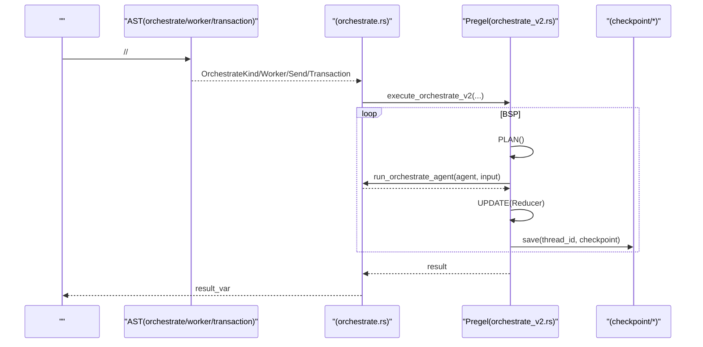
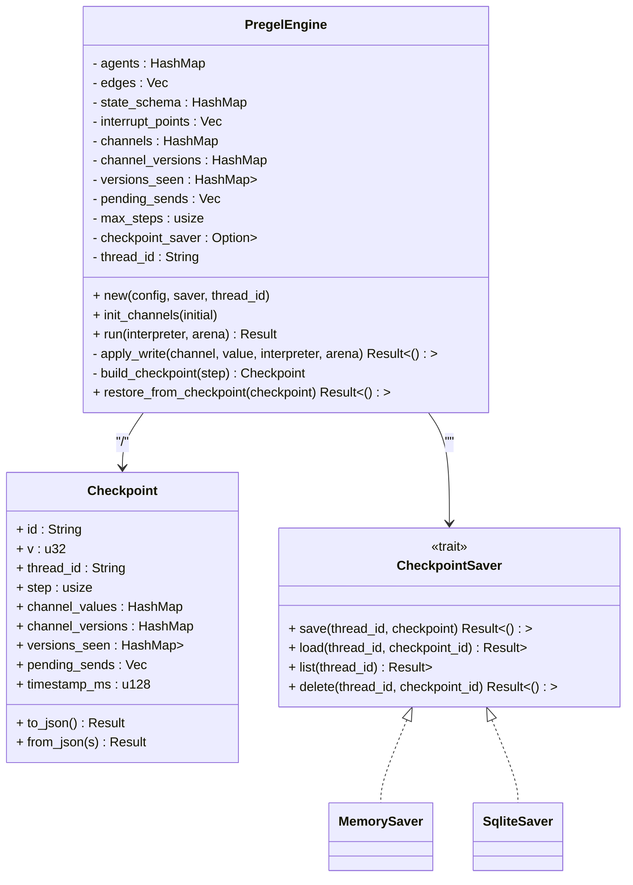
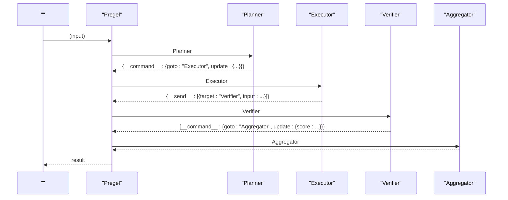
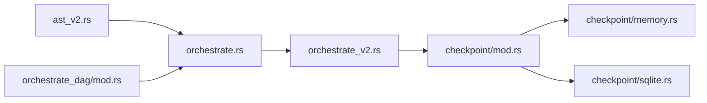

# 

<cite>
****   
- [orchestrate.rs](file://src/interpreter/orchestrate.rs)
- [orchestrate_v2.rs](file://src/interpreter/orchestrate_v2.rs)
- [mod.rsDAG](file://src/orchestrate_dag/mod.rs)
- [mod.rs](file://src/checkpoint/mod.rs)
- [memory.rs](file://src/checkpoint/memory.rs)
- [sqlite.rs](file://src/checkpoint/sqlite.rs)
- [ast_v2.rs](file://src/ast_v2.rs)
</cite>

## 
1. [](#)
2. [](#)
3. [](#)
4. [](#)
5. [](#)
6. [](#)
7. [](#)
8. [](#)
9. [](#)
10. [](#)

## 
 Mora 
- Worker 
- Pregel BSP statenodechannelcheckpoint 
- 
- DAG 
-  Agent LangGraph 
- 
- 

## 

-  v1/v2 
- Pregel BSP v0.50+
- DAG-as-data 
-  SQLite
- AST //

```mermaid
graph TB
subgraph ""
ORCH["orchestrate.rs<br/>Agent"]
ORCH_V2["orchestrate_v2.rs<br/>Pregel BSP "]
end
subgraph ""
AST["ast_v2.rs<br/>Worker/Send/Receive/Transaction/Orchestrate "]
DAG["orchestrate_dag/mod.rs<br/>DAG "]
end
subgraph ""
CKPT_MOD["checkpoint/mod.rs<br/>Checkpoint Saver"]
CKPT_MEM["checkpoint/memory.rs<br/>MemorySaver"]
CKPT_SQL["checkpoint/sqlite.rs<br/>SqliteSaver"]
end
ORCH --> ORCH_V2
ORCH_V2 --> CKPT_MOD
CKPT_MOD --> CKPT_MEM
CKPT_MOD --> CKPT_SQL
AST --> ORCH
AST --> ORCH_V2
DAG --> ORCH
```

****
- [orchestrate.rs:1-133](file://src/interpreter/orchestrate.rs#L1-L133)
- [orchestrate_v2.rs:82-153](file://src/interpreter/orchestrate_v2.rs#L82-L153)
- [mod.rsDAG:1-119](file://src/orchestrate_dag/mod.rs#L1-L119)
- [mod.rs:1-150](file://src/checkpoint/mod.rs#L1-L150)
- [memory.rs:1-84](file://src/checkpoint/memory.rs#L1-L84)
- [sqlite.rs:1-136](file://src/checkpoint/sqlite.rs#L1-L136)
- [ast_v2.rs:339-390](file://src/ast_v2.rs#L339-L390)

****
- [orchestrate.rs:1-133](file://src/interpreter/orchestrate.rs#L1-L133)
- [orchestrate_v2.rs:82-153](file://src/interpreter/orchestrate_v2.rs#L82-L153)
- [mod.rsDAG:1-119](file://src/orchestrate_dag/mod.rs#L1-L119)
- [mod.rs:1-150](file://src/checkpoint/mod.rs#L1-L150)
- [memory.rs:1-84](file://src/checkpoint/memory.rs#L1-L84)
- [sqlite.rs:1-136](file://src/checkpoint/sqlite.rs#L1-L136)
- [ast_v2.rs:339-390](file://src/ast_v2.rs#L339-L390)

## 
-  Agent 
  -  orchestrate  v1Sequential/Graph/Loop v2Pregel/
  -  run_orchestrate_agent with verify 
- Pregel BSP 
  - “”PLAN → EXEC → UPDATE Reducer 
  -  Command Send Interrupt HITLCheckpoint 
- DAG 
  -  DAG-as-data 
- 
  - Checkpoint channelspending_sends  Memory/SQLite 
  -  rewind/resume 

****
- [orchestrate.rs:102-133](file://src/interpreter/orchestrate.rs#L102-L133)
- [orchestrate.rs:277-357](file://src/interpreter/orchestrate.rs#L277-L357)
- [orchestrate_v2.rs:82-153](file://src/interpreter/orchestrate_v2.rs#L82-L153)
- [orchestrate_v2.rs:190-358](file://src/interpreter/orchestrate_v2.rs#L190-L358)
- [mod.rsDAG:23-119](file://src/orchestrate_dag/mod.rs#L23-L119)
- [mod.rs:34-150](file://src/checkpoint/mod.rs#L34-L150)

## 
Mora “AST  +  + BSP  + ” AST  WorkerSend/ReceiveTransactionOrchestrate Pregel



****
- [orchestrate.rs:16-100](file://src/interpreter/orchestrate.rs#L16-L100)
- [orchestrate_v2.rs:190-358](file://src/interpreter/orchestrate_v2.rs#L190-L358)
- [mod.rs:494-510](file://src/checkpoint/mod.rs#L494-L510)

## 

### Worker 
- 
  - Worker
  - Send/Receive
- 
  -  Pregel  channel  Reducer 
- 
  -  Worker 
  -  Receive 
  -  verify 

```mermaid
flowchart TD
Start([""]) --> Spawn[" Worker "]
Spawn --> Parallel[" Worker "]
Parallel --> SendMsg{"?"}
SendMsg --> || Channel[""]
SendMsg --> || NextA[""]
Channel --> NextA
NextA --> Receive{"?"}
Receive --> || Wait[""]
Receive --> || End([""])
Wait --> Merge[""] --> End
```

[]

****
- [ast_v2.rs:339-357](file://src/ast_v2.rs#L339-L357)

### Pregel BSP statenodechannelcheckpoint
- 
  - channels 
  - channel_versions  channel 
  - versions_seen[node][channel] 
- 
  - PLANCommand.goto  pending_sends 
  - EXEC agent writescommandssend_tasks
  - UPDATE state_schema  Reducer  channel 
- 
  - Command JSON  __command__ goto/update/resume
  - Send __send__  active_nodes
- 
  - Interrupt before/after
  - Checkpoint resume  rewind 



****
- [orchestrate_v2.rs:82-153](file://src/interpreter/orchestrate_v2.rs#L82-L153)
- [orchestrate_v2.rs:416-525](file://src/interpreter/orchestrate_v2.rs#L416-L525)
- [mod.rs:34-150](file://src/checkpoint/mod.rs#L34-L150)
- [memory.rs:29-84](file://src/checkpoint/memory.rs#L29-L84)
- [sqlite.rs:51-136](file://src/checkpoint/sqlite.rs#L51-L136)

****
- [orchestrate_v2.rs:82-153](file://src/interpreter/orchestrate_v2.rs#L82-L153)
- [orchestrate_v2.rs:190-358](file://src/interpreter/orchestrate_v2.rs#L190-L358)
- [orchestrate_v2.rs:416-525](file://src/interpreter/orchestrate_v2.rs#L416-L525)
- [mod.rs:34-150](file://src/checkpoint/mod.rs#L34-L150)

### 
- 
  - TransactionCommit Rollback 
  - compensation
- 
  - 
  - 

```mermaid
flowchart TD
TStart[""] --> Body[""]
Body --> CommitCheck{"?"}
CommitCheck --> || Commit[""]
CommitCheck --> || Rollback[""]
Commit --> End([""])
Rollback --> End
```

[]

****
- [ast_v2.rs:353-359](file://src/ast_v2.rs#L353-L359)

### DAG 
- DAG-as-data
  - nodes
  - edges(from, to) 
- 
  - validate
  - topological_orderKahn  BFS O(V+E)
  - has_cycle
- 
  -  Pregel 

```mermaid
flowchart TD
DStart["(nodes, edges)"] --> Validate["validate() "]
Validate --> InDegree[""]
InDegree --> Queue["0"]
Queue --> Loop{"?"}
Loop --> || Pop["n"]
Pop --> Order["order"]
Order --> Reduce["nto"]
Reduce --> Zero{"to==0?"}
Zero --> || Enq["to"]
Zero --> || Loop
Enq --> Loop
Loop --> || Done[""]
Done --> CycleCheck{"order==nodes?"}
CycleCheck --> || Err[""]
CycleCheck --> || Return["order"]
```

****
- [mod.rsDAG:28-119](file://src/orchestrate_dag/mod.rs#L28-L119)

****
- [mod.rsDAG:23-119](file://src/orchestrate_dag/mod.rs#L23-L119)

###  Agent LangGraph 
- 
  - Planner→ Executor→ Verifier→ Aggregator
  -  Command.goto  Send 
  -  state schema  channel  Reducer Append/Merge/Add
- 
  - state
  - nodeAgent 
  - channel
  - checkpoint



[]

### 
- 
  -  UPDATE  saver.save(thread_id, checkpoint)
- 
  - resume channelsversions_seenpending_sends 
  - rewind“”
- 
  - MemorySaver
  - SqliteSaver

```mermaid
flowchart TD
CPStart[""] --> Save[""]
Save --> Resume{"?"}
Resume --> || Load["load(thread_id, id?)"]
Load --> Restore["restore_from_checkpoint()"]
Restore --> Continue[""]
Resume --> || NextStep[""]
NextStep --> Save
```

****
- [orchestrate_v2.rs:494-525](file://src/interpreter/orchestrate_v2.rs#L494-L525)
- [mod.rs:312-346](file://src/checkpoint/mod.rs#L312-L346)
- [memory.rs:29-84](file://src/checkpoint/memory.rs#L29-L84)
- [sqlite.rs:51-136](file://src/checkpoint/sqlite.rs#L51-L136)

****
- [orchestrate_v2.rs:494-525](file://src/interpreter/orchestrate_v2.rs#L494-L525)
- [mod.rs:312-346](file://src/checkpoint/mod.rs#L312-L346)
- [memory.rs:29-84](file://src/checkpoint/memory.rs#L29-L84)
- [sqlite.rs:51-136](file://src/checkpoint/sqlite.rs#L51-L136)

## 
-  AST  OrchestrateKindStateChannelCheckpointConfig  Pregel 
- Pregel 
  - AST OrchestrateAgentOrchestrateEdgeReducerKind 
  - CheckpointSaverMemorySaverSqliteSaver
  - Interpreter.call_value
- DAG  BSP 



****
- [ast_v2.rs:475-526](file://src/ast_v2.rs#L475-L526)
- [orchestrate.rs:16-100](file://src/interpreter/orchestrate.rs#L16-L100)
- [orchestrate_v2.rs:82-153](file://src/interpreter/orchestrate_v2.rs#L82-L153)
- [mod.rs:1-150](file://src/checkpoint/mod.rs#L1-L150)
- [memory.rs:1-84](file://src/checkpoint/memory.rs#L1-L84)
- [sqlite.rs:1-136](file://src/checkpoint/sqlite.rs#L1-L136)
- [mod.rsDAG:1-119](file://src/orchestrate_dag/mod.rs#L1-L119)

****
- [ast_v2.rs:475-526](file://src/ast_v2.rs#L475-L526)
- [orchestrate.rs:16-100](file://src/interpreter/orchestrate.rs#L16-L100)
- [orchestrate_v2.rs:82-153](file://src/interpreter/orchestrate_v2.rs#L82-L153)
- [mod.rs:1-150](file://src/checkpoint/mod.rs#L1-L150)
- [memory.rs:1-84](file://src/checkpoint/memory.rs#L1-L84)
- [sqlite.rs:1-136](file://src/checkpoint/sqlite.rs#L1-L136)
- [mod.rsDAG:1-119](file://src/orchestrate_dag/mod.rs#L1-L119)

## 
- 
  -  1000
- Reducer 
  - Last
  - Append
  - Add
  - Merge
- 
  - Send  active_nodes Send 
- 
  -  I/O  SqliteSaver 
- 
  - versions_seen 

[]

## 
- 
  -  Command.goto  max_steps
  -  feature  sqlite
  -  ID resume  thread_id 
  - Reducer Add Merge 
- 
  - 
  -  rewind 
  -  channels  versions_seen 

****
- [orchestrate_v2.rs:353-358](file://src/interpreter/orchestrate_v2.rs#L353-L358)
- [orchestrate_v2.rs:416-492](file://src/interpreter/orchestrate_v2.rs#L416-L492)
- [orchestrate_v2.rs:513-525](file://src/interpreter/orchestrate_v2.rs#L513-L525)
- [mod.rs:312-346](file://src/checkpoint/mod.rs#L312-L346)

## 
Mora  Worker  Pregel BSP  DAG  Agent  Reducer 

[]

## 
- 
  - state Reducer 
  - nodeAgent 
  - channel
  - checkpoint
- 
  -  Agent [orchestrate.rs](file://src/interpreter/orchestrate.rs)
  - Pregel [orchestrate_v2.rs](file://src/interpreter/orchestrate_v2.rs)
  - DAG [orchestrate_dag/mod.rs](file://src/orchestrate_dag/mod.rs)
  - [checkpoint/mod.rs](file://src/checkpoint/mod.rs)[checkpoint/memory.rs](file://src/checkpoint/memory.rs)[checkpoint/sqlite.rs](file://src/checkpoint/sqlite.rs)
  - AST //[ast_v2.rs](file://src/ast_v2.rs)