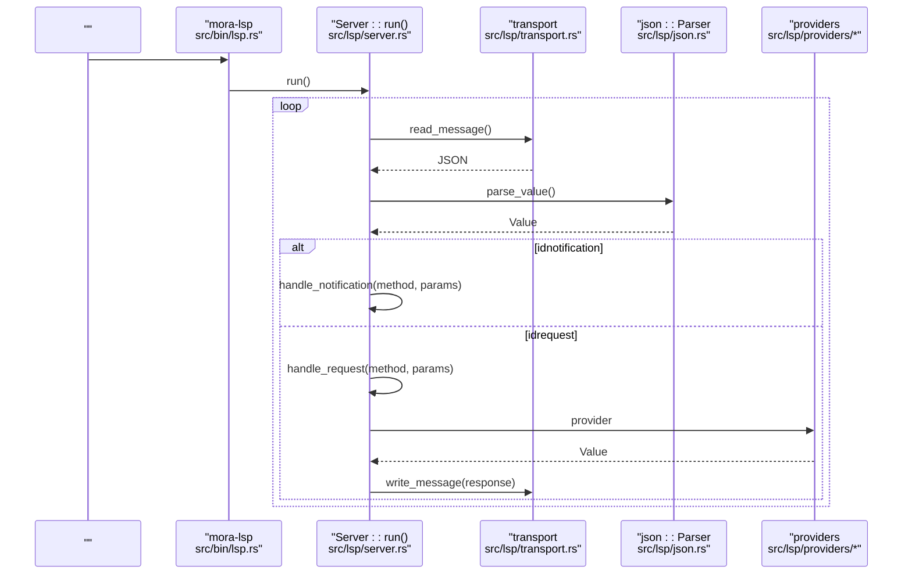
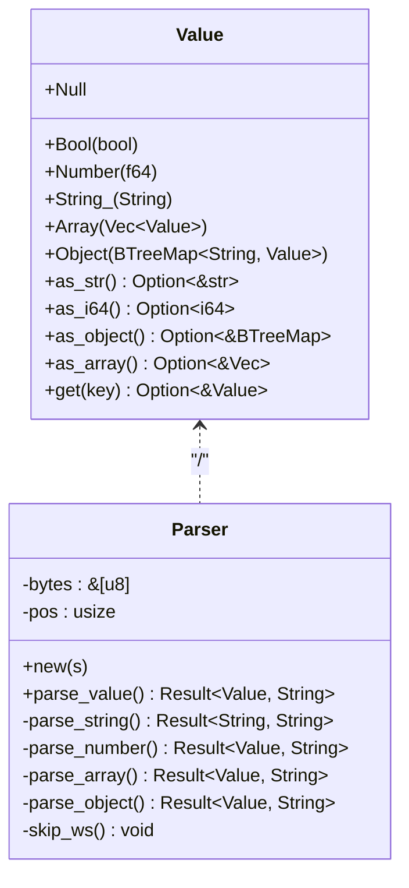
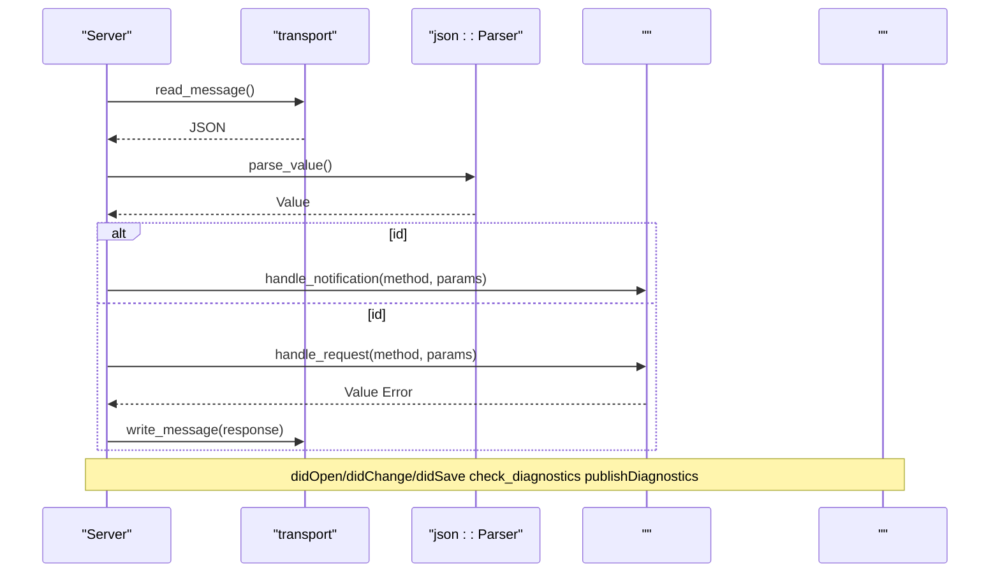
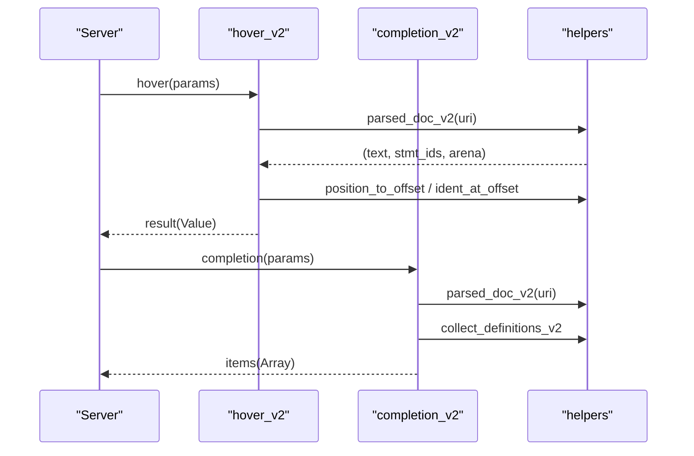
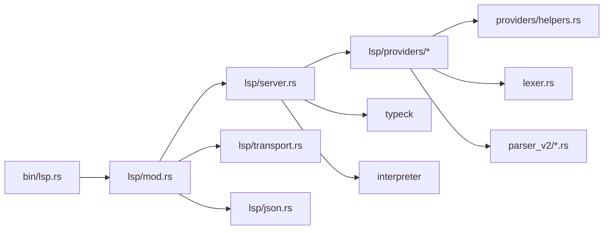

# LSP 

<cite>
****   
- [src/bin/lsp.rs](file://src/bin/lsp.rs)
- [src/lib.rs](file://src/lib.rs)
- [src/lsp/mod.rs](file://src/lsp/mod.rs)
- [src/lsp/server.rs](file://src/lsp/server.rs)
- [src/lsp/transport.rs](file://src/lsp/transport.rs)
- [src/lsp/json.rs](file://src/lsp/json.rs)
- [src/lsp/providers/mod.rs](file://src/lsp/providers/mod.rs)
- [src/lsp/providers/hover.rs](file://src/lsp/providers/hover.rs)
- [src/lsp/providers/completion.rs](file://src/lsp/providers/completion.rs)
- [src/lsp/providers/helpers.rs](file://src/lsp/providers/helpers.rs)
- [README.md](file://README.md)
</cite>

## 
1. [](#)
2. [](#)
3. [](#)
4. [](#)
5. [](#)
6. [](#)
7. [](#)
8. [](#)
9. [](#)
10. [](#)

## 
 Mora LSP 
- JSON-RPC 2.0 over stdin/stdout Content-Length 
- LSP 
-  LSP 
-  JSON Value 
- LSP 
- 

Mora LSP  I/O “ →  JSON →  →  → ”

## 
LSP  src/bin/lsp.rs src/lsp/mod.rs  run() 
- transportJSON-RPC Content-Length 
- json JSON Value + Parser + Serializer
- server
- providers LSP hovercompletiondefinition 

```mermaid
graph TB
A[""] --> B["mora-lsp <br/>src/bin/lsp.rs"]
B --> C["LSP <br/>src/lsp/mod.rs::run()"]
C --> D["<br/>src/lsp/server.rs::Server::run()"]
D --> E["<br/>src/lsp/transport.rs"]
D --> F["JSON /<br/>src/lsp/json.rs"]
D --> G["<br/>src/lsp/server.rs::handle_request()/handle_notification()"]
G --> H["<br/>src/lsp/providers/*"]
```


- [src/bin/lsp.rs:1-25](file://src/bin/lsp.rs#L1-L25)
- [src/lsp/mod.rs:1-23](file://src/lsp/mod.rs#L1-L23)
- [src/lsp/server.rs:58-82](file://src/lsp/server.rs#L58-L82)
- [src/lsp/transport.rs:1-75](file://src/lsp/transport.rs#L1-L75)
- [src/lsp/json.rs:1-40](file://src/lsp/json.rs#L1-L40)
- [src/lsp/providers/mod.rs:1-23](file://src/lsp/providers/mod.rs#L1-L23)


- [src/bin/lsp.rs:1-25](file://src/bin/lsp.rs#L1-L25)
- [src/lsp/mod.rs:1-23](file://src/lsp/mod.rs#L1-L23)
- [README.md:78-83](file://README.md#L78-L83)

## 
- transport
  -  Content-Length  stdin  HTTP  JSON body stdout
  -  Content-Length  body+ flush
- JSON json
  -  Value Null/Bool/Number/String_/Array/Object Parser  Display 
  -  BTreeMap 
- server
  - uri→
  -  →  Value →  handle_notification  handle_request → 
  - initialize  capabilitiestextDocumentSynchoverProvidercompletionProviderdefinitionProviderreferencesProviderdocumentSymbolProviderformatting/rangeFormattingrenamefoldingRangesemanticTokensProvider
  - diagnostics typeck  LSP Diagnostic  textDocument/publishDiagnostics 
- providers
  - hover_v2completion_v2definition_v2references_v2document_symbol_v2formattingrename_v2semantic_tokensfolding_range_v2 
  - helpers 


- [src/lsp/transport.rs:1-75](file://src/lsp/transport.rs#L1-L75)
- [src/lsp/json.rs:18-131](file://src/lsp/json.rs#L18-L131)
- [src/lsp/server.rs:17-82](file://src/lsp/server.rs#L17-L82)
- [src/lsp/server.rs:230-293](file://src/lsp/server.rs#L230-L293)
- [src/lsp/server.rs:373-471](file://src/lsp/server.rs#L373-L471)
- [src/lsp/providers/mod.rs:1-23](file://src/lsp/providers/mod.rs#L1-L23)
- [src/lsp/providers/helpers.rs:1-200](file://src/lsp/providers/helpers.rs#L1-L200)

## 
 LSP  initialize 




- [src/bin/lsp.rs:6-24](file://src/bin/lsp.rs#L6-L24)
- [src/lsp/server.rs:58-106](file://src/lsp/server.rs#L58-L106)
- [src/lsp/transport.rs:14-75](file://src/lsp/transport.rs#L14-L75)
- [src/lsp/json.rs:137-165](file://src/lsp/json.rs#L137-L165)
- [src/lsp/providers/mod.rs:14-22](file://src/lsp/providers/mod.rs#L14-L22)

## 

### JSON-RPC 2.0 Content-Length 
- 
  -  HTTP  UTF-8 JSON body
  - Content-Length: <N> N  body
- 
  -  header 
  -  Content-Length
  -  body String
- 
  -  body  Content-Length  body  flush

```mermaid
flowchart TD
Start([""]) --> ReadHeader["<br/> header "]
ReadHeader --> ParseLen{" Content-Length?"}
ParseLen --> || Err[":  Content-Length"]
ParseLen --> || ReadBody[" body "]
ReadBody --> ToStr["UTF-8 "]
ToStr --> Ok([""])
Err --> End([""])
Ok --> End
```


- [src/lsp/transport.rs:14-67](file://src/lsp/transport.rs#L14-L67)
- [src/lsp/transport.rs:70-75](file://src/lsp/transport.rs#L70-L75)


- [src/lsp/transport.rs:1-75](file://src/lsp/transport.rs#L1-L75)

### JSON  Value 
- Value 
  - NullBoolNumber(f64)String_Array(Vec<Value>)Object(BTreeMap<String, Value>)
  - as_stras_i64as_objectas_arrayget
- 
  -  Display  Value/
  - Object  BTreeMap 
- 
  - Parser  pos 
  - 




- [src/lsp/json.rs:18-64](file://src/lsp/json.rs#L18-L64)
- [src/lsp/json.rs:137-335](file://src/lsp/json.rs#L137-L335)


- [src/lsp/json.rs:18-131](file://src/lsp/json.rs#L18-L131)
- [src/lsp/json.rs:137-335](file://src/lsp/json.rs#L137-L335)

### 
- 
  -  transport::read_message  json::Parser  Value
  -  id  notification  request
  -  exit  shutdown 
- 
  - handle_request  method initializeshutdownhovercompletiondefinitionreferencesdocumentSymbolformatting/rangeFormattingrenamesemanticTokens/fullfoldingRange
  - handle_notification  initializedexittextDocument/didOpen/didChange/didClose/didSave
- 
  -  capabilitiestextDocumentSyncopenClose/change/savehoverProvidercompletionProvidertriggerCharacters: ":"definitionProviderreferencesProviderdocumentSymbolProviderdocumentFormattingProviderdocumentRangeFormattingProviderrenameProviderfoldingRangeProvidersemanticTokensProviderlegend + full
- 
  - check_diagnostics LSP Diagnostic/ 0-basedsource="mora-typeck"
  - publish_diagnostics textDocument/publishDiagnostics 




- [src/lsp/server.rs:58-106](file://src/lsp/server.rs#L58-L106)
- [src/lsp/server.rs:203-225](file://src/lsp/server.rs#L203-L225)
- [src/lsp/server.rs:230-293](file://src/lsp/server.rs#L230-L293)
- [src/lsp/server.rs:373-471](file://src/lsp/server.rs#L373-L471)


- [src/lsp/server.rs:58-106](file://src/lsp/server.rs#L58-L106)
- [src/lsp/server.rs:203-225](file://src/lsp/server.rs#L203-L225)
- [src/lsp/server.rs:230-293](file://src/lsp/server.rs#L230-L293)
- [src/lsp/server.rs:373-471](file://src/lsp/server.rs#L373-L471)

### Hover  Completion 
- Hover
  -  params  textDocument.uri  position AST let/task  Markdown 
- Completion
  -  completion items




- [src/lsp/providers/hover.rs:11-79](file://src/lsp/providers/hover.rs#L11-L79)
- [src/lsp/providers/completion.rs:7-74](file://src/lsp/providers/completion.rs#L7-L74)
- [src/lsp/providers/helpers.rs:93-132](file://src/lsp/providers/helpers.rs#L93-L132)


- [src/lsp/providers/hover.rs:1-84](file://src/lsp/providers/hover.rs#L1-L84)
- [src/lsp/providers/completion.rs:1-79](file://src/lsp/providers/completion.rs#L1-L79)
- [src/lsp/providers/helpers.rs:1-200](file://src/lsp/providers/helpers.rs#L1-L200)

## 
- 
  - bin/lsp.rs  CLI  lsp::run()
  - lsp::mod.rs  transportjsonserverproviders
  - server  transport  json providers
  - providers  helpers  AST lexer/parser_v2/ast_v2
- 
  -  iocollectionssync::Mutex
  - interpretertypecklexerparser_v2ast_v2
- 
  -  I/O 
  - 




- [src/bin/lsp.rs:6-24](file://src/bin/lsp.rs#L6-L24)
- [src/lsp/mod.rs:11-22](file://src/lsp/mod.rs#L11-L22)
- [src/lsp/server.rs:10-16](file://src/lsp/server.rs#L10-L16)
- [src/lsp/providers/mod.rs:1-23](file://src/lsp/providers/mod.rs#L1-L23)


- [src/lib.rs:1-55](file://src/lib.rs#L1-L55)
- [src/lsp/mod.rs:11-22](file://src/lsp/mod.rs#L11-L22)

## 
- 
  -  BufReader write_message  flush IO
- JSON 
  -  BTreeMap  HashMap LSP 
  - 
- 
  - 
- 
  - didOpen/didChange/didSave 
- 
  - docs  Mutex<HashMap>

[]

## 
- 
  -  Content-Length
  - JSON  parser  JSON
  -  methodhandle_request  -32603 LSP 
  - hover/completion  textDocument.uri 
- 
  -  textDocument/publishDiagnostics source  "mora-typeck"
  -  didOpen/didChange/didSave params  LSP 
- 
  -  stderr  fatal exit 


- [src/lsp/transport.rs:52-60](file://src/lsp/transport.rs#L52-L60)
- [src/lsp/server.rs:65-72](file://src/lsp/server.rs#L65-L72)
- [src/lsp/server.rs:203-225](file://src/lsp/server.rs#L203-L225)
- [src/lsp/server.rs:108-201](file://src/lsp/server.rs#L108-L201)

## 
Mora LSP  LSP  JSON-RPC  JSON  LSP 

[]

## 

### LSP 
- initialize  capabilities 
  - textDocumentSyncopenClosechangesave
  - hoverProvider
  - completionProvidertriggerCharacters = [":"]
  - definitionProvider
  - referencesProvider
  - documentSymbolProvider
  - documentFormattingProvider
  - documentRangeFormattingProvider
  - renameProvider
  - foldingRangeProvider
  - semanticTokensProviderlegendtokenTypes/tokenModifiers+ full


- [src/lsp/server.rs:230-293](file://src/lsp/server.rs#L230-L293)

### 
-  mora-lsp 
- stdin/stdout
- JSON-RPC 2.0 + LSP Content-Length  + UTF-8 JSON body
-  initialize  capabilities initialized 


- [src/bin/lsp.rs:6-24](file://src/bin/lsp.rs#L6-L24)
- [README.md:78-83](file://README.md#L78-L83)
- [src/lsp/transport.rs:1-75](file://src/lsp/transport.rs#L1-L75)