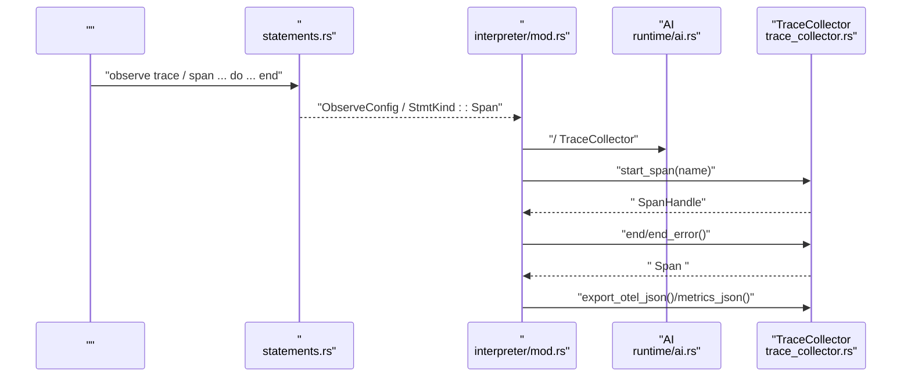
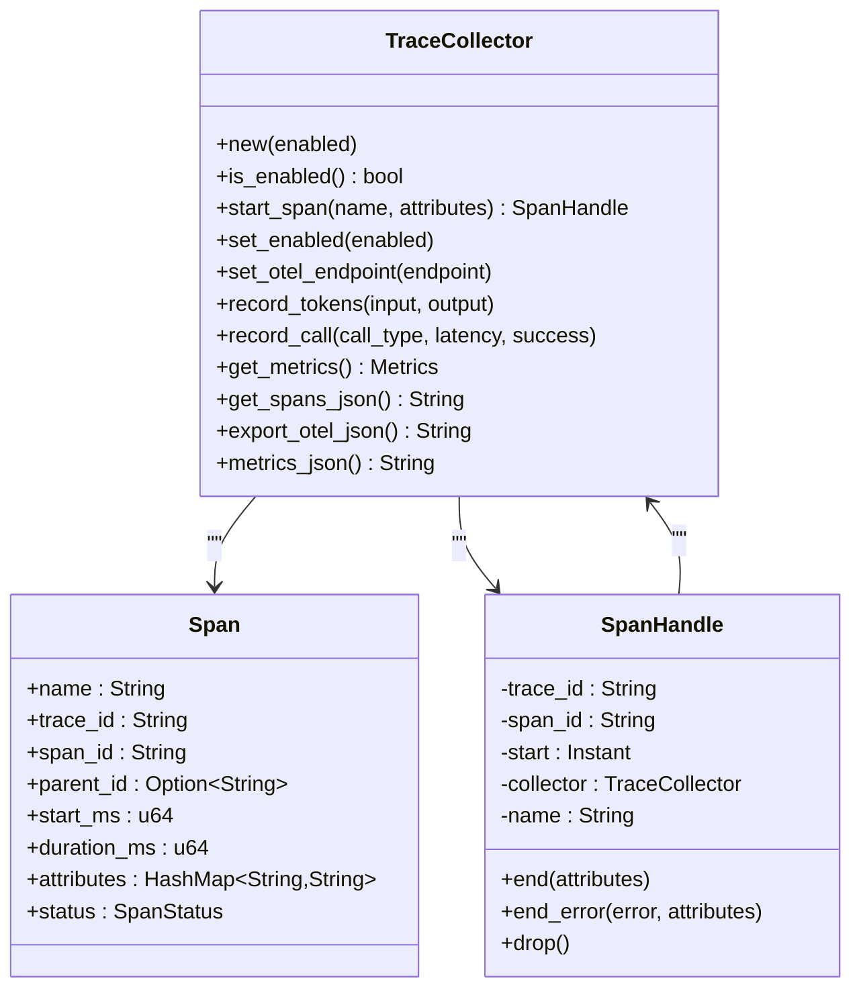
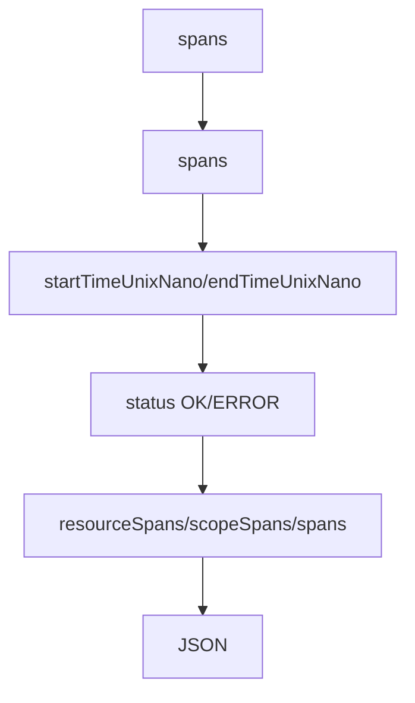
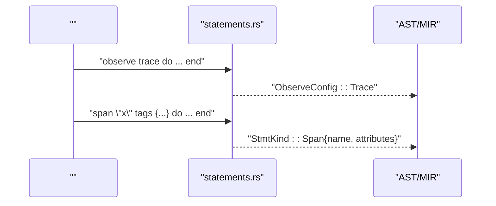
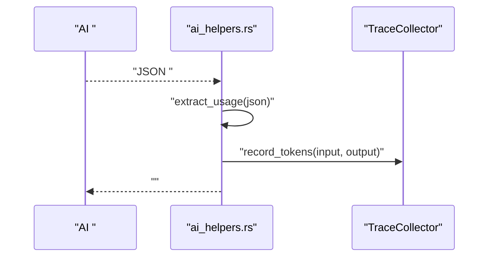
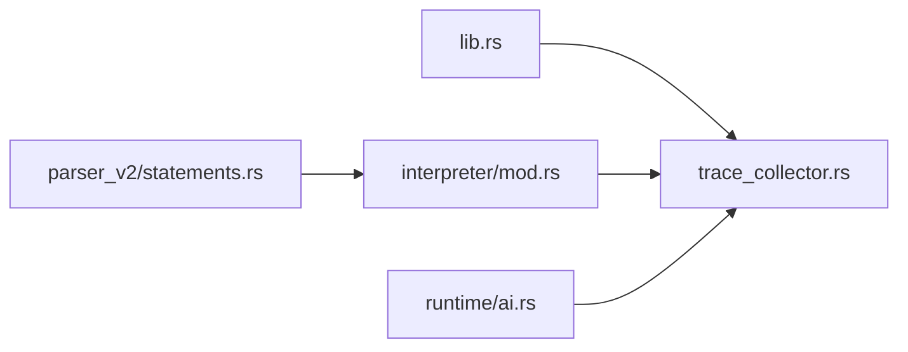

# Trace 

<cite>
****   
- [trace_collector.rs](file://src/trace_collector.rs)
- [interpreter/mod.rs](file://src/interpreter/mod.rs)
- [runtime/ai.rs](file://src/runtime/ai.rs)
- [parser_v2/statements.rs](file://src/parser_v2/statements.rs)
- [observe_demo.mora](file://examples/_legacy/observe_demo.mora)
- [ai_helpers.rs](file://src/interpreter/ai_helpers.rs)
- [lib.rs](file://src/lib.rs)
</cite>

## 
1. [](#)
2. [](#)
3. [](#)
4. [](#)
5. [](#)
6. [](#)
7. [](#)
8. [](#)
9. [](#)
10. [](#)

## 
 Mora  Trace 
- Span  SpanHandle  RAII 
-  trace_id  span_id 
- OpenTelemetry 
- 
- AI 
- / OTEL endpoint 

## 
Trace  src/trace_collector.rs observe/span  parser_v2/statements.rs 

```mermaid
graph TB
subgraph ""
OBS["observe/span <br/>observe_demo.mora"]
PARSER["<br/>parser_v2/statements.rs"]
end
subgraph ""
INTERP["<br/>interpreter/mod.rs"]
RUNTIME_AI["AI <br/>runtime/ai.rs"]
AI_HELPERS["AI <br/>interpreter/ai_helpers.rs"]
end
subgraph ""
COLLECTOR["TraceCollector + Span/SpanHandle<br/>trace_collector.rs"]
end
OBS --> PARSER
PARSER --> INTERP
INTERP --> RUNTIME_AI
RUNTIME_AI --> COLLECTOR
AI_HELPERS --> COLLECTOR
```


- [observe_demo.mora:1-24](file://examples/_legacy/observe_demo.mora#L1-L24)
- [parser_v2/statements.rs:1639-1694](file://src/parser_v2/statements.rs#L1639-L1694)
- [interpreter/mod.rs:621-623](file://src/interpreter/mod.rs#L621-L623)
- [runtime/ai.rs:19,32,50:19-19](file://src/runtime/ai.rs#L19-L19)
- [trace_collector.rs:47-71](file://src/trace_collector.rs#L47-L71)


- [trace_collector.rs:1-71](file://src/trace_collector.rs#L1-L71)
- [interpreter/mod.rs:621-623](file://src/interpreter/mod.rs#L621-L623)
- [runtime/ai.rs:19,32,50:19-19](file://src/runtime/ai.rs#L19-L19)
- [parser_v2/statements.rs:1639-1694](file://src/parser_v2/statements.rs#L1639-L1694)
- [observe_demo.mora:1-24](file://examples/_legacy/observe_demo.mora#L1-L24)

## 
- Spantrace_idspan_id span_id
- SpanStatus
- MetricsToken 
- TraceCollector/ Span Token  JSON  OTEL 
- SpanHandleRAII  collector Drop 


- [trace_collector.rs:12-44](file://src/trace_collector.rs#L12-L44)
- [trace_collector.rs:47-71](file://src/trace_collector.rs#L47-L71)
- [trace_collector.rs:224-252](file://src/trace_collector.rs#L224-L252)

## 
 observe/span  AST/MIR  SpanHandle Span  OTEL 




- [parser_v2/statements.rs:1639-1694](file://src/parser_v2/statements.rs#L1639-L1694)
- [interpreter/mod.rs:621-623](file://src/interpreter/mod.rs#L621-L623)
- [trace_collector.rs:77-136](file://src/trace_collector.rs#L77-L136)
- [trace_collector.rs:189-221](file://src/trace_collector.rs#L189-L221)

## 

### Span  SpanHandle RAII
- SpanHandle  collector  end/end_error 
- Drop 
- start_span  ID 




- [trace_collector.rs:47-71](file://src/trace_collector.rs#L47-L71)
- [trace_collector.rs:12-29](file://src/trace_collector.rs#L12-L29)
- [trace_collector.rs:224-252](file://src/trace_collector.rs#L224-L252)


- [trace_collector.rs:77-136](file://src/trace_collector.rs#L77-L136)
- [trace_collector.rs:224-252](file://src/trace_collector.rs#L224-L252)

### trace_id  span_id 
-  span  "span_N"/"trace_N" 
- / ID + ID 

```mermaid
flowchart TD
Start([" start_span"]) --> CheckEnabled{"?"}
CheckEnabled --> || ReturnEmpty[" ID "]
CheckEnabled --> || IncCounter[""]
IncCounter --> GenIds[" span_id  trace_id"]
GenIds --> ReturnHandle[" SpanHandle"]
```


- [trace_collector.rs:77-99](file://src/trace_collector.rs#L77-L99)


- [trace_collector.rs:77-99](file://src/trace_collector.rs#L77-L99)

### OpenTelemetry 
- export_otel_json spans  resourceSpans/scopeSpans/spans  JSON nametraceIdspanIdstartTimeUnixNanoendTimeUnixNanostatus.code
- metrics_jsonToken 
- set_otel_endpoint OTEL endpoint 




- [trace_collector.rs:189-204](file://src/trace_collector.rs#L189-L204)
- [trace_collector.rs:206-221](file://src/trace_collector.rs#L206-L221)
- [trace_collector.rs:107-111](file://src/trace_collector.rs#L107-L111)


- [trace_collector.rs:189-221](file://src/trace_collector.rs#L189-L221)

### 
- record_call call_type ai.chatai.streamtoolmemory
- record_tokens/ token 
- get_metrics/metrics_json JSON 

```mermaid
flowchart TD
S(["record_call"]) --> IncTotal["total_calls++"]
IncTotal --> Classify{"call_type"}
Classify --> |ai.chat| IncChat["ai_chat_calls++"]
Classify --> |ai.stream| IncStream["ai_stream_calls++"]
Classify --> |tool| IncTool["tool_calls++"]
Classify --> |memory| IncMem["memory_operations++"]
IncChat --> UpdateLatency["latency_sum_ms += ms"]
IncStream --> UpdateLatency
IncTool --> UpdateLatency
IncMem --> UpdateLatency
UpdateLatency --> Avg["avg_latency_ms = sum/total"]
Avg --> ErrorCheck{"success == false ?"}
ErrorCheck --> || ErrInc["total_errors++"]
ErrorCheck --> || End([""])
ErrInc --> End
```


- [trace_collector.rs:145-162](file://src/trace_collector.rs#L145-L162)


- [trace_collector.rs:138-167](file://src/trace_collector.rs#L138-L167)

### observe  span 
- observe trace/do...end/
- span "name" tags {...} do...end
-  observe/span  ObserveConfig  StmtKind::Span




- [parser_v2/statements.rs:1639-1694](file://src/parser_v2/statements.rs#L1639-L1694)
- [parser_v2/statements.rs:1696-1731](file://src/parser_v2/statements.rs#L1696-L1731)


- [parser_v2/statements.rs:1639-1694](file://src/parser_v2/statements.rs#L1639-L1694)
- [parser_v2/statements.rs:1696-1731](file://src/parser_v2/statements.rs#L1696-L1731)

### AI  Token 
- AI  API  usage token  TraceCollector.record_tokens
- 




- [ai_helpers.rs:107-162](file://src/interpreter/ai_helpers.rs#L107-L162)
- [trace_collector.rs:138-143](file://src/trace_collector.rs#L138-L143)


- [ai_helpers.rs:107-162](file://src/interpreter/ai_helpers.rs#L107-L162)
- [trace_collector.rs:138-143](file://src/trace_collector.rs#L138-L143)

## 
-  runtime/ai.rs  TraceCollector
-  observe/span 
- lib.rs  trace_collector 




- [lib.rs:51](file://src/lib.rs#L51)
- [interpreter/mod.rs:621-623](file://src/interpreter/mod.rs#L621-L623)
- [runtime/ai.rs:19,32,50:19-19](file://src/runtime/ai.rs#L19-L19)
- [parser_v2/statements.rs:1639-1694](file://src/parser_v2/statements.rs#L1639-L1694)


- [lib.rs:51](file://src/lib.rs#L51)
- [interpreter/mod.rs:621-623](file://src/interpreter/mod.rs#L621-L623)
- [runtime/ai.rs:19,32,50:19-19](file://src/runtime/ai.rs#L19-L19)
- [parser_v2/statements.rs:1639-1694](file://src/parser_v2/statements.rs#L1639-L1694)

## 
- start_span  ID 
- TraceCollector  Arc<Mutex<>>
- token  Mutex 
- spans  Vec 

[]

## 
-  span 
  -  observe trace  set_trace_enabled(true) 
  -  span  end/end_error 
- OTEL 
  -  export_otel_json  spans
  -  otel_endpoint endpoint
- 
  -  record_call  record_tokens 
  -  total_calls > 0 


- [trace_collector.rs:77-136](file://src/trace_collector.rs#L77-L136)
- [trace_collector.rs:189-221](file://src/trace_collector.rs#L189-L221)
- [interpreter/mod.rs:621-623](file://src/interpreter/mod.rs#L621-L623)

## 
Mora  Trace  Span  OTEL  observe/span  RAII  ID 

[]

## 

### /
-  observe trace do ... end 
-  set_trace_enabled(true/false) 


- [observe_demo.mora:5-7](file://examples/_legacy/observe_demo.mora#L5-L7)
- [interpreter/mod.rs:621-623](file://src/interpreter/mod.rs#L621-L623)

###  Span 
-  span "name" tags {...} do ... end 
-  StmtKind::Span SpanHandle 


- [observe_demo.mora:10-21](file://examples/_legacy/observe_demo.mora#L10-L21)
- [parser_v2/statements.rs:1696-1731](file://src/parser_v2/statements.rs#L1696-L1731)

###  OTEL endpoint
-  TraceCollector.set_otel_endpoint("http://...") 
-  export_otel_json()  OTEL  JSON 


- [trace_collector.rs:107-111](file://src/trace_collector.rs#L107-L111)
- [trace_collector.rs:189-204](file://src/trace_collector.rs#L189-L204)

### AI  Token 
- AI  usage record_tokens 
-  metrics_json()  token 


- [ai_helpers.rs:107-162](file://src/interpreter/ai_helpers.rs#L107-L162)
- [trace_collector.rs:206-221](file://src/trace_collector.rs#L206-L221)