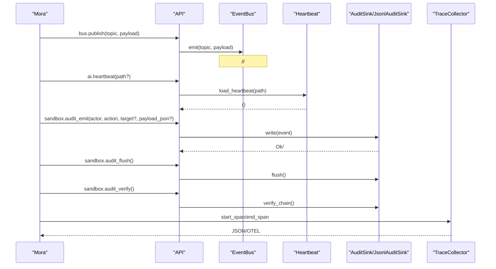
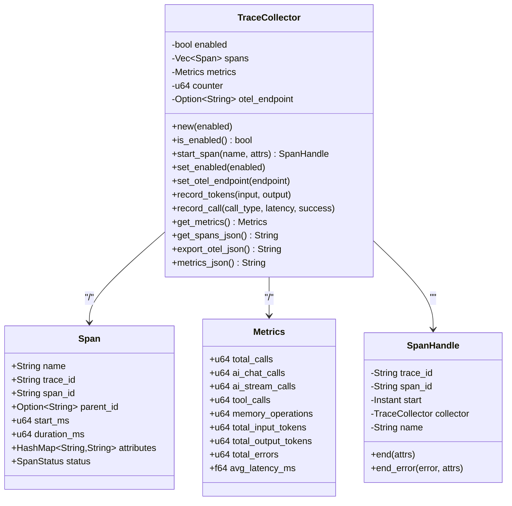
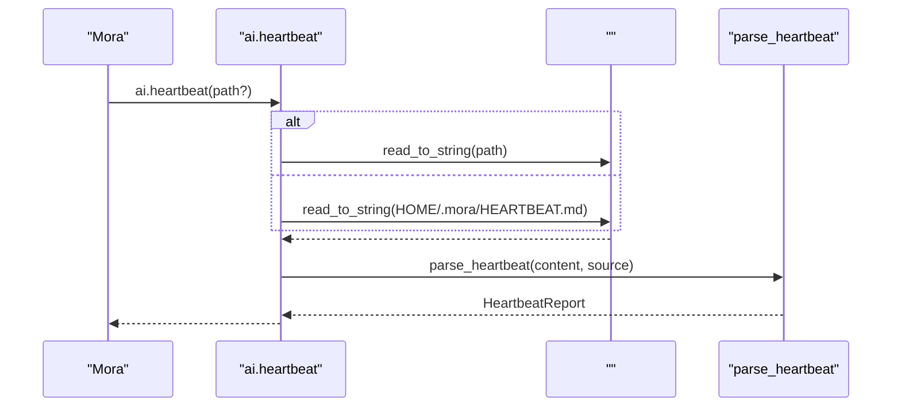
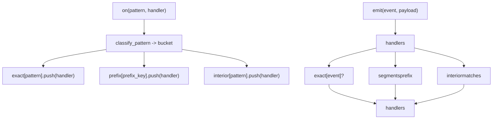
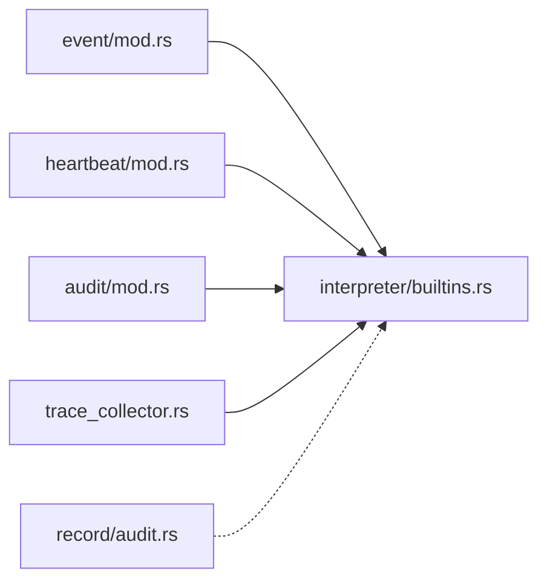

# 

<cite>
****   
- [trace_collector.rs](file://src/trace_collector.rs)
- [audit/mod.rs](file://src/audit/mod.rs)
- [heartbeat/mod.rs](file://src/heartbeat/mod.rs)
- [event/mod.rs](file://src/event/mod.rs)
- [interpreter/builtins.rs](file://src/interpreter/builtins.rs)
- [record/audit.rs](file://src/record/audit.rs)
</cite>

## 
1. [](#)
2. [](#)
3. [](#)
4. [](#)
5. [](#)
6. [](#)
7. [](#)
8. [](#)
9. [](#)
10. [](#)

## 
 Mora 
- Trace  OpenTelemetry SpanMetricsJSON 
-  JSONL + SHA-256 
-  HEARTBEAT.md 
-  O(segments) 
-  API  bus.publishheartbeatsandbox.audit_* 
- 

## 

- trace_collector.rsTrace  Metrics 
- audit/mod.rsSink JSONL 
- heartbeat/mod.rsHEARTBEAT.md 
- event/mod.rs EventBus
- interpreter/builtins.rs
- record/audit.rs

```mermaid
graph TB
subgraph ""
TC["TraceCollector<br/>span/metrics/json"]
AUD["AuditSink/JsonlAuditSink<br/>JSONL+SHA-256"]
HB["Heartbeat<br/>HEARTBEAT.md"]
EV["EventBus<br/>/O(segments)"]
end
INT["Interpreter Builtins<br/>bus.publish / heartbeat / sandbox.audit_*"]
REC["Record Audit<br/>/"]
INT --> TC
INT --> AUD
INT --> HB
INT --> EV
REC -.-> INT
```


- [trace_collector.rs:1-269](file://src/trace_collector.rs#L1-L269)
- [audit/mod.rs:1-721](file://src/audit/mod.rs#L1-L721)
- [heartbeat/mod.rs:1-215](file://src/heartbeat/mod.rs#L1-L215)
- [event/mod.rs:1-691](file://src/event/mod.rs#L1-L691)
- [interpreter/builtins.rs:305-331](file://src/interpreter/builtins.rs#L305-L331)
- [record/audit.rs:1-193](file://src/record/audit.rs#L1-L193)


- [trace_collector.rs:1-269](file://src/trace_collector.rs#L1-L269)
- [audit/mod.rs:1-721](file://src/audit/mod.rs#L1-L721)
- [heartbeat/mod.rs:1-215](file://src/heartbeat/mod.rs#L1-L215)
- [event/mod.rs:1-691](file://src/event/mod.rs#L1-L691)
- [interpreter/builtins.rs:305-331](file://src/interpreter/builtins.rs#L305-L331)
- [record/audit.rs:1-193](file://src/record/audit.rs#L1-L193)

## 
- TraceCollector Span JSON/OTEL 
- AuditSink/JsonlAuditSink// JSONL  prev_hash  self.hash
- Heartbeat HEARTBEAT.md
- EventBusemit  O(segments) 
- Interpreter Builtins bus.publishheartbeatsandbox.audit_emit/flush/verify 
- Record Audit


- [trace_collector.rs:1-269](file://src/trace_collector.rs#L1-L269)
- [audit/mod.rs:1-721](file://src/audit/mod.rs#L1-L721)
- [heartbeat/mod.rs:1-215](file://src/heartbeat/mod.rs#L1-L215)
- [event/mod.rs:1-691](file://src/event/mod.rs#L1-L691)
- [interpreter/builtins.rs:305-331](file://src/interpreter/builtins.rs#L305-L331)
- [record/audit.rs:1-193](file://src/record/audit.rs#L1-L193)

## 
 JSONL Trace  Metrics  JSON 




- [interpreter/builtins.rs:305-331](file://src/interpreter/builtins.rs#L305-L331)
- [event/mod.rs:119-168](file://src/event/mod.rs#L119-L168)
- [heartbeat/mod.rs:94-99](file://src/heartbeat/mod.rs#L94-L99)
- [audit/mod.rs:274-385](file://src/audit/mod.rs#L274-L385)
- [trace_collector.rs:77-136](file://src/trace_collector.rs#L77-L136)

## 

### Trace 
- Span trace_idspan_idID
- AI // token
- / OTEL endpoint token  spans JSON  OTEL JSON
- RAII SpanHandle  drop  end/end_error




- [trace_collector.rs:12-58](file://src/trace_collector.rs#L12-L58)
- [trace_collector.rs:60-136](file://src/trace_collector.rs#L60-L136)
- [trace_collector.rs:224-252](file://src/trace_collector.rs#L224-L252)


- [trace_collector.rs:1-269](file://src/trace_collector.rs#L1-L269)

### 
- payload tokenprev_hashhash
- Sink write/flush/verify_chain/event_count
- JsonlAuditSink
  -  JSON ts/actor/action/target/payload/token/prev/hash
  - prev_hash  hash genesis 
  -  last_hash
  - verify_chain  hash 
- NullSink

```mermaid
flowchart TD
Start([""]) --> SetPrev[" prev_hash = last_hash"]
SetPrev --> Seal[" self.hash = SHA-256(canonical_bytes + prev_hash)"]
Seal --> Serialize[" JSON ( prev/hash)"]
Serialize --> Append[" JSONL "]
Append --> UpdateState[" last_hash "]
UpdateState --> End([""])
VerifyStart([""]) --> Flush[""]
Flush --> ReadFile[""]
ReadFile --> CheckPrev{"prev ?"}
CheckPrev --> || ChainBroken[""]
CheckPrev --> || ReSeal[" hash"]
ReSeal --> MatchHash{"computed == stored?"}
MatchHash --> || HashMismatch[""]
MatchHash --> || NextLine[""]
NextLine --> ReadFile
```


- [audit/mod.rs:274-385](file://src/audit/mod.rs#L274-L385)
- [audit/mod.rs:387-480](file://src/audit/mod.rs#L387-L480)


- [audit/mod.rs:1-721](file://src/audit/mod.rs#L1-L721)

### 
-  HEARTBEAT.md  Markdown - [ ]/- [x]
-  load_heartbeat 
-  ai.heartbeat(path?) total/done/pending/completion_ratio/is_complete/items




- [heartbeat/mod.rs:74-99](file://src/heartbeat/mod.rs#L74-L99)
- [interpreter/builtins.rs:1008-1022](file://src/interpreter/builtins.rs#L1008-L1022)


- [heartbeat/mod.rs:1-215](file://src/heartbeat/mod.rs#L1-L215)
- [interpreter/builtins.rs:1008-1022](file://src/interpreter/builtins.rs#L1008-L1022)

### 
-  on(pattern, handler) exact/prefix/interior 
- emit(event, payload)  handlers
- 
  - O(1) HashMap 
  - O(segments)  segments  prefix 
  -  interior  matches 
-  bus.subscribe/bus.publish 




- [event/mod.rs:79-108](file://src/event/mod.rs#L79-L108)
- [event/mod.rs:119-168](file://src/event/mod.rs#L119-L168)
- [event/mod.rs:230-253](file://src/event/mod.rs#L230-L253)
- [event/mod.rs:263-302](file://src/event/mod.rs#L263-L302)
- [interpreter/builtins.rs:312-327](file://src/interpreter/builtins.rs#L312-L327)


- [event/mod.rs:1-691](file://src/event/mod.rs#L1-L691)
- [interpreter/builtins.rs:305-331](file://src/interpreter/builtins.rs#L305-L331)

###  API 
- bus.subscribe(pattern) pattern 
- bus.publish(topic, payload) handlers pattern 
- ai.heartbeat(path?)
- sandbox.audit_emit/audit_flush/audit_verify


- [interpreter/builtins.rs:305-331](file://src/interpreter/builtins.rs#L305-L331)
- [interpreter/builtins.rs:1008-1022](file://src/interpreter/builtins.rs#L1008-L1022)
- [audit/mod.rs:274-385](file://src/audit/mod.rs#L274-L385)

### 
- redact_secrets sk-/key-/Bearer 
- audit_recording .moraignore 


- [record/audit.rs:1-193](file://src/record/audit.rs#L1-L193)

## 
- TraceCollector 
- AuditSink/JsonlAuditSink  I/O  SHA-256 
- Heartbeat  I/O 
- EventBus  Value  RwLock 
- Interpreter builtins 




- [event/mod.rs:1-691](file://src/event/mod.rs#L1-L691)
- [heartbeat/mod.rs:1-215](file://src/heartbeat/mod.rs#L1-L215)
- [audit/mod.rs:1-721](file://src/audit/mod.rs#L1-L721)
- [trace_collector.rs:1-269](file://src/trace_collector.rs#L1-L269)
- [interpreter/builtins.rs:305-331](file://src/interpreter/builtins.rs#L305-L331)
- [record/audit.rs:1-193](file://src/record/audit.rs#L1-L193)


- [event/mod.rs:1-691](file://src/event/mod.rs#L1-L691)
- [heartbeat/mod.rs:1-215](file://src/heartbeat/mod.rs#L1-L215)
- [audit/mod.rs:1-721](file://src/audit/mod.rs#L1-L721)
- [trace_collector.rs:1-269](file://src/trace_collector.rs#L1-L269)
- [interpreter/builtins.rs:305-331](file://src/interpreter/builtins.rs#L305-L331)
- [record/audit.rs:1-193](file://src/record/audit.rs#L1-L193)

## 
- TraceCollector
  -  token 
  - JSON 
- AuditSink
  -  BufWriter verify_chain 
- Heartbeat
  -  I/O 
- EventBus
  - v0.41  O(segments)  emit snapshot-and-drop 

[]

## 
- TraceCollector
  -  get_spans_json/export_otel_json  is_enabled  set_enabled 
  -  metrics_json  record_call/record_tokens 
- AuditSink
  - verify_chain  ChainBroken/HashMismatch 
  -  last_hash  read_tail_hash 
- Heartbeat
  -  ai.heartbeat  HOME/.mora/HEARTBEAT.md
- EventBus
  -  publish  handler pattern exact/prefix/interior
  -  snapshot handler  emit 
- Record Audit
  -  .moraignore 


- [trace_collector.rs:73-111](file://src/trace_collector.rs#L73-L111)
- [audit/mod.rs:333-385](file://src/audit/mod.rs#L333-L385)
- [heartbeat/mod.rs:94-99](file://src/heartbeat/mod.rs#L94-L99)
- [event/mod.rs:119-168](file://src/event/mod.rs#L119-L168)
- [record/audit.rs:91-108](file://src/record/audit.rs#L91-L108)

## 
Mora 
- Trace  Metrics  OpenTelemetry 
-  JSONL + SHA-256 
- 
-  API 
- 

[]

## 

### 
- TraceCollector
  - /set_enabled(true/false)
  - OTEL set_otel_endpoint("http://collector:4318/v1/traces")
  - record_call("ai.chat"/"ai.stream"/"tool"/"memory", Duration, success)
  -  Tokenrecord_tokens(input, output)
  - get_spans_json()/export_otel_json()/metrics_json()
- AuditSink
  - JsonlAuditSink::new(path)  new_fresh(path)
  - audit_emit(actor, action, target?, payload_json?)
  - audit_flush()
  - audit_verify()
- Heartbeat
  - ai.heartbeat(path?)path  HOME/.mora/HEARTBEAT.md
- EventBus
  - bus.subscribe(pattern)
  - bus.publish(topic, payload)


- [trace_collector.rs:101-111](file://src/trace_collector.rs#L101-L111)
- [trace_collector.rs:138-167](file://src/trace_collector.rs#L138-L167)
- [trace_collector.rs:169-221](file://src/trace_collector.rs#L169-L221)
- [audit/mod.rs:222-272](file://src/audit/mod.rs#L222-L272)
- [audit/mod.rs:274-331](file://src/audit/mod.rs#L274-L331)
- [audit/mod.rs:333-385](file://src/audit/mod.rs#L333-L385)
- [interpreter/builtins.rs:305-331](file://src/interpreter/builtins.rs#L305-L331)
- [interpreter/builtins.rs:1008-1022](file://src/interpreter/builtins.rs#L1008-L1022)

### 
- 
  -  metrics_json()  Prometheus/Grafana  total_callsavg_latency_mstotal_errorstoken 
- 
  -  export_otel_json()  Jaeger/Tempo/OpenTelemetry Collector
- 
  -  JSONL  ELK/Opensearch 
- 
  -  ai.heartbeat 

[]

### 
-  total_errors 
- avg_latency_ms  SLA 
- Token total_input_tokens/total_output_tokens 
- verify_chain  ChainBroken/HashMismatch
- is_complete=false 

[]