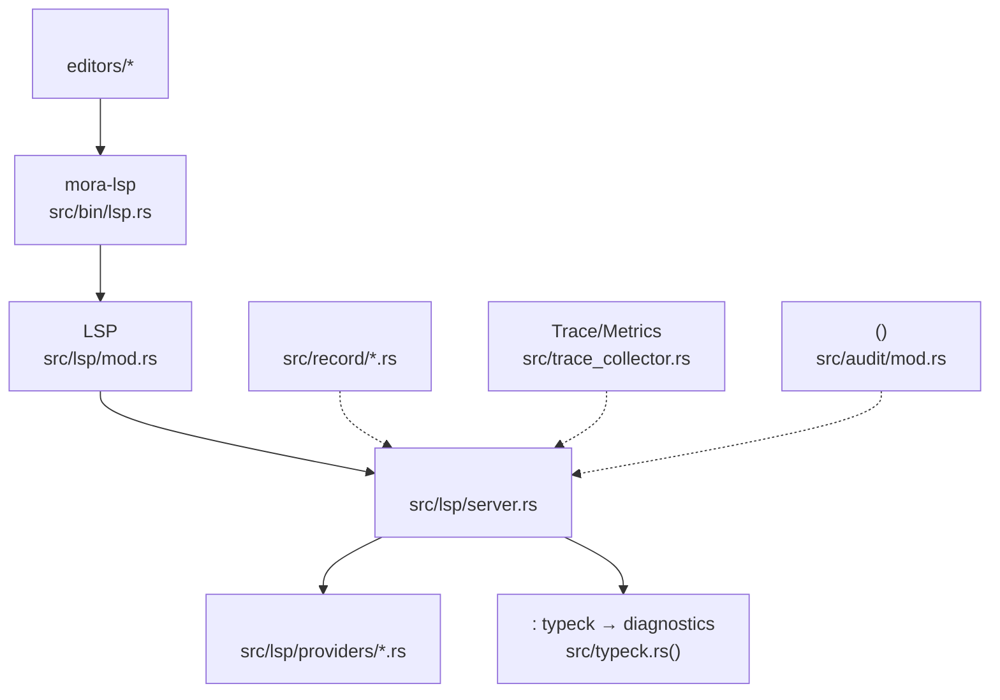
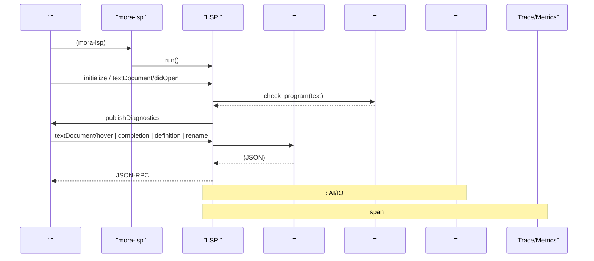
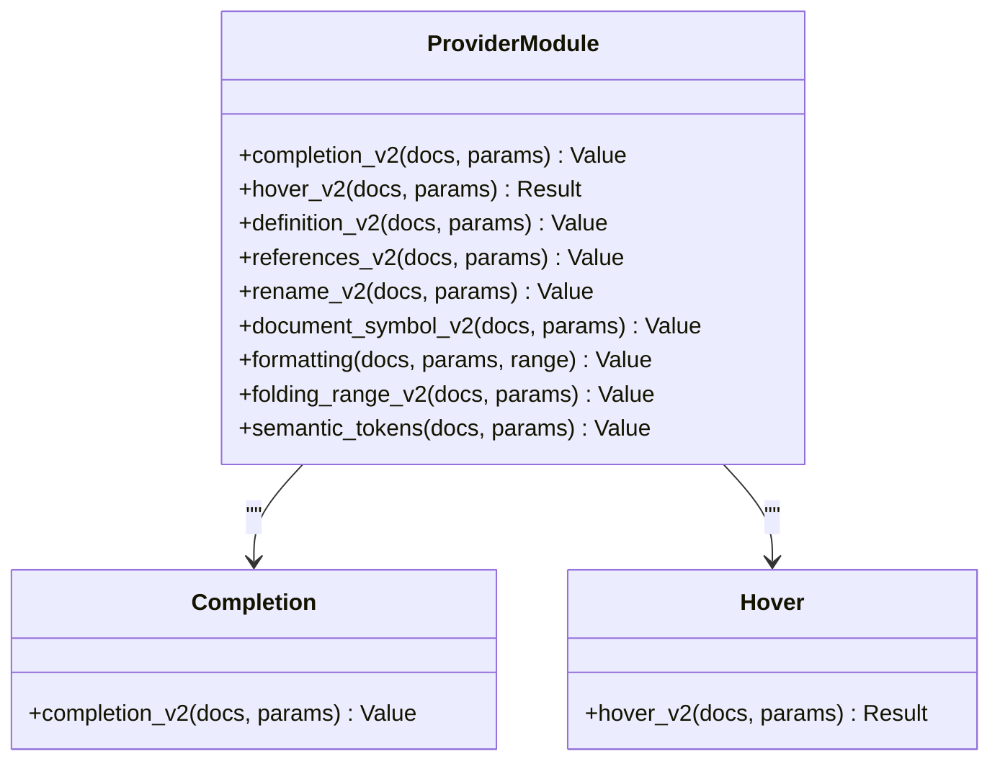
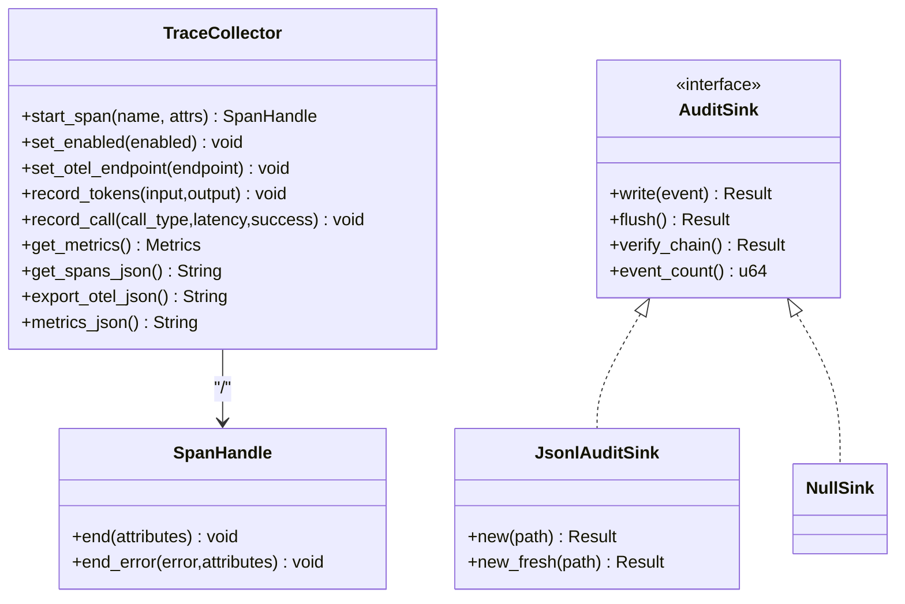
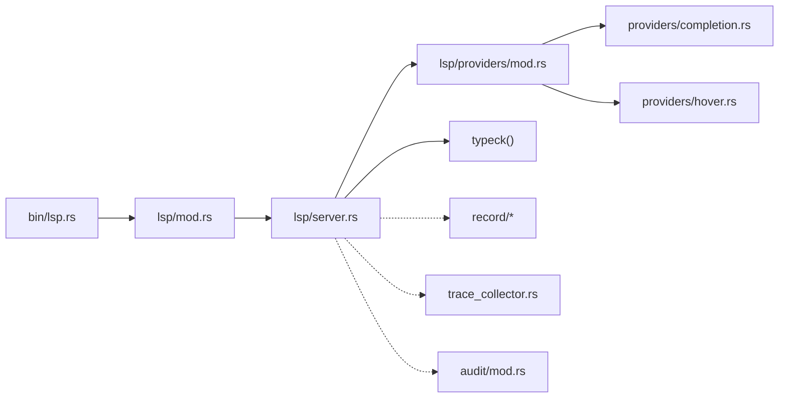

# 

<cite>
****   
- [README.md](file://README.md)
- [bin/lsp.rs](file://src/bin/lsp.rs)
- [lsp/mod.rs](file://src/lsp/mod.rs)
- [lsp/server.rs](file://src/lsp/server.rs)
- [lsp/providers/mod.rs](file://src/lsp/providers/mod.rs)
- [lsp/providers/completion.rs](file://src/lsp/providers/completion.rs)
- [lsp/providers/hover.rs](file://src/lsp/providers/hover.rs)
- [record/mod.rs](file://src/record/mod.rs)
- [record/analysis.rs](file://src/record/analysis.rs)
- [record/snapshot.rs](file://src/record/snapshot.rs)
- [trace_collector.rs](file://src/trace_collector.rs)
- [audit/mod.rs](file://src/audit/mod.rs)
- [editors/vscode/package.json](file://editors/vscode/package.json)
- [editors/neovim/README.md](file://editors/neovim/README.md)
- [editors/emacs/mora-mode.el](file://editors/emacs/mora-mode.el)
</cite>

## 
1. [](#)
2. [](#)
3. [](#)
4. [](#)
5. [](#)
6. [](#)
7. [](#)
8. [](#)
9. [](#)
10. [](#)

## 
 Mora 
- LSP JSON-RPC 
- 
- AI 
- TraceMetrics 
- VSCodeNeovimEmacs 
- 

## 
Mora “ → LSP  → ”




- [bin/lsp.rs:1-25](file://src/bin/lsp.rs#L1-L25)
- [lsp/mod.rs:1-23](file://src/lsp/mod.rs#L1-L23)
- [lsp/server.rs:1-120](file://src/lsp/server.rs#L1-L120)
- [lsp/providers/mod.rs:1-23](file://src/lsp/providers/mod.rs#L1-L23)
- [record/mod.rs:1-60](file://src/record/mod.rs#L1-L60)
- [trace_collector.rs:1-60](file://src/trace_collector.rs#L1-L60)
- [audit/mod.rs:1-60](file://src/audit/mod.rs#L1-L60)


- [README.md:276-338](file://README.md#L276-L338)
- [bin/lsp.rs:1-25](file://src/bin/lsp.rs#L1-L25)
- [lsp/mod.rs:1-23](file://src/lsp/mod.rs#L1-L23)
- [lsp/server.rs:1-120](file://src/lsp/server.rs#L1-L120)
- [lsp/providers/mod.rs:1-23](file://src/lsp/providers/mod.rs#L1-L23)

## 
- LSP  LSP 
- LSP / JSON-RPC 
-  hovercompletiondefinitionrenamesemanticTokensfoldingRangedocumentSymbolformatting 
-  AI/HTTP 
-  Trace/Metrics  OpenTelemetry JSON 
-  SHA-256  JSONL 


- [bin/lsp.rs:1-25](file://src/bin/lsp.rs#L1-L25)
- [lsp/mod.rs:1-23](file://src/lsp/mod.rs#L1-L23)
- [lsp/server.rs:1-120](file://src/lsp/server.rs#L1-L120)
- [lsp/providers/mod.rs:1-23](file://src/lsp/providers/mod.rs#L1-L23)
- [record/mod.rs:1-120](file://src/record/mod.rs#L1-L120)
- [trace_collector.rs:1-120](file://src/trace_collector.rs#L1-L120)
- [audit/mod.rs:1-120](file://src/audit/mod.rs#L1-L120)

## 
 LSP 




- [bin/lsp.rs:1-25](file://src/bin/lsp.rs#L1-L25)
- [lsp/server.rs:58-120](file://src/lsp/server.rs#L58-L120)
- [lsp/server.rs:203-225](file://src/lsp/server.rs#L203-L225)
- [lsp/server.rs:373-415](file://src/lsp/server.rs#L373-L415)
- [lsp/providers/mod.rs:1-23](file://src/lsp/providers/mod.rs#L1-L23)
- [record/mod.rs:108-161](file://src/record/mod.rs#L108-L161)
- [trace_collector.rs:77-100](file://src/trace_collector.rs#L77-L100)

## 

### LSP JSON-RPC 
-  --version/--help LSP 
-  JSON-RPC  →  Value →  request/notification → 
-  uri→++diagnostics didOpen/didChange/didSave 
-  textDocumentSynchovercompletiondefinitionreferencesdocumentSymbolformatting/rangeFormattingrenamesemanticTokensfoldingRange
-  typeck  LSP Diagnostic publishDiagnostics 

```mermaid
flowchart TD
Start([" JSON-RPC "]) --> Parse[" Value"]
Parse --> HasId{" id?"}
HasId --> || Notification["handle_notification(method,params)"]
HasId --> || Request["handle_request(method,params)"]
Notification --> DidOpen{"textDocument/didOpen?"}
DidOpen --> || Recheck["check_diagnostics(text)"]
Recheck --> Publish["publishDiagnostics(uri, diags)"]
DidOpen --> || OtherNotif["(/)"]
Request --> Route[" method  handler"]
Route --> Providers[" providers::*_v2(...)"]
Providers --> Response["send_response(id,result|error)"]
Publish --> End([""])
Response --> End
```


- [bin/lsp.rs:1-25](file://src/bin/lsp.rs#L1-L25)
- [lsp/mod.rs:16-23](file://src/lsp/mod.rs#L16-L23)
- [lsp/server.rs:58-106](file://src/lsp/server.rs#L58-L106)
- [lsp/server.rs:108-201](file://src/lsp/server.rs#L108-L201)
- [lsp/server.rs:203-225](file://src/lsp/server.rs#L203-L225)
- [lsp/server.rs:373-415](file://src/lsp/server.rs#L373-L415)
- [lsp/server.rs:417-500](file://src/lsp/server.rs#L417-L500)


- [bin/lsp.rs:1-25](file://src/bin/lsp.rs#L1-L25)
- [lsp/mod.rs:1-23](file://src/lsp/mod.rs#L1-L23)
- [lsp/server.rs:1-120](file://src/lsp/server.rs#L1-L120)
- [lsp/server.rs:203-225](file://src/lsp/server.rs#L203-L225)
- [lsp/server.rs:373-415](file://src/lsp/server.rs#L373-L415)
- [lsp/server.rs:417-500](file://src/lsp/server.rs#L417-L500)

### 
- completion_v2 AST/
- hover_v2 let/task  Markdown 
- definition_v2references_v2rename_v2document_symbol_v2formattingfolding_range_v2semantic_tokens providers 




- [lsp/providers/mod.rs:1-23](file://src/lsp/providers/mod.rs#L1-L23)
- [lsp/providers/completion.rs:1-79](file://src/lsp/providers/completion.rs#L1-L79)
- [lsp/providers/hover.rs:1-84](file://src/lsp/providers/hover.rs#L1-L84)


- [lsp/providers/mod.rs:1-23](file://src/lsp/providers/mod.rs#L1-L23)
- [lsp/providers/completion.rs:1-79](file://src/lsp/providers/completion.rs#L1-L79)
- [lsp/providers/hover.rs:1-84](file://src/lsp/providers/hover.rs#L1-L84)

### AI 
- Off/Record/Replay JSONL JSONL 
- ai.chatweb.fetchnotetoken 
-  (kind,key) key  ai.chat  model+prompt_hash web.fetch  url
- token  timeline 
-  baselinediff  Match/CountMismatch/EventChanged/Added/Missing

```mermaid
flowchart TD
A[""] --> M{"Mode"}
M --> |Off| N[""]
M --> |Record| R["(events)"]
M --> |Replay| P[" JSONL (index)"]
R --> Save["save():  JSONL()"]
P --> Lookup["lookup_ai_chat/web_fetch(key)"]
Lookup --> ReturnResp[" RecordedResponse"]
Save --> End([""])
ReturnResp --> End
```


- [record/mod.rs:40-60](file://src/record/mod.rs#L40-L60)
- [record/mod.rs:108-161](file://src/record/mod.rs#L108-L161)
- [record/mod.rs:179-204](file://src/record/mod.rs#L179-L204)
- [record/mod.rs:206-236](file://src/record/mod.rs#L206-L236)
- [record/analysis.rs:94-158](file://src/record/analysis.rs#L94-L158)
- [record/analysis.rs:172-237](file://src/record/analysis.rs#L172-L237)
- [record/snapshot.rs:153-160](file://src/record/snapshot.rs#L153-L160)
- [record/snapshot.rs:250-284](file://src/record/snapshot.rs#L250-L284)


- [record/mod.rs:1-120](file://src/record/mod.rs#L1-L120)
- [record/mod.rs:179-236](file://src/record/mod.rs#L179-L236)
- [record/analysis.rs:94-158](file://src/record/analysis.rs#L94-L158)
- [record/analysis.rs:172-237](file://src/record/analysis.rs#L172-L237)
- [record/snapshot.rs:153-160](file://src/record/snapshot.rs#L153-L160)
- [record/snapshot.rs:250-284](file://src/record/snapshot.rs#L250-L284)

### TraceMetrics 
- Trace/Metrics RAII  SpanHandle durationtoken  OTel JSON 
- SHA-256  JSONL prev_hash  self.hash verify_chain NullSink 




- [trace_collector.rs:46-120](file://src/trace_collector.rs#L46-L120)
- [trace_collector.rs:138-222](file://src/trace_collector.rs#L138-L222)
- [trace_collector.rs:224-252](file://src/trace_collector.rs#L224-L252)
- [audit/mod.rs:141-151](file://src/audit/mod.rs#L141-L151)
- [audit/mod.rs:210-272](file://src/audit/mod.rs#L210-L272)
- [audit/mod.rs:486-509](file://src/audit/mod.rs#L486-L509)


- [trace_collector.rs:1-120](file://src/trace_collector.rs#L1-L120)
- [trace_collector.rs:138-222](file://src/trace_collector.rs#L138-L222)
- [audit/mod.rs:141-151](file://src/audit/mod.rs#L141-L151)
- [audit/mod.rs:210-272](file://src/audit/mod.rs#L210-L272)
- [audit/mod.rs:486-509](file://src/audit/mod.rs#L486-L509)

### 
- VS Code
  - mora.languageServer.pathargsnoTypeCheck
  -  TextMate LSP  mora-lsp 
- Neovim
  -  Lua  init.lua  gd/gr/K/Ctrl-Space/rename/format 
  -  Neovim  start_client 
- Emacs
  -  major mode lsp-mode 


- [editors/vscode/package.json:1-72](file://editors/vscode/package.json#L1-L72)
- [editors/neovim/README.md:1-71](file://editors/neovim/README.md#L1-L71)
- [editors/emacs/mora-mode.el:1-51](file://editors/emacs/mora-mode.el#L1-L51)

## 
-  LSP 
- LSP  providers 
- 
- 




- [bin/lsp.rs:1-25](file://src/bin/lsp.rs#L1-L25)
- [lsp/mod.rs:1-23](file://src/lsp/mod.rs#L1-L23)
- [lsp/server.rs:1-120](file://src/lsp/server.rs#L1-L120)
- [lsp/providers/mod.rs:1-23](file://src/lsp/providers/mod.rs#L1-L23)
- [lsp/providers/completion.rs:1-79](file://src/lsp/providers/completion.rs#L1-L79)
- [lsp/providers/hover.rs:1-84](file://src/lsp/providers/hover.rs#L1-L84)
- [record/mod.rs:1-60](file://src/record/mod.rs#L1-L60)
- [trace_collector.rs:1-60](file://src/trace_collector.rs#L1-L60)
- [audit/mod.rs:1-60](file://src/audit/mod.rs#L1-L60)


- [bin/lsp.rs:1-25](file://src/bin/lsp.rs#L1-L25)
- [lsp/mod.rs:1-23](file://src/lsp/mod.rs#L1-L23)
- [lsp/server.rs:1-120](file://src/lsp/server.rs#L1-L120)
- [lsp/providers/mod.rs:1-23](file://src/lsp/providers/mod.rs#L1-L23)

## 
- LSP 
-  didOpen/didChange/didSave 
-  O(1) CI 
- Trace/Metrics OTel JSON 
-  I/O 

[]

## 
- LSP 
  -  mora-lsp  PATH 
  -  LSP  initialize  capabilities 
- 
  -  didOpen/didChange 
  -  typeck  LSP Diagnostic 
- /
  -  ast_v2
  -  completion/hover /Markdown
- 
  -  prompt_hash  key 
  -  JSONL 
- 
  -  verify_chain  hash 
  -  flush 


- [lsp/server.rs:108-201](file://src/lsp/server.rs#L108-L201)
- [lsp/server.rs:373-415](file://src/lsp/server.rs#L373-L415)
- [lsp/providers/completion.rs:1-79](file://src/lsp/providers/completion.rs#L1-L79)
- [lsp/providers/hover.rs:1-84](file://src/lsp/providers/hover.rs#L1-L84)
- [record/mod.rs:179-236](file://src/record/mod.rs#L179-L236)
- [audit/mod.rs:333-377](file://src/audit/mod.rs#L333-L377)

## 
Mora  LSP  AI  JSON-RPC 

[]

## 
-  LSP smoke 
-  MORA_NO_TYPECK 
-  CI


- [README.md:276-338](file://README.md#L276-L338)