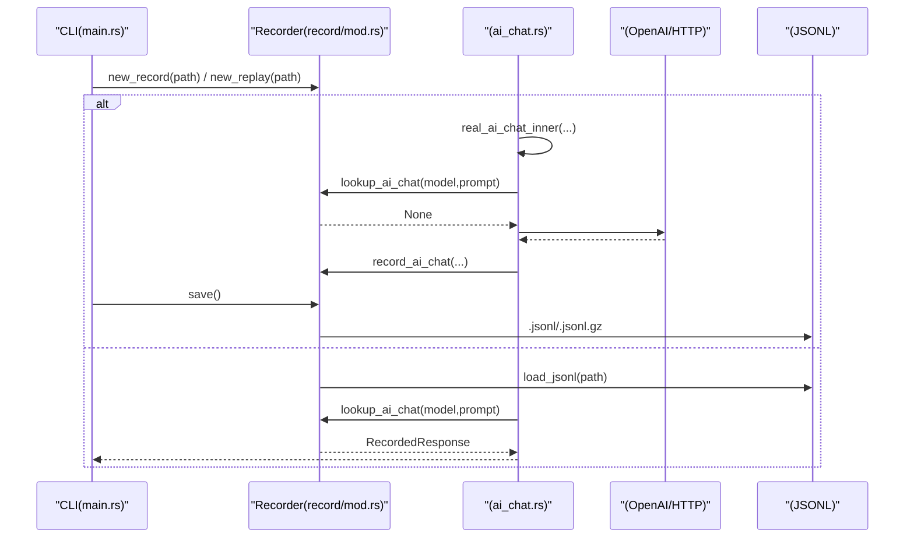
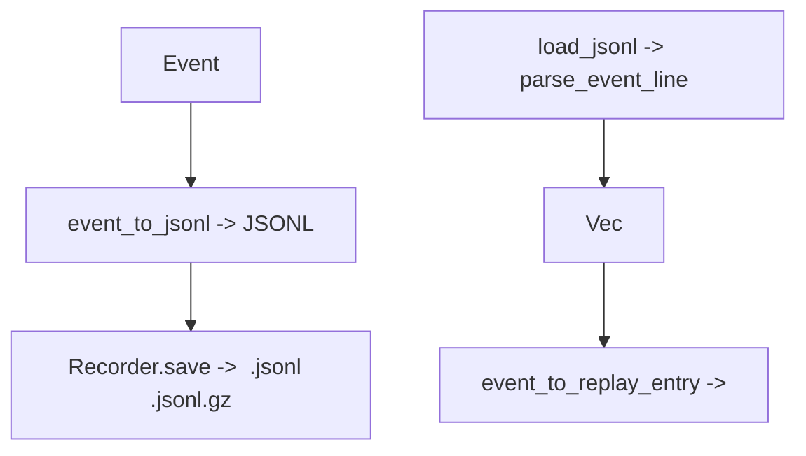
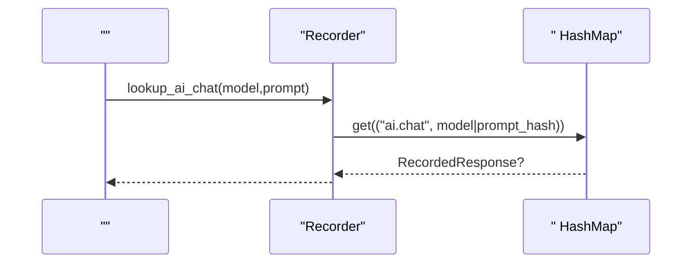
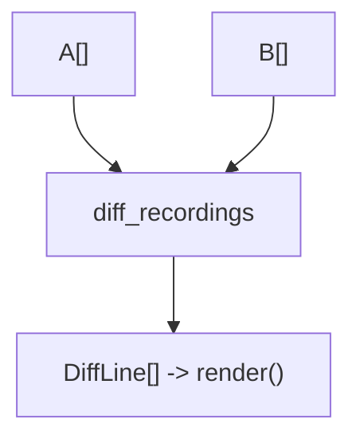
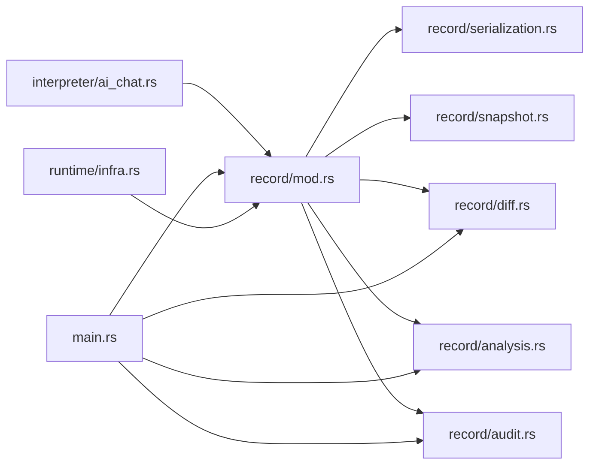

# 

<cite>
****   
- [src/record/mod.rs](file://src/record/mod.rs)
- [src/record/serialization.rs](file://src/record/serialization.rs)
- [src/record/snapshot.rs](file://src/record/snapshot.rs)
- [src/record/diff.rs](file://src/record/diff.rs)
- [src/record/analysis.rs](file://src/record/analysis.rs)
- [src/record/audit.rs](file://src/record/audit.rs)
- [src/interpreter/ai_chat.rs](file://src/interpreter/ai_chat.rs)
- [src/runtime/infra.rs](file://src/runtime/infra.rs)
- [src/main.rs](file://src/main.rs)
</cite>

## 
1. [](#)
2. [](#)
3. [](#)
4. [](#)
5. [](#)
6. [](#)
7. [](#)
8. [](#)
9. [](#)
10. [](#)

## 
 Mora “//”
- AI  JSONL 
- 
- 
- 
- 
- 

“ + JSONL  + ” AI ai.chat HTTP web.fetch

## 
 record 
- record/mod.rs
- /record/serialization.rs
- record/snapshot.rs
- record/diff.rs
- record/analysis.rs
- record/audit.rs
- interpreter/ai_chat.rs
- Recorder /runtime/infra.rs
- CLI main.rs

```mermaid
graph TB
subgraph "CLI"
M["main.rs"]
end
subgraph "Record "
R["record/mod.rs"]
S["record/serialization.rs"]
SN["record/snapshot.rs"]
D["record/diff.rs"]
A["record/analysis.rs"]
AU["record/audit.rs"]
end
subgraph ""
I["interpreter/ai_chat.rs"]
end
subgraph ""
INF["runtime/infra.rs"]
end
M --> R
M --> A
M --> D
M --> AU
I --> R
R --> S
R --> SN
R --> D
R --> A
R --> AU
INF --> R
```


- [src/main.rs:102-200](file://src/main.rs#L102-L200)
- [src/record/mod.rs:1-120](file://src/record/mod.rs#L1-L120)
- [src/interpreter/ai_chat.rs:142-212](file://src/interpreter/ai_chat.rs#L142-L212)
- [src/runtime/infra.rs:66-75](file://src/runtime/infra.rs#L66-L75)


- [src/main.rs:102-200](file://src/main.rs#L102-L200)
- [src/record/mod.rs:1-120](file://src/record/mod.rs#L1-L120)

## 
-  ModeOff / Record(PathBuf) / Replay(PathBuf)
-  EventAiChat / WebFetch / NoteJSONL 
-  Recorder events next_idreplay  save/loadlookup_ai_chat/lookup_web_fetch
-  serialization JSONL prompt hash.jsonl.gz
-  snapshot JSONLdiff 
-  diff Identical/Changed/OnlyInA/OnlyInB
-  analysisJSONL/Markdown
-  audit.moraignore 


- [src/record/mod.rs:24-117](file://src/record/mod.rs#L24-L117)
- [src/record/serialization.rs:1-120](file://src/record/serialization.rs#L1-L120)
- [src/record/snapshot.rs:103-176](file://src/record/snapshot.rs#L103-L176)
- [src/record/diff.rs:1-92](file://src/record/diff.rs#L1-L92)
- [src/record/analysis.rs:77-158](file://src/record/analysis.rs#L77-L158)
- [src/record/audit.rs:1-69](file://src/record/audit.rs#L1-L69)

## 

-  ai.chat/web.fetch  Recorder.events flush  JSONL
- Recorder  JSONL  (kind, key) → RecordedResponse AI/HTTP 
- 




- [src/interpreter/ai_chat.rs:152-212](file://src/interpreter/ai_chat.rs#L152-L212)
- [src/record/mod.rs:147-204](file://src/record/mod.rs#L147-L204)
- [src/record/serialization.rs:156-181](file://src/record/serialization.rs#L156-L181)
- [src/record/mod.rs:206-236](file://src/record/mod.rs#L206-L236)

## 

### Recorder
- new_off/new_record/new_replay  Off/Record/Replay 
- record_ai_chat/record_web_fetch/record_note  Record 
- new_replay  JSONLevent_to_replay_entry  (kind,key)→RecordedResponse 
- lookup_ai_chat  model+prompt_hash  keylookup_web_fetch  url  key
- save  events  JSONL .gz  gzip 

```mermaid
classDiagram
class Recorder {
-mode : Mode
-events : Vec<Event>
-next_id : u64
-index : HashMap<(String,String), RecordedResponse>
+new_off() Self
+new_record(path) Result<Self,String>
+new_replay(path) Result<Self,String>
+mode() &Mode
+events() &[Event]
+now_ms() u128
+record(event) void
+lookup_ai_chat(model,prompt) Option<RecordedResponse>
+lookup_web_fetch(url) Option<RecordedResponse>
+save() Result<(),String>
+next_event_id() u64
+record_ai_chat(...)
+record_web_fetch(...)
+record_note(...)
}
class Mode {
<<enum>>
Off
Record(PathBuf)
Replay(PathBuf)
}
class Event {
<<enum>>
AiChat{...}
WebFetch{...}
Note{...}
}
class RecordedResponse {
+response : String
+tokens_in : usize
+tokens_out : usize
+latency_ms : u128
+status : Option<u16>
+body_len : Option<usize>
}
Recorder --> Mode : ""
Recorder --> Event : ""
Recorder --> RecordedResponse : ""
```


- [src/record/mod.rs:40-117](file://src/record/mod.rs#L40-L117)
- [src/record/mod.rs:119-204](file://src/record/mod.rs#L119-L204)
- [src/record/mod.rs:206-314](file://src/record/mod.rs#L206-L314)


- [src/record/mod.rs:40-117](file://src/record/mod.rs#L40-L117)
- [src/record/mod.rs:119-204](file://src/record/mod.rs#L119-L204)
- [src/record/mod.rs:206-314](file://src/record/mod.rs#L206-L314)

### 
- ai.chat real_ai_chat  lookup_ai_chat record_ai_chat token 
- web.fetch real_web_fetch  lookup_web_fetch GET  record_web_fetch  URL
-  HTTP  2xx  error 

```mermaid
flowchart TD
Start([" ai.chat/web.fetch"]) --> CheckReplay{"?"}
CheckReplay --> || ReturnMock[" RecordedResponse"]
CheckReplay --> || DoCall[""]
DoCall --> OnSuccess{"?"}
OnSuccess --> || RecordEv["record_ai_chat/record_web_fetch"]
OnSuccess --> || RecordErr["record_*  error "]
RecordEv --> End([""])
RecordErr --> End
ReturnMock --> End
```


- [src/interpreter/ai_chat.rs:152-212](file://src/interpreter/ai_chat.rs#L152-L212)
- [src/interpreter/ai_chat.rs:59-140](file://src/interpreter/ai_chat.rs#L59-L140)
- [src/record/mod.rs:187-204](file://src/record/mod.rs#L187-L204)


- [src/interpreter/ai_chat.rs:152-212](file://src/interpreter/ai_chat.rs#L152-L212)
- [src/interpreter/ai_chat.rs:59-140](file://src/interpreter/ai_chat.rs#L59-L140)

### JSONL /
-  JSONLevent_to_jsonl  Event  JSON kind/id/ts_ms 
- prompt hash_prompt  ai.chat 
- load_jsonl parse_event_line  Event
- save  gzip 




- [src/record/serialization.rs:13-97](file://src/record/serialization.rs#L13-L97)
- [src/record/serialization.rs:156-181](file://src/record/serialization.rs#L156-L181)
- [src/record/serialization.rs:99-154](file://src/record/serialization.rs#L99-L154)
- [src/record/mod.rs:206-236](file://src/record/mod.rs#L206-L236)


- [src/record/serialization.rs:1-120](file://src/record/serialization.rs#L1-L120)
- [src/record/serialization.rs:156-181](file://src/record/serialization.rs#L156-L181)
- [src/record/mod.rs:206-236](file://src/record/mod.rs#L206-L236)

### 
- ai.chat  model+prompt_hashweb.fetch  url
- new_replay event_to_replay_entry 
-  RecordedResponse




- [src/record/mod.rs:147-204](file://src/record/mod.rs#L147-L204)
- [src/record/serialization.rs:99-154](file://src/record/serialization.rs#L99-L154)


- [src/record/mod.rs:147-204](file://src/record/mod.rs#L147-L204)
- [src/record/serialization.rs:99-154](file://src/record/serialization.rs#L99-L154)

### 
- event_to_summary  kind/key/tokens/error 
- create_snapshot(name, events)  SnapshotBaseline
- snapshot_to_jsonl/snapshot_from_jsonl 
- diff_snapshot  Match/CountMismatch/EventChanged/EventAdded/EventMissing

```mermaid
flowchart TD
Evt[""] --> Summ["event_to_summary -> EventSummary[]"]
Summ --> Snap["create_snapshot -> SnapshotBaseline"]
Snap --> Jsonl["snapshot_to_jsonl -> JSONL"]
Jsonl --> Restore["snapshot_from_jsonl -> SnapshotBaseline"]
Baseline[""] --> Diff["diff_snapshot -> SnapshotDiff[]"]
```


- [src/record/snapshot.rs:120-176](file://src/record/snapshot.rs#L120-L176)
- [src/record/snapshot.rs:250-284](file://src/record/snapshot.rs#L250-L284)


- [src/record/snapshot.rs:103-176](file://src/record/snapshot.rs#L103-L176)
- [src/record/snapshot.rs:250-284](file://src/record/snapshot.rs#L250-L284)

### 
- diff_recordings Identical/Changed/OnlyInA/OnlyInB
- compute_stats/build_timeline/export_recording 
- audit_recording/redact_secrets  .moraignore 




- [src/record/diff.rs:1-92](file://src/record/diff.rs#L1-L92)
- [src/record/analysis.rs:94-158](file://src/record/analysis.rs#L94-L158)
- [src/record/audit.rs:168-193](file://src/record/audit.rs#L168-L193)


- [src/record/diff.rs:1-92](file://src/record/diff.rs#L1-L92)
- [src/record/analysis.rs:94-158](file://src/record/analysis.rs#L94-L158)
- [src/record/audit.rs:168-193](file://src/record/audit.rs#L168-L193)

### CLI 
- mora record <file.mora> <name>
- mora replay <file.mora> <name>
- mora diff <a> <b>
- //mora record list/stats/timeline <name>
- mora record export <name> [--format jsonl|md] [--output <file>]
- mora record audit <name> [--policy <file>]
- mora record report <name> [--note <text>] [--verify <cmd>] [--output <file>]


- [src/main.rs:102-200](file://src/main.rs#L102-L200)
- [src/main.rs:543-632](file://src/main.rs#L543-L632)

## 
-  Recorder ai.chat/web.fetch  recorder.lookup_*  recorder.record_*
- Recorder  serializationJSONL prompt 
- CLI  record list/stats/timeline/export/audit/report/diff 
-  InfraRuntime  recorder 




- [src/interpreter/ai_chat.rs:152-212](file://src/interpreter/ai_chat.rs#L152-L212)
- [src/record/mod.rs:1-120](file://src/record/mod.rs#L1-L120)
- [src/main.rs:102-200](file://src/main.rs#L102-L200)
- [src/runtime/infra.rs:66-75](file://src/runtime/infra.rs#L66-L75)


- [src/interpreter/ai_chat.rs:152-212](file://src/interpreter/ai_chat.rs#L152-L212)
- [src/record/mod.rs:1-120](file://src/record/mod.rs#L1-L120)
- [src/main.rs:102-200](file://src/main.rs#L102-L200)
- [src/runtime/infra.rs:66-75](file://src/runtime/infra.rs#L66-L75)

## 
- HashMap  (kind,key) O(1) 
- JSONL  JSON  .jsonl.gz 
-  O(n) 
- ai.chat/web.fetch 
- Recorder.events  save 

[]

## 
- 
  -  prompt  prompt_hash
  - 
  - [src/record/mod.rs:187-194](file://src/record/mod.rs#L187-L194)
- JSONL 
  - load_jsonl 
  - [src/record/serialization.rs:156-181](file://src/record/serialization.rs#L156-L181)
- 
  -  record audit  .moraignore //
  - [src/record/audit.rs:168-193](file://src/record/audit.rs#L168-L193)
- 
  - 
  -  diff  snapshot 
  - [src/record/diff.rs:1-92](file://src/record/diff.rs#L1-L92)[src/record/snapshot.rs:250-284](file://src/record/snapshot.rs#L250-L284)


- [src/record/mod.rs:187-194](file://src/record/mod.rs#L187-L194)
- [src/record/serialization.rs:156-181](file://src/record/serialization.rs#L156-L181)
- [src/record/audit.rs:168-193](file://src/record/audit.rs#L168-L193)
- [src/record/diff.rs:1-92](file://src/record/diff.rs#L1-L92)
- [src/record/snapshot.rs:250-284](file://src/record/snapshot.rs#L250-L284)

## 
Mora “ + JSONL + ”
-  ai.chat  web.fetch 
- 
- 
- 
 CLI  AI 

[]

## 

### 
- 
  - mora record script.mora demo-001
- 
  - mora replay script.mora demo-001
- 
  - mora diff demo-001 demo-002
- 
  - mora record list
- 
  - mora record stats demo-001
  - mora record timeline demo-001
- 
  - mora record export demo-001 --format md --output report.md
  - mora record audit demo-001 --policy .moraignore
- 
  - mora record report demo-001 --note "" --verify "pytest -q"


- [src/main.rs:102-200](file://src/main.rs#L102-L200)
- [src/main.rs:543-632](file://src/main.rs#L543-L632)