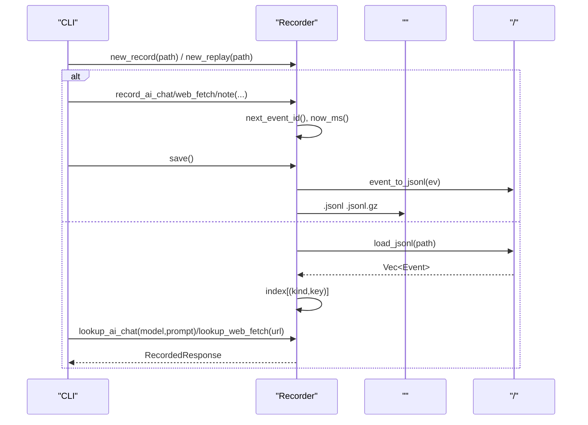
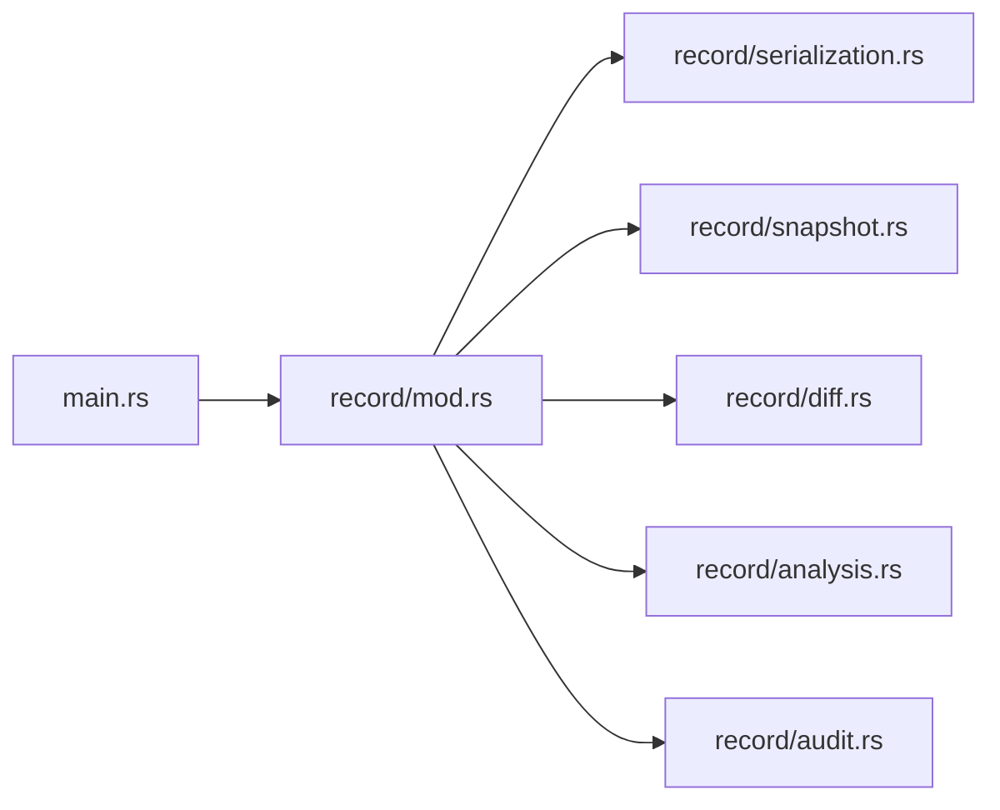

# 

<cite>
****   
- [src/record/mod.rs](file://src/record/mod.rs)
- [src/record/serialization.rs](file://src/record/serialization.rs)
- [src/record/snapshot.rs](file://src/record/snapshot.rs)
- [src/record/diff.rs](file://src/record/diff.rs)
- [src/record/analysis.rs](file://src/record/analysis.rs)
- [src/record/audit.rs](file://src/record/audit.rs)
- [src/event/mod.rs](file://src/event/mod.rs)
- [src/main.rs](file://src/main.rs)
</cite>

## 
1. [](#)
2. [](#)
3. [](#)
4. [](#)
5. [](#)
6. [](#)
7. [](#)
8. [](#)
9. [](#)
10. [](#)

## 
 Mora  Recorder  Mode OffRecordReplay Event AiChatWebFetchNote ID JSONL 

## 
 src/record 
- mod.rsRecorder Mode Event /
- serialization.rs/JSONL 
- snapshot.rs
- diff.rs
- analysis.rs
- audit.rs

```mermaid
graph TB
subgraph ""
R["Recorder<br/>/"] --> S["/<br/>JSONL"]
R --> SN["<br/>Snapshot"]
R --> D["<br/>Diff"]
R --> A["<br/>Analysis"]
R --> AU["<br/>Audit"]
end
CLI["CLI <br/>main.rs"] --> R
```


- [src/record/mod.rs:108-236](file://src/record/mod.rs#L108-L236)
- [src/record/serialization.rs:14-181](file://src/record/serialization.rs#L14-L181)
- [src/record/snapshot.rs:4-101](file://src/record/snapshot.rs#L4-L101)
- [src/record/diff.rs:3-44](file://src/record/diff.rs#L3-L44)
- [src/record/analysis.rs:95-158](file://src/record/analysis.rs#L95-L158)
- [src/record/audit.rs:3-69](file://src/record/audit.rs#L3-L69)
- [src/main.rs:450-541](file://src/main.rs#L450-L541)


- [src/record/mod.rs:1-315](file://src/record/mod.rs#L1-L315)
- [src/record/serialization.rs:1-324](file://src/record/serialization.rs#L1-L324)
- [src/record/snapshot.rs:1-285](file://src/record/snapshot.rs#L1-L285)
- [src/record/diff.rs:1-92](file://src/record/diff.rs#L1-L92)
- [src/record/analysis.rs:1-295](file://src/record/analysis.rs#L1-L295)
- [src/record/audit.rs:1-193](file://src/record/audit.rs#L1-L193)
- [src/main.rs:450-541](file://src/main.rs#L450-L541)

## 
- Recorder ID 
- Mode OffRecord JSONLReplay JSONL 
- Event AiChatWebFetchNote  AI /
- RecordedResponsetoken /


- [src/record/mod.rs:40-117](file://src/record/mod.rs#L40-L117)
- [src/record/mod.rs:108-236](file://src/record/mod.rs#L108-L236)

## 
“--”
-  Record Recorder save()  JSONL  gzip 
- JSONL  recordings  .jsonl.gz 
-  Replay  JSONL  (kind, key) → RecordedResponse lookup_ai_chat/lookup_web_fetch + URL 




- [src/record/mod.rs:129-236](file://src/record/mod.rs#L129-L236)
- [src/record/serialization.rs:156-181](file://src/record/serialization.rs#L156-L181)
- [src/record/serialization.rs:14-81](file://src/record/serialization.rs#L14-L81)

## 

### Recorder  Mode 
- Mode 
  - Off record_* 
  - Record(PathBuf)record_*  events save() 
  - Replay(PathBuf)lookup_*  kind+key 
- Recorder 
  - mode
  - events
  - next_id ID 
  - index (kind, key) RecordedResponse
  - now_ms() Unix 
  - record_ai_chat/web_fetch/note
  - save() JSONL .gz 
  - lookup_ai_chat/lookup_web_fetch

```mermaid
classDiagram
class Mode {
+Off
+Record(path)
+Replay(path)
+is_off() bool
+is_record() bool
+is_replay() bool
}
class Event {
<<enum>>
AiChat{...}
WebFetch{...}
Note{...}
}
class RecordedResponse {
+response : String
+tokens_in : usize
+tokens_out : usize
+latency_ms : u128
+status : Option<u16>
+body_len : Option<usize>
}
class Recorder {
-mode : Mode
-events : Vec~Event~
-next_id : u64
-index : HashMap~(String,String), RecordedResponse~
+new_off() Self
+new_record(path) Result<Self,String>
+new_replay(path) Result<Self,String>
+now_ms() u128
+record(event) void
+record_ai_chat(...) void
+record_web_fetch(...) void
+record_note(message) void
+save() Result<(),String>
+lookup_ai_chat(model,prompt) Option~RecordedResponse~
+lookup_web_fetch(url) Option~RecordedResponse~
+events() &[Event]
}
Recorder --> Mode : ""
Recorder --> Event : ""
Recorder --> RecordedResponse : ""
```


- [src/record/mod.rs:40-117](file://src/record/mod.rs#L40-L117)
- [src/record/mod.rs:108-236](file://src/record/mod.rs#L108-L236)


- [src/record/mod.rs:40-117](file://src/record/mod.rs#L40-L117)
- [src/record/mod.rs:108-236](file://src/record/mod.rs#L108-L236)

###  Event 
- AiChatAI 
  - id
  - ts_ms
  - model
  - prompt_hash
  - prompt_preview
  - response
  - tokens_in/tokens_out/ token 
  - latency_ms
  - error
- WebFetch
  - id/ts_ms/url/method/status/body_len/latency_ms/error HTTP 
- Note/
  - id/ts_ms/message


- [src/record/mod.rs:62-95](file://src/record/mod.rs#L62-L95)

###  ID 
-  IDRecorder.next_event_id()  Record  record_* 
- Recorder.now_ms()  SystemTime::now()  UNIX_EPOCH  ts_ms 


- [src/record/mod.rs:171-177](file://src/record/mod.rs#L171-L177)
- [src/record/mod.rs:238-242](file://src/record/mod.rs#L238-L242)
- [src/record/mod.rs:244-313](file://src/record/mod.rs#L244-L313)

### JSONL 
- event_to_jsonl()  Event  JSON  kindidts_ms 
- esc()  JSON 
- load_jsonl() parse_event_line() 
- save()  gz flate2  GzEncoder  gzip  JSONL

```mermaid
flowchart TD
Start([""]) --> CheckExt{" .gz ?"}
CheckExt --> || Compress[" GzEncoder "]
CheckExt --> || WritePlain[" JSONL "]
Compress --> End([""])
WritePlain --> End
```


- [src/record/mod.rs:206-236](file://src/record/mod.rs#L206-L236)
- [src/record/serialization.rs:14-81](file://src/record/serialization.rs#L14-L81)
- [src/record/serialization.rs:156-181](file://src/record/serialization.rs#L156-L181)


- [src/record/serialization.rs:14-81](file://src/record/serialization.rs#L14-L81)
- [src/record/serialization.rs:156-181](file://src/record/serialization.rs#L156-L181)
- [src/record/mod.rs:206-236](file://src/record/mod.rs#L206-L236)

### 
- Recorder.new_record(path) Recorder.new_replay(path) 
- CLI main.rs  run_record/run_replay  recording_path(name)  Recorder 
- list_recordings(dir)  recordings  .jsonl 


- [src/record/mod.rs:129-161](file://src/record/mod.rs#L129-L161)
- [src/record/analysis.rs:5-39](file://src/record/analysis.rs#L5-L39)
- [src/main.rs:450-541](file://src/main.rs#L450-L541)

### 
- 
  -  Recorder Record  record_ai_chat/record_web_fetch/record_note  save() 
  -  roundtrip ->  ->  -> 
- 
  - new_record CLI 
  - /save/load CLI 
  - new_replay CLI 
  - load_jsonl 


- [src/record/tests.rs:33-77](file://src/record/tests.rs#L33-L77)
- [src/record/mod.rs:129-161](file://src/record/mod.rs#L129-L161)
- [src/record/serialization.rs:156-181](file://src/record/serialization.rs#L156-L181)
- [src/main.rs:450-541](file://src/main.rs#L450-L541)

###  EventBus
Mora  EventBus O(segments) /


- [src/event/mod.rs:39-202](file://src/event/mod.rs#L39-L202)

## 
- Recorder 
  - serialization/
  - snapshot
  - diff
  - analysis
  - audit
- CLI 
  - main.rs  recording_path(name)  Recorder 




- [src/main.rs:450-541](file://src/main.rs#L450-L541)
- [src/record/mod.rs:108-236](file://src/record/mod.rs#L108-L236)


- [src/record/mod.rs:1-315](file://src/record/mod.rs#L1-L315)
- [src/main.rs:450-541](file://src/main.rs#L450-L541)

## 
-  I/O
  - JSONL 
- 
  -  HashMap<(kind, key), RecordedResponse>  O(1) key + URL 
- 
  - EventBus exact/prefix/interioremit  O(segments) 

[]

## 
- 
  - new_replay 
  - 
  - load_jsonl  JSONL 
- 
  -  list_recordings 
  -  compute_stats/build_timeline/export_recording 
  -  audit_recording/redact_secrets 


- [src/record/analysis.rs:5-39](file://src/record/analysis.rs#L5-L39)
- [src/record/analysis.rs:95-158](file://src/record/analysis.rs#L95-L158)
- [src/record/audit.rs:168-193](file://src/record/audit.rs#L168-L193)

## 
Mora  Recorder  Mode / JSONL  Event  AI  ID 

[]

## 

### 
- AiChatidts_msmodelprompt_hashprompt_previewresponsetokens_intokens_outlatency_mserror
- WebFetchidts_msurlmethodstatusbody_lenlatency_mserror
- Noteidts_msmessage


- [src/record/mod.rs:62-95](file://src/record/mod.rs#L62-L95)

### CLI
- mora record <script.mora> <name>
- mora replay <script.mora> <name>
- mora diff <name-a> <name-b>
- mora record list
- mora record stats <name>


- [src/main.rs:450-541](file://src/main.rs#L450-L541)
- [src/main.rs:603-649](file://src/main.rs#L603-L649)