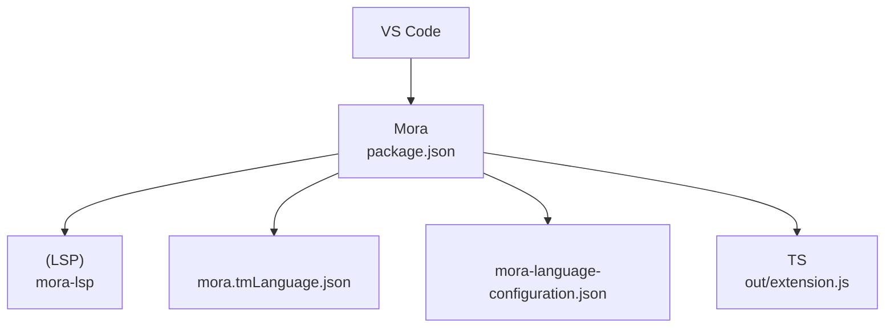
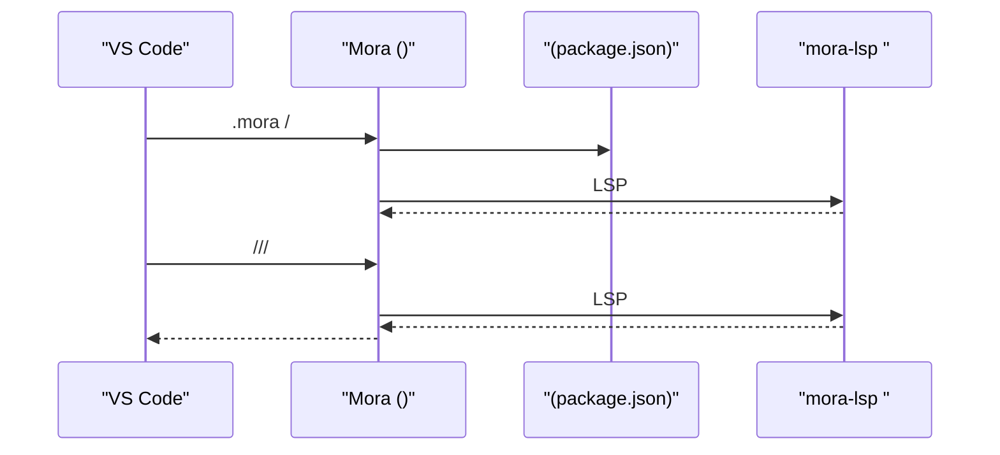
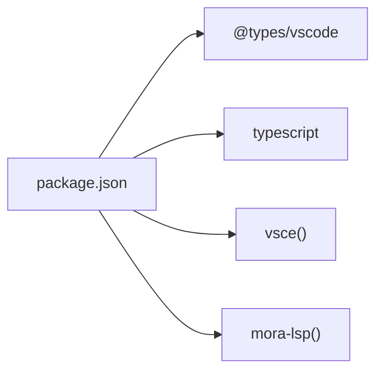

# VSCode 

<cite>
****   
- [package.json](file://editors/vscode/package.json)
- [mora-language-configuration.json](file://editors/vscode/mora-language-configuration.json)
- [mora.tmLanguage.json](file://editors/vscode/syntaxes/mora.tmLanguage.json)
- [README.md](file://editors/vscode/README.md)
- [tsconfig.json](file://editors/vscode/tsconfig.json)
</cite>

## 
1. 
2. 
3. 
4. 
5. 
6. 
7. 
8. 
9. 
10. 

## 
 VS Code  Mora  LSP 

## 
VS Code  editors/vscode 
- package.jsonLSP 
- mora-language-configuration.json
- syntaxes/mora.tmLanguage.jsonTextMate 
- README.md
- tsconfig.jsonTypeScript 

- [package.json:1-72](file://editors/vscode/package.json#L1-L72)
- [mora.tmLanguage.json:1-82](file://editors/vscode/syntaxes/mora.tmLanguage.json#L1-L82)
- [mora-language-configuration.json:1-23](file://editors/vscode/mora-language-configuration.json#L1-L23)
- [README.md:1-67](file://editors/vscode/README.md#L1-L67)

- [package.json:1-72](file://editors/vscode/package.json#L1-L72)
- [README.md:1-67](file://editors/vscode/README.md#L1-L67)

## 
-  LSP package.json
  - id
  - scopeName  tmLanguage 
  - 
  -  .mora  .mora 
  -  out/extension.js
- mora-language-configuration.json
  - 
  - 
  - 
- syntaxes/mora.tmLanguage.json
  - 
- README.mdpackage.jsontsconfig.json
  -  VSIX 
  - TypeScript 

- [package.json:1-72](file://editors/vscode/package.json#L1-L72)
- [mora-language-configuration.json:1-23](file://editors/vscode/mora-language-configuration.json#L1-L23)
- [mora.tmLanguage.json:1-82](file://editors/vscode/syntaxes/mora.tmLanguage.json#L1-L82)
- [README.md:1-67](file://editors/vscode/README.md#L1-L67)
- [tsconfig.json:1-14](file://editors/vscode/tsconfig.json#L1-L14)

## 
Mora VS Code  LSP  TextMate 

- [package.json:1-72](file://editors/vscode/package.json#L1-L72)
- [README.md:1-67](file://editors/vscode/README.md#L1-L67)

## 

###  LSP package.json
- 
  - id
- 
  - scopeName  tmLanguage 
- 
  - 
  - 
  - 
- 
  - onLanguage:mora
  - workspaceContains:**/*.mora
- 
  - main  out/extension.js
- 
  - buildpackagelint 
  - devDependencies  @types/vscodetypescript 

- [package.json:1-72](file://editors/vscode/package.json#L1-L72)

### mora-language-configuration.json
- 
  - 
- 
  - 
- 
  - 
- 
  - 

- [mora-language-configuration.json:1-23](file://editors/vscode/mora-language-configuration.json#L1-L23)

### syntaxes/mora.tmLanguage.json
-  patterns  repository 
- repository 
  - comments
  - strings
  - numbers
  - keywordsIO
  - builtin-typesstringnumberboollistdicttaskclosureconversation
  - builtin-modulesaiwebjsonfile
  - task-call
  - method-call
  - identifiers

- [mora.tmLanguage.json:1-82](file://editors/vscode/syntaxes/mora.tmLanguage.json#L1-L82)

### README.mdpackage.jsontsconfig.json
-  VSIX 
  -  vsce
  -  .vsix
  -  code --install-extension 
- 
  - npm install
  -  TS 
  -  VS Code  F5 
- 
  -  mora-lsp  PATH 
- 
  - tsc -p .

- [README.md:1-67](file://editors/vscode/README.md#L1-L67)
- [package.json:1-72](file://editors/vscode/package.json#L1-L72)
- [tsconfig.json:1-14](file://editors/vscode/tsconfig.json#L1-L14)

### 
- 
  - 
  -  PATH
- 
  - 
- 
  - 

- [package.json:1-72](file://editors/vscode/package.json#L1-L72)
- [README.md:1-67](file://editors/vscode/README.md#L1-L67)

### 
- 
- F12
- Shift+F12
- Ctrl+Space
- Shift+Alt+F
- F2
- Ctrl+Shift+O

- [README.md:1-67](file://editors/vscode/README.md#L1-L67)

### 
-  TextMate 
  -  scope
  -  scope 
- 
  - 

- [mora.tmLanguage.json:1-82](file://editors/vscode/syntaxes/mora.tmLanguage.json#L1-L82)

## 
- 
  - mora-lsp 
- 
  - @types/vscodetypescript 
- 
  - vsce VSIX

- [package.json:1-72](file://editors/vscode/package.json#L1-L72)
- [README.md:1-67](file://editors/vscode/README.md#L1-L67)

- [package.json:1-72](file://editors/vscode/package.json#L1-L72)
- [README.md:1-67](file://editors/vscode/README.md#L1-L67)

## 
- 
  -  .mora  .mora 
- 
  - 
- 
  - 
- 
  -  tmLanguage 

[]

## 
- 
  -  mora-lsp  PATH
- 
  -  .mora  .mora 
- //
  -  LSP 
  - 
- 
  - 
- 
  -  tmLanguage 

- [README.md:1-67](file://editors/vscode/README.md#L1-L67)
- [package.json:1-72](file://editors/vscode/package.json#L1-L72)

## 
 package.json  tmLanguage Mora  VS Code  LSP  mora-lsp 

[]

## 

### 
- mora.languageServer.path
- mora.languageServer.args
- mora.noTypeCheck

- [package.json:1-72](file://editors/vscode/package.json#L1-L72)
- [README.md:1-67](file://editors/vscode/README.md#L1-L67)

### 
-  vsce
-  VSIX
- 
- 

- [README.md:1-67](file://editors/vscode/README.md#L1-L67)
- [package.json:1-72](file://editors/vscode/package.json#L1-L72)
- [tsconfig.json:1-14](file://editors/vscode/tsconfig.json#L1-L14)