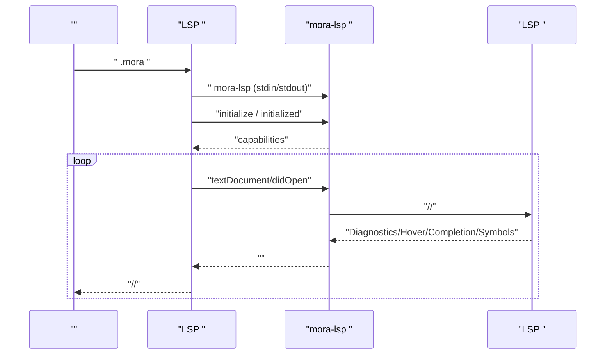
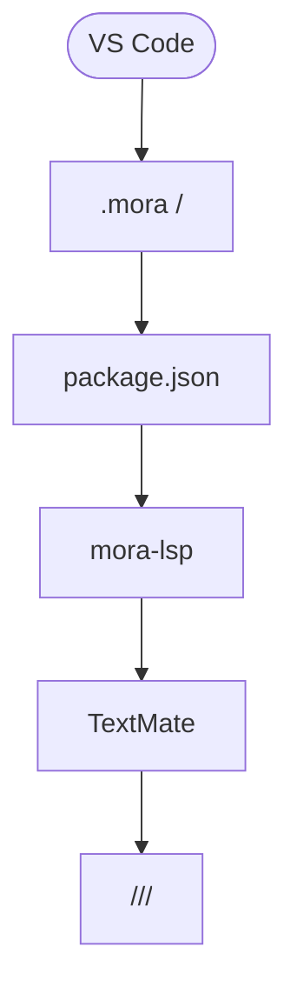
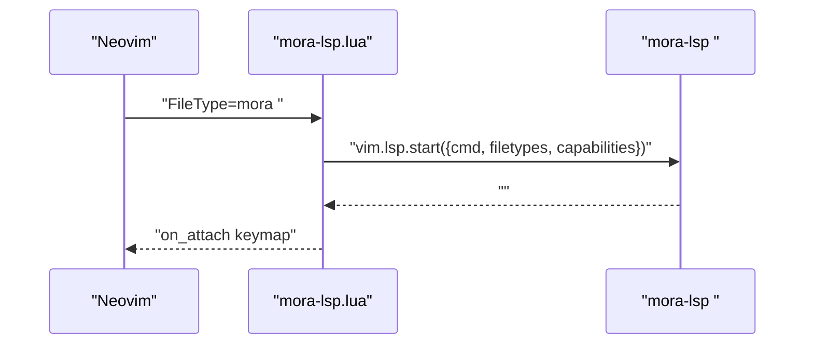
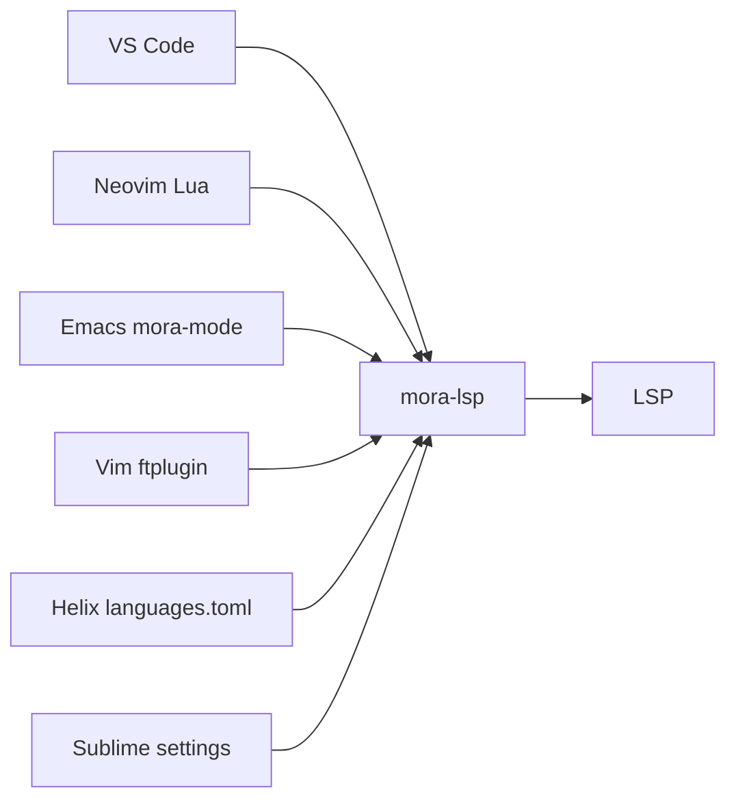

# 

<cite>
****   
- [editors/README.md](file://editors/README.md)
- [editors/vscode/README.md](file://editors/vscode/README.md)
- [editors/vscode/package.json](file://editors/vscode/package.json)
- [editors/vscode/mora-language-configuration.json](file://editors/vscode/mora-language-configuration.json)
- [editors/vscode/syntaxes/mora.tmLanguage.json](file://editors/vscode/syntaxes/mora.tmLanguage.json)
- [editors/neovim/README.md](file://editors/neovim/README.md)
- [editors/neovim/lua/mora-lsp.lua](file://editors/neovim/lua/mora-lsp.lua)
- [editors/helix/README.md](file://editors/helix/README.md)
- [editors/helix/languages.toml](file://editors/helix/languages.toml)
- [editors/sublime/mora.sublime-settings](file://editors/sublime/mora.sublime-settings)
- [editors/vim/ftplugin/mora.vim](file://editors/vim/ftplugin/mora.vim)
- [editors/emacs/mora-mode.el](file://editors/emacs/mora-mode.el)
- [src/bin/lsp.rs](file://src/bin/lsp.rs)
- [src/lsp/mod.rs](file://src/lsp/mod.rs)
</cite>

## 
1. [](#)
2. [](#)
3. [](#)
4. [](#)
5. [](#)
6. [](#)
7. [](#)
8. [](#)
9. [](#)
10. [](#)

## 
 VS CodeNeovimEmacsVimHelix  Sublime Text  Mora Mora  LSPmora-lsp PATH  mora-lsp 

## 
 editors 
- vscodeVS Code 
- neovimLua  Neovim 
- emacsmora-mode 
- vimVim /LSP 
- helixlanguages.toml  LSP 
- sublimeSublime Text 

```mermaid
graph TB
A[""] --> B["VS Code <br/>package.json +  + "]
A --> C["Neovim Lua <br/>mora-lsp.lua"]
A --> D["Emacs mora-mode<br/>mora-mode.el"]
A --> E["Vim ftplugin<br/>mora.vim"]
A --> F["Helix <br/>languages.toml"]
A --> G["Sublime Text <br/>mora.sublime-settings"]
B --> H["mora-lsp "]
C --> H
D --> H
E --> H
F --> H
G --> H
H --> I["LSP <br/>src/lsp/*"]
```


- [editors/vscode/package.json:1-72](file://editors/vscode/package.json#L1-L72)
- [editors/neovim/lua/mora-lsp.lua:1-49](file://editors/neovim/lua/mora-lsp.lua#L1-L49)
- [editors/emacs/mora-mode.el:1-51](file://editors/emacs/mora-mode.el#L1-L51)
- [editors/vim/ftplugin/mora.vim:1-45](file://editors/vim/ftplugin/mora.vim#L1-L45)
- [editors/helix/languages.toml:1-21](file://editors/helix/languages.toml#L1-L21)
- [editors/sublime/mora.sublime-settings:1-28](file://editors/sublime/mora.sublime-settings#L1-L28)
- [src/lsp/mod.rs:1-23](file://src/lsp/mod.rs#L1-L23)


- [editors/README.md:1-50](file://editors/README.md#L1-L50)

## 
- LSP 
  -  --version/--help  LSP 
  - LSP  JSON-RPC JSON 
- 
  - VS Code package.json  LSP 
  - NeovimLua  FileType  LSP  capabilities  on_attach
  - Emacsmora-mode LSP  lsp-mode 
  - Vimftplugin  vim-lsp 
  - Helixlanguages.toml LSP 
  - Sublime Textsettings scope LSP 


- [src/bin/lsp.rs:1-25](file://src/bin/lsp.rs#L1-L25)
- [src/lsp/mod.rs:1-23](file://src/lsp/mod.rs#L1-L23)
- [editors/vscode/package.json:1-72](file://editors/vscode/package.json#L1-L72)
- [editors/neovim/lua/mora-lsp.lua:1-49](file://editors/neovim/lua/mora-lsp.lua#L1-L49)
- [editors/emacs/mora-mode.el:1-51](file://editors/emacs/mora-mode.el#L1-L51)
- [editors/vim/ftplugin/mora.vim:1-45](file://editors/vim/ftplugin/mora.vim#L1-L45)
- [editors/helix/languages.toml:1-21](file://editors/helix/languages.toml#L1-L21)
- [editors/sublime/mora.sublime-settings:1-28](file://editors/sublime/mora.sublime-settings#L1-L28)

## 
 LSP  LSP  mora-lsp  JSON-RPC 2.0 + LSP 




- [src/bin/lsp.rs:1-25](file://src/bin/lsp.rs#L1-L25)
- [src/lsp/mod.rs:1-23](file://src/lsp/mod.rs#L1-L23)

## 

### VS Code 
- 
  -  TextMate 
  - 
  - LSP 
- 
  -  VSIX 
  -  mora.languageServer.path  mora-lsp 
  - 
- 
  -  VS Code  LSP  F12Shift+F12Ctrl+SpaceShift+Alt+FF2Ctrl+Shift+O
  -  TextMate  scope 




- [editors/vscode/package.json:1-72](file://editors/vscode/package.json#L1-L72)
- [editors/vscode/mora-language-configuration.json:1-23](file://editors/vscode/mora-language-configuration.json#L1-L23)
- [editors/vscode/syntaxes/mora.tmLanguage.json:1-82](file://editors/vscode/syntaxes/mora.tmLanguage.json#L1-L82)
- [editors/vscode/README.md:1-67](file://editors/vscode/README.md#L1-L67)


- [editors/vscode/README.md:1-67](file://editors/vscode/README.md#L1-L67)
- [editors/vscode/package.json:1-72](file://editors/vscode/package.json#L1-L72)
- [editors/vscode/mora-language-configuration.json:1-23](file://editors/vscode/mora-language-configuration.json#L1-L23)
- [editors/vscode/syntaxes/mora.tmLanguage.json:1-82](file://editors/vscode/syntaxes/mora.tmLanguage.json#L1-L82)

### Neovim 
- 
  -  FileType=mora  LSP 
  -  cmdcapabilities  on_attach
  - *.mora -> filetype=mora
- 
  -  lua/mora-lsp.lua  init.lua  require  setup
  -  Neovim0.10  vim.lsp.start_client 
- 
  -  on_attach  gd/gr/K/Ctrl+Space/rename/format  LSP 




- [editors/neovim/lua/mora-lsp.lua:1-49](file://editors/neovim/lua/mora-lsp.lua#L1-L49)
- [editors/neovim/README.md:1-71](file://editors/neovim/README.md#L1-L71)


- [editors/neovim/README.md:1-71](file://editors/neovim/README.md#L1-L71)
- [editors/neovim/lua/mora-lsp.lua:1-49](file://editors/neovim/lua/mora-lsp.lua#L1-L49)

### Emacs mora-mode
- 
  -  major mode//
  - LSP  lsp-mode
- 
  - defcustom  mora-lsp-server-executable  mora-lsp 
  - auto-mode-alist  .mora 
- 
  -  font-lock-keywords LSP  lsp-mode 


- [editors/emacs/mora-mode.el:1-51](file://editors/emacs/mora-mode.el#L1-L51)

### Vim 
- 
  -  *.mora  mora
  - 
  - 
  -  vim-lsp  LSP  vim-lsp 
- 
  - Keyword/Type/Comment/String/Number/Function
  - LSP  LSP 


- [editors/vim/ftplugin/mora.vim:1-45](file://editors/vim/ftplugin/mora.vim#L1-L45)

### Helix 
- 
  - languages.toml LSP 
  -  tree-sitter grammar 
- 
  -  [[language]]  command = "mora-lsp"
  -  :lsp-workspace-command status  LSP 
- 
  - K/gd/gr/Ctrl+Space/rename/format 


- [editors/helix/README.md:1-40](file://editors/helix/README.md#L1-L40)
- [editors/helix/languages.toml:1-21](file://editors/helix/languages.toml#L1-L21)

### Sublime Text
- 
  - scope
  -  LSP command=["mora-lsp"], languages=["mora"]
  - 
- 
  -  settings  mora-lsp  PATH


- [editors/sublime/mora.sublime-settings:1-28](file://editors/sublime/mora.sublime-settings#L1-L28)

## 
-  LSP 
  -  mora-lsp 
  - VS Code  package.json 
  - Neovim  Lua  LSP 
  - Emacs/Vim  major mode  ftplugin  LSP 
  - Helix/Sublime  LSP 
- 
  - src/bin/lsp.rs  CLI  src/lsp/mod.rs  run() 




- [editors/vscode/package.json:1-72](file://editors/vscode/package.json#L1-L72)
- [editors/neovim/lua/mora-lsp.lua:1-49](file://editors/neovim/lua/mora-lsp.lua#L1-L49)
- [editors/emacs/mora-mode.el:1-51](file://editors/emacs/mora-mode.el#L1-L51)
- [editors/vim/ftplugin/mora.vim:1-45](file://editors/vim/ftplugin/mora.vim#L1-L45)
- [editors/helix/languages.toml:1-21](file://editors/helix/languages.toml#L1-L21)
- [editors/sublime/mora.sublime-settings:1-28](file://editors/sublime/mora.sublime-settings#L1-L28)
- [src/bin/lsp.rs:1-25](file://src/bin/lsp.rs#L1-L25)
- [src/lsp/mod.rs:1-23](file://src/lsp/mod.rs#L1-L23)


- [src/bin/lsp.rs:1-25](file://src/bin/lsp.rs#L1-L25)
- [src/lsp/mod.rs:1-23](file://src/lsp/mod.rs#L1-L23)

## 
- 
  -  mora-lsp  PATH 
  - /
  -  LSP 
- 
  - VS Codemora.noTypeCheck
  - Neovim LSP  LSP
  - Emacs/Vim LSP
  - Helix/Sublime

[]

## 
- 
  -  mora-lsp PATH 
  -  .mora 
  - LSP  LSP  initialize/initialized 
  - /
- 
  - 
- 
  -  PATH
  -  LSP 


- [editors/README.md:14-50](file://editors/README.md#L14-L50)
- [editors/vscode/README.md:30-67](file://editors/vscode/README.md#L30-L67)
- [editors/neovim/README.md:1-71](file://editors/neovim/README.md#L1-L71)
- [editors/helix/README.md:1-40](file://editors/helix/README.md#L1-L40)

## 
 LSP Mora  LSP 

[]

## 
-  LSP 
  - K  Ctrl+Shift+Space
  - gd  F12
  - gr  Shift+F12
  - Ctrl+Space
  - F2  <leader>rn
  - Shift+Alt+F  <leader>f
- 
  - VS CodeTextMate  scope 
  - Neovim/Emacs/Vim highlight/link  theme 
  - Helix/Sublime

[]