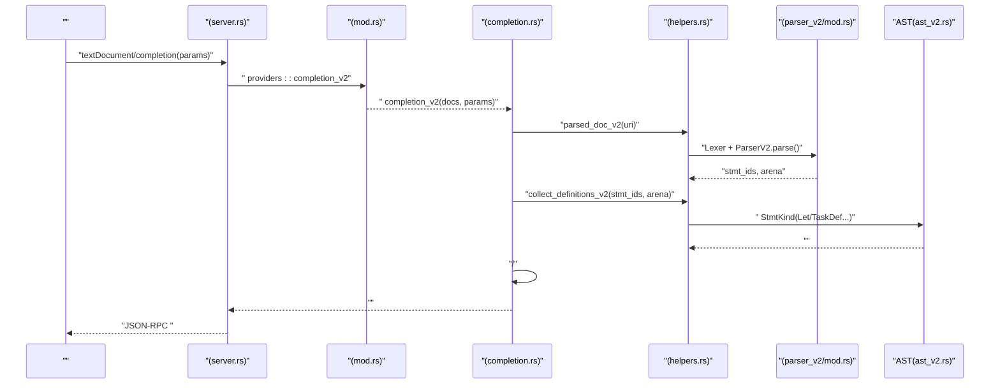
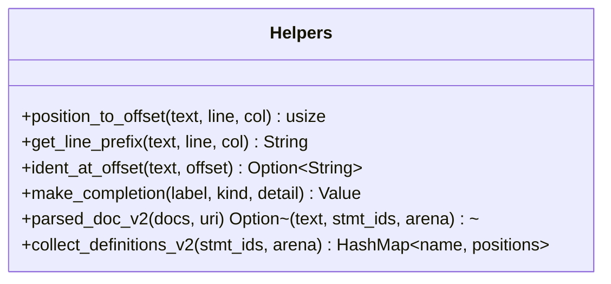
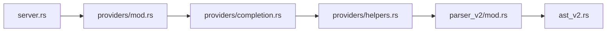

# 

<cite>
****   
- [completion.rs](file://src/lsp/providers/completion.rs)
- [helpers.rs](file://src/lsp/providers/helpers.rs)
- [mod.rs](file://src/lsp/providers/mod.rs)
- [server.rs](file://src/lsp/server.rs)
- [ast_v2.rs](file://src/ast_v2.rs)
- [parser_v2/mod.rs](file://src/parser_v2/mod.rs)
</cite>

## 
1. [](#)
2. [](#)
3. [](#)
4. [](#)
5. [](#)
6. [](#)
7. [](#)
8. [](#)
9. [](#)
10. [](#)

## 
 Mora LSP“” AST 

## 
Mora LSP  providers  server 
- server  JSON-RPC  textDocument/completion  providers::completion_v2
- providers::completion_v2  helpers 
-  parser_v2  ast_v2 

```mermaid
graph TB
Client[""] --> Server["LSP <br/>server.rs"]
Server --> Providers["<br/>providers/mod.rs"]
Providers --> Completion["<br/>providers/completion.rs"]
Completion --> Helpers["<br/>providers/helpers.rs"]
Helpers --> ParserV2[" v2<br/>parser_v2/mod.rs"]
ParserV2 --> AST["AST <br/>ast_v2.rs"]
```


- [server.rs:203-225](file://src/lsp/server.rs#L203-L225)
- [mod.rs:1-23](file://src/lsp/providers/mod.rs#L1-L23)
- [completion.rs:1-79](file://src/lsp/providers/completion.rs#L1-L79)
- [helpers.rs:90-132](file://src/lsp/providers/helpers.rs#L90-L132)
- [parser_v2/mod.rs:16-60](file://src/parser_v2/mod.rs#L16-L60)
- [ast_v2.rs:160-200](file://src/ast_v2.rs#L160-L200)


- [server.rs:203-225](file://src/lsp/server.rs#L203-L225)
- [mod.rs:1-23](file://src/lsp/providers/mod.rs#L1-L23)

## 
- completion_v2
  -  URI 
  -  parsed_doc_v2  ID  AST Arena
  -  collect_definitions_v2 “” lettask
  - 
- 
  - get_line_prefix
  - ident_at_offset
  - make_completion LSP completion item
  - parsed_doc_v2 / collect_definitions_v2 AST 


- [completion.rs:7-74](file://src/lsp/providers/completion.rs#L7-L74)
- [helpers.rs:22-49](file://src/lsp/providers/helpers.rs#L22-L49)
- [helpers.rs:90-132](file://src/lsp/providers/helpers.rs#L90-L132)

## 
 AST 




- [server.rs:306-312](file://src/lsp/server.rs#L306-L312)
- [mod.rs:14](file://src/lsp/providers/mod.rs#L14)
- [completion.rs:7-74](file://src/lsp/providers/completion.rs#L7-L74)
- [helpers.rs:90-132](file://src/lsp/providers/helpers.rs#L90-L132)
- [parser_v2/mod.rs:32-45](file://src/parser_v2/mod.rs#L32-L45)
- [ast_v2.rs:160-200](file://src/ast_v2.rs#L160-L200)

## 

### completion_v2
- 
  -  params  textDocument.uri  position(line, character)
  - 
- 
  -  parsed_doc_v2  ID  AST Arena
  -  get_line_prefix 
- 
  -  collect_definitions_v2  AST“” lettask
- 
  -  defs.keys() variable 3.0
  -  keyword 14.0
  -  builtin 10.0
- 
  -  BTreeSet 
  -  kind 

```mermaid
flowchart TD
Start([" completion_v2"]) --> ParseParams[" uri  position"]
ParseParams --> Valid{"?"}
Valid --> || ReturnEmpty[""]
Valid --> || ParseDoc["parsed_doc_v2 /AST"]
ParseDoc --> CollectDefs["collect_definitions_v2 "]
CollectDefs --> BuildItems["<br/>//"]
BuildItems --> Dedup["BTreeSet "]
Dedup --> ReturnItems[""]
```


- [completion.rs:7-74](file://src/lsp/providers/completion.rs#L7-L74)
- [helpers.rs:90-132](file://src/lsp/providers/helpers.rs#L90-L132)


- [completion.rs:7-74](file://src/lsp/providers/completion.rs#L7-L74)

### helpers
- 
  - position_to_offset (line, col) 
  - get_line_prefix
- 
  - ident_at_offset
- 
  - make_completion labelkinddetail 
- AST 
  - parsed_doc_v2 stmt_ids  arena
  - collect_definitions_v2 StmtKind::Let  StmtKind::TaskDef name  span




- [helpers.rs:5-49](file://src/lsp/providers/helpers.rs#L5-L49)
- [helpers.rs:90-132](file://src/lsp/providers/helpers.rs#L90-L132)


- [helpers.rs:5-49](file://src/lsp/providers/helpers.rs#L5-L49)
- [helpers.rs:90-132](file://src/lsp/providers/helpers.rs#L90-L132)

### AST ast_v2  parser_v2
- AST 
  - TypedStmt/StmtKind LetAssignTaskDef  Span 
  - ExprKind VariableCallMethodCall 
-  v2
  - ParserV2 tokenscurrent  AstArena
  - parse Vec<NodeId>
  - into_arena Arena 

```mermaid
classDiagram
class ParserV2 {
-tokens : Vec<Token>
-current : usize
-arena : AstArena
+new(tokens) Self
+parse() Vec~NodeId~
+arena() &AstArena
+into_arena() AstArena
}
class AstArena {
+alloc_stmt(kind, span) NodeId
+get_stmt(id) Option~TypedStmt~
+get_expr(id) Option~TypedExpr~
}
class TypedStmt {
+id : NodeId
+kind : StmtKind
+span : Span
}
class StmtKind {
<<enum>>
+Let{name,type_hint,init,exported}
+TaskDef{name,lifetime_params,params,return_type,body,exported}
+...
}
ParserV2 --> AstArena : "/"
AstArena --> TypedStmt : ""
```


- [parser_v2/mod.rs:16-60](file://src/parser_v2/mod.rs#L16-L60)
- [ast_v2.rs:160-200](file://src/ast_v2.rs#L160-L200)


- [parser_v2/mod.rs:16-60](file://src/parser_v2/mod.rs#L16-L60)
- [ast_v2.rs:160-200](file://src/ast_v2.rs#L160-L200)

### 
- 
  -  initialize  completionProvider.triggerCharacters  ":"
- 
  -  collect_definitions_v2  let  variable 
- 
  -  task  function/task 
- 
  - // collect_definitions_v2  Type/Enum/Struct  StmtKind
- 
  -  import  parsed_doc_v2 


- [server.rs:244-250](file://src/lsp/server.rs#L244-L250)
- [helpers.rs:108-132](file://src/lsp/providers/helpers.rs#L108-L132)

### 
- 
  -  printrangelentype_ofis_instancemethods_ofatomswapderefcomposepartialbatch_chat  builtin 10.0
- 
  -  collect_definitions_v2  variable 3.0
- 
  -  lettaskifthenendforinreturnfntruefalsenilmatchwithimportexportparallelbreakcontinuerouteobservestreamtool  keyword 14.0


- [completion.rs:43-71](file://src/lsp/providers/completion.rs#L43-L71)

### 
- 
  -  get_line_prefix  ident_at_offset 
- 
  -  kind  kind 
- 
  -  BTreeSet<String> 


- [completion.rs:31-51](file://src/lsp/providers/completion.rs#L31-L51)
- [helpers.rs:22-49](file://src/lsp/providers/helpers.rs#L22-L49)

## 
- 
  - server.rs  providers/mod.rs  completion_v2
  - providers/completion.rs  providers/helpers.rs 
  - helpers.rs  parser_v2/mod.rs  ast_v2.rs 
- 
  -  JSON 




- [server.rs:306-312](file://src/lsp/server.rs#L306-L312)
- [mod.rs:14](file://src/lsp/providers/mod.rs#L14)
- [completion.rs:1-79](file://src/lsp/providers/completion.rs#L1-L79)
- [helpers.rs:90-132](file://src/lsp/providers/helpers.rs#L90-L132)
- [parser_v2/mod.rs:16-60](file://src/parser_v2/mod.rs#L16-L60)
- [ast_v2.rs:160-200](file://src/ast_v2.rs#L160-L200)


- [server.rs:306-312](file://src/lsp/server.rs#L306-L312)
- [mod.rs:14](file://src/lsp/providers/mod.rs#L14)

## 
- 
  - lexer + parser_v2
  -  AST  Arena
- 
  - collect_definitions_v2  O(N)
  - →
- 
  - BTreeSet 
- I/O 
  - 

[]

## 
- 
  -  initialize  completionProvider.triggerCharacters 
  -  parsed_doc_v2  URI  position 
  -  completion.rs 
- 
  -  parsed_doc_v2  stmt_ids  arena 
  -  collect_definitions_v2 
  -  get_line_prefix  ident_at_offset 


- [server.rs:244-250](file://src/lsp/server.rs#L244-L250)
- [completion.rs:7-26](file://src/lsp/providers/completion.rs#L7-L26)
- [helpers.rs:22-82](file://src/lsp/providers/helpers.rs#L22-L82)

## 
 Mora LSP 

[]

## 
- 
  -  collect_definitions_v2  StmtKind Type/Enum/Struct
  -  completion_v2  kind  detail
  -  get_line_prefix  ident_at_offset 
  - 
  - 

[]