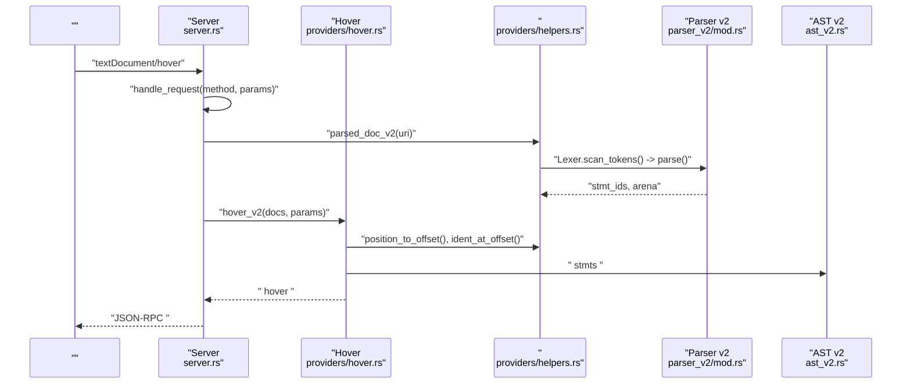
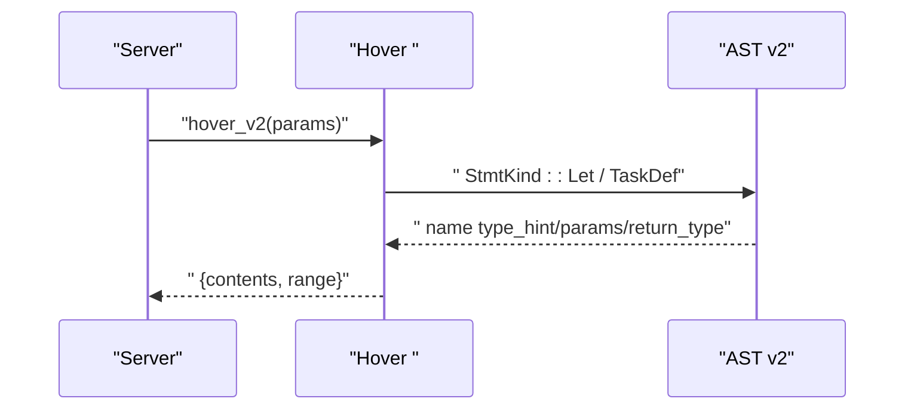
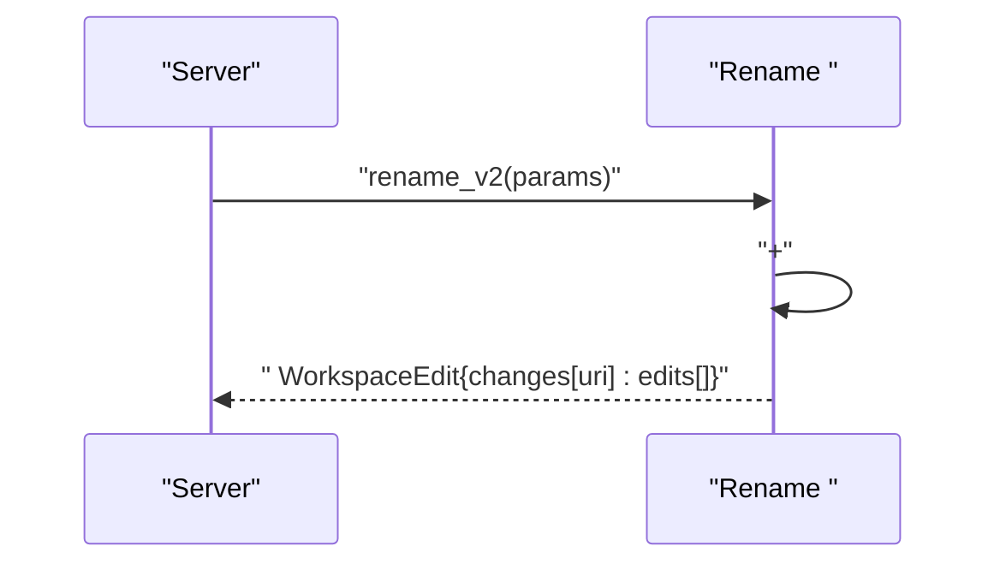
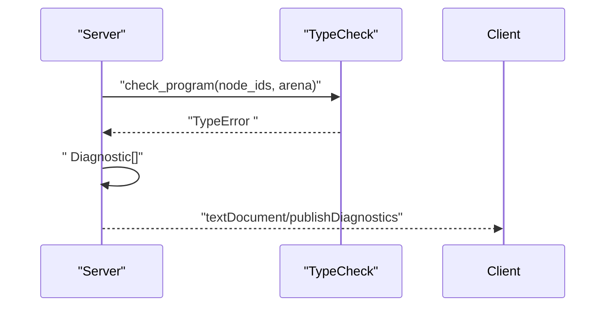
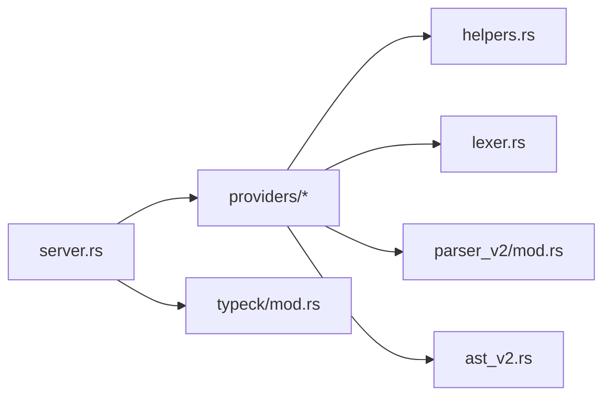

# 

<cite>
****   
- [src/bin/lsp.rs](file://src/bin/lsp.rs)
- [src/lsp/mod.rs](file://src/lsp/mod.rs)
- [src/lsp/server.rs](file://src/lsp/server.rs)
- [src/lsp/providers/mod.rs](file://src/lsp/providers/mod.rs)
- [src/lsp/providers/completion.rs](file://src/lsp/providers/completion.rs)
- [src/lsp/providers/hover.rs](file://src/lsp/providers/hover.rs)
- [src/lsp/providers/definition.rs](file://src/lsp/providers/definition.rs)
- [src/lsp/providers/references.rs](file://src/lsp/providers/references.rs)
- [src/lsp/providers/rename.rs](file://src/lsp/providers/rename.rs)
- [src/lsp/providers/symbols.rs](file://src/lsp/providers/symbols.rs)
- [src/lsp/providers/folding.rs](file://src/lsp/providers/folding.rs)
- [src/lsp/providers/formatting.rs](file://src/lsp/providers/formatting.rs)
- [src/lsp/providers/semantic.rs](file://src/lsp/providers/semantic.rs)
- [src/lsp/providers/helpers.rs](file://src/lsp/providers/helpers.rs)
- [src/ast_v2.rs](file://src/ast_v2.rs)
- [src/parser_v2/mod.rs](file://src/parser_v2/mod.rs)
- [src/typeck/mod.rs](file://src/typeck/mod.rs)
</cite>

## 
1. [](#)
2. [](#)
3. [](#)
4. [](#)
5. [](#)
6. [](#)
7. [](#)
8. [](#)
9. [](#)
10. [](#)

## 
 Mora  LSPLanguage Server Protocol
- 
-  AST /
- 
- Semantic Tokens
- Diagnostics LSP 
- 
- 

## 
Mora LSP “ + ” JSON-RPC  Provider Provider  AST 

```mermaid
graph TB
subgraph ""
BIN["lsp <br/>src/bin/lsp.rs"]
RUN["LSP <br/>src/lsp/mod.rs"]
end
subgraph ""
SRV["Server <br/>src/lsp/server.rs"]
TR["JSON-RPC <br/>src/lsp/transport.rs"]
J["JSON <br/>src/lsp/json.rs"]
end
subgraph ""
P_MOD["providers <br/>src/lsp/providers/mod.rs"]
COMP["completion<br/>src/lsp/providers/completion.rs"]
HOVER["hover<br/>src/lsp/providers/hover.rs"]
DEF["definition<br/>src/lsp/providers/definition.rs"]
REFS["references<br/>src/lsp/providers/references.rs"]
RENAME["rename<br/>src/lsp/providers/rename.rs"]
SYMS["documentSymbol<br/>src/lsp/providers/symbols.rs"]
FOLD["foldingRange<br/>src/lsp/providers/folding.rs"]
FMT["formatting<br/>src/lsp/providers/formatting.rs"]
SEM["semanticTokens<br/>src/lsp/providers/semantic.rs"]
HELP["helpers <br/>src/lsp/providers/helpers.rs"]
end
subgraph ""
LEX[" Lexer<br/>src/lexer.rs"]
PARSE["Parser v2<br/>src/parser_v2/mod.rs"]
AST["AST v2 <br/>src/ast_v2.rs"]
TYPECK[" TypeCheck<br/>src/typeck/mod.rs"]
end
BIN --> RUN --> SRV
SRV --> TR
SRV --> J
SRV --> P_MOD
P_MOD --> COMP
P_MOD --> HOVER
P_MOD --> DEF
P_MOD --> REFS
P_MOD --> RENAME
P_MOD --> SYMS
P_MOD --> FOLD
P_MOD --> FMT
P_MOD --> SEM
P_MOD --> HELP
HELP --> LEX
HELP --> PARSE
HELP --> AST
SRV --> TYPECK
```


- [src/bin/lsp.rs:1-25](file://src/bin/lsp.rs#L1-L25)
- [src/lsp/mod.rs:1-23](file://src/lsp/mod.rs#L1-L23)
- [src/lsp/server.rs:1-120](file://src/lsp/server.rs#L1-L120)
- [src/lsp/providers/mod.rs:1-23](file://src/lsp/providers/mod.rs#L1-L23)
- [src/lsp/providers/helpers.rs:1-104](file://src/lsp/providers/helpers.rs#L1-L104)
- [src/parser_v2/mod.rs:1-60](file://src/parser_v2/mod.rs#L1-L60)
- [src/ast_v2.rs:1-80](file://src/ast_v2.rs#L1-L80)
- [src/typeck/mod.rs:1-60](file://src/typeck/mod.rs#L1-L60)


- [src/bin/lsp.rs:1-25](file://src/bin/lsp.rs#L1-L25)
- [src/lsp/mod.rs:1-23](file://src/lsp/mod.rs#L1-L23)
- [src/lsp/server.rs:1-120](file://src/lsp/server.rs#L1-L120)

## 
- 
  -  JSON-RPC  handler
- Providers
  -  LSP  AST
- Helpers
  - /AST 
- 
  - Parser v2AST v2


- [src/lsp/server.rs:120-225](file://src/lsp/server.rs#L120-L225)
- [src/lsp/providers/mod.rs:1-23](file://src/lsp/providers/mod.rs#L1-L23)
- [src/lsp/providers/helpers.rs:1-104](file://src/lsp/providers/helpers.rs#L1-L104)
- [src/parser_v2/mod.rs:1-60](file://src/parser_v2/mod.rs#L1-L60)
- [src/ast_v2.rs:1-80](file://src/ast_v2.rs#L1-L80)
- [src/typeck/mod.rs:1-60](file://src/typeck/mod.rs#L1-L60)

## 
 LSP  textDocument/hover AST 




- [src/lsp/server.rs:203-225](file://src/lsp/server.rs#L203-L225)
- [src/lsp/providers/hover.rs:1-84](file://src/lsp/providers/hover.rs#L1-L84)
- [src/lsp/providers/helpers.rs:1-104](file://src/lsp/providers/helpers.rs#L1-L104)
- [src/parser_v2/mod.rs:1-60](file://src/parser_v2/mod.rs#L1-L60)
- [src/ast_v2.rs:1-80](file://src/ast_v2.rs#L1-L80)

## 

### Completion
- 
  - 
  - /
  -  kind/detail 
- 
  -  →  →  →  →  CompletionItem 
- 
  - 

```mermaid
flowchart TD
Start([""]) --> Parse["<br/>helpers.parsed_doc_v2"]
Parse --> CollectDefs["<br/>collect_definitions_v2"]
CollectDefs --> AddKw[""]
AddKw --> AddBuiltin[""]
AddBuiltin --> Dedup[""]
Dedup --> BuildItems[" CompletionItem"]
BuildItems --> End([""])
```


- [src/lsp/providers/completion.rs:1-79](file://src/lsp/providers/completion.rs#L1-L79)
- [src/lsp/providers/helpers.rs:106-132](file://src/lsp/providers/helpers.rs#L106-L132)


- [src/lsp/providers/completion.rs:1-79](file://src/lsp/providers/completion.rs#L1-L79)
- [src/lsp/providers/helpers.rs:106-132](file://src/lsp/providers/helpers.rs#L106-L132)

### Hover
- 
  -  AST  let  task 
  -  Markdown //
- 
  -  →  →  →  AST  → 




- [src/lsp/providers/hover.rs:1-84](file://src/lsp/providers/hover.rs#L1-L84)
- [src/ast_v2.rs:170-200](file://src/ast_v2.rs#L170-L200)


- [src/lsp/providers/hover.rs:1-84](file://src/lsp/providers/hover.rs#L1-L84)
- [src/ast_v2.rs:170-200](file://src/ast_v2.rs#L170-L200)

### Definition
- 
  - let/task Location 
- 
  -  AST  1-based  LSP  0-based 

```mermaid
flowchart TD
Start([""]) --> Id[""]
Id --> FindDefs["<br/>collect_definitions_v2"]
FindDefs --> MapPos[" (1→0)"]
MapPos --> Locations[" Location[]"]
Locations --> End([""])
```


- [src/lsp/providers/definition.rs:1-76](file://src/lsp/providers/definition.rs#L1-L76)
- [src/lsp/providers/helpers.rs:106-132](file://src/lsp/providers/helpers.rs#L106-L132)


- [src/lsp/providers/definition.rs:1-76](file://src/lsp/providers/definition.rs#L1-L76)

### References
- 
  -  Location 
- 
  - 

```mermaid
flowchart TD
Start([""]) --> Id[""]
Id --> Defs[""]
Id --> Refs["<br/>collect_references_v2"]
Defs --> Merge["+"]
Refs --> Merge
Merge --> Locations[" Location[]"]
Locations --> End([""])
```


- [src/lsp/providers/references.rs:1-83](file://src/lsp/providers/references.rs#L1-L83)
- [src/lsp/providers/helpers.rs:134-215](file://src/lsp/providers/helpers.rs#L134-L215)


- [src/lsp/providers/references.rs:1-83](file://src/lsp/providers/references.rs#L1-L83)
- [src/lsp/providers/helpers.rs:134-215](file://src/lsp/providers/helpers.rs#L134-L215)

### Rename
- 
  -  TextEdit
- 
  - 




- [src/lsp/providers/rename.rs:1-97](file://src/lsp/providers/rename.rs#L1-L97)


- [src/lsp/providers/rename.rs:1-97](file://src/lsp/providers/rename.rs#L1-L97)

### Document Symbols
- 
  -  let task
- 
  -  AST  1-based  LSP  0-based 

```mermaid
flowchart TD
Start([""]) --> Walk[""]
Walk --> MatchLet{"StmtKind::Let?"}
MatchLet --> || AddVar[" Variable "]
MatchLet --> || MatchTask{"StmtKind::TaskDef?"}
MatchTask --> || AddFunc[" Function "]
MatchTask --> || Next[""]
AddVar --> Next
AddFunc --> Next
Next --> End([""])
```


- [src/lsp/providers/symbols.rs:1-92](file://src/lsp/providers/symbols.rs#L1-L92)


- [src/lsp/providers/symbols.rs:1-92](file://src/lsp/providers/symbols.rs#L1-L92)

### Folding Range
- 
  -  if/for/task  region 
- 
  - 

```mermaid
flowchart TD
Start([""]) --> Walk[""]
Walk --> If{"If/For/TaskDef?"}
If --> || Region[" startLine/endLine"]
If --> || Skip[""]
Region --> Out[" FoldingRange"]
Skip --> Out
Out --> End([""])
```


- [src/lsp/providers/folding.rs:1-83](file://src/lsp/providers/folding.rs#L1-L83)


- [src/lsp/providers/folding.rs:1-83](file://src/lsp/providers/folding.rs#L1-L83)

### Formatting
- 
  - 2  then/end 
- 
  - //

```mermaid
flowchart TD
Start([""]) --> Scan[" tokens"]
Scan --> Rebuild[" token "]
Rebuild --> Indent[" then/end "]
Indent --> Trim[""]
Trim --> Output[" newText"]
Output --> End([""])
```


- [src/lsp/providers/formatting.rs:1-159](file://src/lsp/providers/formatting.rs#L1-L159)


- [src/lsp/providers/formatting.rs:1-159](file://src/lsp/providers/formatting.rs#L1-L159)

### Semantic Tokens
- 
  -  AST  function variable
- 
  - delta encoding data 

```mermaid
flowchart TD
Start([""]) --> Lex[" tokens"]
Lex --> Classify[" keyword/string/number..."]
Classify --> ASTAnnotate[" AST  function/variable"]
ASTAnnotate --> Delta[" (dl, dc, type, mod, len)"]
Delta --> Data[" data "]
Data --> End([""])
```


- [src/lsp/providers/semantic.rs:1-138](file://src/lsp/providers/semantic.rs#L1-L138)


- [src/lsp/providers/semantic.rs:1-138](file://src/lsp/providers/semantic.rs#L1-L138)

### Diagnostics
- 
  - // LSP Diagnostic 
- 
  -  1-based  LSP  0-based 




- [src/lsp/server.rs:373-471](file://src/lsp/server.rs#L373-L471)
- [src/typeck/mod.rs:1-60](file://src/typeck/mod.rs#L1-L60)


- [src/lsp/server.rs:373-471](file://src/lsp/server.rs#L373-L471)
- [src/typeck/mod.rs:1-60](file://src/typeck/mod.rs#L1-L60)

## 
- 
  - server.rs  providers/*providers  helpers.rs 
- 
  - lexerparser_v2ast_v2typeck  providers  server 
- 
  - providers  server




- [src/lsp/server.rs:1-120](file://src/lsp/server.rs#L1-L120)
- [src/lsp/providers/mod.rs:1-23](file://src/lsp/providers/mod.rs#L1-L23)
- [src/lsp/providers/helpers.rs:1-104](file://src/lsp/providers/helpers.rs#L1-L104)
- [src/parser_v2/mod.rs:1-60](file://src/parser_v2/mod.rs#L1-L60)
- [src/ast_v2.rs:1-80](file://src/ast_v2.rs#L1-L80)
- [src/typeck/mod.rs:1-60](file://src/typeck/mod.rs#L1-L60)


- [src/lsp/server.rs:1-120](file://src/lsp/server.rs#L1-L120)
- [src/lsp/providers/mod.rs:1-23](file://src/lsp/providers/mod.rs#L1-L23)
- [src/lsp/providers/helpers.rs:1-104](file://src/lsp/providers/helpers.rs#L1-L104)
- [src/parser_v2/mod.rs:1-60](file://src/parser_v2/mod.rs#L1-L60)
- [src/ast_v2.rs:1-80](file://src/ast_v2.rs#L1-L80)
- [src/typeck/mod.rs:1-60](file://src/typeck/mod.rs#L1-L60)

## 
- 
  -  AST
- 
  - 
- 
  -  AST-aware 
- 
  -  CPU 

## 
- 
  -  uri 
  - position_to_offset 
  - AST  1-basedLSP  0-based
- 
  -  parsed_doc_v2  stmt_ids 
  -  position  offset 
  -  token 


- [src/lsp/providers/helpers.rs:5-20](file://src/lsp/providers/helpers.rs#L5-L20)
- [src/lsp/providers/symbols.rs:6-20](file://src/lsp/providers/symbols.rs#L6-L20)
- [src/lsp/server.rs:503-525](file://src/lsp/server.rs#L503-L525)

## 
Mora LSP  AST 

## 

### 
- capabilities
  - openClose/change/save
  - hoverProvidercompletionProviderdefinitionProviderreferencesProviderdocumentSymbolProviderdocumentFormattingProviderdocumentRangeFormattingProviderrenameProviderfoldingRangeProvidersemanticTokensProvider
  - 
- 
  - tokenTypeskeyword/function/variable/string/float/comment/type/operator
  - tokenModifiersdeclaration/definition


- [src/lsp/server.rs:230-293](file://src/lsp/server.rs#L230-L293)

### 
- 
  -  providers  mod.rs  server.rs  handle_request 
- 
  -  completion_v2 
- 
  -  hover_v2 
- 
  -  formatting  AST-aware 


- [src/lsp/providers/mod.rs:1-23](file://src/lsp/providers/mod.rs#L1-L23)
- [src/lsp/server.rs:203-225](file://src/lsp/server.rs#L203-L225)

### 
- 
  -  LSP  mora-lsp
- 
  - 
  - 
- 
  - 
  - 


- [src/bin/lsp.rs:1-25](file://src/bin/lsp.rs#L1-L25)
- [src/lsp/server.rs:230-293](file://src/lsp/server.rs#L230-L293)