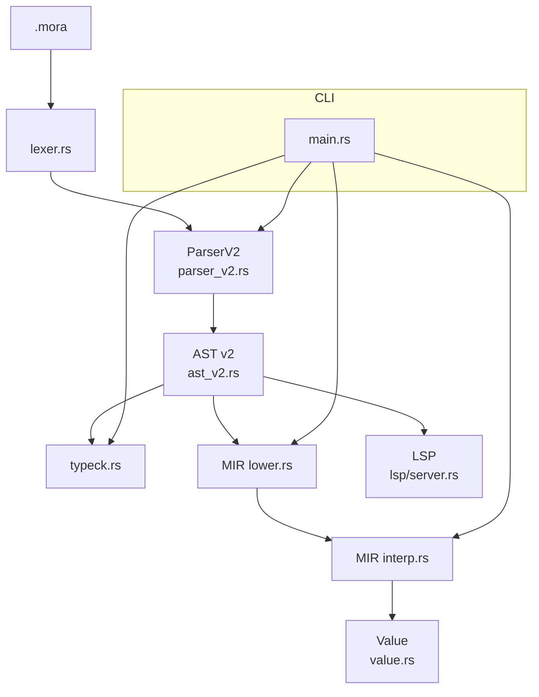
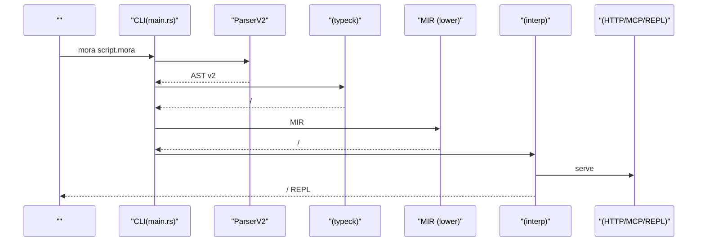
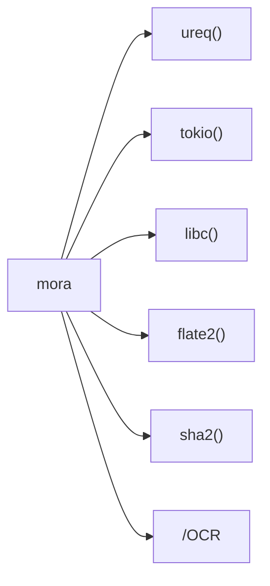

# 

<cite>
****   
- [README.md](file://README.md)
- [Cargo.toml](file://Cargo.toml)
- [src/main.rs](file://src/main.rs)
- [src/lib.rs](file://src/lib.rs)
- [examples/compact_demo.mora](file://examples/compact_demo.mora)
- [examples/mcp_server_demo.mora](file://examples/mcp_server_demo.mora)
- [examples/_legacy/http_server_demo.mora](file://examples/_legacy/http_server_demo.mora)
- [examples/_legacy/orchestrate_demo.mora](file://examples/_legacy/orchestrate_demo.mora)
- [Dockerfile](file://Dockerfile)
- [.github/workflows/release.yml](file://.github/workflows/release.yml)
</cite>

## 
1. 
2. 
3. 
4. 
5. 
6. 
7. 
8. 
9. 
10. 

## 
Mora  AI-native  LLM HTTP/MCP  Agent “” AI 
-  AI 
-  HTTP/MCP 
- /
-  +  MIR 

 Mora  CLI REPLAI HTTP MCP 

## 
CLI  LSP 
- src/main.rs
- src/lib.rs
- examples/*.mora
- Cargo.tomlDockerfile.github/workflows/release.yml

- [src/main.rs:1-120](file://src/main.rs#L1-L120)
- [src/lib.rs:1-55](file://src/lib.rs#L1-L55)

- [src/main.rs:1-120](file://src/main.rs#L1-L120)
- [src/lib.rs:1-55](file://src/lib.rs#L1-L55)

## 
- REPL/MCP 
- ParserV2  AST v2
- MIR v0.52+ 
- AI HTTP/MCP  trace/span
- mora-lsp 

- [src/main.rs:26-120](file://src/main.rs#L26-L120)
- [src/lib.rs:1-55](file://src/lib.rs#L1-L55)

## 

-  .mora  →  →  AST v2 →  → MIR  → 
-  serve HTTP/MCP/REPL
- observe/span record/replay 

- [src/main.rs:26-120](file://src/main.rs#L26-L120)
- [src/main.rs:370-405](file://src/main.rs#L370-L405)

## 

### 
-  Releases  mora  mora-lsp PATH 
-  Rust  cargo build --release 
- Docker  REPL

- [README.md:52-83](file://README.md#L52-L83)
- [Cargo.toml:1-25](file://Cargo.toml#L1-L25)
- [Dockerfile:1-42](file://Dockerfile#L1-L42)

### 
- mora script.mora
-  REPLmora --repl
- mora --check script.mora
-  LSPmora-lsp

- [README.md:66-83](file://README.md#L66-L83)
- [src/main.rs:26-120](file://src/main.rs#L26-L120)

### AI 
-  p"..."  AI 
-  route  with 
- token 

- [README.md:149-181](file://README.md#L149-L181)
- [README.md:229-253](file://README.md#L229-L253)

### HTTP 
-  Router::new() 
-  GET/POSTJSON 

- [examples/_legacy/http_server_demo.mora:1-45](file://examples/_legacy/http_server_demo.mora#L1-L45)

### MCP 
-  McpServer::new()  tool serve()  MCP 
-  Claude Desktop  MCP 

- [examples/mcp_server_demo.mora:1-17](file://examples/mcp_server_demo.mora#L1-L17)

###  Agent 
-  orchestrate  Sequential/Graph/Loop 
-  memory  ai.chat 

- [examples/_legacy/orchestrate_demo.mora:1-115](file://examples/_legacy/orchestrate_demo.mora#L1-L115)

### 
- compress(text, strategy)  summary/head_tail/lossless/auto 
- crush_json  JSON 

- [examples/compact_demo.mora:1-47](file://examples/compact_demo.mora#L1-L47)

### 
- record/replay/diff/list/stats/timeline 
-  snapshot 

- [src/main.rs:407-800](file://src/main.rs#L407-L800)

### 
- 
-  Any 
- 

- [README.md:255-275](file://README.md#L255-L275)
- [src/main.rs:370-405](file://src/main.rs#L370-L405)

### LSP 
-  hovercompletiondefinitionreferencesrenamediagnosticsfoldingsemanticTokens 
- 

- [README.md:276-298](file://README.md#L276-L298)

## 
- moraCLImora-lsp
- ureqHTTPtokio HTTP/MCP libcSO_REUSEADDRflate2sha2OCR/PDF/Markdown/HTML 
- checkpoint-sqlitejitLLVM

- [Cargo.toml:29-102](file://Cargo.toml#L29-L102)

- [Cargo.toml:1-102](file://Cargo.toml#L1-L102)

## 
- v0.52+  MIR 
- observe trace/span  OTEL record/replay 

- [README.md:9-19](file://README.md#L9-L19)
- [README.md:241-253](file://README.md#L241-L253)
- [src/main.rs:407-800](file://src/main.rs#L407-L800)

## 
-  AI API
  -  OPENAI_API_KEY mock 
  -  MORA_AI_BASE_URL 
- 
  - HTTP server  4 
- 
  -  mora --check  MORA_NO_TYPECK=1 
- /
  -  .mora/recordings 
- 
  -  Rust musl  musl-tools

- [README.md:182-191](file://README.md#L182-L191)
- [README.md:222-227](file://README.md#L222-L227)
- [src/main.rs:370-405](file://src/main.rs#L370-L405)
- [src/main.rs:407-800](file://src/main.rs#L407-L800)

## 
Mora  AI  AI  LSP  AI HTTP/MCP  CLI 

## 

### 
- mora script.mora
-  REPLmora --repl
- mora --check script.mora
-  LSPmora-lsp
- //mora record / replay / diff / list / stats / timeline
- MCP mora mcp tool-list / tool-search / toolsets

- [README.md:66-83](file://README.md#L66-L83)
- [src/main.rs:26-120](file://src/main.rs#L26-L120)

### 
- OPENAI_API_KEY AI  = mock 
- MORA_AI_MODELAI 
- MORA_AI_BASE_URLAPI 
- MORA_EMBED_MODELEmbedding 
- MORA_NO_TYPECK 1 

- [README.md:182-191](file://README.md#L182-L191)