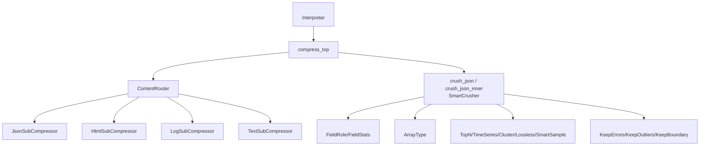
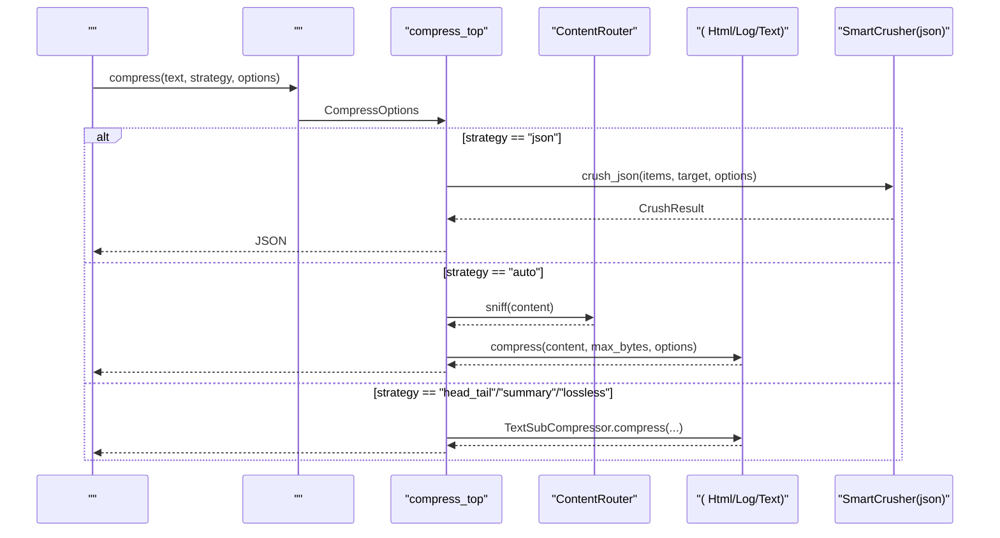
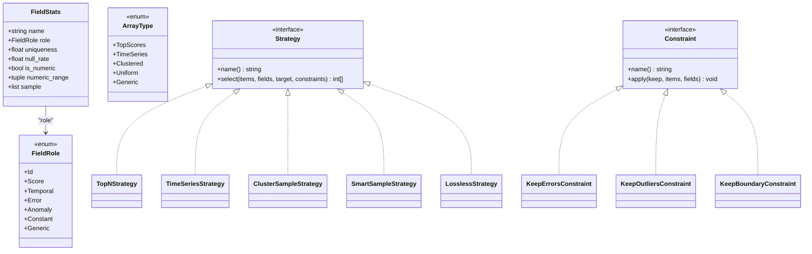
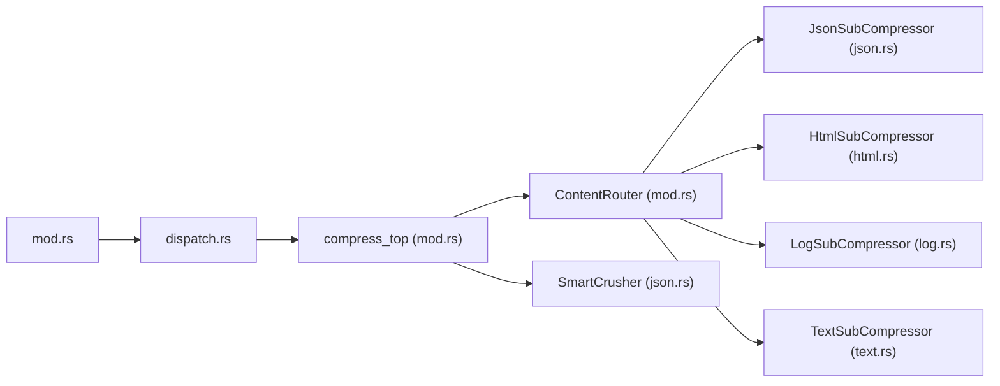

# 

<cite>
****   
- [src/compress/mod.rs](file://src/compress/mod.rs)
- [src/compress/json.rs](file://src/compress/json.rs)
- [src/compress/html.rs](file://src/compress/html.rs)
- [src/compress/log.rs](file://src/compress/log.rs)
- [src/compress/text.rs](file://src/compress/text.rs)
- [src/interpreter/mod.rs](file://src/interpreter/mod.rs)
- [src/interpreter/dispatch.rs](file://src/interpreter/dispatch.rs)
- [examples/compress_demo.mora](file://examples/compress_demo.mora)
- [examples/compact_demo.mora](file://examples/compact_demo.mora)
- [examples/compress_smart_demo.mora](file://examples/compress_smart_demo.mora)
</cite>

## 
1. [](#)
2. [](#)
3. [](#)
4. [](#)
5. [](#)
6. [](#)
7. [](#)
8. [](#)
9. [](#)
10. [](#)
11. [](#)

## 
 Mora 
- HTML JSON SmartCrusher
- 
- 
- AI 

## 
Mora  src/compress “ +  + ”
- SubCompressor traitContentRouterCompressOptions compress_top
- jsonhtmllogtext code
-  Interpreter  compress/crush_json  compress_top




- [src/compress/mod.rs:1-145](file://src/compress/mod.rs#L1-L145)
- [src/compress/json.rs:811-820](file://src/compress/json.rs#L811-L820)
- [src/interpreter/mod.rs:401-405](file://src/interpreter/mod.rs#L401-L405)


- [src/compress/mod.rs:1-145](file://src/compress/mod.rs#L1-L145)
- [src/interpreter/mod.rs:401-405](file://src/interpreter/mod.rs#L401-L405)

## 
- SubCompressor trait sniffcompressorigin 
- ContentRouter sniff  json/code/html/log/text
- CompressOptions
- compress_top strategy  SmartCrusher  TextSubCompressor
- SmartCrusherjson JSON  TopN/TimeSeries/Cluster/Lossless/SmartSample 


- [src/compress/mod.rs:66-145](file://src/compress/mod.rs#L66-L145)
- [src/compress/mod.rs:241-309](file://src/compress/mod.rs#L241-L309)
- [src/compress/json.rs:21-56](file://src/compress/json.rs#L21-L56)
- [src/compress/json.rs:811-820](file://src/compress/json.rs#L811-L820)

## 





- [src/interpreter/mod.rs:401-405](file://src/interpreter/mod.rs#L401-L405)
- [src/compress/mod.rs:241-309](file://src/compress/mod.rs#L241-L309)
- [src/compress/json.rs:1142-1185](file://src/compress/json.rs#L1142-L1185)

## 

### HTML HtmlSubCompressor
-  “<” ≥ 0.5  HTML 0.8
-  quick-xml pull-parser  <script>/<style> 
- 

```mermaid
flowchart TD
Start([" HTML"]) --> Sniff[" '<' <br/> HTML"]
Sniff --> || Parse["quick-xml "]
Parse --> Skip[" script/style "]
Skip --> Extract[" Text "]
Extract --> Trim[""]
Trim --> Mark[" original_size "]
Mark --> End([""])
Sniff --> || Pass[""]
```


- [src/compress/html.rs:20-86](file://src/compress/html.rs#L20-L86)


- [src/compress/html.rs:1-117](file://src/compress/html.rs#L1-117)

### JSON SmartCrusher
-  IdScoreTemporalErrorAnomalyConstantGeneric
- TopScoresTimeSeriesClusteredUniformGeneric
- 
  - TopNStrategy Score  N
  - TimeSeriesStrategy + 
  - ClusterSampleStrategy
  - SmartSampleStrategy+
  - LosslessStrategyCSV schema  Markdown KV schema 
- 
  - KeepErrorsConstraint
  - KeepOutliersConstraint z-score 
  - KeepBoundaryConstraint
- crush_json → crush_json_inner recursive=true 




- [src/compress/json.rs:21-56](file://src/compress/json.rs#L21-L56)
- [src/compress/json.rs:426-597](file://src/compress/json.rs#L426-L597)
- [src/compress/json.rs:620-735](file://src/compress/json.rs#L620-L735)


- [src/compress/json.rs:136-424](file://src/compress/json.rs#L136-L424)
- [src/compress/json.rs:811-820](file://src/compress/json.rs#L811-L820)
- [src/compress/json.rs:822-918](file://src/compress/json.rs#L822-L918)

### TextSubCompressor
- head_tail marker UTF-8  panic
- summary mock  200  +  LLM
- lossless original_size 
-  head_tail0.3/0.3

```mermaid
flowchart TD
In([""]) --> CheckLen{" ≤ max_bytes ?"}
CheckLen --> || Passthrough[""]
CheckLen --> || HeadTail[" head/tail <br/>UTF-8 "]
HeadTail --> Marker["<br/> elided "]
Marker --> Out([""])
```


- [src/compress/text.rs:22-80](file://src/compress/text.rs#L22-L80)
- [src/compress/text.rs:113-146](file://src/compress/text.rs#L113-L146)


- [src/compress/text.rs:1-239](file://src/compress/text.rs#L1-239)

### LogSubCompressor
-  ISO-8601  syslog INFO/WARN/ERROR/DEBUG/FATAL ≥ 0.4 
-  ERROR/FATAL max_bytes/80  ERROR/FATAL 

```mermaid
flowchart TD
Start([""]) --> Sniff[" ISO-8601  syslog "]
Sniff --> IsLog{" ≥ 0.4 ?"}
IsLog --> || Budget[" max_bytes/80 "]
Budget --> Preserve[" ERROR/FATAL "]
Preserve --> Mark[" preserved "]
Mark --> End([""])
IsLog --> || Pass[""]
```


- [src/compress/log.rs:46-110](file://src/compress/log.rs#L46-L110)


- [src/compress/log.rs:1-155](file://src/compress/log.rs#L1-155)

### CodeSubCompressor
-  SubCompressor //


- [src/compress/mod.rs:136-141](file://src/compress/mod.rs#L136-L141)

## 
-  compress/crush_json  compress_top
- compress_top json  SmartCrusher TextSubCompressorauto  ContentRouter 
- SmartCrusher 




- [src/interpreter/mod.rs:401-405](file://src/interpreter/mod.rs#L401-L405)
- [src/interpreter/dispatch.rs:886-899](file://src/interpreter/dispatch.rs#L886-L899)
- [src/compress/mod.rs:241-309](file://src/compress/mod.rs#L241-L309)


- [src/interpreter/mod.rs:401-405](file://src/interpreter/mod.rs#L401-L405)
- [src/interpreter/dispatch.rs:886-899](file://src/interpreter/dispatch.rs#L886-L899)
- [src/compress/mod.rs:241-309](file://src/compress/mod.rs#L241-L309)

## 
-  vs 
  - SmartCrusher  TopN/TimeSeries/Cluster  60%-90%
  - head_tail  lossless  CPU 
- 
  - HTML  quick-xml DOM
  - SmartCrusher ≤5  ≤target
- 
  - UTF-8  head_tail  panic
  - 

[]

## 
- CompressOptions 
  - strategyauto | topn | timeseries | cluster | lossless | smart_sample | head_tail | summary
  - max_bytes head_tail  SmartCrusher  target 
  - target_ratio SmartCrusher  target 
  - head_pct / tail_pct 0.15
  - k_first / k_last
  - lossless_min_savings_ratio 0.15
  - preserve_errors / preserve_outliers / preserve_ids
  - recursive Value Headroom DocumentCompactor 
  - output_formatjson | markdown_kv | csv_schema
- 
  -  auto  jsonSmartCrusher preserve_errors/preserve_outliers 
  -  timeseries 
  -  cluster_sample
  -  lossless schema  CSV schema 
  -  max_bytes  head_pct/tail_pct
  -  CPU 


- [src/compress/mod.rs:14-64](file://src/compress/mod.rs#L14-L64)
- [src/compress/mod.rs:190-239](file://src/compress/mod.rs#L190-L239)
- [src/compress/json.rs:811-820](file://src/compress/json.rs#L811-L820)

## 
- 
  -  head_tail  lossless  max_bytes 
- 
  -  LogSubCompressor
  -  SmartCrusher
- AI 
  -  compress(summary/head_tail/lossless)  token 
  -  JSON  crush_json


- [examples/compress_demo.mora:1-26](file://examples/compress_demo.mora#L1-L26)
- [examples/compact_demo.mora:1-47](file://examples/compact_demo.mora#L1-L47)
- [examples/compress_smart_demo.mora:1-47](file://examples/compress_smart_demo.mora#L1-L47)

## 
-  head_tail panic
  -  UTF-8  slice panic
  - floor_char_boundary 
- JSON 
  -  JSON  crush.json 
  -  JSON  compress("auto") 
- 
  - 
  -  auto 


- [src/compress/text.rs:22-80](file://src/compress/text.rs#L22-L80)
- [src/compress/json.rs:1142-1185](file://src/compress/json.rs#L1142-L1185)
- [src/compress/mod.rs:241-309](file://src/compress/mod.rs#L241-L309)

## 
Mora  SubCompressor  ContentRouter  SmartCrusher  JSON  SmartCrusher head_tail 