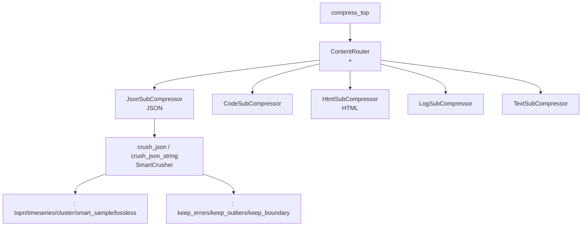
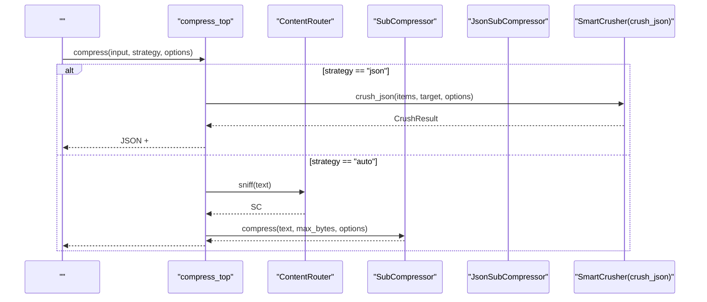
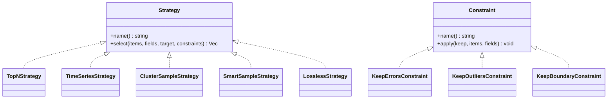
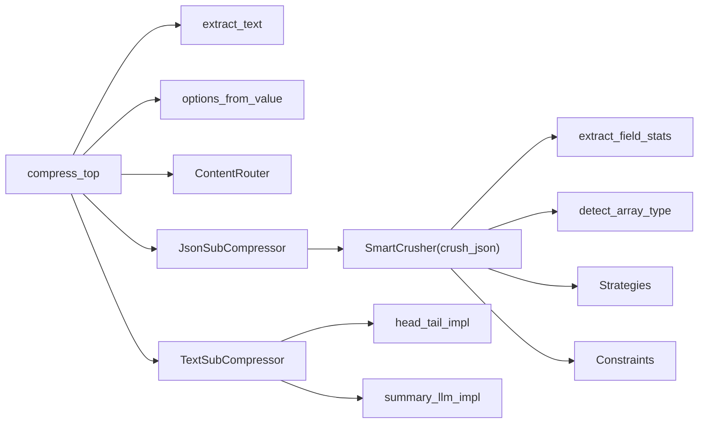

# 

<cite>
****   
- [src/compress/mod.rs](file://src/compress/mod.rs)
- [src/compress/json.rs](file://src/compress/json.rs)
- [src/compress/text.rs](file://src/compress/text.rs)
- [src/compress/html.rs](file://src/compress/html.rs)
- [src/compress/log.rs](file://src/compress/log.rs)
- [examples/compact_demo.mora](file://examples/compact_demo.mora)
- [examples/compress_demo.mora](file://examples/compress_demo.mora)
- [examples/compress_smart_demo.mora](file://examples/compress_smart_demo.mora)
</cite>

## 
1. [](#)
2. [](#)
3. [](#)
4. [](#)
5. [](#)
6. [](#)
7. [](#)
8. [](#)
9. [](#)
10. [](#)

## 
 Mora  SmartCrusher  JSON head_tailsummarylosslessauto

## 
 src/compress “ +  + ”
-  compress_top 
- ContentRouter  sniff  SubCompressor
-  SubCompressor json/code/html/log/text
- SmartCrusherjson.rs List-of-Dict 




- [src/compress/mod.rs:86-134](file://src/compress/mod.rs#L86-L134)
- [src/compress/json.rs:1142-1185](file://src/compress/json.rs#L1142-L1185)
- [src/compress/text.rs:108-146](file://src/compress/text.rs#L108-L146)


- [src/compress/mod.rs:1-142](file://src/compress/mod.rs#L1-L142)
- [src/compress/json.rs:1-113](file://src/compress/json.rs#L1-L113)

## 
- CompressOptions//ID 
- SubCompressor trait sniffcompressorigin 
- ContentRouter SubCompressor sniff ≥0.6
- TextSubCompressor head_tailsummarymocklossless 
- JsonSubCompressor JSON  Value::List SmartCrusher 
- SmartCrusherjson.rs List-of-Dict  CrushResult


- [src/compress/mod.rs:14-84](file://src/compress/mod.rs#L14-L84)
- [src/compress/mod.rs:86-134](file://src/compress/mod.rs#L86-L134)
- [src/compress/text.rs:108-146](file://src/compress/text.rs#L108-L146)
- [src/compress/json.rs:1142-1185](file://src/compress/json.rs#L1142-L1185)

## 
SmartCrusher 
- Value::List JSON  target  max_bytes/target_ratio 
- extract_field_stats 
- detect_field_role  Id/Score/Temporal/Error/Anomaly/Constant/Generic
- detect_array_type  TopScores/TimeSeries/Clustered/Uniform/Generic
-  options.strategy  auto  TopN/TimeSeries/ClusterSample/SmartSample/Lossless
- KeepErrors/KeepOutliers/KeepBoundary 
- CrushResult  itemsstrategy_usedarray_typesavings_ratiobyte_estimate 




- [src/compress/mod.rs:241-309](file://src/compress/mod.rs#L241-L309)
- [src/compress/json.rs:811-916](file://src/compress/json.rs#L811-L916)


- [src/compress/mod.rs:241-309](file://src/compress/mod.rs#L241-L309)
- [src/compress/json.rs:811-916](file://src/compress/json.rs#L811-L916)

## 

### SmartCrusherjson.rs
- 
  - TemporalISO-8601/Unix 
  - Error ERROR_KEYWORDS false  success/ok/passed
  - Anomaly z-score > 3σ  1-5% < 5%
  - Score 0-1  0-100
  - IdUUID 
  - Constant/Generic
- 
  - TopScores Score 
  - TimeSeries Temporal 
  - Clustereduniqueness < 0.3
  - Uniform Constant/Generic
  - Generic
- 
  - TopNStrategy Score  N Score  SmartSample
  - TimeSeriesStrategy 1/3
  - ClusterSampleStrategy
  - SmartSampleStrategy
  - LosslessStrategy N  try_lossless_compact  CSV-schema/Markdown-KV
- 
  - KeepErrorsConstraint
  - KeepOutliersConstraint Anomaly  z-score 
  - KeepBoundaryConstraint k_first/k_last 
- try_lossless_compact  schema  csv-schema  markdown-kv 
-  compactcompact_value_recursive  DFS  Value  min_items  List 




- [src/compress/json.rs:58-76](file://src/compress/json.rs#L58-L76)
- [src/compress/json.rs:428-597](file://src/compress/json.rs#L428-L597)
- [src/compress/json.rs:620-735](file://src/compress/json.rs#L620-L735)


- [src/compress/json.rs:135-332](file://src/compress/json.rs#L135-L332)
- [src/compress/json.rs:401-424](file://src/compress/json.rs#L401-L424)
- [src/compress/json.rs:428-597](file://src/compress/json.rs#L428-L597)
- [src/compress/json.rs:620-735](file://src/compress/json.rs#L620-L735)
- [src/compress/json.rs:741-809](file://src/compress/json.rs#L741-L809)
- [src/compress/json.rs:918-1105](file://src/compress/json.rs#L918-L1105)

### text.rs
- head_tail_impl head_pct/tail_pct  elided markerUTF-8  floor_char_boundary 
- summary_llm_impl mock  200  mock_mode 
- TextSubCompressor options.strategy  head_tail/summary/lossless head_tail 0.3/0.3

```mermaid
flowchart TD
Start([" head_tail_impl"]) --> CheckSize[" ≤ max_bytes?"]
CheckSize --> || ReturnOrig[""]
CheckSize --> || CalcPct[" head_n/tail_n"]
CalcPct --> Align["UTF-8 "]
Align --> Slice[" head/tail"]
Slice --> Elide[" elided "]
Elide --> Format[" head + marker + tail"]
Format --> End([""])
```


- [src/compress/text.rs:28-80](file://src/compress/text.rs#L28-L80)


- [src/compress/text.rs:108-146](file://src/compress/text.rs#L108-L146)

### HTML html.rs
- sniff `<`  ≥ 0.5 → 0.8 
- compressquick-xml pull-parser  script/style  max_bytes 


- [src/compress/html.rs:1-86](file://src/compress/html.rs#L1-L86)

### log.rs
- sniffISO-8601  syslog  ≥ 0.4 → 0.8
- compress ERROR/FATAL  preserved 


- [src/compress/log.rs:1-110](file://src/compress/log.rs#L1-L110)

### mod.rs
- extract_text Value String/Conversation/List of Dict{role,content}
- options_from_value Value::Dict  CompressOptions/
- compress_top"json"  SmartCrusher"auto"  ContentRouter"head_tail"/"summary"/"lossless"  TextSubCompressor


- [src/compress/mod.rs:146-239](file://src/compress/mod.rs#L146-L239)
- [src/compress/mod.rs:241-309](file://src/compress/mod.rs#L241-L309)

## 
- compress_top  extract_textoptions_from_valueContentRouterTextSubCompressorJsonSubCompressor
- JsonSubCompressor  flow::json_to_value/value_to_json  SmartCrusher
- SmartCrusher  extract_field_statsdetect_array_type
- TextSubCompressor  head_tail_implsummary_llm_impl
- HtmlSubCompressor  quick-xml
- LogSubCompressor  ISO-8601/syslog 




- [src/compress/mod.rs:241-309](file://src/compress/mod.rs#L241-L309)
- [src/compress/json.rs:811-916](file://src/compress/json.rs#L811-L916)


- [src/compress/mod.rs:241-309](file://src/compress/mod.rs#L241-L309)
- [src/compress/json.rs:811-916](file://src/compress/json.rs#L811-L916)

## 
- estimate_bytes  streaming byte estimator value_byte_size  UTF-8 
- items ≤ 5  items ≤ target 
-  compactcompact_value_recursive  DFS min_items 
- head_tail  O(n)HTML/ max_bytes 
- auto  sniff  SCSmartCrusher  O(N·F)


- [src/compress/json.rs:950-1002](file://src/compress/json.rs#L950-L1002)
- [src/compress/json.rs:822-852](file://src/compress/json.rs#L822-L852)
- [src/compress/json.rs:918-1105](file://src/compress/json.rs#L918-L1105)
- [src/compress/text.rs:51-80](file://src/compress/text.rs#L51-L80)
- [src/compress/html.rs:33-81](file://src/compress/html.rs#L33-L81)
- [src/compress/log.rs:67-105](file://src/compress/log.rs#L67-L105)

## 
-  head_tail  panic floor_char_boundary  UTF-8 
- JSON crush_json_string 
- auto sniff  ≥ 0.6 SC  None sniff
- try_lossless_compact  schema  SmartSample
- / preserve_errors/preserve_outliers  ERROR_KEYWORDS  z-score 


- [src/compress/text.rs:28-80](file://src/compress/text.rs#L28-L80)
- [src/compress/json.rs:1110-1126](file://src/compress/json.rs#L1110-L1126)
- [src/compress/mod.rs:119-134](file://src/compress/mod.rs#L119-L134)
- [src/compress/json.rs:741-809](file://src/compress/json.rs#L741-L809)

## 
Mora “ +  + SmartCrusher” JSON SmartCrusher  head_tail/summary/lossless HTML/HTML 

## 
-  JSON 
  -  Score  → topn
  -  Temporal  → timeseries
  - uniqueness < 0.3→ cluster
  -  Constant/Generic → lossless CSV-schema/Markdown-KV
  -  → smart_sample
- 
  -  → summary mock
  -  → head_tail
  -  → lossless original_size 
- 
  -  auto ContentRouter  sniff  SC
  -  JSON//HTML/
- 
  - savings_ratio = 1 - (kept_items / total_items)
  - byte_estimate 
- 
  -  topn/timeseries/cluster
  - 
  -  preserve_errors/preserve_outliers 
  -  min_items  compact


- [src/compress/json.rs:861-884](file://src/compress/json.rs#L861-L884)
- [src/compress/json.rs:906-916](file://src/compress/json.rs#L906-L916)
- [src/compress/mod.rs:241-309](file://src/compress/mod.rs#L241-L309)