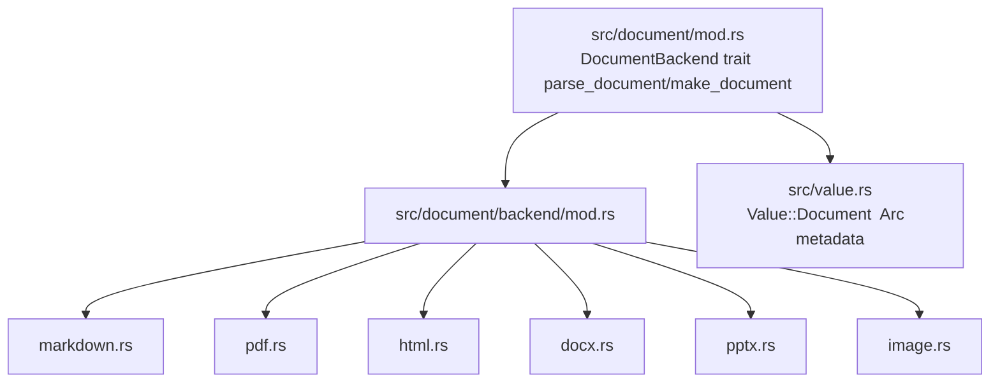
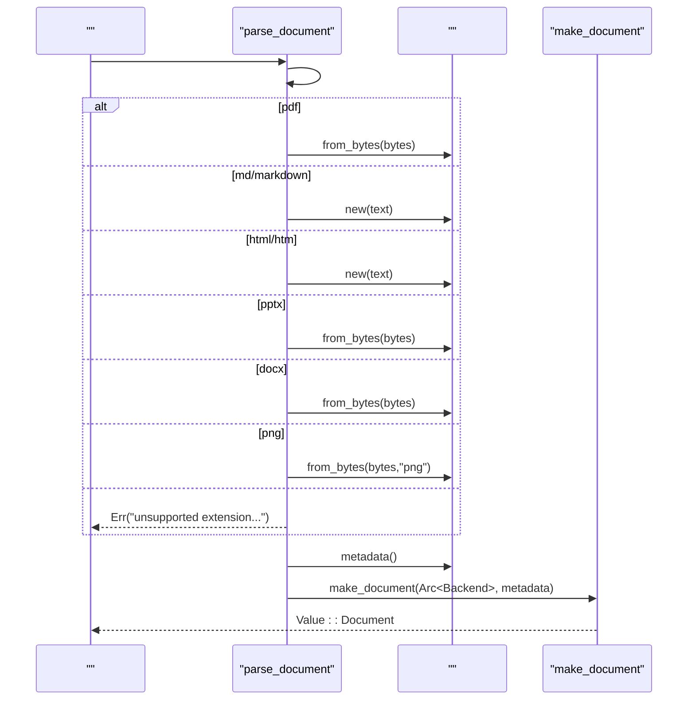

# 

<cite>
****   
- [src/document/mod.rs](file://src/document/mod.rs)
- [src/document/backend/mod.rs](file://src/document/backend/mod.rs)
- [src/document/backend/markdown.rs](file://src/document/backend/markdown.rs)
- [src/document/backend/pdf.rs](file://src/document/backend/pdf.rs)
- [src/document/backend/html.rs](file://src/document/backend/html.rs)
- [src/document/backend/docx.rs](file://src/document/backend/docx.rs)
- [src/document/backend/pptx.rs](file://src/document/backend/pptx.rs)
- [src/document/backend/image.rs](file://src/document/backend/image.rs)
- [src/value.rs](file://src/value.rs)
- [Cargo.toml](file://Cargo.toml)
</cite>

## 
1. [](#)
2. [](#)
3. [](#)
4. [](#)
5. [](#)
6. [](#)
7. [](#)
8. [](#)
9. [](#)
10. [](#)

## 
 Mora “” DocumentBackend trait 

## 
 src/document “ IR + ”
- 
- backend 
- Value  Document  Arc<dyn DocumentBackend> 




- [src/document/mod.rs:1-146](file://src/document/mod.rs#L1-L146)
- [src/document/backend/mod.rs:1-10](file://src/document/backend/mod.rs#L1-L10)
- [src/value.rs:257-263](file://src/value.rs#L257-L263)


- [src/document/mod.rs:1-146](file://src/document/mod.rs#L1-L146)
- [src/document/backend/mod.rs:1-10](file://src/document/backend/mod.rs#L1-L10)
- [src/value.rs:257-263](file://src/value.rs#L257-L263)

## 
- DocumentBackend trait PDF/Markdown/HTML/DOCX/PPTX/
- make_document Value::Document
- parse_document Value::Document
- Value::Document Arc<dyn DocumentBackend>  HashMap<String, Value> 


- [src/document/mod.rs:14-43](file://src/document/mod.rs#L14-L43)
- [src/document/mod.rs:47-146](file://src/document/mod.rs#L47-L146)
- [src/value.rs:257-263](file://src/value.rs#L257-L263)

## 
DocumentBackend  trait Value::Document  origin/pages/markdown/text/metadata/blocks  IR parse_document 

```mermaid
classDiagram
class DocumentBackend {
+origin() &str
+pages() Result<Value,String>
+markdown() Result<String,String>
+text() Result<String,String>
+metadata() Result<Value,String>
+blocks() Result<Value,String>
}
class MarkdownBackend
class PdfBackend
class HtmlBackend
class DocxBackend
class PptxBackend
class ImageBackend
class Value {
<<enum>>
+Document{backend, metadata}
}
DocumentBackend <|.. MarkdownBackend
DocumentBackend <|.. PdfBackend
DocumentBackend <|.. HtmlBackend
DocumentBackend <|.. DocxBackend
DocumentBackend <|.. PptxBackend
DocumentBackend <|.. ImageBackend
Value --> DocumentBackend : "Value : : Document "
```


- [src/document/mod.rs:14-34](file://src/document/mod.rs#L14-L34)
- [src/document/backend/markdown.rs:24-36](file://src/document/backend/markdown.rs#L24-L36)
- [src/document/backend/pdf.rs:25-31](file://src/document/backend/pdf.rs#L25-L31)
- [src/document/backend/html.rs:28-44](file://src/document/backend/html.rs#L28-L44)
- [src/document/backend/docx.rs:44-50](file://src/document/backend/docx.rs#L44-L50)
- [src/document/backend/pptx.rs:39-45](file://src/document/backend/pptx.rs#L39-L45)
- [src/document/backend/image.rs:97-105](file://src/document/backend/image.rs#L97-L105)
- [src/value.rs:257-263](file://src/value.rs#L257-L263)

## 

### DocumentBackend trait 
- origin():  "pdf"/"markdown"/"html"/"docx"/"pptx"/"image"
- pages():  IR  page_nowidthheightblocksblocks 
- markdown():  Markdown  PDF/PPTX MVP  text()
- text(): 
- metadata():  Dict originpagessize titleauthorformatocr_engine 
- blocks(): 


- pages(): Value::List Value::Dict page_nowidthheightblocks
- blocks(): Value::List Value::Dict kindbboxspansspans  Value::List Value::Dict textbboxscore
- metadata(): Value::Dict String Value


-  Result<T, String>
-  "document.parse: ..."


- trait  Send + Sync
-  Value


- [src/document/mod.rs:14-34](file://src/document/mod.rs#L14-L34)
- [src/document/mod.rs:47-146](file://src/document/mod.rs#L47-L146)
- [src/document/backend/markdown.rs:38-126](file://src/document/backend/markdown.rs#L38-L126)
- [src/document/backend/pdf.rs:66-166](file://src/document/backend/pdf.rs#L66-L166)
- [src/document/backend/html.rs:118-244](file://src/document/backend/html.rs#L118-L244)
- [src/document/backend/docx.rs:137-228](file://src/document/backend/docx.rs#L137-L228)
- [src/document/backend/pptx.rs:126-218](file://src/document/backend/pptx.rs#L126-L218)
- [src/document/backend/image.rs:203-235](file://src/document/backend/image.rs#L203-L235)

### Markdown 
- markdown() text() blocks()  heading/paragraph/code metadata()  origin/pages/sizepages() blocks  blocks()
- O(n) n 
- Send+Sync 


- [src/document/backend/markdown.rs:1-178](file://src/document/backend/markdown.rs#L1-L178)

### PDF 
-  lopdf  pdf-extract MVP  text blockspan metadata()  origin/pages/size
-  O(n) O(m) per_page_text  OCR/
- Arc 


- [src/document/backend/pdf.rs:1-197](file://src/document/backend/pdf.rs#L1-L197)

### HTML 
- quick-xml  <title>  <meta name="author">text()  script/style blocks()  p/h1-h6/pre/code metadata()  origin/pages/size/title/author
- O(n)
- Send+Sync


- [src/document/backend/html.rs:1-299](file://src/document/backend/html.rs#L1-L299)

### DOCX 
- undoc  OOXML plain_textmetadata()  core propertiespages() blocks markdown()/text() 
-  O(p)p  paragraphs 
- Arc 


- [src/document/backend/docx.rs:1-261](file://src/document/backend/docx.rs#L1-L261)

### PPTX 
- undoc  OOXML slide metadata()  origin/pages/size  core propertiesmarkdown()  slidesblocks()  slide 
-  O(s)s  per_slide_text
- Arc 


- [src/document/backend/pptx.rs:1-255](file://src/document/backend/pptx.rs#L1-L255)

###  OCR 
- image  PNGocrs+rten  OCR OnceLock metadata()  format/width/height/ocr_engine/sizepages()  blocksmarkdown()/text()  OCR 
- OCR 
- OnceLock ImageBackend Send+Sync


- [src/document/backend/image.rs:1-417](file://src/document/backend/image.rs#L1-L417)

### 
- parse_document metadata()  path  make_document  Value::Document
- make_document Arc<dyn DocumentBackend>  metadata  Value::Document




- [src/document/mod.rs:47-146](file://src/document/mod.rs#L47-L146)
- [src/document/mod.rs:38-43](file://src/document/mod.rs#L38-L43)


- [src/document/mod.rs:47-146](file://src/document/mod.rs#L47-L146)
- [src/document/mod.rs:38-43](file://src/document/mod.rs#L38-L43)

## 
- 
  - PDFlopdfpdf-extract
  - Markdownpulldown-cmark
  - HTMLquick-xml
  - Officeundocdocxpptx
  -  OCRocrsrtenimage
-  Cargo.toml 

```mermaid
graph LR
subgraph ""
MD["MarkdownBackend"]
PDF["PdfBackend"]
HTML["HtmlBackend"]
DOCX["DocxBackend"]
PPTX["PptxBackend"]
IMG["ImageBackend"]
end
subgraph ""
PM["pulldown-cmark"]
LP["lopdf / pdf-extract"]
QX["quick-xml"]
UD["undoc(docx,pptx)"]
OC["ocrs / rten / image"]
end
MD --> PM
PDF --> LP
HTML --> QX
DOCX --> UD
PPTX --> UD
IMG --> OC
```


- [Cargo.toml:61-83](file://Cargo.toml#L61-L83)
- [src/document/backend/markdown.rs:18-21](file://src/document/backend/markdown.rs#L18-L21)
- [src/document/backend/pdf.rs:16-18](file://src/document/backend/pdf.rs#L16-L18)
- [src/document/backend/html.rs:19-25](file://src/document/backend/html.rs#L19-L25)
- [src/document/backend/docx.rs:31-33](file://src/document/backend/docx.rs#L31-L33)
- [src/document/backend/pptx.rs:29-31](file://src/document/backend/pptx.rs#L29-L31)
- [src/document/backend/image.rs:37-46](file://src/document/backend/image.rs#L37-L46)


- [Cargo.toml:61-83](file://Cargo.toml#L61-L83)

## 
-  PDF  per_page_textDOCX/PPTX / IO 
-  Valuepages()/blocks()/metadata()  Value
- /HTML/Markdown  DOM 
- OCR ImageBackend  OnceLock  ocrs 
- trait  Send+SyncValue::Document  Arc 

[]

## 
- parse_document 
-  from_bytes/new  "document.parse:" 
- OCR ImageBackend  MORA_OCR_MODELS_DIR 
-  best-effort 


- [src/document/mod.rs:140-146](file://src/document/mod.rs#L140-L146)
- [src/document/backend/pdf.rs:38-63](file://src/document/backend/pdf.rs#L38-L63)
- [src/document/backend/image.rs:84-95](file://src/document/backend/image.rs#L84-L95)

## 
DocumentBackend  IR trait  parse_document 

[]

## 

### 
-  src/document/backend  custom.rs DocumentBackend trait
- 
  -  bytes
  -  origin() 
  -  pages()/blocks()/metadata()/markdown()/text()


- [src/document/backend/mod.rs:1-10](file://src/document/backend/mod.rs#L1-L10)
- [src/document/backend/markdown.rs:24-36](file://src/document/backend/markdown.rs#L24-L36)
- [src/document/backend/pdf.rs:25-31](file://src/document/backend/pdf.rs#L25-L31)
- [src/document/backend/html.rs:28-44](file://src/document/backend/html.rs#L28-L44)
- [src/document/backend/docx.rs:44-50](file://src/document/backend/docx.rs#L44-L50)
- [src/document/backend/pptx.rs:39-45](file://src/document/backend/pptx.rs#L39-L45)
- [src/document/backend/image.rs:97-105](file://src/document/backend/image.rs#L97-L105)

### 
-  Cargo.toml  dependencies  OCR 
-  features 


- [Cargo.toml:61-83](file://Cargo.toml#L61-L83)

### 
-  parse_document  metadata()  path  make_document  Value::Document
- 


- [src/document/mod.rs:47-146](file://src/document/mod.rs#L47-L146)

### 
-  origin()/metadata()/blocks() 
-  fixtures 


- [src/document/backend/markdown.rs:142-178](file://src/document/backend/markdown.rs#L142-L178)
- [src/document/backend/pdf.rs:168-197](file://src/document/backend/pdf.rs#L168-L197)
- [src/document/backend/html.rs:246-299](file://src/document/backend/html.rs#L246-L299)
- [src/document/backend/docx.rs:230-261](file://src/document/backend/docx.rs#L230-L261)
- [src/document/backend/pptx.rs:220-255](file://src/document/backend/pptx.rs#L220-L255)
- [src/document/backend/image.rs:237-320](file://src/document/backend/image.rs#L237-L320)

### 
-  IO 
-  Value
-  Arc/Mutex  OnceLock
-  OCR OnceLock


- [src/document/backend/image.rs:118-145](file://src/document/backend/image.rs#L118-L145)
- [src/document/backend/pdf.rs:1-16](file://src/document/backend/pdf.rs#L1-L16)
- [src/document/backend/html.rs:1-17](file://src/document/backend/html.rs#L1-L17)
- [src/document/backend/markdown.rs:1-15](file://src/document/backend/markdown.rs#L1-L15)

### 
-  String 
-  "document.parse: ..." 
- 


- [src/document/mod.rs:140-146](file://src/document/mod.rs#L140-L146)
- [src/document/backend/pdf.rs:38-63](file://src/document/backend/pdf.rs#L38-L63)
- [src/document/backend/image.rs:84-95](file://src/document/backend/image.rs#L84-L95)