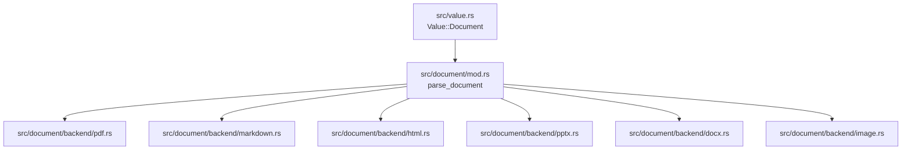
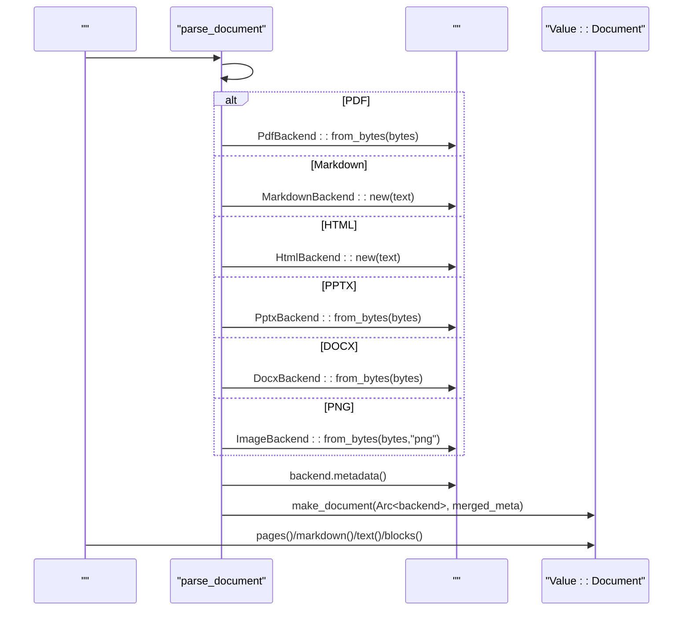
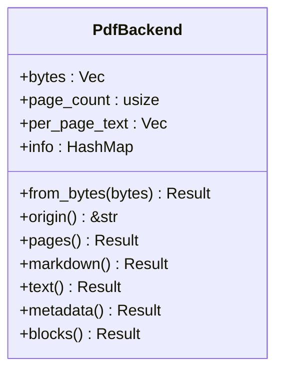
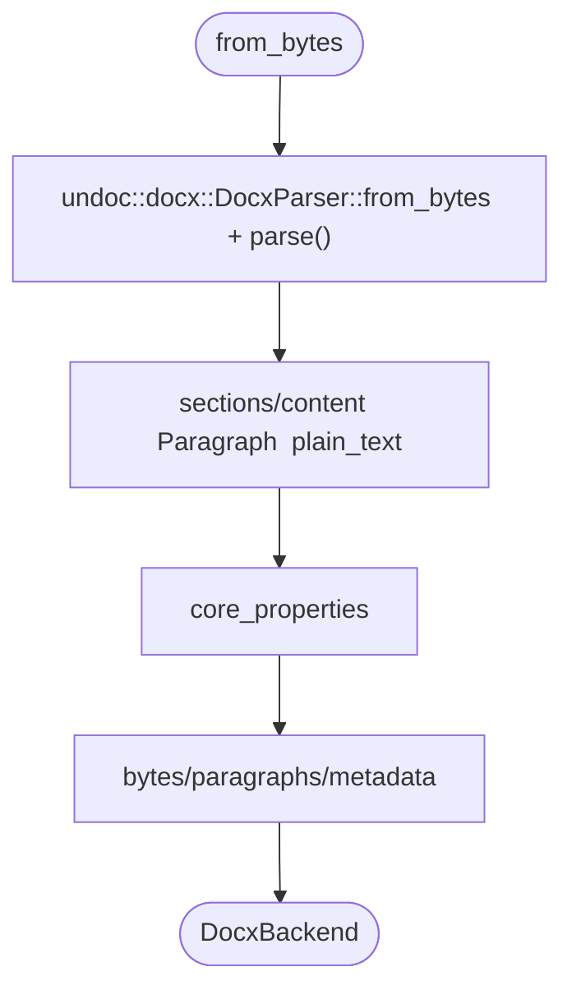
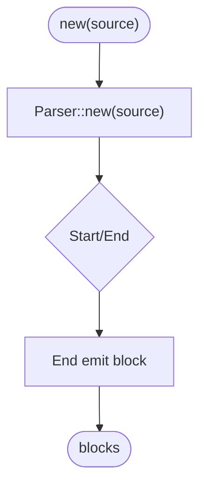
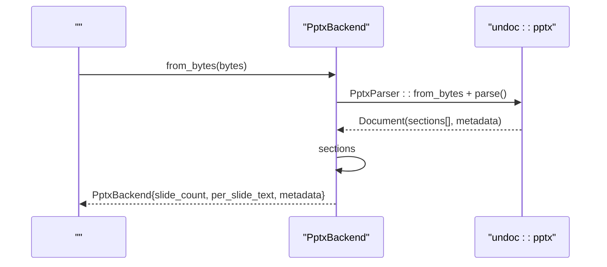
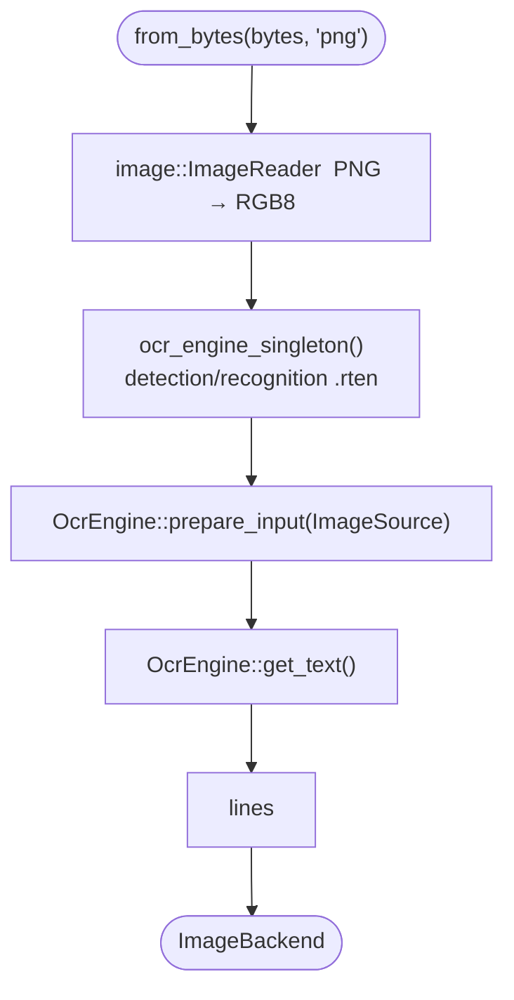
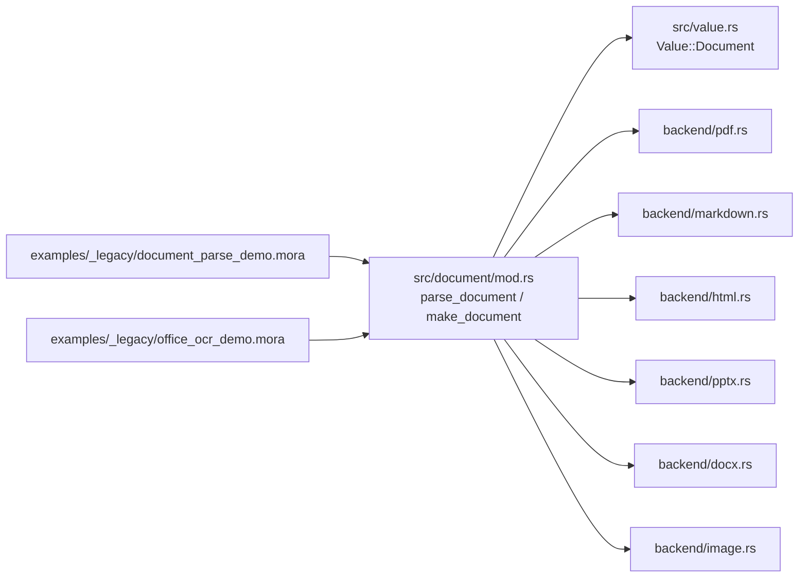

# 

<cite>
****
- [src/document/mod.rs](file://src/document/mod.rs)
- [src/document/backend/mod.rs](file://src/document/backend/mod.rs)
- [src/document/backend/pdf.rs](file://src/document/backend/pdf.rs)
- [src/document/backend/docx.rs](file://src/document/backend/docx.rs)
- [src/document/backend/html.rs](file://src/document/backend/html.rs)
- [src/document/backend/markdown.rs](file://src/document/backend/markdown.rs)
- [src/document/backend/pptx.rs](file://src/document/backend/pptx.rs)
- [src/document/backend/image.rs](file://src/document/backend/image.rs)
- [src/value.rs](file://src/value.rs)
- [examples/_legacy/document_parse_demo.mora](file://examples/_legacy/document_parse_demo.mora)
- [examples/_legacy/office_ocr_demo.mora](file://examples/_legacy/office_ocr_demo.mora)
</cite>

## 
1. [](#)
2. [](#)
3. [](#)
4. [](#)
5. [](#)
6. [](#)
7. [](#)
8. [](#)
9. [](#)
10. [](#)

## 
 Mora “” DocumentBackend trait  PDFWordHTMLMarkdownPPT  OCR  origin()pages()markdown()text()metadata()blocks()  Value::Document 

## 
 src/document “”
- src/document/mod.rs
- src/document/backend/{pdf,docx,html,markdown,pptx,image}.rs
- src/value.rsValue::Document




- [src/document/mod.rs:45-146](file://src/document/mod.rs#L45-L146)
- [src/document/backend/pdf.rs:1-64](file://src/document/backend/pdf.rs#L1-L64)
- [src/document/backend/markdown.rs:1-36](file://src/document/backend/markdown.rs#L1-L36)
- [src/document/backend/html.rs:1-44](file://src/document/backend/html.rs#L1-L44)
- [src/document/backend/pptx.rs:1-124](file://src/document/backend/pptx.rs#L1-L124)
- [src/document/backend/docx.rs:1-135](file://src/document/backend/docx.rs#L1-L135)
- [src/document/backend/image.rs:1-201](file://src/document/backend/image.rs#L1-L201)
- [src/value.rs:257-263](file://src/value.rs#L257-L263)


- [src/document/mod.rs:1-233](file://src/document/mod.rs#L1-L233)
- [src/document/backend/mod.rs:1-10](file://src/document/backend/mod.rs#L1-L10)
- [src/value.rs:257-263](file://src/value.rs#L257-L263)

## 
- DocumentBackend trait origin()pages()markdown()text()metadata()blocks() Value
- parse_document  metadata()  path  Value::Document
- Value::Document Arc<dyn DocumentBackend>  metadata 


- [src/document/mod.rs:14-34](file://src/document/mod.rs#L14-L34)
- [src/document/mod.rs:45-146](file://src/document/mod.rs#L45-L146)
- [src/value.rs:257-263](file://src/value.rs#L257-L263)

## 
 IR 




- [src/document/mod.rs:45-146](file://src/document/mod.rs#L45-L146)
- [src/document/backend/pdf.rs:33-64](file://src/document/backend/pdf.rs#L33-L64)
- [src/document/backend/markdown.rs:29-36](file://src/document/backend/markdown.rs#L29-L36)
- [src/document/backend/html.rs:35-44](file://src/document/backend/html.rs#L35-L44)
- [src/document/backend/pptx.rs:47-124](file://src/document/backend/pptx.rs#L47-L124)
- [src/document/backend/docx.rs:52-135](file://src/document/backend/docx.rs#L52-L135)
- [src/document/backend/image.rs:147-201](file://src/document/backend/image.rs#L147-L201)
- [src/document/mod.rs:36-43](file://src/document/mod.rs#L36-L43)

## 

### DocumentBackend
- origin():  "pdf""markdown""html""pptx""docx""image"
- pages():  IR  List<Page dict> page_nowidthheightblocks Block  kindbboxspans Span  textbboxscore
- markdown():  Markdown 
- text(): 
- metadata():  Dict originpagessize titleauthor 
- blocks(): 


- [src/document/mod.rs:14-34](file://src/document/mod.rs#L14-L34)

### PDF PdfBackend
- lopdf  PDF pdf-extract 
- MVP  text span  bbox
-  per_page_text text()/markdown() 
- origin="pdf"pages=size=info 




- [src/document/backend/pdf.rs:25-64](file://src/document/backend/pdf.rs#L25-L64)
- [src/document/backend/pdf.rs:66-166](file://src/document/backend/pdf.rs#L66-L166)


- [src/document/backend/pdf.rs:1-197](file://src/document/backend/pdf.rs#L1-L197)

### Word DocxBackend
- undoc 0.5.2 OOXML  Rust 
-  Section→Block::Paragraph plain_text() 
- DOCX  text 
-  core properties  titleauthorsubjectdescriptioncreatedmodifiedapplicationlast_modified_bykeywordspage_countword_count 




- [src/document/backend/docx.rs:52-135](file://src/document/backend/docx.rs#L52-L135)


- [src/document/backend/docx.rs:1-261](file://src/document/backend/docx.rs#L1-L261)

### HTML HtmlBackend
-  quick-xml pull-parser 
-  <title>  <meta name="author">
-  <script>/<style> 
-  <p><h1>-<h6><pre><code>  text/heading/code 
- blocks  blocks() 

```mermaid
flowchart TD
S([" new(source)"]) --> ScanMeta[" title/meta author"]
ScanMeta --> Store[" source/title/author"]
Store --> T(["text() "])
T --> SkipJS[" script/style "]
SkipJS --> JoinText[" Event::Text "]
JoinText --> R([""])
```


- [src/document/backend/html.rs:35-88](file://src/document/backend/html.rs#L35-L88)
- [src/document/backend/html.rs:137-174](file://src/document/backend/html.rs#L137-L174)


- [src/document/backend/html.rs:1-299](file://src/document/backend/html.rs#L1-L299)

### Markdown MarkdownBackend
- pulldown-cmark 
- 
  - markdown() 
  - text()  Event::Text
  - blocks()  Tag::Heading/Tag::CodeBlock/Tag::Paragraph  heading/text/code 
- blocks  blocks() 




- [src/document/backend/markdown.rs:29-36](file://src/document/backend/markdown.rs#L29-L36)
- [src/document/backend/markdown.rs:84-125](file://src/document/backend/markdown.rs#L84-L125)


- [src/document/backend/markdown.rs:1-178](file://src/document/backend/markdown.rs#L1-L178)

### PPT PptxBackend
- undoc 0.5.2PPTX  slides  Sections
-  doc.sections Section  Paragraph  plain_text()  per_slide_text
-  16:9 960×540 text 
-  core properties  titleauthorsubjectdescriptioncreatedmodifiedapplicationkeywords 




- [src/document/backend/pptx.rs:47-124](file://src/document/backend/pptx.rs#L47-L124)


- [src/document/backend/pptx.rs:1-255](file://src/document/backend/pptx.rs#L1-L255)

###  OCR ImageBackend
- image crate  PNG RGB8
- OCR ocrs  rten ONNX  .rten 
- 
  1) MORA_OCR_MODELS_DIR 
  2) $XDG_DATA_HOME/mora/ocr/
  3) $HOME/.local/share/mora/ocr/
  4) %LOCALAPPDATA%\mora\ocr\Windows
-  OnceLock  OcrEngine
- lines markdown()/text() 




- [src/document/backend/image.rs:147-201](file://src/document/backend/image.rs#L147-L201)
- [src/document/backend/image.rs:123-145](file://src/document/backend/image.rs#L123-L145)
- [src/document/backend/image.rs:59-95](file://src/document/backend/image.rs#L59-L95)


- [src/document/backend/image.rs:1-417](file://src/document/backend/image.rs#L1-L417)

## 
- parse_document  path  metadata
- make_document  Arc<dyn DocumentBackend>  metadata  Value::Document
- document_parse_demo.mora  office_ocr_demo.mora  document.parse  metadata/markdown/text/blocks




- [src/document/mod.rs:45-146](file://src/document/mod.rs#L45-L146)
- [src/value.rs:257-263](file://src/value.rs#L257-L263)
- [examples/_legacy/document_parse_demo.mora:1-35](file://examples/_legacy/document_parse_demo.mora#L1-L35)
- [examples/_legacy/office_ocr_demo.mora:1-55](file://examples/_legacy/office_ocr_demo.mora#L1-L55)


- [src/document/mod.rs:45-146](file://src/document/mod.rs#L45-L146)
- [src/value.rs:257-263](file://src/value.rs#L257-L263)
- [examples/_legacy/document_parse_demo.mora:1-35](file://examples/_legacy/document_parse_demo.mora#L1-L35)
- [examples/_legacy/office_ocr_demo.mora:1-55](file://examples/_legacy/office_ocr_demo.mora#L1-L55)

## 
-  per_page_textparagraphssource I/O 
- HTML  Markdown 
- OCR ImageBackend  OnceLock  OcrEngine 1–3 
- PDF  PPTX 

[]

## 
- parse_document 
- PDF lopdf  pdf-extract  PDF 
- DOCX/PPTX undoc  OOXML 
- HTML quick-xml  XML 
- Markdown pulldown-cmark 
- OCR  MORA_OCR_MODELS_DIR  .rten 


- [src/document/mod.rs:140-146](file://src/document/mod.rs#L140-L146)
- [src/document/backend/pdf.rs:38-63](file://src/document/backend/pdf.rs#L38-L63)
- [src/document/backend/docx.rs:60-70](file://src/document/backend/docx.rs#L60-L70)
- [src/document/backend/pptx.rs:55-65](file://src/document/backend/pptx.rs#L55-L65)
- [src/document/backend/html.rs:46-88](file://src/document/backend/html.rs#L46-L88)
- [src/document/backend/image.rs:85-95](file://src/document/backend/image.rs#L85-L95)

## 
Mora  DocumentBackend trait  parse_document  Value::Document “+ Value”OCR 

[]

## 
- 
  -  DocumentBackend trait origin() 
  - pages()  IR  List<Page dict>Page  page_nowidthheightblocksBlock  kindbboxspansSpan  textbboxscore
  - markdown()  text() 
  - metadata()  originpagessize
  - blocks() 
- 
  -  String  "document.parse: ..."
  -  lopdfundococrs
- 
  - 
  - 
  -  OCR OnceLock
  - 
- 
  -  src/document/backend/mod.rs 
  -  src/document/mod.rs  parse_document  metadata
  -  originmetadatablocks 
  - 


- [src/document/backend/mod.rs:1-10](file://src/document/backend/mod.rs#L1-L10)
- [src/document/mod.rs:45-146](file://src/document/mod.rs#L45-L146)
- [src/document/backend/pdf.rs:66-166](file://src/document/backend/pdf.rs#L66-L166)
- [src/document/backend/docx.rs:137-228](file://src/document/backend/docx.rs#L137-L228)
- [src/document/backend/html.rs:118-244](file://src/document/backend/html.rs#L118-L244)
- [src/document/backend/markdown.rs:38-126](file://src/document/backend/markdown.rs#L38-L126)
- [src/document/backend/pptx.rs:126-218](file://src/document/backend/pptx.rs#L126-L218)
- [src/document/backend/image.rs:203-235](file://src/document/backend/image.rs#L203-L235)