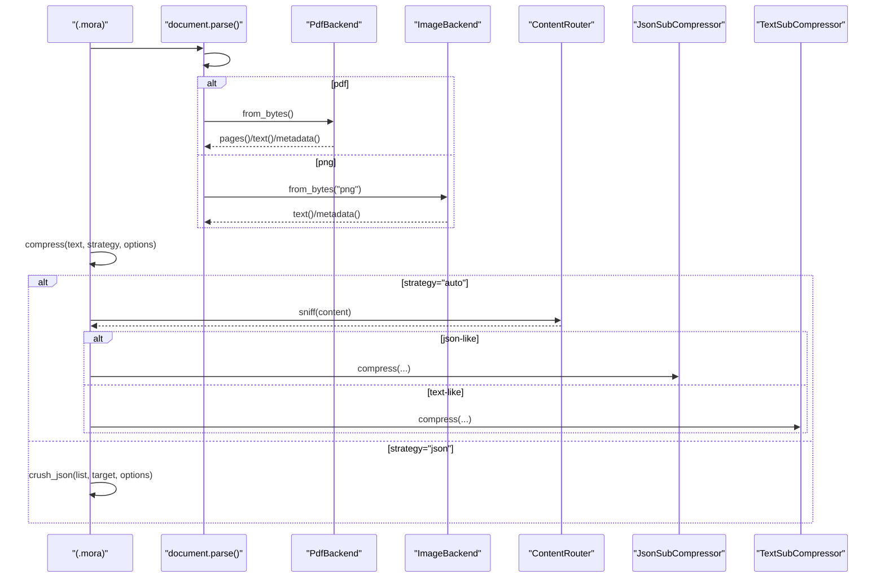
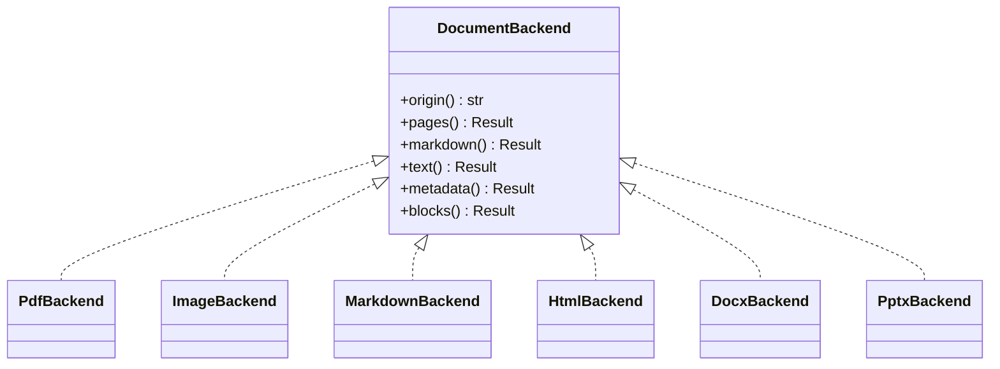
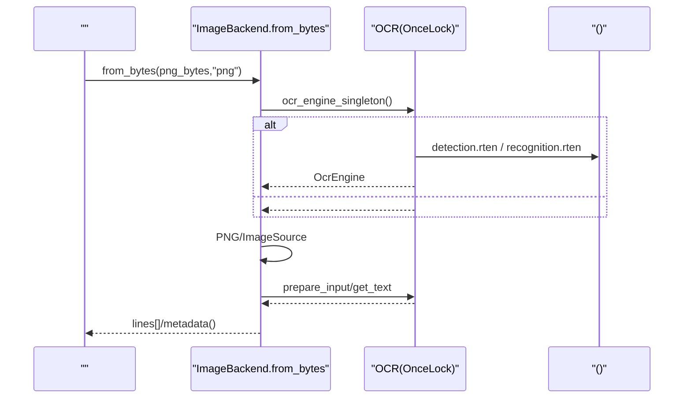
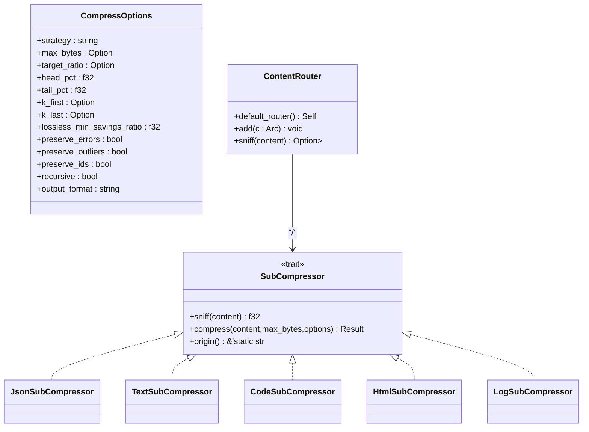
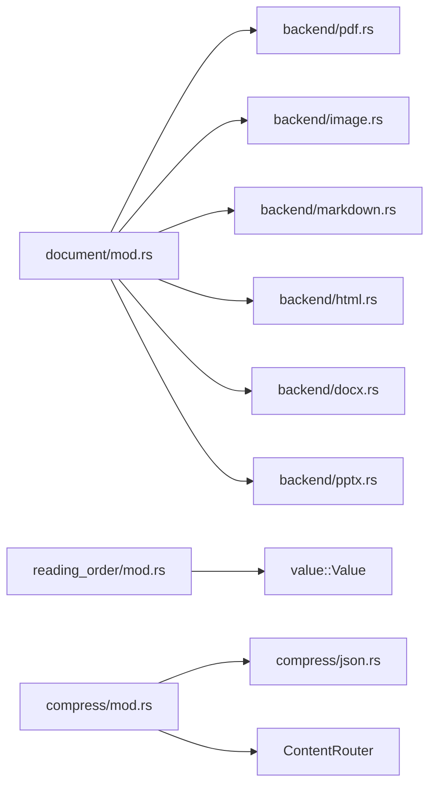

# 

<cite>
****   
- [src/document/mod.rs](file://src/document/mod.rs)
- [src/document/backend/mod.rs](file://src/document/backend/mod.rs)
- [src/document/backend/pdf.rs](file://src/document/backend/pdf.rs)
- [src/document/backend/image.rs](file://src/document/backend/image.rs)
- [src/document/reading_order/mod.rs](file://src/document/reading_order/mod.rs)
- [src/compress/mod.rs](file://src/compress/mod.rs)
- [src/compress/json.rs](file://src/compress/json.rs)
- [examples/compact_demo.mora](file://examples/compact_demo.mora)
- [examples/compress_demo.mora](file://examples/compress_demo.mora)
- [examples/compress_smart_demo.mora](file://examples/compress_smart_demo.mora)
- [examples/_legacy/document_parse_demo.mora](file://examples/_legacy/document_parse_demo.mora)
- [examples/_legacy/office_ocr_demo.mora](file://examples/_legacy/office_ocr_demo.mora)
</cite>

## 
1. [](#)
2. [](#)
3. [](#)
4. [](#)
5. [](#)
6. [](#)
7. [](#)
8. [](#)
9. [](#)
10. [](#)

## 
 Mora PDFWordPPTHTMLMarkdown OCR JSON//HTML/

## 
Mora “ IR + ” DocumentBackend  SubCompressor  ContentRouter 

```mermaid
graph TB
subgraph ""
A["document/mod.rs<br/>"] --> B["backend/*<br/>"]
B --> B1["pdf.rs"]
B --> B2["image.rs"]
B --> B3["html.rs"]
B --> B4["markdown.rs"]
B --> B5["docx.rs"]
B --> B6["pptx.rs"]
A --> C["reading_order/mod.rs<br/>"]
end
subgraph ""
D["compress/mod.rs<br/> API/"] --> E["json.rs<br/>SmartCrusher"]
D --> F["text/html/log/code "]
end
subgraph ""
G["examples/*.mora"]
end
G --> A
G --> D
```


- [src/document/mod.rs:1-146](file://src/document/mod.rs#L1-L146)
- [src/document/backend/mod.rs:1-10](file://src/document/backend/mod.rs#L1-L10)
- [src/document/backend/pdf.rs:1-197](file://src/document/backend/pdf.rs#L1-L197)
- [src/document/backend/image.rs:1-200](file://src/document/backend/image.rs#L1-L200)
- [src/document/reading_order/mod.rs:1-135](file://src/document/reading_order/mod.rs#L1-L135)
- [src/compress/mod.rs:1-145](file://src/compress/mod.rs#L1-L145)
- [src/compress/json.rs:1-112](file://src/compress/json.rs#L1-L112)


- [src/document/mod.rs:1-146](file://src/document/mod.rs#L1-L146)
- [src/document/backend/mod.rs:1-10](file://src/document/backend/mod.rs#L1-L10)
- [src/compress/mod.rs:1-145](file://src/compress/mod.rs#L1-L145)

## 
- DocumentBackend origin/pages/markdown/text/metadata/blocks  PDF/Markdown/HTML/PPTX/DOCX/Image 
- parse_document  Value::Document
- assign_reading_order  InputOrder/TopToBottom/GapTree/XyCut/GroupBased/XyCutPlusPlus  reading_order_idx
- SubCompressor  + ContentRouter  + SmartCrusherJSON 


- [src/document/mod.rs:14-43](file://src/document/mod.rs#L14-L43)
- [src/document/mod.rs:47-146](file://src/document/mod.rs#L47-L146)
- [src/document/reading_order/mod.rs:103-135](file://src/document/reading_order/mod.rs#L103-L135)
- [src/compress/mod.rs:66-145](file://src/compress/mod.rs#L66-L145)

## 





- [src/document/mod.rs:47-146](file://src/document/mod.rs#L47-L146)
- [src/document/backend/pdf.rs:33-64](file://src/document/backend/pdf.rs#L33-L64)
- [src/document/backend/image.rs:147-200](file://src/document/backend/image.rs#L147-L200)
- [src/compress/mod.rs:241-309](file://src/compress/mod.rs#L241-L309)
- [src/compress/mod.rs:104-134](file://src/compress/mod.rs#L104-L134)

## 

### 
- 
  -  Value IO/
  - parse_document  metadata  Value::Document
- 
  - pdfmd/markdownhtml/htmpptxdocxpng
  - 




- [src/document/mod.rs:14-34](file://src/document/mod.rs#L14-L34)
- [src/document/backend/pdf.rs:25-64](file://src/document/backend/pdf.rs#L25-L64)
- [src/document/backend/image.rs:97-145](file://src/document/backend/image.rs#L97-L145)


- [src/document/mod.rs:14-43](file://src/document/mod.rs#L14-L43)
- [src/document/mod.rs:47-146](file://src/document/mod.rs#L47-L146)

### PDF PdfBackend
- 
  -  PDF 
  - MVP  blocks block  spans  bbox
- 
  - pages()  Page text()/markdown() metadata()  origin/pages/size 

```mermaid
flowchart TD
Start(["from_bytes(bytes)"]) --> Load["PDF"]
Load --> Pages[""]
Pages --> Extract[""]
Extract --> Cache[" per_page_text"]
Cache --> End([" PdfBackend"])
```


- [src/document/backend/pdf.rs:33-64](file://src/document/backend/pdf.rs#L33-L64)


- [src/document/backend/pdf.rs:1-197](file://src/document/backend/pdf.rs#L1-L197)

###  OCR ImageBackend
- 
  -  ocrs + rten ONNX  .rten 
  -  OnceLock  1–3 
- 
  -  MORA_OCR_MODELS_DIR  OCR 
  -  XDG_DATA_HOME/HOME/LOCALAPPDATA 
- 
  -  PNG →  ImageSource → prepare_input → get_text → 




- [src/document/backend/image.rs:107-145](file://src/document/backend/image.rs#L107-L145)
- [src/document/backend/image.rs:147-200](file://src/document/backend/image.rs#L147-L200)
- [src/document/backend/image.rs:59-95](file://src/document/backend/image.rs#L59-L95)


- [src/document/backend/image.rs:1-200](file://src/document/backend/image.rs#L1-L200)

### Reading Order
- 
  - List<Value> "text" "bbox"x,y,w,h
- 
  - InputOrderTopToBottomGapTreeXyCutGroupBasedXyCutPlusPlus- + 
- 
  -  block  "reading_order_idx"

```mermaid
flowchart TD
In["blocks[] (bbox)"] --> Pick[""]
Pick --> |InputOrder| Keep[""]
Pick --> |TopToBottom| SortYX["x"]
Pick --> |GapTree| CenterSort["center_yycenter_x"]
Pick --> |XyCut| GridSort["yx"]
Pick --> |GroupBased| GroupSort["xy"]
Pick --> |XyCutPlusPlus| XYPP["+"]
Keep --> Out["reading_order_idx"]
SortYX --> Out
CenterSort --> Out
GridSort --> Out
GroupSort --> Out
XYPP --> Out
```


- [src/document/reading_order/mod.rs:103-135](file://src/document/reading_order/mod.rs#L103-L135)
- [src/document/reading_order/mod.rs:140-277](file://src/document/reading_order/mod.rs#L140-L277)
- [src/document/reading_order/mod.rs:280-578](file://src/document/reading_order/mod.rs#L280-L578)


- [src/document/reading_order/mod.rs:1-135](file://src/document/reading_order/mod.rs#L1-L135)
- [src/document/reading_order/mod.rs:140-277](file://src/document/reading_order/mod.rs#L140-L277)
- [src/document/reading_order/mod.rs:280-578](file://src/document/reading_order/mod.rs#L280-L578)

### Compress & SmartCrusher
-  API
  - compress_top(input, strategy, options)
    - strategy="json" SmartCrushercrush_json List
    - strategy="auto"ContentRouter json/code/html/log/text
    - strategy="head_tail"/"summary"/"lossless"
- 
  - SubCompressor.sniff  ≥ 0.6 text 
- JSON SmartCrusher
  - Id/Score/Temporal/Error/Anomaly/Constant/Generic
  - TopScores/TimeSeries/Clustered/Uniform/Generic
  - topn/timeseries/cluster_sample/smart_sample/lossless
  - keep_errors/keep_outliers/keep_boundary
  - CSV schema  Markdown KV




- [src/compress/mod.rs:14-64](file://src/compress/mod.rs#L14-L64)
- [src/compress/mod.rs:66-134](file://src/compress/mod.rs#L66-L134)
- [src/compress/mod.rs:104-112](file://src/compress/mod.rs#L104-L112)

```mermaid
flowchart TD
S(["compress_top(input,strategy,options)"]) --> Check{"strategy == 'json'?"}
Check --> || JSON["crush_json(items,target,options)"]
JSON --> Meta["(/)"]
Meta --> Ret1[""]
Check --> || Txt["extract_text(input)"]
Txt --> Route{"strategy"}
Route --> |auto| Router["ContentRouter.sniff()"]
Router --> Best[""]
Best --> DoComp["sub_compressor.compress(...)"]
DoComp --> Ret2[""]
Route --> |head_tail/summary/lossless| TextComp["TextSubCompressor"]
TextComp --> Ret2
```


- [src/compress/mod.rs:241-309](file://src/compress/mod.rs#L241-L309)
- [src/compress/mod.rs:146-188](file://src/compress/mod.rs#L146-L188)
- [src/compress/mod.rs:104-134](file://src/compress/mod.rs#L104-L134)


- [src/compress/mod.rs:1-145](file://src/compress/mod.rs#L1-L145)
- [src/compress/mod.rs:241-309](file://src/compress/mod.rs#L241-L309)
- [src/compress/json.rs:1-112](file://src/compress/json.rs#L1-L112)

## 
- 
  - document/mod.rs  backend/* reading_order  Value
- 
  - compress/mod.rs  SubCompressor  ContentRouter json.rs  SmartCrusher 
- 
  - PDFlopdf + pdf-extract
  - OCRocrs + rtenONNX 
  - image crate




- [src/document/mod.rs:1-10](file://src/document/mod.rs#L1-L10)
- [src/document/backend/mod.rs:1-10](file://src/document/backend/mod.rs#L1-L10)
- [src/compress/mod.rs:136-145](file://src/compress/mod.rs#L136-L145)


- [src/document/backend/mod.rs:1-10](file://src/document/backend/mod.rs#L1-L10)
- [src/compress/mod.rs:136-145](file://src/compress/mod.rs#L136-L145)

## 
- 
  - / IO 
  - PDF Image  OCR 
- OCR 
  -  OnceLock  OcrEngine ~1–3s
  - 
- 
  - SmartCrusher 
  - ContentRouter  sniff 
- 
  -  bbox XY-Cut++ 

[]

## 
- OCR 
  -  OCR 
  -  MORA_OCR_MODELS_DIR  text-detection.rten  text-recognition.rten 
- 
  - parse_document 
  - pdf/md/markdown/html/htm/pptx/docx/png
- 
  - compress.auto 
  -  strategy head_tail/lossless


- [src/document/backend/image.rs:84-95](file://src/document/backend/image.rs#L84-L95)
- [src/document/mod.rs:140-146](file://src/document/mod.rs#L140-L146)
- [src/compress/mod.rs:294-309](file://src/compress/mod.rs#L294-L309)

## 
Mora  OCR 

[]

## 
- 
  -  PDF/Markdown/HTML 
  -  PPTX/DOCX  OCR 
- 
  - summary/head_tail/lossless/auto
  - JSON crush_json  SmartCrusher 


- [examples/_legacy/document_parse_demo.mora:1-35](file://examples/_legacy/document_parse_demo.mora#L1-L35)
- [examples/_legacy/office_ocr_demo.mora:1-55](file://examples/_legacy/office_ocr_demo.mora#L1-L55)
- [examples/compact_demo.mora:1-47](file://examples/compact_demo.mora#L1-L47)
- [examples/compress_demo.mora:1-26](file://examples/compress_demo.mora#L1-L26)
- [examples/compress_smart_demo.mora:1-47](file://examples/compress_smart_demo.mora#L1-L47)