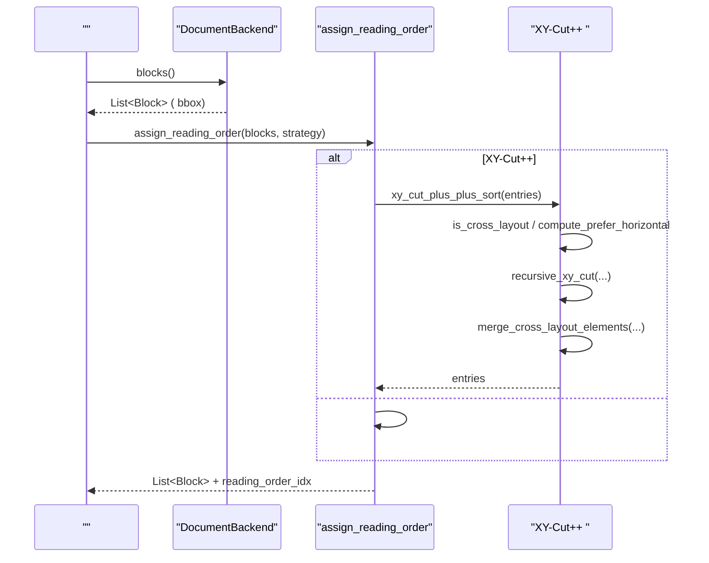
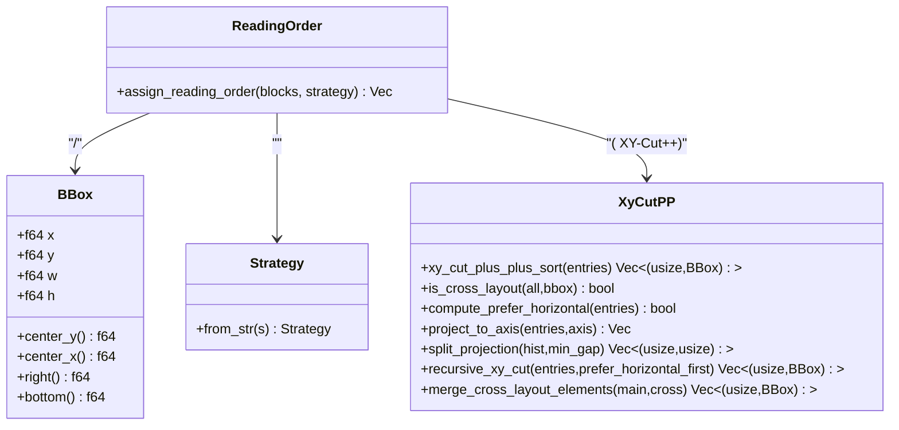
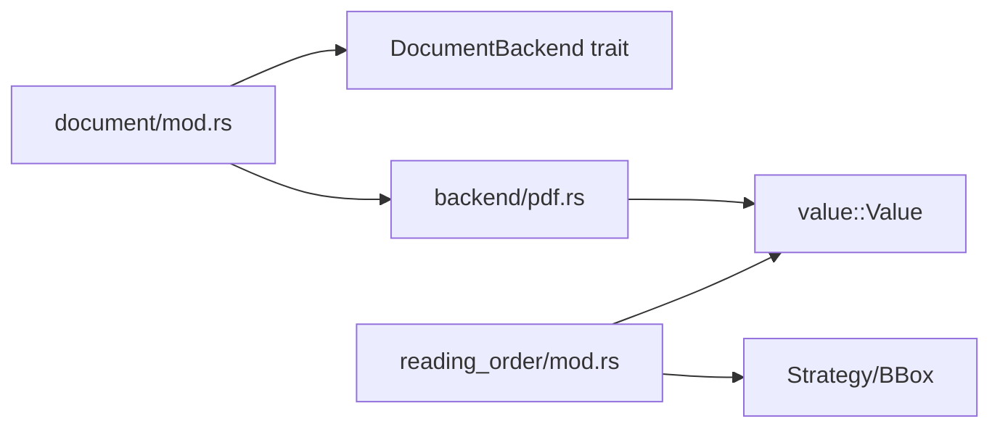

# 

<cite>
****   
- [src/document/reading_order/mod.rs](file://src/document/reading_order/mod.rs)
- [src/document/mod.rs](file://src/document/mod.rs)
- [src/document/backend/pdf.rs](file://src/document/backend/pdf.rs)
- [examples/_legacy/document_parse_demo.mora](file://examples/_legacy/document_parse_demo.mora)
</cite>

## 
1. [](#)
2. [](#)
3. [](#)
4. [](#)
5. [](#)
6. [](#)
7. [](#)
8. [](#)
9. [](#)
10. [](#)

## 
“”“”PDFMarkdownHTMLPPTXDOCX DOM/ bbox/Mora 

## 
 bbox reading_order_idx

```mermaid
graph TB
subgraph ""
MOD["document/mod.rs<br/> IR + "]
RO["document/reading_order/mod.rs<br/>"]
end
subgraph ""
PDF["backend/pdf.rs<br/>PDF "]
end
subgraph ""
DEMO["examples/_legacy/document_parse_demo.mora"]
end
DEMO --> MOD
MOD --> PDF
MOD --> RO
PDF --> RO
```


- [src/document/mod.rs:1-233](file://src/document/mod.rs#L1-L233)
- [src/document/reading_order/mod.rs:1-1160](file://src/document/reading_order/mod.rs#L1-L1160)
- [src/document/backend/pdf.rs:1-197](file://src/document/backend/pdf.rs#L1-L197)
- [examples/_legacy/document_parse_demo.mora:1-35](file://examples/_legacy/document_parse_demo.mora#L1-L35)


- [src/document/mod.rs:1-233](file://src/document/mod.rs#L1-L233)
- [src/document/reading_order/mod.rs:1-1160](file://src/document/reading_order/mod.rs#L1-L1160)
- [src/document/backend/pdf.rs:1-197](file://src/document/backend/pdf.rs#L1-L197)
- [examples/_legacy/document_parse_demo.mora:1-35](file://examples/_legacy/document_parse_demo.mora#L1-L35)

## 
- BBox Value 
- StrategyGapTreeXY-cutGroupBasedXY-Cut++
- assign_reading_order blocks  reading_order_idx  blocks
- XY-Cut++ -


- [src/document/reading_order/mod.rs:23-135](file://src/document/reading_order/mod.rs#L23-L135)
- [src/document/reading_order/mod.rs:137-277](file://src/document/reading_order/mod.rs#L137-L277)
- [src/document/reading_order/mod.rs:280-578](file://src/document/reading_order/mod.rs#L280-L578)

## 
 IR  blocks bbox blocks  reading_order_idx




- [src/document/reading_order/mod.rs:137-277](file://src/document/reading_order/mod.rs#L137-L277)
- [src/document/reading_order/mod.rs:280-578](file://src/document/reading_order/mod.rs#L280-L578)

## 

### 
- BBox x/y/w/h center_y/center_x/right/bottom 
- Strategy xy++xy_cut_pp
- assign_reading_order
  - List<Value> text bbox
  -  List<Value> reading_order_idx
  -  indices reading_order_idx


- [src/document/reading_order/mod.rs:23-135](file://src/document/reading_order/mod.rs#L23-L135)
- [src/document/reading_order/mod.rs:137-277](file://src/document/reading_order/mod.rs#L137-L277)

### 
- InputOrder bbox 
- TopToBottom x 
- GapTree y  y  x 
- XyCut y  x 
- GroupBased x  y 
- XyCutPlusPlusMinerU 
  -  + 
  -  x/y 
  - -primary/secondary axis 
  - 

```mermaid
flowchart TD
Start([""]) --> ParseBBox[" block  bbox"]
ParseBBox --> Choose{""}
Choose --> |InputOrder| Keep[""]
Choose --> |TopToBottom| TTB["+"]
Choose --> |GapTree| GT["y/x"]
Choose --> |XyCut| XYC["(y), (x)"]
Choose --> |GroupBased| GB["x, y"]
Choose --> |XyCutPlusPlus| XYP["XY-Cut++ "]
XYP --> Cross[""]
Cross --> Density[", "]
Density --> RecCut["-"]
RecCut --> Merge[""]
Keep --> WriteIdx[" reading_order_idx"]
TTB --> WriteIdx
GT --> WriteIdx
XYC --> WriteIdx
GB --> WriteIdx
Merge --> WriteIdx
WriteIdx --> End([""])
```


- [src/document/reading_order/mod.rs:137-277](file://src/document/reading_order/mod.rs#L137-L277)
- [src/document/reading_order/mod.rs:280-578](file://src/document/reading_order/mod.rs#L280-L578)


- [src/document/reading_order/mod.rs:137-277](file://src/document/reading_order/mod.rs#L137-L277)
- [src/document/reading_order/mod.rs:280-578](file://src/document/reading_order/mod.rs#L280-L578)

### XY-Cut++ 
- is_cross_layout > beta * max_width_in_set N 
- compute_prefer_horizontal x/y  y  x 
- project_to_axis
- split_projection gap
- recursive_xy_cut-primary/secondary 
- merge_cross_layout_elements vertical center 




- [src/document/reading_order/mod.rs:23-135](file://src/document/reading_order/mod.rs#L23-L135)
- [src/document/reading_order/mod.rs:137-277](file://src/document/reading_order/mod.rs#L137-L277)
- [src/document/reading_order/mod.rs:280-578](file://src/document/reading_order/mod.rs#L280-L578)


- [src/document/reading_order/mod.rs:23-135](file://src/document/reading_order/mod.rs#L23-L135)
- [src/document/reading_order/mod.rs:137-277](file://src/document/reading_order/mod.rs#L137-L277)
- [src/document/reading_order/mod.rs:280-578](file://src/document/reading_order/mod.rs#L280-L578)

### 
- XY-Cut++ /GroupBased  GapTree 
-  bboxXY-Cut++  TopToBottom/GapTree
-  bboxkind/spans


- [src/document/reading_order/mod.rs:280-578](file://src/document/reading_order/mod.rs#L280-L578)

### 
- 
-  reading_order_idx 
- 


- [src/document/reading_order/mod.rs:137-277](file://src/document/reading_order/mod.rs#L137-L277)

## 
- document/mod.rs  parse_document  DocumentBackend trait blocks()/pages() 
- reading_order/mod.rs  value::Value  BBox 
- backend/pdf.rs  blocks()  MVP bbox 




- [src/document/mod.rs:1-233](file://src/document/mod.rs#L1-L233)
- [src/document/backend/pdf.rs:1-197](file://src/document/backend/pdf.rs#L1-L197)
- [src/document/reading_order/mod.rs:1-1160](file://src/document/reading_order/mod.rs#L1-L1160)


- [src/document/mod.rs:1-233](file://src/document/mod.rs#L1-L233)
- [src/document/backend/pdf.rs:1-197](file://src/document/backend/pdf.rs#L1-L197)
- [src/document/reading_order/mod.rs:1-1160](file://src/document/reading_order/mod.rs#L1-L1160)

## 
- 
  - InputOrder/TopToBottom/GapTree/XyCut/GroupBased O(n log n)
  - XY-Cut++ O(n·W/H) 50  block  debug  200ms
- 
  -  block 
- 
  -  Value blocks 
  - 
  -  assign_reading_order


- [src/document/reading_order/mod.rs:1084-1109](file://src/document/reading_order/mod.rs#L1084-L1109)

## 
-  bbox
  -  block  bbox
  -  blocks()  bbox  from_value 
- 
  - /
  -  betaoverlap  gap is_cross_layout 
- 
  - 
  -  compute_density_ratios  span  sum_w/sum_h 
- 
  - 
  - 


- [src/document/reading_order/mod.rs:137-277](file://src/document/reading_order/mod.rs#L137-L277)
- [src/document/reading_order/mod.rs:280-578](file://src/document/reading_order/mod.rs#L280-L578)

## 
Mora  XY-Cut++ /

## 
- 
  -  document.parse  blocks  reading_order_idx 
  -  PDF/Markdown/HTML  metadata/markdown/text/blocks


- [examples/_legacy/document_parse_demo.mora:1-35](file://examples/_legacy/document_parse_demo.mora#L1-L35)