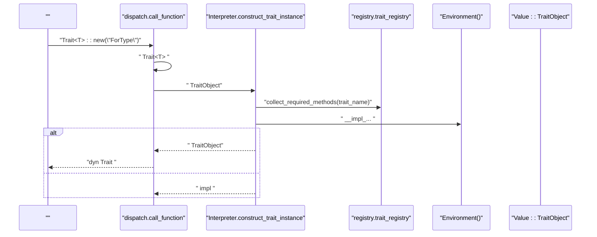
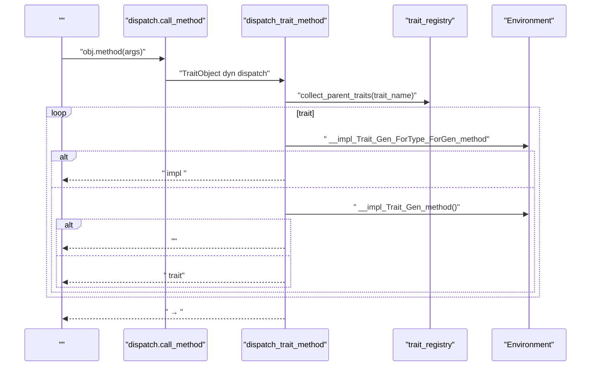
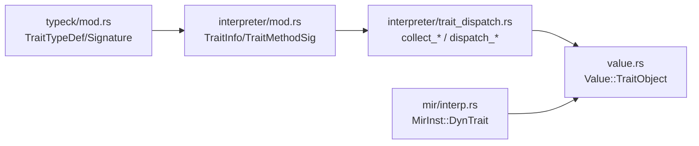

# Trait 

<cite>
****   
- [src/typeck/mod.rs](file://src/typeck/mod.rs)
- [src/interpreter/mod.rs](file://src/interpreter/mod.rs)
- [src/interpreter/trait_dispatch.rs](file://src/interpreter/trait_dispatch.rs)
- [src/interpreter/dispatch.rs](file://src/interpreter/dispatch.rs)
- [src/value.rs](file://src/value.rs)
- [src/mir/interp.rs](file://src/mir/interp.rs)
- [examples/_legacy/trait_demo.mora](file://examples/_legacy/trait_demo.mora)
- [examples/_legacy/trait_inherit_demo.mora](file://examples/_legacy/trait_inherit_demo.mora)
- [examples/_legacy/trait_default_demo.mora](file://examples/_legacy/trait_default_demo.mora)
- [examples/_legacy/container.mora](file://examples/_legacy/container.mora)
- [test_data/typeck_errors.mora](file://test_data/typeck_errors.mora)
</cite>

## 
1. [](#)
2. [](#)
3. [](#)
4. [](#)
5. [](#)
6. [](#)
7. [](#)
8. [](#)
9. [](#)
10. [](#)

## 
 Mora  Trait 
- Trait  Trait
- Trait 
- impl trait_registry 
- dyn Trait TraitObject 
- Trait 
-  Trait TraitTrait 
- 

## 
Trait MIR 
-  Trait typeck  TraitDef/ImplDef  trait_registry  impl_registry
-  Trait interpreter  TraitInfo/TraitMethodSig  LRU 
- interpreter::dispatch  trait_dispatch  Trait::new  dispatch_trait_method 
- value.rs  Value::TraitObject  trait 
- MIR mir/interp.rs  MirInst::DynTrait  TraitObject

```mermaid
graph TB
subgraph ""
TC["TypeChecker<br/>collect_signatures / collect_trait_methods_recursive"]
TR["trait_registry / impl_registry"]
end
subgraph ""
RI["RegistryRuntime<br/>trait_registry()"]
INT["Interpreter<br/>construct_trait_instance / dispatch_trait_method"]
VAL["Value::TraitObject"]
end
subgraph "MIR"
MIRI["MirInst::DynTrait"]
end
subgraph ""
EX1["trait_demo.mora"]
EX2["trait_inherit_demo.mora"]
EX3["trait_default_demo.mora"]
EX4["container.mora"]
end
TC --> TR
TR --> RI
RI --> INT
INT --> VAL
MIRI --> VAL
EX1 --> INT
EX2 --> INT
EX3 --> INT
EX4 --> INT
```


- [src/typeck/mod.rs:1057-1146](file://src/typeck/mod.rs#L1057-L1146)
- [src/interpreter/mod.rs:323-342](file://src/interpreter/mod.rs#L323-L342)
- [src/interpreter/trait_dispatch.rs:1-53](file://src/interpreter/trait_dispatch.rs#L1-L53)
- [src/interpreter/dispatch.rs:31-65](file://src/interpreter/dispatch.rs#L31-L65)
- [src/value.rs:226-237](file://src/value.rs#L226-L237)
- [src/mir/interp.rs:181-198](file://src/mir/interp.rs#L181-L198)
- [examples/_legacy/trait_demo.mora:1-24](file://examples/_legacy/trait_demo.mora#L1-L24)
- [examples/_legacy/trait_inherit_demo.mora:1-32](file://examples/_legacy/trait_inherit_demo.mora#L1-L32)
- [examples/_legacy/trait_default_demo.mora:1-30](file://examples/_legacy/trait_default_demo.mora#L1-L30)
- [examples/_legacy/container.mora:1-25](file://examples/_legacy/container.mora#L1-L25)


- [src/typeck/mod.rs:1057-1146](file://src/typeck/mod.rs#L1057-L1146)
- [src/interpreter/mod.rs:323-342](file://src/interpreter/mod.rs#L323-L342)
- [src/interpreter/trait_dispatch.rs:1-53](file://src/interpreter/trait_dispatch.rs#L1-L53)
- [src/interpreter/dispatch.rs:31-65](file://src/interpreter/dispatch.rs#L31-L65)
- [src/value.rs:226-237](file://src/value.rs#L226-L237)
- [src/mir/interp.rs:181-198](file://src/mir/interp.rs#L181-L198)

## 
- Trait 
  - TraitTypeDef nameparentsgenericsmethods has_self 
  - Signature hint hint
-  Trait 
  - TraitInfonameparentsmethods has_self
  - TraitMethodSignameparamsreturn_typehas_self
- impl 
  - impl_method_key__impl_<Trait>_<TraitGen>_<ForType>_<ForGen>_<method>
  - default_impl_method_key__impl_<Trait>_<TraitGen>_<method>
-  Trait 
  - Value::TraitObjectfor_genericstrait_genericsfor_typetrait_namedata


- [src/typeck/mod.rs:603-629](file://src/typeck/mod.rs#L603-L629)
- [src/interpreter/mod.rs:323-342](file://src/interpreter/mod.rs#L323-L342)
- [src/interpreter/mod.rs:113-143](file://src/interpreter/mod.rs#L113-L143)
- [src/value.rs:226-237](file://src/value.rs#L226-L237)

## 
Trait 
- typeck
  -  TraitDef/ImplDef trait_registry  impl_registry
  -  Trait 
- interpreter
  - Trait::new("ForType")  TraitObject impl 
  -  for_type + trait_name + generics  impl 
  -  trait  BFS  trait 




- [src/interpreter/dispatch.rs:31-65](file://src/interpreter/dispatch.rs#L31-L65)
- [src/interpreter/trait_dispatch.rs:138-177](file://src/interpreter/trait_dispatch.rs#L138-L177)
- [src/interpreter/mod.rs:113-143](file://src/interpreter/mod.rs#L113-L143)
- [src/value.rs:226-237](file://src/value.rs#L226-L237)

## 

### Trait 
-  Traittrait Container<T> impl 
- 
  - self  self receiver
  - self-less  self receiver
  -  trait  = exprimpl 
- trait Foo: Bar, Baz trait  trait 


- [src/typeck/mod.rs:1065-1118](file://src/typeck/mod.rs#L1065-L1118)
- [src/interpreter/mod.rs:323-342](file://src/interpreter/mod.rs#L323-L342)
- [examples/_legacy/trait_default_demo.mora:1-30](file://examples/_legacy/trait_default_demo.mora#L1-L30)
- [examples/_legacy/trait_inherit_demo.mora:1-32](file://examples/_legacy/trait_inherit_demo.mora#L1-L32)
- [examples/_legacy/container.mora:1-25](file://examples/_legacy/container.mora#L1-L25)

### Trait 
- collect_trait_methods_recursive  parents
-  BFScollect_parent_traits  trait  dispatch 
- visited  trait 

```mermaid
flowchart TD
Start([""]) --> Visit[" trait"]
Visit --> Parents{" trait?"}
Parents --> || Recurse[" trait "]
Parents --> || OwnMethods[" trait "]
Recurse --> OwnMethods
OwnMethods --> Overwrite[" trait "]
Overwrite --> End([""])
```


- [src/typeck/mod.rs:637-665](file://src/typeck/mod.rs#L637-L665)
- [src/interpreter/trait_dispatch.rs:32-53](file://src/interpreter/trait_dispatch.rs#L32-L53)


- [src/typeck/mod.rs:637-665](file://src/typeck/mod.rs#L637-L665)
- [src/interpreter/trait_dispatch.rs:32-53](file://src/interpreter/trait_dispatch.rs#L32-L53)

### impl 
- typeck
  -  ImplDef (for_type, trait_name) -> [method_names]
  -  impl  trait  TraitDef 
- interpreter
  -  impl_method_key  default_impl_method_key 
  - construct_trait_instance  impl 
  - dispatch_trait_method  for_type + trait_generics + method  impl

```mermaid
classDiagram
class TypeChecker {
+trait_registry : HashMap<String, TraitTypeDef>
+impl_registry : HashMap<(String,String), Vec<String>>
+collect_signatures()
+check_program()
}
class Interpreter {
+construct_trait_instance()
+dispatch_trait_method()
+impl_method_key()
+default_impl_method_key()
}
class RegistryRuntime {
+trait_registry : Arc<HashMap<String, TraitInfo>>
}
class Value {
<<enum>>
+TraitObject{for_generics, trait_generics, for_type, trait_name, data}
}
TypeChecker --> RegistryRuntime : " trait_registry"
Interpreter --> RegistryRuntime : " TraitInfo"
Interpreter --> Value : " TraitObject"
```


- [src/typeck/mod.rs:1057-1146](file://src/typeck/mod.rs#L1057-L1146)
- [src/interpreter/mod.rs:113-143](file://src/interpreter/mod.rs#L113-L143)
- [src/interpreter/trait_dispatch.rs:138-177](file://src/interpreter/trait_dispatch.rs#L138-L177)
- [src/value.rs:226-237](file://src/value.rs#L226-L237)


- [src/typeck/mod.rs:1119-1146](file://src/typeck/mod.rs#L1119-L1146)
- [src/interpreter/trait_dispatch.rs:138-177](file://src/interpreter/trait_dispatch.rs#L138-L177)
- [src/interpreter/mod.rs:113-143](file://src/interpreter/mod.rs#L113-L143)

### dyn Trait 
- Trait::new("ForType")  `expr as dyn Trait`MIR 
  -  call_function  construct_trait_instance
  -  MirInst::DynTrait  Value::TraitObject
- dispatch_trait_method
  -  TraitObject  for_typetrait_genericstrait_name
  -  BFS  trait
  -  trait
    -  impl  Environment
    - 
    -  has_self  receiver
  - 




- [src/interpreter/dispatch.rs:460-485](file://src/interpreter/dispatch.rs#L460-L485)
- [src/interpreter/trait_dispatch.rs:55-136](file://src/interpreter/trait_dispatch.rs#L55-L136)
- [src/mir/interp.rs:181-198](file://src/mir/interp.rs#L181-L198)


- [src/interpreter/dispatch.rs:460-485](file://src/interpreter/dispatch.rs#L460-L485)
- [src/interpreter/trait_dispatch.rs:55-136](file://src/interpreter/trait_dispatch.rs#L55-L136)
- [src/mir/interp.rs:181-198](file://src/mir/interp.rs#L181-L198)

### Trait 
- Trait name 
- Nil v0.12 Nil  Nil  Trait
- nil  nil traitResult 


- [src/typeck/mod.rs:311-348](file://src/typeck/mod.rs#L311-L348)
- [src/typeck/mod.rs:1720-1738](file://src/typeck/mod.rs#L1720-L1738)

## 
- typeck  interpreter 
  - typeck  trait_registryinterpreter  TraitInfo
  - impl 
-  trait_registry  RegistryRuntimeHTTP/MCP workers
- MIR MIR  DynTrait  TraitObject




- [src/typeck/mod.rs:603-629](file://src/typeck/mod.rs#L603-L629)
- [src/interpreter/mod.rs:323-342](file://src/interpreter/mod.rs#L323-L342)
- [src/interpreter/trait_dispatch.rs:1-53](file://src/interpreter/trait_dispatch.rs#L1-L53)
- [src/value.rs:226-237](file://src/value.rs#L226-L237)
- [src/mir/interp.rs:181-198](file://src/mir/interp.rs#L181-L198)


- [src/typeck/mod.rs:603-629](file://src/typeck/mod.rs#L603-L629)
- [src/interpreter/mod.rs:323-342](file://src/interpreter/mod.rs#L323-L342)
- [src/interpreter/trait_dispatch.rs:1-53](file://src/interpreter/trait_dispatch.rs#L1-L53)
- [src/value.rs:226-237](file://src/value.rs#L226-L237)
- [src/mir/interp.rs:181-198](file://src/mir/interp.rs#L181-L198)

## 
-  O(1)  BFS 
-  TraitObject 
-  trait_registry  Arc  worker 
- 
  -  trait 
  - 
  -  impl  fallback 

[]

## 
- 
  - Trait::new “ impl ” impl 
  - self-less  test_data  case
  - impl  trait  <T> 
- 
  -  REPL 
  - __impl_... impl 
  -  trait_demo.mora


- [test_data/typeck_errors.mora:154-194](file://test_data/typeck_errors.mora#L154-L194)
- [src/interpreter/trait_dispatch.rs:138-177](file://src/interpreter/trait_dispatch.rs#L138-L177)
- [src/interpreter/mod.rs:113-143](file://src/interpreter/mod.rs#L113-L143)

## 
Mora  Trait 
-  Trait/Impl 
- 
- 
- 

[]

## 
-  Trait  dyn 
  - [examples/_legacy/trait_demo.mora:1-24](file://examples/_legacy/trait_demo.mora#L1-L24)
- Trait 
  - [examples/_legacy/trait_inherit_demo.mora:1-32](file://examples/_legacy/trait_inherit_demo.mora#L1-L32)
  - [examples/_legacy/trait_default_demo.mora:1-30](file://examples/_legacy/trait_default_demo.mora#L1-L30)
-  Trait
  - [examples/_legacy/container.mora:1-25](file://examples/_legacy/container.mora#L1-L25)


- [examples/_legacy/trait_demo.mora:1-24](file://examples/_legacy/trait_demo.mora#L1-L24)
- [examples/_legacy/trait_inherit_demo.mora:1-32](file://examples/_legacy/trait_inherit_demo.mora#L1-L32)
- [examples/_legacy/trait_default_demo.mora:1-30](file://examples/_legacy/trait_default_demo.mora#L1-L30)
- [examples/_legacy/container.mora:1-25](file://examples/_legacy/container.mora#L1-L25)