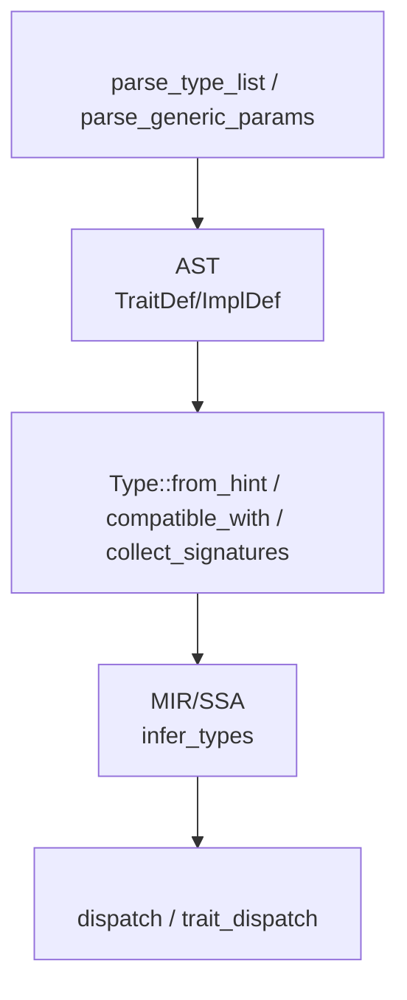
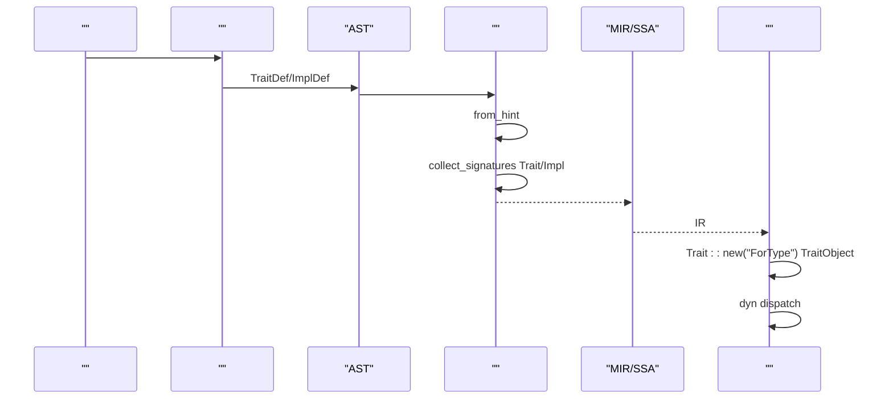
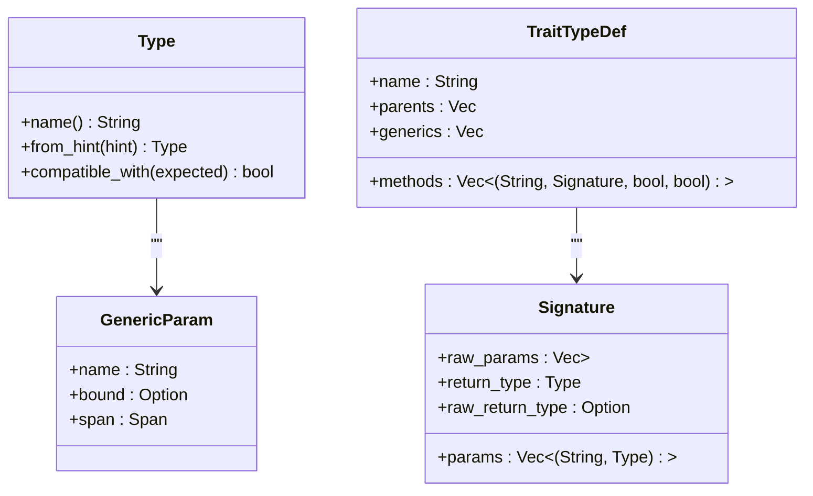
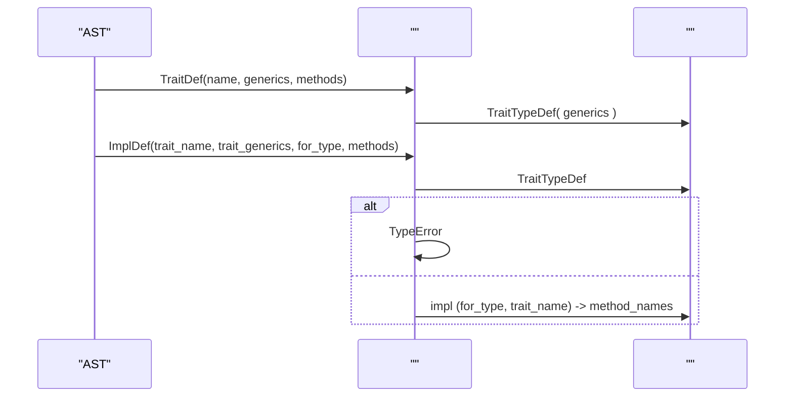
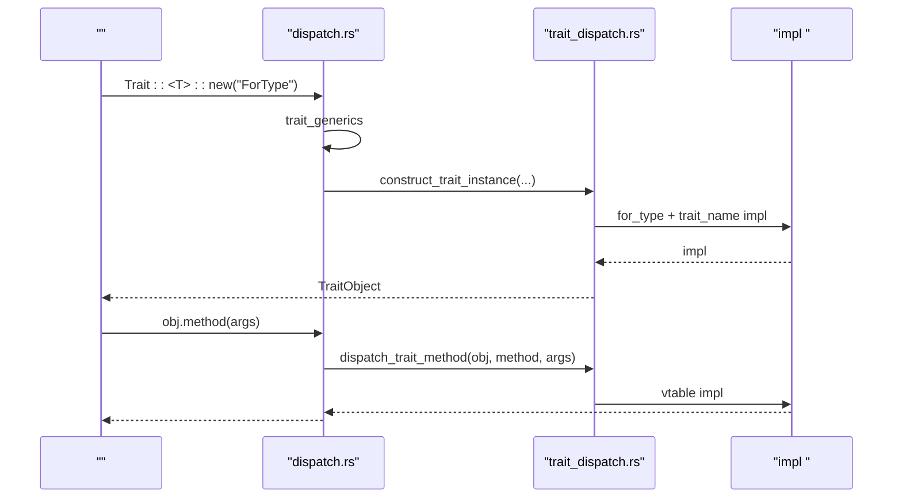
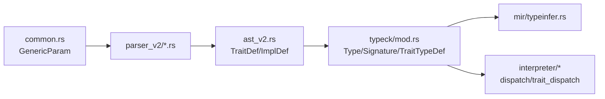

# 

<cite>
****   
- [src/typeck/mod.rs](file://src/typeck/mod.rs)
- [src/common.rs](file://src/common.rs)
- [src/ast_v2.rs](file://src/ast_v2.rs)
- [src/parser_v2/mod.rs](file://src/parser_v2/mod.rs)
- [src/parser_v2/statements.rs](file://src/parser_v2/statements.rs)
- [src/parser_v2/expressions.rs](file://src/parser_v2/expressions.rs)
- [src/mir/typeinfer.rs](file://src/mir/typeinfer.rs)
- [src/mir/lower.rs](file://src/mir/lower.rs)
- [src/interpreter/dispatch.rs](file://src/interpreter/dispatch.rs)
- [src/interpreter/trait_dispatch.rs](file://src/interpreter/trait_dispatch.rs)
- [examples/_legacy/container.mora](file://examples/_legacy/container.mora)
- [examples/_legacy/nested_generic.mora](file://examples/_legacy/nested_generic.mora)
- [examples/_legacy/generic_with_where.mora](file://examples/_legacy/generic_with_where.mora)
</cite>

## 
1. [](#)
2. [](#)
3. [](#)
4. [](#)
5. [](#)
6. [](#)
7. [](#)
8. [](#)
9. [](#)
10. [](#)

## 
 Mora 
- Trait 
-  where  bound
-  list<dict<string, int>>Container<Boxed<number>>
- dyn Trait 
- 
- Trait 

## 
Mora “/ → AST →  → MIR/SSA → ”
- dyn Trait 
- AST  TraitDef/ImplDef 
- Type from_hint compatible_with 
- MIR/SSA  JIT/
- dyn Trait  vtable 




- [src/parser_v2/mod.rs:393-431](file://src/parser_v2/mod.rs#L393-L431)
- [src/ast_v2.rs:322-337](file://src/ast_v2.rs#L322-L337)
- [src/typeck/mod.rs:162-255](file://src/typeck/mod.rs#L162-L255)
- [src/mir/typeinfer.rs:17-112](file://src/mir/typeinfer.rs#L17-L112)
- [src/interpreter/dispatch.rs:31-61](file://src/interpreter/dispatch.rs#L31-L61)


- [src/parser_v2/mod.rs:393-431](file://src/parser_v2/mod.rs#L393-L431)
- [src/ast_v2.rs:322-337](file://src/ast_v2.rs#L322-L337)
- [src/typeck/mod.rs:162-255](file://src/typeck/mod.rs#L162-L255)
- [src/mir/typeinfer.rs:17-112](file://src/mir/typeinfer.rs#L17-L112)
- [src/interpreter/dispatch.rs:31-61](file://src/interpreter/dispatch.rs#L31-L61)

## 
- 
  - GenericParam bound
  - TypeResultTraitConcreteUnion 
  - TypeError/
- 
  - TypeChecker trait_registryimpl_registry
  - Signature hint 
- 
  - parse_generic_params <T: Bound, U> 
  - parse_type_list dyn Trait<T,U> 
  - statements/expressions let x: dyn Trait<T>  expr as dyn Trait<T>
- 
  - dispatch.rsTrait::new("ForType")  TraitObject for_type + trait_name  impl
  - trait_dispatch.rs vtable 


- [src/common.rs:56-61](file://src/common.rs#L56-L61)
- [src/typeck/mod.rs:38-111](file://src/typeck/mod.rs#L38-L111)
- [src/typeck/mod.rs:408-505](file://src/typeck/mod.rs#L408-L505)
- [src/typeck/mod.rs:554-630](file://src/typeck/mod.rs#L554-L630)
- [src/parser_v2/mod.rs:393-431](file://src/parser_v2/mod.rs#L393-L431)
- [src/parser_v2/statements.rs:1-37](file://src/parser_v2/statements.rs#L1-L37)
- [src/parser_v2/expressions.rs:1-37](file://src/parser_v2/expressions.rs#L1-L37)
- [src/interpreter/dispatch.rs:31-61](file://src/interpreter/dispatch.rs#L31-L61)
- [src/interpreter/trait_dispatch.rs:55-64](file://src/interpreter/trait_dispatch.rs#L55-L64)

## 





- [src/parser_v2/mod.rs:393-431](file://src/parser_v2/mod.rs#L393-L431)
- [src/ast_v2.rs:322-337](file://src/ast_v2.rs#L322-L337)
- [src/typeck/mod.rs:162-255](file://src/typeck/mod.rs#L162-L255)
- [src/typeck/mod.rs:1057-1146](file://src/typeck/mod.rs#L1057-L1146)
- [src/mir/typeinfer.rs:17-112](file://src/mir/typeinfer.rs#L17-L112)
- [src/interpreter/dispatch.rs:31-61](file://src/interpreter/dispatch.rs#L31-L61)

## 

### 
- Type  Trait  Concrete “trait ”“”
- Type::from_hint  Type
  - list<T>dict<K,V>result<T,E> 
  - dyn:Trait<T,U>  Trait { name, generics }
  -  Foo<Bar<number>>  Trait 
- Type::compatible_with 
  - Union 
  - Result/List/Dict 
  - Nil  Nil  trait 
  - Trait 




- [src/typeck/mod.rs:38-111](file://src/typeck/mod.rs#L38-L111)
- [src/typeck/mod.rs:162-255](file://src/typeck/mod.rs#L162-L255)
- [src/typeck/mod.rs:284-348](file://src/typeck/mod.rs#L284-L348)
- [src/common.rs:56-61](file://src/common.rs#L56-L61)
- [src/typeck/mod.rs:603-618](file://src/typeck/mod.rs#L603-L618)
- [src/typeck/mod.rs:620-629](file://src/typeck/mod.rs#L620-L629)


- [src/typeck/mod.rs:38-111](file://src/typeck/mod.rs#L38-L111)
- [src/typeck/mod.rs:162-255](file://src/typeck/mod.rs#L162-L255)
- [src/typeck/mod.rs:284-348](file://src/typeck/mod.rs#L284-L348)
- [src/common.rs:56-61](file://src/common.rs#L56-L61)
- [src/typeck/mod.rs:603-618](file://src/typeck/mod.rs#L603-L618)
- [src/typeck/mod.rs:620-629](file://src/typeck/mod.rs#L620-L629)

### 
-  trait/impl/method  bound T: Comparable
-  dyn Trait<T,U>  expr as dyn Trait<T,U> 
- 
  - parse_generic_params <T: Bound, U> 
  - parse_type_list dyn Trait<T,U> 
  - statements/expressions dyn Trait<T>  hint "dyn:Foo<T>" from_hint 

```mermaid
flowchart TD
Start([""]) --> ParseGP["<br/>parse_generic_params"]
ParseGP --> CheckBound{" bound?"}
CheckBound --> || AddBound[" bound "]
CheckBound --> || SkipBound[" bound"]
AddBound --> NextP[""]
SkipBound --> NextP
NextP --> DoneGP[""]
DoneGP --> ParseTL["<br/>parse_type_list"]
ParseTL --> DynHint[" 'dyn:Name<T,...>' "]
DynHint --> End([""])
```


- [src/parser_v2/mod.rs:393-431](file://src/parser_v2/mod.rs#L393-L431)
- [src/parser_v2/statements.rs:1-37](file://src/parser_v2/statements.rs#L1-L37)
- [src/parser_v2/expressions.rs:1-37](file://src/parser_v2/expressions.rs#L1-L37)


- [src/parser_v2/mod.rs:393-431](file://src/parser_v2/mod.rs#L393-L431)
- [src/parser_v2/statements.rs:1-37](file://src/parser_v2/statements.rs#L1-L37)
- [src/parser_v2/expressions.rs:1-37](file://src/parser_v2/expressions.rs#L1-L37)

### Trait  Impl 
- TraitDef  ImplDef  AST 
  - TraitDef.genericstrait 
  - ImplDef.trait_generics
  - ImplDef.for_type/for_generics
-  collect_signatures
  -  TraitDef raw_params/raw_return_type 
  -  ImplDef trait 




- [src/ast_v2.rs:322-337](file://src/ast_v2.rs#L322-L337)
- [src/typeck/mod.rs:1057-1146](file://src/typeck/mod.rs#L1057-L1146)


- [src/ast_v2.rs:322-337](file://src/ast_v2.rs#L322-L337)
- [src/typeck/mod.rs:1057-1146](file://src/typeck/mod.rs#L1057-L1146)

### 
- 
  - GenericParam.bound bound T: Comparable
  - TraitDef.trait_wherewhere 
- 
  -  collect_signatures  raw_params/raw_return_type
  - substitute_type_hint  Boxed<number>
  - compatible_with  Trait 
- where 
  -  generic_with_where.mora  Min<T> where T: Comparable  T  less 


- [src/common.rs:56-61](file://src/common.rs#L56-L61)
- [src/ast_v2.rs:322-327](file://src/ast_v2.rs#L322-L327)
- [src/typeck/mod.rs:958-993](file://src/typeck/mod.rs#L958-L993)
- [src/typeck/mod.rs:284-348](file://src/typeck/mod.rs#L284-L348)
- [examples/_legacy/generic_with_where.mora:1-30](file://examples/_legacy/generic_with_where.mora#L1-L30)

### list<dict<string, int>>Container<Boxed<number>>
- 
  - split_top_level_comma  <...> 
  - from_hint  dict<K,V>  Foo<Bar<number>>  Type
- 
  - compatible_with  List/Dict 
- 
  - nested_generic.mora  Container<Boxed<number>>  dyn 

```mermaid
flowchart TD
S[""] --> Split["split_top_level_comma  K,V"]
Split --> RecurK[" K"]
Split --> RecurV[" V"]
RecurK --> BuildDict[" Dict(K,V)"]
RecurV --> BuildDict
BuildDict --> OK[""]
```


- [src/typeck/mod.rs:392-406](file://src/typeck/mod.rs#L392-L406)
- [src/typeck/mod.rs:190-202](file://src/typeck/mod.rs#L190-L202)
- [src/typeck/mod.rs:229-246](file://src/typeck/mod.rs#L229-L246)
- [src/typeck/mod.rs:306-313](file://src/typeck/mod.rs#L306-L313)
- [examples/_legacy/nested_generic.mora:1-26](file://examples/_legacy/nested_generic.mora#L1-L26)


- [src/typeck/mod.rs:392-406](file://src/typeck/mod.rs#L392-L406)
- [src/typeck/mod.rs:190-202](file://src/typeck/mod.rs#L190-L202)
- [src/typeck/mod.rs:229-246](file://src/typeck/mod.rs#L229-L246)
- [src/typeck/mod.rs:306-313](file://src/typeck/mod.rs#L306-L313)
- [examples/_legacy/nested_generic.mora:1-26](file://examples/_legacy/nested_generic.mora#L1-L26)

### 
- 
  -  Value::TraitObject  trait trait_name 
  - dyn Trait<T>  impl for_type + trait_name 
- 
  - Trait::new("ForType")  trait  TraitObject
- 
  - call_method  TraitObject  trait_dispatch for_type + trait_name  impl 




- [src/interpreter/dispatch.rs:31-61](file://src/interpreter/dispatch.rs#L31-L61)
- [src/interpreter/trait_dispatch.rs:55-64](file://src/interpreter/trait_dispatch.rs#L55-L64)


- [src/interpreter/dispatch.rs:31-61](file://src/interpreter/dispatch.rs#L31-L61)
- [src/interpreter/trait_dispatch.rs:55-64](file://src/interpreter/trait_dispatch.rs#L55-L64)

### 
-  raw_params 
  -  Signature.raw_params  substitute_type_hint 
- Trait 
  - container.mora  Container<T>  put/get  dyn 
- 
  - nested_generic.mora  Container<Boxed<number>> 
- Where 
  - generic_with_where.mora  Min<T> where T: Comparable 


- [src/typeck/mod.rs:620-629](file://src/typeck/mod.rs#L620-L629)
- [src/typeck/mod.rs:958-993](file://src/typeck/mod.rs#L958-L993)
- [examples/_legacy/container.mora:1-25](file://examples/_legacy/container.mora#L1-L25)
- [examples/_legacy/nested_generic.mora:1-26](file://examples/_legacy/nested_generic.mora#L1-L26)
- [examples/_legacy/generic_with_where.mora:1-30](file://examples/_legacy/generic_with_where.mora#L1-L30)

## 
-  common.GenericParam  parser_v2 
-  AST  TraitDef/ImplDef  Type 
- MIR  SSA 
-  trait_registry  impl_registry 




- [src/common.rs:56-61](file://src/common.rs#L56-L61)
- [src/parser_v2/mod.rs:393-431](file://src/parser_v2/mod.rs#L393-L431)
- [src/ast_v2.rs:322-337](file://src/ast_v2.rs#L322-L337)
- [src/typeck/mod.rs:554-630](file://src/typeck/mod.rs#L554-L630)
- [src/mir/typeinfer.rs:17-112](file://src/mir/typeinfer.rs#L17-L112)
- [src/interpreter/dispatch.rs:31-61](file://src/interpreter/dispatch.rs#L31-L61)


- [src/common.rs:56-61](file://src/common.rs#L56-L61)
- [src/parser_v2/mod.rs:393-431](file://src/parser_v2/mod.rs#L393-L431)
- [src/ast_v2.rs:322-337](file://src/ast_v2.rs#L322-L337)
- [src/typeck/mod.rs:554-630](file://src/typeck/mod.rs#L554-L630)
- [src/mir/typeinfer.rs:17-112](file://src/mir/typeinfer.rs#L17-L112)
- [src/interpreter/dispatch.rs:31-61](file://src/interpreter/dispatch.rs#L31-L61)

## 
- 
-  split_top_level_comma 
-  dyn dispatch  vtable  impl 
- 

[]

## 
- 
  - Trait  collect_signatures  TypeError
  - compatible_with TypeError  expected/actual/hint
- 
  -  Span 
  -  trait_registry  impl_registry 
- 
  -  dyn Trait<T> 
  -  where  bound
  - 


- [src/typeck/mod.rs:1129-1141](file://src/typeck/mod.rs#L1129-L1141)
- [src/typeck/mod.rs:408-505](file://src/typeck/mod.rs#L408-L505)

## 
Mora 
-  Type::from_hint  compatible_with 
-  TraitObject  vtable 
- Span  TypeError 


[]

## 
- 
  - [container.mora](file://examples/_legacy/container.mora)
  - [nested_generic.mora](file://examples/_legacy/nested_generic.mora)
  - [generic_with_where.mora](file://examples/_legacy/generic_with_where.mora)

[]