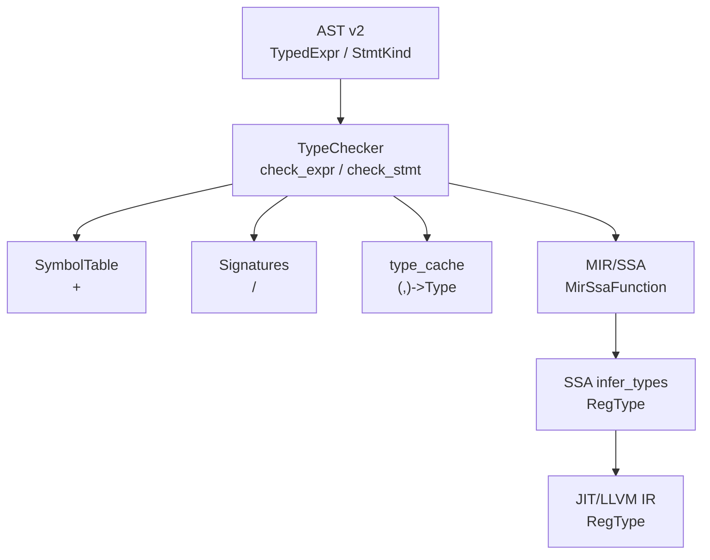
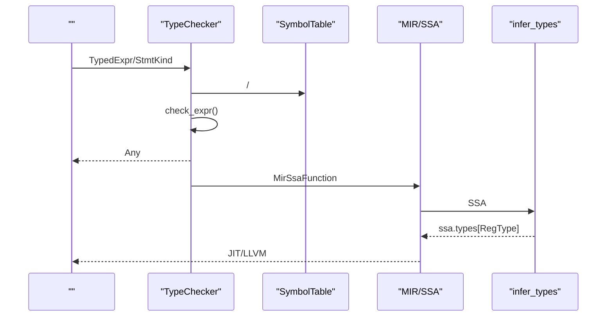
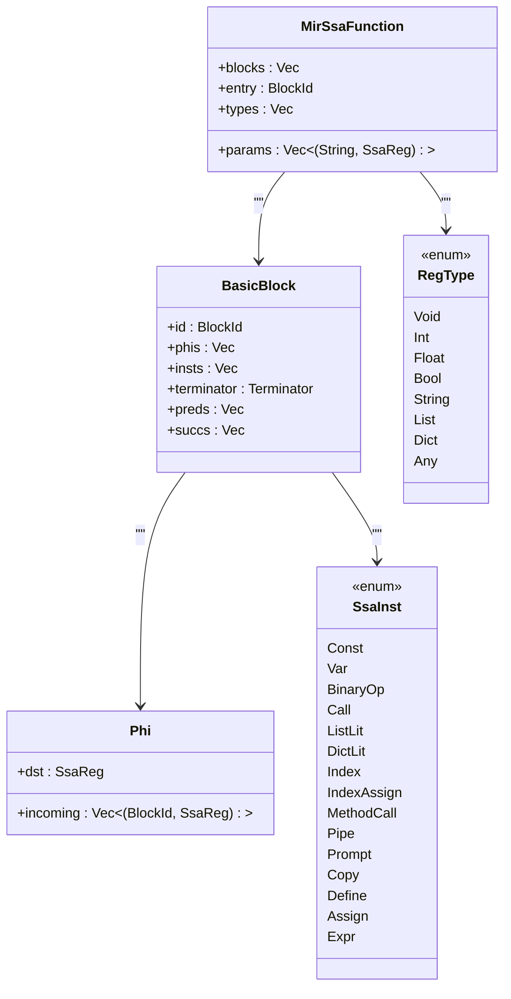
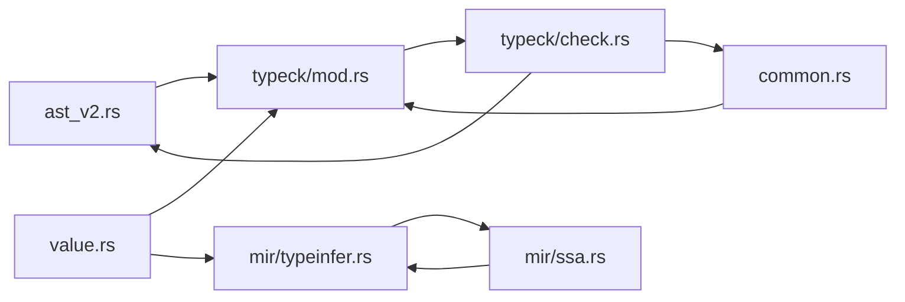

# 

<cite>
****   
- [src/mir/typeinfer.rs](file://src/mir/typeinfer.rs)
- [src/mir/ssa.rs](file://src/mir/ssa.rs)
- [src/typeck/mod.rs](file://src/typeck/mod.rs)
- [src/typeck/check.rs](file://src/typeck/check.rs)
- [src/ast_v2.rs](file://src/ast_v2.rs)
- [src/value.rs](file://src/value.rs)
</cite>

## 
1. [](#)
2. [](#)
3. [](#)
4. [](#)
5. [](#)
6. [](#)
7. [](#)
8. [](#)
9. [](#)
10. [](#)

## 
 Mora 
-  Any Union
- 
- 
- 
-  Any 
- 

Mora “ + ” Any Union

## 

- AST TypeChecker
- MIR/SSA RegType  SSA  JIT 




- [src/typeck/mod.rs:555-572](file://src/typeck/mod.rs#L555-L572)
- [src/typeck/check.rs:894-983](file://src/typeck/check.rs#L894-L983)
- [src/mir/ssa.rs:27-35](file://src/mir/ssa.rs#L27-L35)
- [src/mir/typeinfer.rs:16-112](file://src/mir/typeinfer.rs#L16-L112)


- [src/typeck/mod.rs:1-112](file://src/typeck/mod.rs#L1-L112)
- [src/ast_v2.rs:1-156](file://src/ast_v2.rs#L1-L156)

## 
- TypeChecker AST /
- SymbolTable Any Union
- Signatures/
- MirSsaFunction + RegTypeSSA Int/Float/String/List/Dict/Any 
- infer_typesSSA 
- Value Int/Float/String/Bool/Nil/List/Dict


- [src/typeck/mod.rs:512-572](file://src/typeck/mod.rs#L512-L572)
- [src/typeck/check.rs:894-983](file://src/typeck/check.rs#L894-L983)
- [src/mir/ssa.rs:27-48](file://src/mir/ssa.rs#L27-L48)
- [src/mir/typeinfer.rs:16-112](file://src/mir/typeinfer.rs#L16-L112)
- [src/value.rs:142-263](file://src/value.rs#L142-L263)

## 
Mora 
- AST let for 
- SSA SSA phi 




- [src/typeck/check.rs:894-983](file://src/typeck/check.rs#L894-L983)
- [src/mir/ssa.rs:140-263](file://src/mir/ssa.rs#L140-L263)
- [src/mir/typeinfer.rs:16-112](file://src/mir/typeinfer.rs#L16-L112)

## 

### 1. AST TypeChecker
- 
  - Literal → Int/Float/String/Bool/Char/Nil
  -  SymbolTable  Any Union
  - →Bool
  - list[T]dict[K,V]string → Char
  - / list<T>/dict<K,V>
  - / parts  String
  - / Closure
  - Union
- 
  - let hint
  - for iterable  var list→string→char
  - index assign
  - task/tool 
- 
  - if  Bool Any
  - method call  list.map 
  -  Signatures  return_type

```mermaid
flowchart TD
Start([" check_expr"]) --> Kind{""}
Kind --> |Literal| Lit[""]
Kind --> |Variable| Var[" SymbolTable  Any"]
Kind --> |BinaryOp| Bin[""]
Kind --> |Index| Idx[""]
Kind --> |ListLit| Lst[" Any"]
Kind --> |DictLit| Dic[" Any"]
Kind --> |Prompt| Prom[" parts  String"]
Kind --> |Pipe| Pipe[""]
Kind --> |Closure| Cls["/ Closure"]
Kind --> |Match| Mat[" Union"]
Kind --> || Any[" Any"]
Any --> End([""])
Lit --> End
Var --> End
Bin --> End
Idx --> End
Lst --> End
Dic --> End
Prom --> End
Pipe --> End
Cls --> End
Mat --> End
```


- [src/typeck/check.rs:894-983](file://src/typeck/check.rs#L894-L983)
- [src/typeck/check.rs:986-1030](file://src/typeck/check.rs#L986-L1030)
- [src/typeck/check.rs:1090-1150](file://src/typeck/check.rs#L1090-L1150)
- [src/typeck/check.rs:1152-1222](file://src/typeck/check.rs#L1152-L1222)
- [src/typeck/check.rs:1224-1247](file://src/typeck/check.rs#L1224-L1247)
- [src/typeck/check.rs:1249-1293](file://src/typeck/check.rs#L1249-L1293)


- [src/typeck/check.rs:894-1303](file://src/typeck/check.rs#L894-L1303)
- [src/typeck/mod.rs:512-572](file://src/typeck/mod.rs#L512-L572)

### 2. SSA RegType 
- MirSsaFunctionphi 
- 
  -  Any
  - 
  - Phi  phi  incoming 
  - 
- 
  - Const/Var/Copy/Define/Assign/Expr
  - BinaryOp//
  - ListLit/DictLit/Index/
  - Prompt String
  - Call/MethodCall/Pipe
- ssa.types  JIT 




- [src/mir/ssa.rs:27-86](file://src/mir/ssa.rs#L27-L86)
- [src/mir/ssa.rs:38-48](file://src/mir/ssa.rs#L38-L48)
- [src/mir/typeinfer.rs:16-112](file://src/mir/typeinfer.rs#L16-L112)


- [src/mir/ssa.rs:140-263](file://src/mir/ssa.rs#L140-L263)
- [src/mir/typeinfer.rs:16-303](file://src/mir/typeinfer.rs#L16-L303)

### 3. 
-  AST  SSA “”
- 
  - AST 
  - SSA /
- 
  -  raw_params/raw_return_type  T → number
  - Trait/Concrete 


- [src/typeck/mod.rs:620-629](file://src/typeck/mod.rs#L620-L629)
- [src/typeck/mod.rs:325-348](file://src/typeck/mod.rs#L325-L348)

### 4. 
-  LSP 
- TypeChecker  HashMap<(usize, usize), Type> (, )
-  check_expr 


- [src/typeck/mod.rs:570-572](file://src/typeck/mod.rs#L570-L572)
- [src/typeck/mod.rs:766-768](file://src/typeck/mod.rs#L766-L768)

### 5. Any 
- Any  UnionType::Union(vec![])
- 
  - SymbolTable.lookup  Any
  - check_call_expr  Any
  - / Any
  - SSA  Any Any
- 


- [src/typeck/mod.rs:351-354](file://src/typeck/mod.rs#L351-L354)
- [src/typeck/check.rs:894-983](file://src/typeck/check.rs#L894-L983)
- [src/mir/typeinfer.rs:57-64](file://src/mir/typeinfer.rs#L57-L64)

### 6. 
- 
  - int + int → int
  - float + float → float
  - mixed → float
  - string + any → stringv0.24 
- 
  - print(x)x  string/number/bool/char/nil/list/dictUnion 
  - range(start, end, step) number list<number>
- 
  - if conditioncondition  bool  any
  - match arms Union
- 
  - list.map(fn(x: number) x * 2)
  - dict  Any


- [src/typeck/check.rs:986-1030](file://src/typeck/check.rs#L986-L1030)
- [src/typeck/check.rs:1032-1088](file://src/typeck/check.rs#L1032-L1088)
- [src/typeck/check.rs:1152-1222](file://src/typeck/check.rs#L1152-L1222)
- [src/typeck/check.rs:1249-1293](file://src/typeck/check.rs#L1249-L1293)

## 
- TypeChecker 
  - ast_v2/
  - commonBinaryOpSpan 
  - value MIR 
- SSA 
  - mir/ssaSSA 
  - value RegType
- 
  -  Any




- [src/ast_v2.rs:1-156](file://src/ast_v2.rs#L1-L156)
- [src/typeck/mod.rs:1-112](file://src/typeck/mod.rs#L1-L112)
- [src/typeck/check.rs:1-10](file://src/typeck/check.rs#L1-L10)
- [src/mir/ssa.rs:1-20](file://src/mir/ssa.rs#L1-L20)
- [src/mir/typeinfer.rs:1-15](file://src/mir/typeinfer.rs#L1-L15)


- [src/typeck/mod.rs:1-112](file://src/typeck/mod.rs#L1-L112)
- [src/typeck/check.rs:1-10](file://src/typeck/check.rs#L1-L10)
- [src/mir/ssa.rs:1-20](file://src/mir/ssa.rs#L1-L20)
- [src/mir/typeinfer.rs:1-15](file://src/mir/typeinfer.rs#L1-L15)

## 
-  (, )  LSP 
- SSA  + phi ≤50 
- O(n) 
- 


- [src/typeck/mod.rs:570-572](file://src/typeck/mod.rs#L570-L572)
- [src/mir/typeinfer.rs:67-112](file://src/mir/typeinfer.rs#L67-L112)

## 
- 
  -  let 
  -  number  string
  - list  numberdict  string
  -  map/filter 
- 
  - main.rs 
  -  TypeError  expected/actual/hint 
  -  (, ) 


- [src/typeck/mod.rs:408-505](file://src/typeck/mod.rs#L408-L505)
- [src/typeck/check.rs:986-1030](file://src/typeck/check.rs#L986-L1030)
- [src/typeck/check.rs:1090-1150](file://src/typeck/check.rs#L1090-L1150)

## 
Mora “AST  + SSA ” JIT  Any 

## 
- 
  - v0.13 Union  Type::Any  Union  Any
  - v0.24 string + number  string
  - v0.38Int/Float 
- 
  - Type
  - RegTypeSSA 
  - Value
  - Signature


- [src/typeck/mod.rs:38-111](file://src/typeck/mod.rs#L38-L111)
- [src/mir/ssa.rs:38-48](file://src/mir/ssa.rs#L38-L48)
- [src/value.rs:142-263](file://src/value.rs#L142-L263)
- [src/typeck/mod.rs:620-629](file://src/typeck/mod.rs#L620-L629)