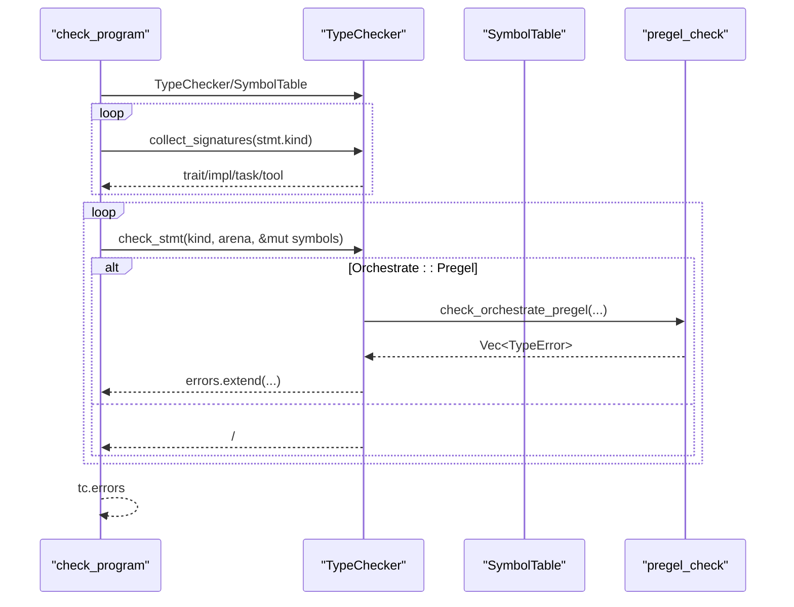
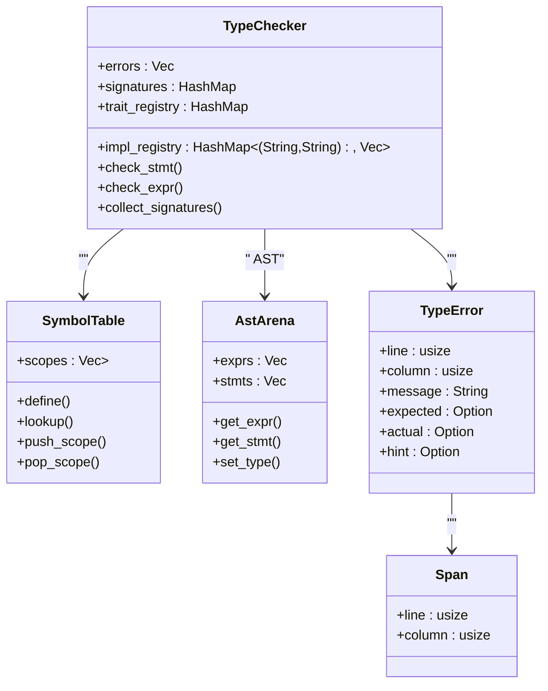

# 

<cite>
****   
- [src/typeck/mod.rs](file://src/typeck/mod.rs)
- [src/typeck/check.rs](file://src/typeck/check.rs)
- [src/typeck/pregel_check.rs](file://src/typeck/pregel_check.rs)
- [src/ast_v2.rs](file://src/ast_v2.rs)
- [src/common.rs](file://src/common.rs)
</cite>

## 
1. [](#)
2. [](#)
3. [](#)
4. [](#)
5. [](#)
6. [](#)
7. [](#)
8. [](#)
9. [](#)
10. [](#)

## 
 Mora 
- trait/impltask/tool 
- 
-  hint +  + Union 
- 
- Span  TypeError 
-  Union 
- /for-inmatch 

## 
 typeck  ast_v2  Arena  AST  common  SpanLiteralBinaryOp

```mermaid
graph TB
subgraph ""
A["typeck/mod.rs<br/>//"]
B["typeck/check.rs<br/>check_stmt/check_expr "]
C["typeck/pregel_check.rs<br/>Pregel "]
end
subgraph "AST "
D["ast_v2.rs<br/>TypedExpr/StmtKind/AstArena/NodeId"]
E["common.rs<br/>Span/Literal/BinaryOp"]
end
A --> B
A --> C
B --> D
B --> E
C --> D
C --> E
```


- [src/typeck/mod.rs:1033-1055](file://src/typeck/mod.rs#L1033-L1055)
- [src/typeck/check.rs:18-230](file://src/typeck/check.rs#L18-L230)
- [src/typeck/pregel_check.rs:62-139](file://src/typeck/pregel_check.rs#L62-L139)
- [src/ast_v2.rs:568-632](file://src/ast_v2.rs#L568-L632)
- [src/common.rs:8-21](file://src/common.rs#L8-L21)


- [src/typeck/mod.rs:1033-1055](file://src/typeck/mod.rs#L1033-L1055)
- [src/typeck/check.rs:18-230](file://src/typeck/check.rs#L18-L230)
- [src/typeck/pregel_check.rs:62-139](file://src/typeck/pregel_check.rs#L62-L139)
- [src/ast_v2.rs:568-632](file://src/ast_v2.rs#L568-L632)
- [src/common.rs:8-21](file://src/common.rs#L8-L21)

## 
- Type 
  - list/dictResultTrait/ConcreteUnion 
  -  from_hint name compatible_with 
- SymbolTable 
  -  define/lookup/push_scope/pop_scope
- TypeChecker 
  -  task/closure trait/impl 
  -  check_program 
- 
  - TypeError /
  - Span 
- Pregel 
  -  orchestrate Pregel  schema goto/send 


- [src/typeck/mod.rs:38-349](file://src/typeck/mod.rs#L38-L349)
- [src/typeck/mod.rs:512-548](file://src/typeck/mod.rs#L512-L548)
- [src/typeck/mod.rs:555-769](file://src/typeck/mod.rs#L555-L769)
- [src/typeck/mod.rs:408-506](file://src/typeck/mod.rs#L408-L506)
- [src/common.rs:8-21](file://src/common.rs#L8-L21)
- [src/typeck/pregel_check.rs:62-139](file://src/typeck/pregel_check.rs#L62-L139)

## 
Mora “”
- trait/impltask/tool 
- 




- [src/typeck/mod.rs:1033-1055](file://src/typeck/mod.rs#L1033-L1055)
- [src/typeck/mod.rs:1058-1146](file://src/typeck/mod.rs#L1058-L1146)
- [src/typeck/check.rs:803-834](file://src/typeck/check.rs#L803-L834)
- [src/typeck/pregel_check.rs:62-139](file://src/typeck/pregel_check.rs#L62-L139)


- [src/typeck/mod.rs:1033-1055](file://src/typeck/mod.rs#L1033-L1055)
- [src/typeck/mod.rs:1058-1146](file://src/typeck/mod.rs#L1058-L1146)
- [src/typeck/check.rs:803-834](file://src/typeck/check.rs#L803-L834)
- [src/typeck/pregel_check.rs:62-139](file://src/typeck/pregel_check.rs#L62-L139)

## 

###  Union 
- Type ResultTrait/ConcreteUnion 
- compatible_with 
  - Union  expected  self  Union Union  any
  - Result<T,E> T/E 
  - List<T>/Dict<K,V> 
  - Nil  Nil
  - Trait 
-  is_empty_union  Unionany 

```mermaid
flowchart TD
Start([""]) --> CheckExpectedUnion{"expected  Union?"}
CheckExpectedUnion --> || EmptyExp{"members ?"}
EmptyExp --> || ReturnTrue[" true (any)"]
EmptyExp --> || AnyMember["?"]
AnyMember --> || ReturnTrue
AnyMember --> || ReturnFalse[" false"]
CheckExpectedUnion --> || CheckSelfUnion{"self  Union?"}
CheckSelfUnion --> || EmptySelf{"members ?"}
EmptySelf --> || ReturnTrue
EmptySelf --> || SelfMember[" expected?"]
SelfMember --> || ReturnTrue
SelfMember --> || ReturnFalse
CheckSelfUnion --> || CheckResult{" Result?"}
CheckResult --> || ResultCheck["T1==T2  E1==E2?"]
ResultCheck --> || ReturnTrue
ResultCheck --> || ReturnFalse
CheckResult --> || CheckList{" List?"}
CheckList --> || ListCheck["?"]
ListCheck --> || ReturnTrue
ListCheck --> || ReturnFalse
CheckList --> || CheckNil{" Nil?"}
CheckNil --> || NilCheck[" Nil?"]
NilCheck --> || ReturnTrue
NilCheck --> || ReturnFalse
CheckNil --> || CheckTrait{" Trait?"}
CheckTrait --> || TraitCheck["++?"]
TraitCheck --> || ReturnTrue
TraitCheck --> || ReturnFalse
CheckTrait --> || FinalEq{"self == expected?"}
FinalEq --> || ReturnTrue
FinalEq --> || ReturnFalse
```


- [src/typeck/mod.rs:284-349](file://src/typeck/mod.rs#L284-L349)
- [src/typeck/mod.rs:351-354](file://src/typeck/mod.rs#L351-L354)


- [src/typeck/mod.rs:284-349](file://src/typeck/mod.rs#L284-L349)
- [src/typeck/mod.rs:351-354](file://src/typeck/mod.rs#L351-L354)

### 
- SymbolTable push/pop if/for/match 
- lookup  Unionany
- define 


- [src/typeck/mod.rs:512-548](file://src/typeck/mod.rs#L512-L548)

### 
-  collect_signatures
  -  TraitDef/ImplDef trait_registry  impl_registry
  -  self
-  check_stmt/check_expr
  - 
  -  Orchestrate::Pregel pregel_check 


- [src/typeck/mod.rs:1058-1146](file://src/typeck/mod.rs#L1058-L1146)
- [src/typeck/check.rs:18-230](file://src/typeck/check.rs#L18-L230)
- [src/typeck/check.rs:803-834](file://src/typeck/check.rs#L803-L834)

### 
-  IDE 
- 
  - TypeChecker  errors: Vec<TypeError>
  -  push 
  -  check_program  tc.errors


- [src/typeck/mod.rs:555-572](file://src/typeck/mod.rs#L555-L572)
- [src/typeck/mod.rs:1033-1055](file://src/typeck/mod.rs#L1033-L1055)
- [src/typeck/check.rs:233-274](file://src/typeck/check.rs#L233-L274)

### 
- Span  line/column 
- TypeError  Span  expected/actual/hint
- format_error IDE 


- [src/common.rs:8-21](file://src/common.rs#L8-L21)
- [src/typeck/mod.rs:408-506](file://src/typeck/mod.rs#L408-L506)

### 
-  hint let x: T = expr expr  T 
-  hint 
  - string/int/float/bool/nil/char
  - // any
  - for-in 
  - match arms  Union
- 
  -  number string + any → stringv0.24 
  -  list→numberdict→stringstring→number
  -  method_return_type 
  - 


- [src/typeck/check.rs:894-983](file://src/typeck/check.rs#L894-L983)
- [src/typeck/check.rs:985-1030](file://src/typeck/check.rs#L985-L1030)
- [src/typeck/check.rs:1090-1150](file://src/typeck/check.rs#L1090-L1150)
- [src/typeck/check.rs:1152-1222](file://src/typeck/check.rs#L1152-L1222)
- [src/typeck/mod.rs:897-956](file://src/typeck/mod.rs#L897-L956)

### 
- let
  -  hint init  hint 
  -  hint init  any
  - [src/typeck/check.rs:233-274](file://src/typeck/check.rs#L233-L274)
- assign
  - 
  - [src/typeck/check.rs:277-294](file://src/typeck/check.rs#L277-L294)
- call
  -  return_type
  - [src/typeck/check.rs:1032-1088](file://src/typeck/check.rs#L1032-L1088)
- method call
  - 
  - [src/typeck/check.rs:1249-1293](file://src/typeck/check.rs#L1249-L1293), [src/typeck/mod.rs:897-956](file://src/typeck/mod.rs#L897-L956)
- 
  - list  numberdict  stringstring  number
  - 
  - [src/typeck/check.rs:1090-1150](file://src/typeck/check.rs#L1090-L1150), [src/typeck/check.rs:395-425](file://src/typeck/check.rs#L395-L425)
- /
  - / any 
  - [src/typeck/check.rs:1152-1222](file://src/typeck/check.rs#L1152-L1222)
- for-in 
  -  list/string
  - [src/typeck/check.rs:356-393](file://src/typeck/check.rs#L356-L393)
- match 
  -  arm  Union
  - [src/typeck/check.rs:961-981](file://src/typeck/check.rs#L961-L981)


- [src/typeck/check.rs:233-274](file://src/typeck/check.rs#L233-L274)
- [src/typeck/check.rs:277-294](file://src/typeck/check.rs#L277-L294)
- [src/typeck/check.rs:1032-1088](file://src/typeck/check.rs#L1032-L1088)
- [src/typeck/check.rs:1249-1293](file://src/typeck/check.rs#L1249-L1293)
- [src/typeck/check.rs:1090-1150](file://src/typeck/check.rs#L1090-L1150)
- [src/typeck/check.rs:395-425](file://src/typeck/check.rs#L395-L425)
- [src/typeck/check.rs:1152-1222](file://src/typeck/check.rs#L1152-L1222)
- [src/typeck/check.rs:356-393](file://src/typeck/check.rs#L356-L393)
- [src/typeck/check.rs:961-981](file://src/typeck/check.rs#L961-L981)

### Pregel 
- 
  - state_schema  reducer  type_hint append→listadd→number
  - edge 
  - checkpoint saver 
  - interrupt_points  command goto/send 
  - map/fan_out  reduce/fan_in 
  - agent 
-  panic


- [src/typeck/pregel_check.rs:62-139](file://src/typeck/pregel_check.rs#L62-L139)
- [src/typeck/pregel_check.rs:145-276](file://src/typeck/pregel_check.rs#L145-L276)

## 
- TypeChecker 
  - ast_v2  TypedExpr/StmtKind/AstArena/NodeId  AST  Span
  - common  Span/Literal/BinaryOp 
  - pregel_check  Pregel 
- 
  - typeck/mod.rs 
  - typeck/check.rs 
  - typeck/pregel_check.rs 




- [src/typeck/mod.rs:555-572](file://src/typeck/mod.rs#L555-L572)
- [src/typeck/mod.rs:512-548](file://src/typeck/mod.rs#L512-L548)
- [src/ast_v2.rs:568-632](file://src/ast_v2.rs#L568-L632)
- [src/common.rs:8-21](file://src/common.rs#L8-L21)
- [src/typeck/mod.rs:408-506](file://src/typeck/mod.rs#L408-L506)


- [src/typeck/mod.rs:555-572](file://src/typeck/mod.rs#L555-L572)
- [src/typeck/mod.rs:512-548](file://src/typeck/mod.rs#L512-L548)
- [src/ast_v2.rs:568-632](file://src/ast_v2.rs#L568-L632)
- [src/common.rs:8-21](file://src/common.rs#L8-L21)
- [src/typeck/mod.rs:408-506](file://src/typeck/mod.rs#L408-L506)

## 
- Arena 
- type_cache TypeChecker 
- 
- Union  Union 

[]

## 
- 
  - expected/actual hint 
  - 
  - /
  - list/dict/string 
  -  list.map/filter 
- 
  -  Span 
  -  format_error  IDE 
  -  Pregel  state_schema/reducer/edge 


- [src/typeck/mod.rs:408-506](file://src/typeck/mod.rs#L408-L506)
- [src/typeck/check.rs:233-274](file://src/typeck/check.rs#L233-L274)
- [src/typeck/check.rs:1032-1088](file://src/typeck/check.rs#L1032-L1088)
- [src/typeck/check.rs:1090-1150](file://src/typeck/check.rs#L1090-L1150)
- [src/typeck/check.rs:1249-1293](file://src/typeck/check.rs#L1249-L1293)
- [src/typeck/pregel_check.rs:145-276](file://src/typeck/pregel_check.rs#L145-L276)

## 
Mora  hint  Union  Pregel 

[]

## 
- 
  - Union Union  any
  - Span
  - TypeError/
- 
  - [src/typeck/mod.rs:38-349](file://src/typeck/mod.rs#L38-L349)
  - [src/typeck/mod.rs:512-548](file://src/typeck/mod.rs#L512-L548)
  - [src/typeck/mod.rs:1033-1055](file://src/typeck/mod.rs#L1033-L1055)
  - [src/typeck/check.rs:894-983](file://src/typeck/check.rs#L894-L983)
  - [src/typeck/mod.rs:897-956](file://src/typeck/mod.rs#L897-L956)
  - Pregel [src/typeck/pregel_check.rs:62-139](file://src/typeck/pregel_check.rs#L62-L139)