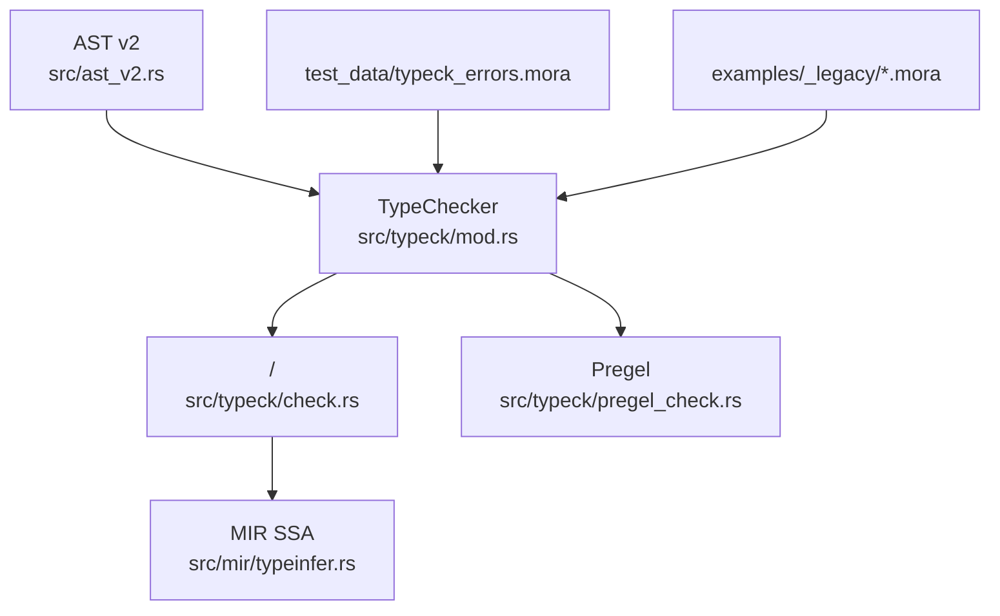
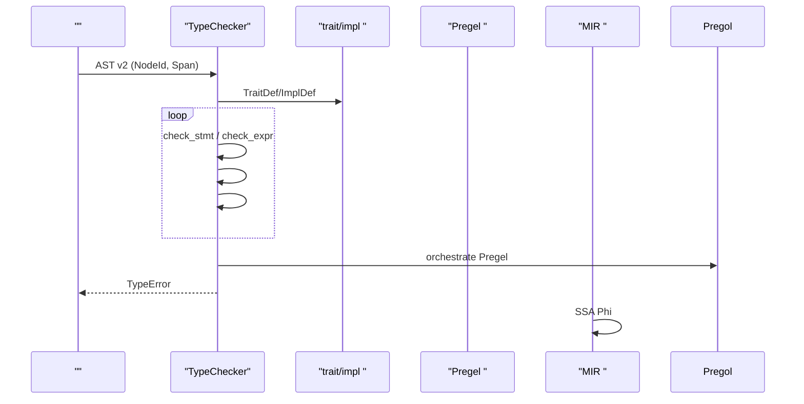
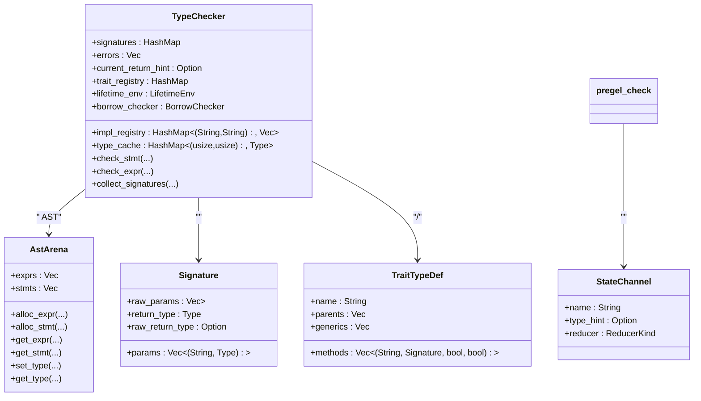

# 

<cite>
****
- [src/typeck/mod.rs](file://src/typeck/mod.rs)
- [src/typeck/check.rs](file://src/typeck/check.rs)
- [src/mir/typeinfer.rs](file://src/mir/typeinfer.rs)
- [src/ast_v2.rs](file://src/ast_v2.rs)
- [src/typeck/pregel_check.rs](file://src/typeck/pregel_check.rs)
- [test_data/typeck_errors.mora](file://test_data/typeck_errors.mora)
- [examples/_legacy/trait_demo.mora](file://examples/_legacy/trait_demo.mora)
- [examples/_legacy/generic_with_where.mora](file://examples/_legacy/generic_with_where.mora)
</cite>

## 
1. [](#)
2. [](#)
3. [](#)
4. [](#)
5. [](#)
6. [](#)
7. [](#)
8. [](#)
9. [](#)
10. [](#)

## 
 Mora  Trait //

## 
Mora 
- src/typeck/mod.rs
- src/typeck/check.rs
- MIR SSA src/mir/typeinfer.rs
- AST v2 src/ast_v2.rs
- Pregel src/typeck/pregel_check.rs
- test_data/typeck_errors.mora, examples/_legacy/*.mora




- [src/typeck/mod.rs:1033-1055](file://src/typeck/mod.rs#L1033-L1055)
- [src/typeck/check.rs:18-229](file://src/typeck/check.rs#L18-L229)
- [src/mir/typeinfer.rs:17-112](file://src/mir/typeinfer.rs#L17-L112)
- [src/ast_v2.rs:568-632](file://src/ast_v2.rs#L568-L632)


- [src/typeck/mod.rs:1033-1055](file://src/typeck/mod.rs#L1033-L1055)
- [src/typeck/check.rs:18-229](file://src/typeck/check.rs#L18-L229)
- [src/mir/typeinfer.rs:17-112](file://src/mir/typeinfer.rs#L17-L112)
- [src/ast_v2.rs:568-632](file://src/ast_v2.rs#L568-L632)

## 
- Type  Union TypeError  SymbolTable TypeChecker
- check_program  → check_stmt/check_expr 
- MIR  SSA  + Phi 
- Trait/Impldyn Trait
- Pregel 


- [src/typeck/mod.rs:37-349](file://src/typeck/mod.rs#L37-L349)
- [src/typeck/mod.rs:511-548](file://src/typeck/mod.rs#L511-L548)
- [src/typeck/mod.rs:555-769](file://src/typeck/mod.rs#L555-L769)
- [src/typeck/check.rs:894-983](file://src/typeck/check.rs#L894-L983)
- [src/mir/typeinfer.rs:17-112](file://src/mir/typeinfer.rs#L17-L112)
- [src/typeck/pregel_check.rs:49-139](file://src/typeck/pregel_check.rs#L49-L139)

## 

-  AST v2 NodeId  Span
-  TraitDef/ImplDef  trait_registry  impl_registry
-  check_stmt check_expr 
-  method_return_type 
-  Pregel  pregel_check 
-  MIR  SSA  JIT/LLVM IR 




- [src/typeck/mod.rs:1033-1055](file://src/typeck/mod.rs#L1033-L1055)
- [src/typeck/check.rs:18-229](file://src/typeck/check.rs#L18-L229)
- [src/typeck/pregel_check.rs:49-139](file://src/typeck/pregel_check.rs#L49-L139)
- [src/mir/typeinfer.rs:17-112](file://src/mir/typeinfer.rs#L17-L112)

## 

### 
- stringcharintfloatboolnil
- list<T>dict<K,V>
- taskclosureconversationstreambuiltinai_configai_resultai_errorai_modulerouterhttp_requesthttp_responsemcp_server
- Trait{name, generics}Concrete{name, generics, traits}TraitObject
- Union(Vec<Type>) Union “any”
- agentcomposepartialatommacroprompt_sectiondocument


- Union 
- Result<T,E> 
- List/Dict /
- Nil  Nil trait
- Trait  name 

 from_hint
-  list<T>dict<K,V>dyn:Trait<...> Trait 
- any  Union(vec![])


- TypeError /
- format_error  IDE 


- [src/typeck/mod.rs:37-349](file://src/typeck/mod.rs#L37-L349)
- [src/typeck/mod.rs:408-505](file://src/typeck/mod.rs#L408-L505)

### 
-  push/pop scope
- lookup  AnyUnion(vec![])


- [src/typeck/mod.rs:511-548](file://src/typeck/mod.rs#L511-L548)

### 
- TypeChecker / hintroutestrait/impl 
- collect_signatures  TraitDef/ImplDef  TraitTypeDef 
- check_program 
- check_stmt letassignreturnifformatchwithtool/task deftrait/impltype aliasenum/structorchestrateevalskillprompt/document section 
- check_expr /dyn Trait


- let  hint 
- return 
- for list→string→char
- with 
-  method_return_type 
- //


- [src/typeck/mod.rs:555-769](file://src/typeck/mod.rs#L555-L769)
- [src/typeck/mod.rs:1033-1146](file://src/typeck/mod.rs#L1033-L1146)
- [src/typeck/check.rs:18-229](file://src/typeck/check.rs#L18-L229)
- [src/typeck/check.rs:894-983](file://src/typeck/check.rs#L894-L983)
- [src/typeck/check.rs:985-1030](file://src/typeck/check.rs#L985-L1030)
- [src/typeck/check.rs:1032-1088](file://src/typeck/check.rs#L1032-L1088)
- [src/typeck/check.rs:1090-1150](file://src/typeck/check.rs#L1090-L1150)
- [src/typeck/check.rs:1152-1222](file://src/typeck/check.rs#L1152-L1222)
- [src/typeck/check.rs:1224-1247](file://src/typeck/check.rs#L1224-L1247)
- [src/typeck/check.rs:1249-1293](file://src/typeck/check.rs#L1249-L1293)

### 
- +  string+stringstring+any→stringlist+list Any-/*/%  number
- number/string  bool
- 
  - list<T>map/filter/push  list<T>reduce/pop/get  Anylen  float
  - dict<K,V>get  V|Nilset  dict<K,V>keys/values  listlen  float
  -  fallbackstring  len/upper/lower/trim/replace/split/contains Conversation/AiModule/AiConfig/Router/McpServer/HttpRequest 


- [src/typeck/mod.rs:794-891](file://src/typeck/mod.rs#L794-L891)
- [src/typeck/mod.rs:897-956](file://src/typeck/mod.rs#L897-L956)

###  Trait 
- Trait  trait has_defaulthas_self
- Impl  trait
- dyn Trait ExprKind::DynTrait  Trait runtime  vtable 
- substitute_type_hint  type_to_hint_string  hint 
- Trait collect_trait_methods_recursive  trait 


- trait  impl examples/_legacy/trait_demo.mora
-  + where examples/_legacy/generic_with_where.mora


- [src/typeck/mod.rs:603-665](file://src/typeck/mod.rs#L603-L665)
- [src/typeck/mod.rs:1058-1146](file://src/typeck/mod.rs#L1058-L1146)
- [src/typeck/check.rs:677-745](file://src/typeck/check.rs#L677-L745)
- [src/typeck/check.rs:923-932](file://src/typeck/check.rs#L923-L932)
- [src/typeck/mod.rs:958-1023](file://src/typeck/mod.rs#L958-L1023)
- [examples/_legacy/trait_demo.mora:1-24](file://examples/_legacy/trait_demo.mora#L1-L24)
- [examples/_legacy/generic_with_where.mora:1-30](file://examples/_legacy/generic_with_where.mora#L1-L30)

### 
- TypeAlias 
- EnumDef  dict<string, any> builtin
- StructDef  hint Task Task


- [src/typeck/check.rs:176-184](file://src/typeck/check.rs#L176-L184)
- [src/typeck/check.rs:747-784](file://src/typeck/check.rs#L747-L784)

### 
- Match  arm  arm  Union(arm_types)


- [src/typeck/check.rs:961-982](file://src/typeck/check.rs#L961-L982)

### Pregel 
-  state_schema  reducer  type_hint append→listadd→number
-  edge  @start/@exit  skip 
-  checkpoint saver 
-  interrupt_points  command goto/send 
- map/fan_out  reduce/fan_in 
-  agent 


- [src/typeck/pregel_check.rs:49-139](file://src/typeck/pregel_check.rs#L49-L139)
- [src/typeck/pregel_check.rs:145-276](file://src/typeck/pregel_check.rs#L145-L276)

### MIR SSA 
-  + Phi  50 
-  Const/Var/BinaryOp/ListLit/DictLit/Index/Copy/Define/Assign/Expr 
- Any  int+float→floatlist<T>+list<U>→list<merge(T,U)>

```mermaid
flowchart TD
Start([""]) --> Init[" Any"]
Init --> Collect[""]
Collect --> Iterate{""}
Iterate --> || Propagate[""]
Propagate --> MergePhi[" Phi  incoming "]
MergePhi --> Update[" changed"]
Update --> Iterate
Iterate --> || End([""])
```


- [src/mir/typeinfer.rs:17-112](file://src/mir/typeinfer.rs#L17-L112)
- [src/mir/typeinfer.rs:170-303](file://src/mir/typeinfer.rs#L170-L303)


- [src/mir/typeinfer.rs:17-112](file://src/mir/typeinfer.rs#L17-L112)
- [src/mir/typeinfer.rs:170-303](file://src/mir/typeinfer.rs#L170-L303)

## 
- TypeChecker  ast_v2  TypedExpr/TypedStmt  NodeId/Span
- TypeChecker  common.BinaryOp  Span
- TypeChecker  signaturestrait_registryimpl_registrylifetime_envborrow_checkertype_cache
- check.rs  method_return_type  method_return_type_fallback
- pregel_check  ast_v2  OrchestrateAgent/Edge/StateChannel/CheckpointConfig/InterruptPoint




- [src/typeck/mod.rs:555-769](file://src/typeck/mod.rs#L555-L769)
- [src/typeck/mod.rs:603-665](file://src/typeck/mod.rs#L603-L665)
- [src/ast_v2.rs:568-632](file://src/ast_v2.rs#L568-L632)
- [src/typeck/pregel_check.rs:145-193](file://src/typeck/pregel_check.rs#L145-L193)


- [src/typeck/mod.rs:555-769](file://src/typeck/mod.rs#L555-L769)
- [src/ast_v2.rs:568-632](file://src/ast_v2.rs#L568-L632)
- [src/typeck/pregel_check.rs:145-193](file://src/typeck/pregel_check.rs#L145-L193)

## 
- 
-  lookup  O(n_scope) type_cache 
- MIR 50
- 
-  hint 

[]

## 

- let expected 'X', got 'Y'
-  Any
- +/-/*/ %  number  number/string
- with  model/temperature/max_tokens/system/mock_llm/compact_at/tools 
- record_tokens / number
- return 
- /
- route/ai_model 
- trait  impl  trait  impl 
- self-less trait  self 
- trait impl  trait 


- [test_data/typeck_errors.mora:1-195](file://test_data/typeck_errors.mora#L1-L195)
- [src/typeck/check.rs:232-274](file://src/typeck/check.rs#L232-L274)
- [src/typeck/check.rs:296-317](file://src/typeck/check.rs#L296-L317)
- [src/typeck/check.rs:356-393](file://src/typeck/check.rs#L356-L393)
- [src/typeck/check.rs:569-607](file://src/typeck/check.rs#L569-L607)
- [src/typeck/check.rs:695-745](file://src/typeck/check.rs#L695-L745)

## 
Mora Trait/ dyn Trait MIR  JIT/LLVM IR Pregel  AI 

[]

## 

### 
```mermaid
flowchart TD
Entry(["check_program "]) --> Collect[" TraitDef/ImplDef "]
Collect --> LoopStmts[""]
LoopStmts --> CheckStmt["check_stmt "]
CheckStmt --> CheckExpr["check_expr "]
CheckExpr --> MethodReturn["method_return_type "]
MethodReturn --> Builtins[""]
Builtins --> Errors[" TypeError"]
Errors --> NextStmt[""]
NextStmt --> LoopStmts
LoopStmts --> Done([""])
```


- [src/typeck/mod.rs:1033-1055](file://src/typeck/mod.rs#L1033-L1055)
- [src/typeck/check.rs:18-229](file://src/typeck/check.rs#L18-L229)
- [src/typeck/check.rs:894-983](file://src/typeck/check.rs#L894-L983)
- [src/typeck/mod.rs:897-956](file://src/typeck/mod.rs#L897-L956)

### 
-  AnyUnion(vec![]) task Any 
-  let  hint  init /
- Nil  trait Option  T? 
- Result<T,E> 
- dyn Trait  Trait  vtable  impl 


- [src/typeck/mod.rs:37-349](file://src/typeck/mod.rs#L37-L349)
- [src/typeck/check.rs:232-274](file://src/typeck/check.rs#L232-L274)
- [src/typeck/check.rs:923-932](file://src/typeck/check.rs#L923-L932)