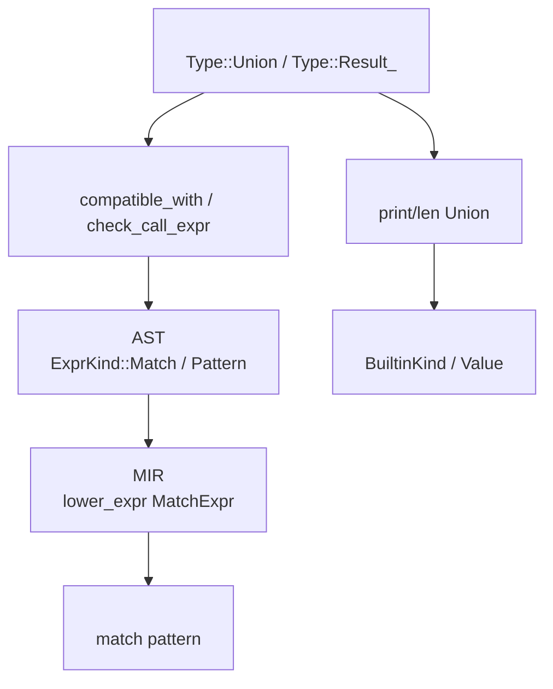
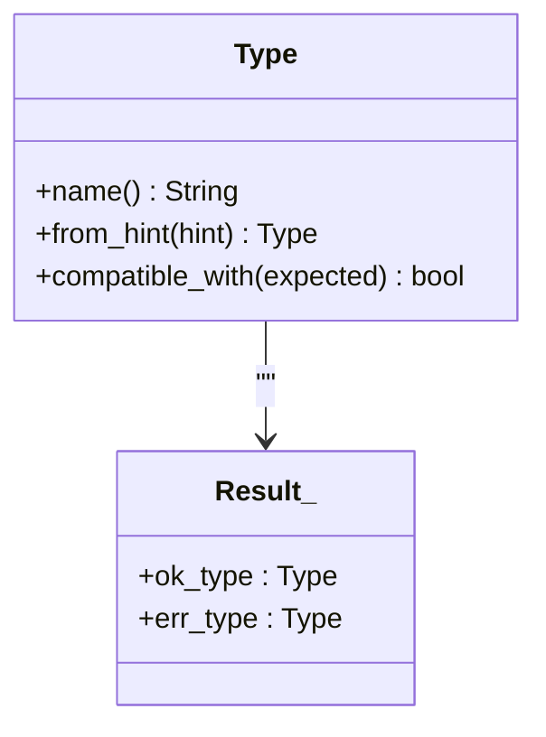
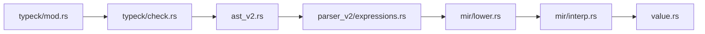

# 

<cite>
****   
- [src/typeck/mod.rs](file://src/typeck/mod.rs)
- [src/typeck/check.rs](file://src/typeck/check.rs)
- [src/ast_v2.rs](file://src/ast_v2.rs)
- [src/parser_v2/expressions.rs](file://src/parser_v2/expressions.rs)
- [src/mir/lower.rs](file://src/mir/lower.rs)
- [src/mir/interp.rs](file://src/mir/interp.rs)
- [src/value.rs](file://src/value.rs)
- [test_data/v0.07_validation.mora](file://test_data/v0.07_validation.mora)
- [test_data/typeck_errors.mora](file://test_data/typeck_errors.mora)
</cite>

## 
1. [](#)
2. [](#)
3. [](#)
4. [](#)
5. [](#)
6. [](#)
7. [](#)
8. [](#)
9. [](#)
10. [](#)

## 
 Mora UnionResult
-  T1 | T2 | T3  any 
- 
- Result<T, E>  Ok/Err 
- print  Union 
-  any  Any 
- 

## 
/
- typeck/mod.rs
- typeck/check.rs
- AST  match ast_v2.rsparser_v2/expressions.rs
- MIR mir/lower.rsmir/interp.rs
- value.rs
- test_data/*.mora



**** 
- [src/typeck/mod.rs:38-111](file://src/typeck/mod.rs#L38-L111)
- [src/typeck/mod.rs:284-348](file://src/typeck/mod.rs#L284-L348)
- [src/typeck/check.rs:894-919](file://src/typeck/check.rs#L894-L919)
- [src/ast_v2.rs:127-131](file://src/ast_v2.rs#L127-L131)
- [src/parser_v2/expressions.rs:197-232](file://src/parser_v2/expressions.rs#L197-L232)
- [src/mir/lower.rs:173-192](file://src/mir/lower.rs#L173-L192)
- [src/mir/interp.rs:850-892](file://src/mir/interp.rs#L850-L892)
- [src/value.rs:44-79](file://src/value.rs#L44-L79)

****
- [src/typeck/mod.rs:38-111](file://src/typeck/mod.rs#L38-L111)
- [src/typeck/check.rs:894-919](file://src/typeck/check.rs#L894-L919)
- [src/ast_v2.rs:127-131](file://src/ast_v2.rs#L127-L131)
- [src/parser_v2/expressions.rs:197-232](file://src/parser_v2/expressions.rs#L197-L232)
- [src/mir/lower.rs:173-192](file://src/mir/lower.rs#L173-L192)
- [src/mir/interp.rs:850-892](file://src/mir/interp.rs#L850-L892)
- [src/value.rs:44-79](file://src/value.rs#L44-L79)

## 
-  TypeTrait/ConcreteUnionResult_ name()  Union  "T1 | T2 | T3" Union  "any"
-  from_hint("any") → Type::Union(vec![]) Any 
-  compatible_withUnion  Union Result_(T,E) T1==T2  E1==E2
-  check_expr / check_call_expr call  Union  Union(vec![])
- AST  matchPattern  Wildcard/Literal/Variable/List/Dict/GuardExprKind::Match 
- MIR  lower_expr ExprKind::Match  MirInst::MatchExpr
-  interp dict/guard/char 
- print/len  Union 

****
- [src/typeck/mod.rs:113-160](file://src/typeck/mod.rs#L113-L160)
- [src/typeck/mod.rs:162-255](file://src/typeck/mod.rs#L162-L255)
- [src/typeck/mod.rs:284-348](file://src/typeck/mod.rs#L284-L348)
- [src/typeck/check.rs:894-919](file://src/typeck/check.rs#L894-L919)
- [src/ast_v2.rs:12-27](file://src/ast_v2.rs#L12-L27)
- [src/parser_v2/expressions.rs:197-232](file://src/parser_v2/expressions.rs#L197-L232)
- [src/mir/lower.rs:173-192](file://src/mir/lower.rs#L173-L192)
- [src/mir/interp.rs:850-892](file://src/mir/interp.rs#L850-L892)

## 
 →  → AST  → MIR  →  → 

```mermaid
sequenceDiagram
participant  as ""
participant  as "(check.rs)"
participant  as "(mod.rs)"
participant  as "(expressions.rs)"
participant MIR as "MIR(lower.rs)"
participant  as "(interp.rs)"
participant  as "(value.rs)"
->> :  match / let / call
-->> : AST( ExprKind : : Match / Call)
->> : /(Union/Result_)
-->>MIR : (MatchExpr/Call)
MIR-->> : 
->> :  BuiltinKind (print/len/...)
-->> : 
```

**** 
- [src/typeck/check.rs:894-919](file://src/typeck/check.rs#L894-L919)
- [src/typeck/mod.rs:284-348](file://src/typeck/mod.rs#L284-L348)
- [src/parser_v2/expressions.rs:197-232](file://src/parser_v2/expressions.rs#L197-L232)
- [src/mir/lower.rs:173-192](file://src/mir/lower.rs#L173-L192)
- [src/mir/interp.rs:850-892](file://src/mir/interp.rs#L850-L892)
- [src/value.rs:44-79](file://src/value.rs#L44-L79)

## 

### Union
- Type::Union(Vec<Type>)name()  "T1 | T2 | T3" Union  "any"
- 
  -  expected  Union self 
  -  self  Union expected 
  -  Union Any 
  - List/Dict/Trait 
-  Union  Any

```mermaid
flowchart TD
Start([""]) --> CheckExpected{"expected  Union?"}
CheckExpected --> || EmptyCheck{"members ?"}
EmptyCheck --> || ReturnTrue[" true (any )"]
EmptyCheck --> || AnyMember[" self ?"]
AnyMember --> || ReturnTrue
AnyMember --> || CheckSelf{"self  Union?"}
CheckExpected --> || CheckSelf
CheckSelf --> || SelfEmpty{"members ?"}
SelfEmpty --> || ReturnTrue
SelfEmpty --> || MemberOfExpected[" expected ?"]
MemberOfExpected --> || ReturnTrue
MemberOfExpected --> || Fallback[" List/Dict/Trait/Result_ "]
CheckSelf --> || Fallback
Fallback --> End([""])
ReturnTrue --> End
```

**** 
- [src/typeck/mod.rs:284-348](file://src/typeck/mod.rs#L284-L348)

****
- [src/typeck/mod.rs:113-160](file://src/typeck/mod.rs#L113-L160)
- [src/typeck/mod.rs:284-348](file://src/typeck/mod.rs#L284-L348)

### Result<T, E>
- Type::Result_(Box<Type>, Box<Type>)name()  "result<T, E>"
- v0.13 ——T1  T2  E1  E2
- 
  -  Result<T, E> match {ok: val} / {err: e} 
  - ?  any  Result ok
- /



**** 
- [src/typeck/mod.rs:113-160](file://src/typeck/mod.rs#L113-L160)
- [src/typeck/mod.rs:284-348](file://src/typeck/mod.rs#L284-L348)

****
- [src/typeck/mod.rs:113-160](file://src/typeck/mod.rs#L113-L160)
- [src/typeck/mod.rs:284-348](file://src/typeck/mod.rs#L284-L348)
- [test_data/v0.07_validation.mora:37-94](file://test_data/v0.07_validation.mora#L37-L94)

###  print 
- print  Union<string, float, bool, char, nil, list<any>, dict<any, any>>
-  check_call_expr  Union 
-  API 

```mermaid
sequenceDiagram
participant  as ""
participant  as "check_call_expr"
participant  as "(print)"
participant  as "compatible_with"
->> :  print(x)
->> :  print  Union[...]
->> : x  Union ?
-->> : /
-->> : 
```

**** 
- [src/typeck/mod.rs:667-721](file://src/typeck/mod.rs#L667-L721)
- [src/typeck/check.rs:894-919](file://src/typeck/check.rs#L894-L919)

****
- [src/typeck/mod.rs:667-721](file://src/typeck/mod.rs#L667-L721)
- [src/typeck/check.rs:894-919](file://src/typeck/check.rs#L894-L919)

###  Result 
- AST ExprKind::Match  PatternWildcard/Literal/Variable/List/Dict/Guard
- match_expression  with/end  arms when 
- MIR lower_expr  Match  MatchExpr arm 
- interp  dict/guard/char 
- Result {ok: val} / {err: e} ? 

```mermaid
flowchart TD
Parse[" match "] --> BuildArms[" arms[(pattern, body)]"]
BuildArms --> Lower["MIR  MatchExpr"]
Lower --> Exec[""]
Exec --> DictPat{" dict:{ok:...} ?"}
DictPat --> || ExtractOk[" ok "]
DictPat --> || TryErr{" dict:{err:...} ?"}
TryErr --> || ExtractErr[" err "]
TryErr --> || NextArm[""]
ExtractOk --> Done[""]
ExtractErr --> Done
NextArm --> Exec
```

**** 
- [src/parser_v2/expressions.rs:197-232](file://src/parser_v2/expressions.rs#L197-L232)
- [src/mir/lower.rs:173-192](file://src/mir/lower.rs#L173-L192)
- [src/mir/interp.rs:850-892](file://src/mir/interp.rs#L850-L892)

****
- [src/parser_v2/expressions.rs:197-232](file://src/parser_v2/expressions.rs#L197-L232)
- [src/mir/lower.rs:173-192](file://src/mir/lower.rs#L173-L192)
- [src/mir/interp.rs:850-892](file://src/mir/interp.rs#L850-L892)
- [test_data/v0.07_validation.mora:37-94](file://test_data/v0.07_validation.mora#L37-L94)

###  any 
- from_hint("any") → Type::Union(vec![])name()  "any"
- is_empty_union(Type::Union(vec![]))  Any
-  Union  compatible_with  true Any 
-  Union  Any Any 

****
- [src/typeck/mod.rs:162-171](file://src/typeck/mod.rs#L162-L171)
- [src/typeck/mod.rs:113-160](file://src/typeck/mod.rs#L113-L160)
- [src/typeck/mod.rs:284-301](file://src/typeck/mod.rs#L284-L301)

## 
- typeck/mod.rs  Type 
- typeck/check.rs  Type 
- ast_v2.rs  parser_v2/expressions.rs  match  AST
- mir/lower.rs  AST  MIR 
- mir/interp.rs 
- value.rs 



**** 
- [src/typeck/mod.rs:38-111](file://src/typeck/mod.rs#L38-L111)
- [src/typeck/check.rs:894-919](file://src/typeck/check.rs#L894-L919)
- [src/ast_v2.rs:127-131](file://src/ast_v2.rs#L127-L131)
- [src/parser_v2/expressions.rs:197-232](file://src/parser_v2/expressions.rs#L197-L232)
- [src/mir/lower.rs:173-192](file://src/mir/lower.rs#L173-L192)
- [src/mir/interp.rs:850-892](file://src/mir/interp.rs#L850-L892)
- [src/value.rs:44-79](file://src/value.rs#L44-L79)

****
- [src/typeck/mod.rs:38-111](file://src/typeck/mod.rs#L38-L111)
- [src/typeck/check.rs:894-919](file://src/typeck/check.rs#L894-L919)
- [src/ast_v2.rs:127-131](file://src/ast_v2.rs#L127-L131)
- [src/parser_v2/expressions.rs:197-232](file://src/parser_v2/expressions.rs#L197-L232)
- [src/mir/lower.rs:173-192](file://src/mir/lower.rs#L173-L192)
- [src/mir/interp.rs:850-892](file://src/mir/interp.rs#L850-L892)
- [src/value.rs:44-79](file://src/value.rs#L44-L79)

## 
- Union 
- Result_  T/E
- match 
- 
  -  Union 
  -  match
  -  LSP 

[]

## 
- 
  - let  hint 
  - 
  -  number * list
  -  number  string
  - with model 
- 
  - TypeError  line/column/message/expected/actual/hint
  - format_error  IDE 
- 
  - 
  -  match  Result  ok/err 
  - 
  -  with model 

****
- [src/typeck/mod.rs:408-505](file://src/typeck/mod.rs#L408-L505)
- [test_data/typeck_errors.mora:1-45](file://test_data/typeck_errors.mora#L1-L45)

## 
Mora  Type::Union  Type::Result_ Union  Any Result_  AST  MIR 

[]

## 
- 
  -  Result<T, E> match {ok: val}/{err: e} 
  -  Union<string, number, bool>print 
  -  dict  Result ? 
  -  any  Any 

****
- [test_data/v0.07_validation.mora:37-94](file://test_data/v0.07_validation.mora#L37-L94)
- [src/typeck/mod.rs:667-721](file://src/typeck/mod.rs#L667-L721)