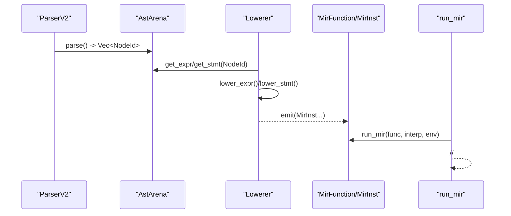
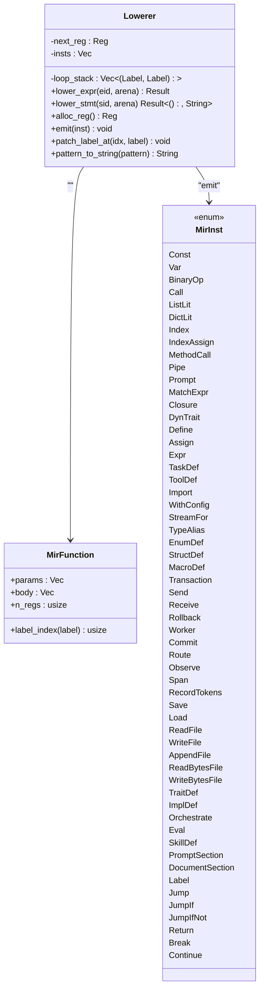
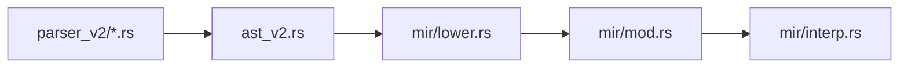

# AST  MIR 

<cite>
****   
- [src/mir/lower.rs](file://src/mir/lower.rs)
- [src/mir/mod.rs](file://src/mir/mod.rs)
- [src/mir/interp.rs](file://src/mir/interp.rs)
- [src/ast_v2.rs](file://src/ast_v2.rs)
- [src/parser_v2/mod.rs](file://src/parser_v2/mod.rs)
- [src/parser_v2/expressions.rs](file://src/parser_v2/expressions.rs)
- [src/parser_v2/statements.rs](file://src/parser_v2/statements.rs)
</cite>

## 
1. [](#)
2. [](#)
3. [](#)
4. [](#)
5. [](#)
6. [](#)
7. [](#)
8. [](#)
9. [](#)
10. [](#)

## 
 AST v2  MIR  lowering ///worker 

## 
AST v2  Arena  NodeId MIR Lowering  AST v2  MIR MIR  SSA/JIT 

```mermaid
graph TB
subgraph ""
LEX[""] --> PARSER["ParserV2<br/> ast_v2 "]
PARSER --> AST["AstArena + TypedExpr/TypedStmt"]
end
subgraph "Lowering "
AST --> LOWER["lower.rs<br/> Lowerer"]
LOWER --> MIR_MOD["mir/mod.rs<br/>MirFunction/MirInst "]
end
subgraph ""
MIR_MOD --> INTERP["mir/interp.rs<br/>run_mir "]
INTERP --> RUNTIME["Interpreter/Environment/Value"]
end
```


- [src/parser_v2/mod.rs:33-45](file://src/parser_v2/mod.rs#L33-L45)
- [src/ast_v2.rs:568-632](file://src/ast_v2.rs#L568-L632)
- [src/mir/lower.rs:13-19](file://src/mir/lower.rs#L13-L19)
- [src/mir/mod.rs:41-46](file://src/mir/mod.rs#L41-L46)
- [src/mir/interp.rs:18-22](file://src/mir/interp.rs#L18-L22)


- [src/parser_v2/mod.rs:33-45](file://src/parser_v2/mod.rs#L33-L45)
- [src/ast_v2.rs:568-632](file://src/ast_v2.rs#L568-L632)
- [src/mir/lower.rs:13-19](file://src/mir/lower.rs#L13-L19)
- [src/mir/mod.rs:41-46](file://src/mir/mod.rs#L41-L46)
- [src/mir/interp.rs:18-22](file://src/mir/interp.rs#L18-L22)

## 
- AST v2  Arena TypedExpr/TypedStmt  AstArena  NodeId 
- MIR  Reg Label  body 
- Lowerer next_reg insts loop_stack 
- MIR  pc  MirFunctionJIT 


- [src/ast_v2.rs:70-155](file://src/ast_v2.rs#L70-L155)
- [src/ast_v2.rs:169-441](file://src/ast_v2.rs#L169-L441)
- [src/ast_v2.rs:568-632](file://src/ast_v2.rs#L568-L632)
- [src/mir/mod.rs:34-46](file://src/mir/mod.rs#L34-L46)
- [src/mir/mod.rs:48-343](file://src/mir/mod.rs#L48-L343)
- [src/mir/lower.rs:39-54](file://src/mir/lower.rs#L39-L54)
- [src/mir/interp.rs:18-22](file://src/mir/interp.rs#L18-L22)

## 
AST → MIR 
-  ParserV2  AstArena NodeId 
- lower_program  stmt_ids Lowerer.lower_stmt  MirFunction
-  lower_expr  lower_stmt 
- If/For Jump/JumpIf/JumpIfNot  Label Break/Continue  loop_stack  label
- TaskDef/Closure/MatchExpr/Transaction/Worker/WithConfig  lowering  MirInst




- [src/parser_v2/mod.rs:33-45](file://src/parser_v2/mod.rs#L33-L45)
- [src/mir/lower.rs:13-19](file://src/mir/lower.rs#L13-L19)
- [src/mir/lower.rs:77-235](file://src/mir/lower.rs#L77-L235)
- [src/mir/lower.rs:240-907](file://src/mir/lower.rs#L240-L907)
- [src/mir/interp.rs:18-22](file://src/mir/interp.rs#L18-L22)

## 

###  lowering 
- Const(dst, value)
- Var(dst, name)
- BinaryOp(dst, l, op, r)
- Call(dst, callee, args_regs)
- 
- /ListLit/DictLit
- Index/MethodCall
- Pipe(dst, lhs, rhs)
- Prompt(dst, parts)
- MatchExpr(val, arms) arm  MirFunction 
- Closure(dst, params, body)body 
-  trait DynTrait(dst, src, trait_generics, trait_name)


- [src/mir/lower.rs:77-235](file://src/mir/lower.rs#L77-L235)
- [src/mir/mod.rs:50-112](file://src/mir/mod.rs#L50-L112)

####  lowering 



- [src/mir/lower.rs:39-54](file://src/mir/lower.rs#L39-L54)
- [src/mir/lower.rs:77-235](file://src/mir/lower.rs#L77-L235)
- [src/mir/lower.rs:240-907](file://src/mir/lower.rs#L240-L907)
- [src/mir/mod.rs:41-46](file://src/mir/mod.rs#L41-L46)
- [src/mir/mod.rs:48-343](file://src/mir/mod.rs#L48-L343)

###  lowering 
- Let/Assign/IndexAssignDefine/Assign/IndexAssign
- IfJumpIfNot + Jump + patch_label_at  else/end 
- For loop_stack  continue/break  i++  Jump  loop_label
- ReturnReturn(Some/None)
- Break/Continue loop_stack  (cont, brk)  Break(brk)/Continue(cont)
- TaskDef lower body  MirFunctionemit TaskDef
- ImportImport(path)
- WithConfig/ AI configjit=true  SSA→LLVM→JIT MIR 
- Parallel
- Match  match arm body  lower_expr
- StreamFor AST  body
- ToolDefToolDef(name, description, params, return_type, body, exported)
- TypeAlias/EnumDef/StructDef
- Transaction(body, compensation)
- /Send/Receive
- RollbackRollback
- MacroDefMacroDef(name, params)
- CommitCommit
- WorkerWorker(name, body)
- RouteRoute(name)
- Observe/Span/RecordTokensObserve/Span/RecordTokens
-  I/OSave/Load/ReadFile/WriteFile/AppendFile/ReadBytesFile/WriteBytesFile
- Trait/ImplTraitDef/ImplDefprelower method bodies
- Orchestrate/Eval/SkillDef/PromptSection/DocumentSection MirInst


- [src/mir/lower.rs:240-907](file://src/mir/lower.rs#L240-L907)
- [src/mir/mod.rs:114-343](file://src/mir/mod.rs#L114-L343)

#### If 
```mermaid
flowchart TD
Start(["lower_stmt(If)"]) --> Cond["lower_expr(condition)"]
Cond --> EmitJumpIfNot["emit JumpIfNot(cond, placeholder)"]
EmitJumpIfNot --> ThenBranch["lower_stmt(then_branch)"]
ThenBranch --> EmitJump["emit Jump(placeholder)"]
EmitJump --> ElseStart["else_start = insts.len()"]
ElseStart --> PatchElse["patch_label_at(JumpIfNot, else_start)"]
PatchElse --> ElseBranch["lower_stmt(else_branch)"]
ElseBranch --> End["end = insts.len()"]
End --> PatchEnd["patch_label_at(Jump, end)"]
PatchEnd --> Done([""])
```


- [src/mir/lower.rs:260-286](file://src/mir/lower.rs#L260-L286)

#### For 
```mermaid
flowchart TD
S(["lower_stmt(For)"]) --> Iter["lower_expr(iterable) -> iter_reg"]
Iter --> InitI["Const(i_reg, 0)"]
InitI --> Len["Call(len_reg, 'len', [iter_reg])"]
Len --> One["Const(one_reg, 1)"]
One --> LoopLabel["loop_label = insts.len()"]
LoopLabel --> Cond["BinaryOp(cond_reg, i_reg, >=, len_reg)"]
Cond --> ExitJump["emit JumpIf(cond_reg, placeholder)"]
ExitJump --> BodyStart["body_start = insts.len()"]
BodyStart --> Index["Index(x_reg, iter_reg, i_reg)"]
Index --> DefineX["Define(var, x_reg)"]
DefineX --> PushLoop["loop_stack.push((loop_label, 0))"]
PushLoop --> Body["lower_stmt(body)"]
Body --> PopLoop["loop_stack.pop()"]
PopLoop --> Incr["BinaryOp(i_reg, i_reg, +, one_reg)"]
Incr --> BackToLoop["Jump(loop_label)"]
BackToLoop --> EndLabel["end_label = insts.len()"]
EndLabel --> PatchExit["patch_label_at(JumpIf, end_label)"]
PatchExit --> PatchBody[" body  Break/Continue "]
PatchBody --> Done([""])
```


- [src/mir/lower.rs:318-382](file://src/mir/lower.rs#L318-L382)

### 
- Lowerer.next_reg finish  n_regs
- env.define/env.assign  EnvRef 
- TaskDef/Closure/WithConfig  Lowerer


- [src/mir/lower.rs:64-68](file://src/mir/lower.rs#L64-L68)
- [src/mir/lower.rs:193-213](file://src/mir/lower.rs#L193-L213)
- [src/mir/interp.rs:171-180](file://src/mir/interp.rs#L171-L180)
- [src/value.rs:117-140](file://src/value.rs#L117-L140)

### 
-  body  Label α.0 
- patch_label_at  JumpIfNot/Jump  else_start/end 
- For break  end_labelcontinue  loop_labelbody  Break/Continue  0


- [src/mir/lower.rs:909-918](file://src/mir/lower.rs#L909-L918)
- [src/mir/lower.rs:260-286](file://src/mir/lower.rs#L260-L286)
- [src/mir/lower.rs:318-382](file://src/mir/lower.rs#L318-L382)
- [src/mir/mod.rs:345-351](file://src/mir/mod.rs#L345-L351)

### 
- TaskDef  lower body  MirFunction task_registry  run_mir
- Closure  Value::Closure EnvRef  dispatch  run_mir
- MatchExpr  pattern  self_match_pattern 
- Transaction  body compensation 
- Worker Worker  body AST  child_env
- WithConfig/ AI configjit=true  SSA→LLVM→JIT MIR 


- [src/mir/lower.rs:383-400](file://src/mir/lower.rs#L383-L400)
- [src/mir/lower.rs:193-213](file://src/mir/lower.rs#L193-L213)
- [src/mir/lower.rs:173-192](file://src/mir/lower.rs#L173-L192)
- [src/mir/lower.rs:537-554](file://src/mir/lower.rs#L537-L554)
- [src/mir/lower.rs:591-603](file://src/mir/lower.rs#L591-L603)
- [src/mir/lower.rs:406-427](file://src/mir/lower.rs#L406-L427)
- [src/mir/interp.rs:208-243](file://src/mir/interp.rs#L208-L243)
- [src/mir/interp.rs:323-343](file://src/mir/interp.rs#L323-L343)
- [src/mir/interp.rs:380-392](file://src/mir/interp.rs#L380-L392)
- [src/mir/interp.rs:273-297](file://src/mir/interp.rs#L273-L297)

### 
-  expressions.rs  when  Pattern::Guard
- Lowering  Pattern  self_match_pattern 
- ///nil 


- [src/parser_v2/expressions.rs:197-232](file://src/parser_v2/expressions.rs#L197-L232)
- [src/mir/lower.rs:920-957](file://src/mir/lower.rs#L920-L957)
- [src/mir/interp.rs:781-891](file://src/mir/interp.rs#L781-L891)

### 
- Transactionbody  compensation 
- Rollback“Transaction rolled back”


- [src/mir/lower.rs:537-554](file://src/mir/lower.rs#L537-L554)
- [src/mir/interp.rs:323-343](file://src/mir/interp.rs#L323-L343)
- [src/mir/interp.rs:360-363](file://src/mir/interp.rs#L360-L363)

### Worker 
- Worker body child_env
- Send/Receive worker_channels/worker_receivers 


- [src/mir/lower.rs:591-603](file://src/mir/lower.rs#L591-L603)
- [src/mir/interp.rs:344-359](file://src/mir/interp.rs#L344-L359)
- [src/mir/interp.rs:380-392](file://src/mir/interp.rs#L380-L392)

## 
- Lowerer  ast_v2  ExprKind/StmtKind/Pattern/AstArena
- MIR  mir/mod.rs mir/interp.rs
-  parser_v2  ast_v2  with jit 




- [src/ast_v2.rs:70-155](file://src/ast_v2.rs#L70-L155)
- [src/mir/lower.rs:6-10](file://src/mir/lower.rs#L6-L10)
- [src/mir/mod.rs:21-32](file://src/mir/mod.rs#L21-L32)
- [src/mir/interp.rs:9-13](file://src/mir/interp.rs#L9-L13)
- [src/parser_v2/mod.rs:5-10](file://src/parser_v2/mod.rs#L5-L10)


- [src/ast_v2.rs:70-155](file://src/ast_v2.rs#L70-L155)
- [src/mir/lower.rs:6-10](file://src/mir/lower.rs#L6-L10)
- [src/mir/mod.rs:21-32](file://src/mir/mod.rs#L21-L32)
- [src/mir/interp.rs:9-13](file://src/mir/interp.rs#L9-L13)
- [src/parser_v2/mod.rs:5-10](file://src/parser_v2/mod.rs#L5-L10)

## 
- 
- If/For  Label+Jump
- JIT with jit  LLVM JIT MIR 
- 

[]

## 
- 
  - NodeId  Arenalower_expr/lower_stmt 
  - Break/Continue loop_stack 
  -  ExprKind/StmtKindlowering 
- 
  -  MIR  Jump/JumpIf 
  -  run_mir_with_signal Return/Break/Continue
  -  with jit  JIT 


- [src/mir/lower.rs:77-81](file://src/mir/lower.rs#L77-L81)
- [src/mir/lower.rs:297-316](file://src/mir/lower.rs#L297-L316)
- [src/mir/lower.rs:230-234](file://src/mir/lower.rs#L230-L234)
- [src/mir/interp.rs:933-944](file://src/mir/interp.rs#L933-L944)
- [src/mir/interp.rs:221-236](file://src/mir/interp.rs#L221-L236)

## 
AST v2  MIR  lowering worker  SSA/JIT 

[]

## 

### if-else 
- ASTIf(condition, then_branch, else_branch)
- MIRJumpIfNot(cond, else_start); then_body; Jump(end); else_body; end
- patch_label_at  else_start  end


- [src/mir/lower.rs:260-286](file://src/mir/lower.rs#L260-L286)

### for 
- ASTFor(var, iterable, body)
- MIR i=0len=len(iterable) i>=lenIndex Define varbody  i++Jump  loop_labelbreak  endcontinue  loop_label


- [src/mir/lower.rs:318-382](file://src/mir/lower.rs#L318-L382)

### match 
- ASTMatch(expr, arms)
- MIRMatchExpr(val, arms) arm  (pat_str, cond_reg_or_None, body_mir_func, output_reg)
- self_match_pattern  arm


- [src/mir/lower.rs:173-192](file://src/mir/lower.rs#L173-L192)
- [src/mir/interp.rs:273-297](file://src/mir/interp.rs#L273-L297)
- [src/mir/interp.rs:781-891](file://src/mir/interp.rs#L781-L891)

### 
-  liveness 
-  Const + BinaryOp 
- 
-  Jump 

[]