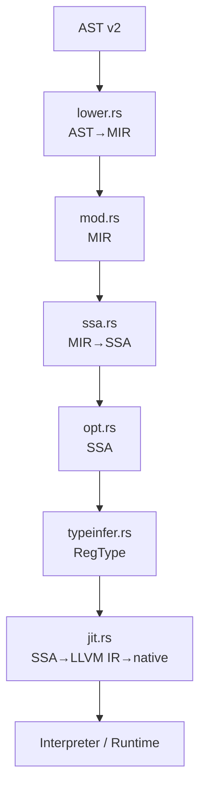
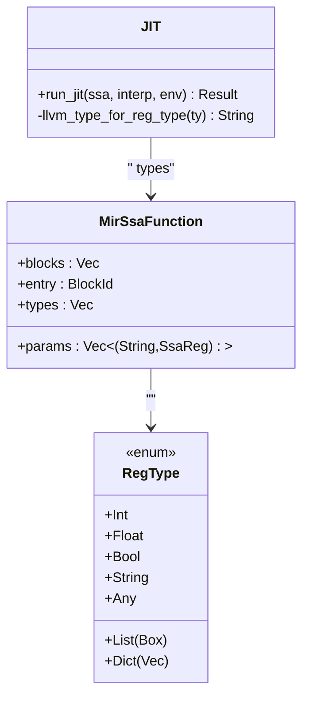
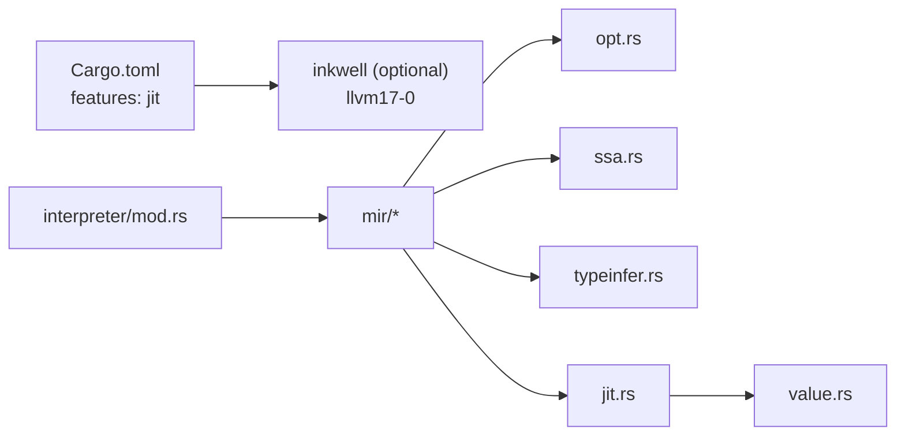

# JIT 

<cite>
****
- [src/mir/jit.rs](file://src/mir/jit.rs)
- [src/mir/mod.rs](file://src/mir/mod.rs)
- [src/mir/lower.rs](file://src/mir/lower.rs)
- [src/mir/ssa.rs](file://src/mir/ssa.rs)
- [src/mir/opt.rs](file://src/mir/opt.rs)
- [src/mir/typeinfer.rs](file://src/mir/typeinfer.rs)
- [src/interpreter/mod.rs](file://src/interpreter/mod.rs)
- [Cargo.toml](file://Cargo.toml)
- [src/value.rs](file://src/value.rs)
</cite>

## 
1. [](#)
2. [](#)
3. [](#)
4. [](#)
5. [](#)
6. [](#)
7. [](#)
8. [](#)
9. [](#)
10. [](#)

## 
 Mora “JIT” MIR → SSA → JIT  LLVM inkwell  feature  SSA → LLVM IR → native  MIR 

## 
MIR/JIT  src/mir  Cargo features 
- MIR  loweringsrc/mir/mod.rssrc/mir/lower.rs
- SSA  deconstructsrc/mir/ssa.rs
-  passsrc/mir/opt.rs
-  JIT  RegTypesrc/mir/typeinfer.rs
- JIT feature-gatedsrc/mir/jit.rs
- src/interpreter/mod.rs
- src/value.rs
-  LLVM Cargo.toml




- [src/mir/lower.rs:1-120](file://src/mir/lower.rs#L1-L120)
- [src/mir/mod.rs:1-120](file://src/mir/mod.rs#L1-L120)
- [src/mir/ssa.rs:137-263](file://src/mir/ssa.rs#L137-L263)
- [src/mir/opt.rs:19-49](file://src/mir/opt.rs#L19-L49)
- [src/mir/typeinfer.rs:16-112](file://src/mir/typeinfer.rs#L16-L112)
- [src/mir/jit.rs:1-53](file://src/mir/jit.rs#L1-L53)
- [src/interpreter/mod.rs:534-580](file://src/interpreter/mod.rs#L534-L580)


- [src/mir/mod.rs:1-120](file://src/mir/mod.rs#L1-L120)
- [src/mir/lower.rs:1-120](file://src/mir/lower.rs#L1-L120)
- [src/mir/ssa.rs:137-263](file://src/mir/ssa.rs#L137-L263)
- [src/mir/opt.rs:19-49](file://src/mir/opt.rs#L19-L49)
- [src/mir/typeinfer.rs:16-112](file://src/mir/typeinfer.rs#L16-L112)
- [src/mir/jit.rs:1-53](file://src/mir/jit.rs#L1-L53)
- [src/interpreter/mod.rs:534-580](file://src/interpreter/mod.rs#L534-L580)

## 
- MIR ///I/O
- AST→MIR Lowering ASTv2 MIR  Label + Jump
- SSA Phi  MIR-plain  deconstruct
-  Pass
-  SSA  RegType JIT 
- JIT feature  LLVM 17  jit feature


- [src/mir/mod.rs:40-352](file://src/mir/mod.rs#L40-L352)
- [src/mir/lower.rs:12-37](file://src/mir/lower.rs#L12-L37)
- [src/mir/ssa.rs:137-263](file://src/mir/ssa.rs#L137-L263)
- [src/mir/opt.rs:19-49](file://src/mir/opt.rs#L19-L49)
- [src/mir/typeinfer.rs:16-112](file://src/mir/typeinfer.rs#L16-L112)
- [src/mir/jit.rs:24-63](file://src/mir/jit.rs#L24-L63)

## 
 AST  JIT  JIT 

```mermaid
sequenceDiagram
participant User as ""
participant Parser as ""
participant Lower as "lower.rs<br/>AST→MIR"
participant Opt as "opt.rs<br/>SSA "
participant TypeInf as "typeinfer.rs<br/>RegType "
participant JIT as "jit.rs<br/>SSA→LLVM IR→native"
participant RT as "Interpreter/Runtime"
User->>Parser : 
Parser-->>Lower : AST v2
Lower-->>Opt : MIR 
Opt-->>TypeInf : SSA 
TypeInf-->>JIT : SSA + RegType
JIT-->>RT : 
RT-->>User : 
```


- [src/mir/lower.rs:12-37](file://src/mir/lower.rs#L12-L37)
- [src/mir/ssa.rs:137-263](file://src/mir/ssa.rs#L137-L263)
- [src/mir/opt.rs:19-49](file://src/mir/opt.rs#L19-L49)
- [src/mir/typeinfer.rs:16-112](file://src/mir/typeinfer.rs#L16-L112)
- [src/mir/jit.rs:24-63](file://src/mir/jit.rs#L24-L63)
- [src/interpreter/mod.rs:534-580](file://src/interpreter/mod.rs#L534-L580)

## 

### MIR 
- MirFunction
- MirInst///I/O
- α.0 Label  body Jump/Break/Continue 


- [src/mir/mod.rs:40-352](file://src/mir/mod.rs#L40-L352)

### AST→MIR Lowering
- lower_program lowering  MirFunction
- lower_expr_only / lower_stmt_only/
- Lowereremit 
- For Break/Continue 


- [src/mir/lower.rs:12-37](file://src/mir/lower.rs#L12-L37)
- [src/mir/lower.rs:39-62](file://src/mir/lower.rs#L39-L62)
- [src/mir/lower.rs:317-382](file://src/mir/lower.rs#L317-L382)

### SSA  Deconstruct
- constructCFG Phi 
- split_into_ssa MIR  SsaInst terminator 
- deconstruct SSA  MIR-plain

```mermaid
flowchart TD
Start([" MIR "]) --> Split[""]
Split --> CFG["/"]
CFG --> Dom[""]
Dom --> DF[""]
DF --> Phi[" Phi "]
Phi --> Rename[""]
Rename --> End([" SSA "])
```


- [src/mir/ssa.rs:137-263](file://src/mir/ssa.rs#L137-L263)
- [src/mir/ssa.rs:323-557](file://src/mir/ssa.rs#L323-L557)


- [src/mir/ssa.rs:137-263](file://src/mir/ssa.rs#L137-L263)
- [src/mir/ssa.rs:323-557](file://src/mir/ssa.rs#L323-L557)

###  Pass
- 
- 
- OptLevel MORA_OPT 0=None, 1=Basic, =Aggressive

```mermaid
flowchart TD
In(["SSA "]) --> CP[""]
CP --> CopyProp[""]
CopyProp --> DCE[""]
DCE --> GVN[""]
GVN --> LICM{"?"}
LICM --> || LICMStep[""]
LICM --> || Out([" SSA"])
LICMStep --> LSR[""]
LSR --> TCO[""]
TCO --> Out
```


- [src/mir/opt.rs:19-49](file://src/mir/opt.rs#L19-L49)
- [src/mir/ssa.rs:109-135](file://src/mir/ssa.rs#L109-L135)


- [src/mir/opt.rs:19-49](file://src/mir/opt.rs#L19-L49)
- [src/mir/ssa.rs:109-135](file://src/mir/ssa.rs#L109-L135)

### RegType
-  Const/Var 
- Phi  incoming  int+float→float
-  ssa.types JIT  LLVM IR 


- [src/mir/typeinfer.rs:16-112](file://src/mir/typeinfer.rs#L16-L112)
- [src/mir/typeinfer.rs:253-302](file://src/mir/typeinfer.rs#L253-L302)

### JIT  LLVM 
- run_jitfeature  LLVM  jit feature  LLVM 17
- llvm_type_for_reg_type RegType → LLVM 
- SSA  usize  typeinfer  ssa.types




- [src/mir/ssa.rs:27-48](file://src/mir/ssa.rs#L27-L48)
- [src/mir/jit.rs:24-77](file://src/mir/jit.rs#L24-L77)


- [src/mir/jit.rs:24-77](file://src/mir/jit.rs#L24-L77)
- [src/mir/ssa.rs:27-48](file://src/mir/ssa.rs#L27-L48)

### 
-  dispatch ////
- dyn Trait  trait  for_type + trait_name  impl
-  JIT  native 


- [src/interpreter/mod.rs:534-580](file://src/interpreter/mod.rs#L534-L580)
- [src/interpreter/dispatch.rs:460-485](file://src/interpreter/dispatch.rs#L460-L485)

### 
-  Value  Rust Arc/Mutex GC
- EnvRef 
- intern_string
- JIT  SSA→LLVM IR 


- [src/value.rs:117-140](file://src/value.rs#L117-L140)
- [src/value.rs:142-200](file://src/value.rs#L142-L200)
- [src/interpreter/mod.rs:638-653](file://src/interpreter/mod.rs#L638-L653)

## 
- Cargo features
  - jit = ["dep:inkwell"] inkwell 0.5 llvm17-0
- 
  - tokioHTTP/MCP ureqHTTP parking_lotserde/json 
- 
  - MIR opt/ssa/typeinfer 
  - JIT  ssa  value 




- [Cargo.toml:92-102](file://Cargo.toml#L92-L102)
- [src/mir/opt.rs:19-49](file://src/mir/opt.rs#L19-L49)
- [src/mir/ssa.rs:137-263](file://src/mir/ssa.rs#L137-L263)
- [src/mir/typeinfer.rs:16-112](file://src/mir/typeinfer.rs#L16-L112)
- [src/mir/jit.rs:24-77](file://src/mir/jit.rs#L24-L77)
- [src/interpreter/mod.rs:534-580](file://src/interpreter/mod.rs#L534-L580)


- [Cargo.toml:92-102](file://Cargo.toml#L92-L102)

## 
- 
  - MORA_OPT=0
  - MORA_OPT=1CP/CopyProp/DCE/GVN
  - LICM/LSR/TCO
- 
  - LICM 
  - LSR //
- 
  -  SSA  IR 
- JIT 
  -  LLVM O3 
  -  IR/

[]

## 
-  JIT
  -  LLVM 17 --features jit 
  -  LLVM run_jit 
- 
  -  MORA_OPT 
- 
  -  LLVM  LLVM  inkwell 
  -  JIT  typeinfer RegType
  -  JIT  run_jit 


- [src/mir/jit.rs:24-63](file://src/mir/jit.rs#L24-L63)
- [src/mir/ssa.rs:109-135](file://src/mir/ssa.rs#L109-L135)

## 
Mora  JIT MIR AST→MIR lowering SSA  pass  JIT  RegType JIT  feature  LLVM IR  native  SSA→LLVM IR RegType  LLVM JIT  LLVM 17 

[]

## 

### 
- 
  - jit inkwell  LLVM 17
- 
  - MORA_OPT0=None, 1=Basic, =Aggressive
- 
  -  MORA_OPT=0 
  -  SSA  IR  CFG
  -  JIT 


- [Cargo.toml:92-102](file://Cargo.toml#L92-L102)
- [src/mir/ssa.rs:109-135](file://src/mir/ssa.rs#L109-L135)

### 
- LLVM 17  LLVM
- inkwell  llvm17-0  LLVM 
-  CI  LLVM 17 

[]

### 
- 
  -  JIT 
  -  AI 
- 
  -  LLVM  O3 
  - 

[]