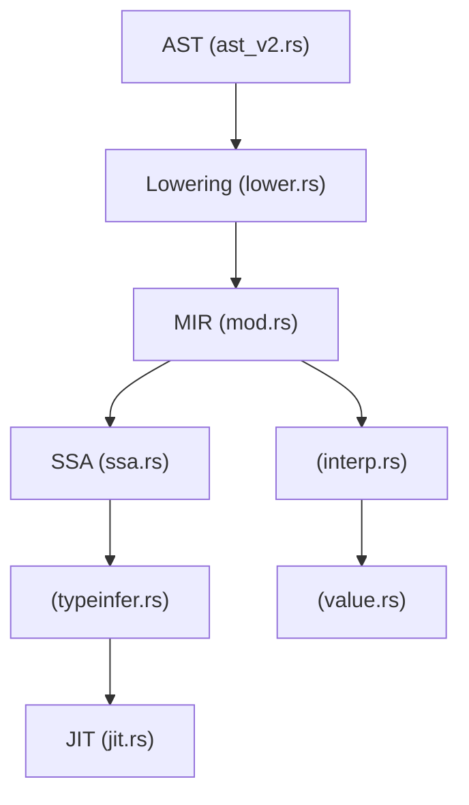
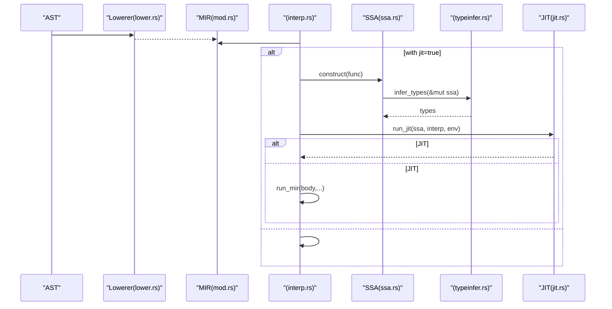
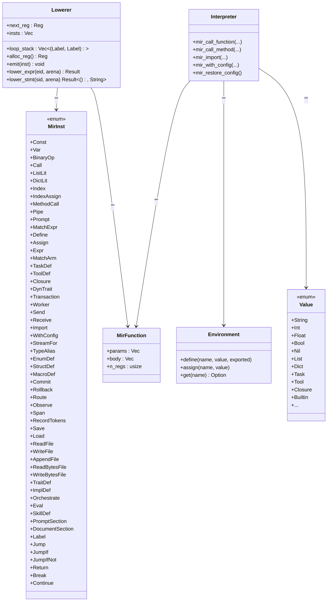

# MIR 

<cite>
****   
- [src/mir/mod.rs](file://src/mir/mod.rs)
- [src/mir/lower.rs](file://src/mir/lower.rs)
- [src/mir/interp.rs](file://src/mir/interp.rs)
- [src/mir/jit.rs](file://src/mir/jit.rs)
- [src/mir/ssa.rs](file://src/mir/ssa.rs)
- [src/mir/typeinfer.rs](file://src/mir/typeinfer.rs)
- [src/value.rs](file://src/value.rs)
- [src/ast_v2.rs](file://src/ast_v2.rs)
</cite>

## 
1. [](#)
2. [](#)
3. [](#)
4. [](#)
5. [](#)
6. [](#)
7. [](#)
8. [](#)
9. [](#)
10. [](#)

## 
 Mora  MIRMIR “” AST  IR Label 
- 
- 
-  AST 
-  Label 
- 

## 
MIR  src/mir AST→MIR JIT SSA 




- [src/mir/mod.rs:1-352](file://src/mir/mod.rs#L1-L352)
- [src/mir/lower.rs:1-200](file://src/mir/lower.rs#L1-L200)
- [src/mir/interp.rs:1-120](file://src/mir/interp.rs#L1-L120)
- [src/mir/ssa.rs:1-120](file://src/mir/ssa.rs#L1-L120)
- [src/mir/typeinfer.rs:1-60](file://src/mir/typeinfer.rs#L1-L60)
- [src/mir/jit.rs:1-77](file://src/mir/jit.rs#L1-L77)
- [src/value.rs:1-200](file://src/value.rs#L1-L200)
- [src/ast_v2.rs:1-160](file://src/ast_v2.rs#L1-L160)


- [src/mir/mod.rs:1-352](file://src/mir/mod.rs#L1-L352)
- [src/mir/lower.rs:1-200](file://src/mir/lower.rs#L1-L200)

## 
-  MirInst MIR 
-  MirFunction body n_regs
-  run_mir regs  pc env 
-  Lowerer AST MIR  Label + Jump
- SSA  MIR +Phi  SSA  JIT
- JIT  with jit  SSA 


- [src/mir/mod.rs:34-352](file://src/mir/mod.rs#L34-L352)
- [src/mir/interp.rs:17-120](file://src/mir/interp.rs#L17-L120)
- [src/mir/lower.rs:39-120](file://src/mir/lower.rs#L39-L120)
- [src/mir/ssa.rs:140-263](file://src/mir/ssa.rs#L140-L263)
- [src/mir/typeinfer.rs:17-112](file://src/mir/typeinfer.rs#L17-L112)
- [src/mir/jit.rs:24-63](file://src/mir/jit.rs#L24-L63)

## 
MIR 
- AST → lowering →  MIR
-  pc  Jump/JumpIf/JumpIfNot/Break/Continue  pc
- with jit  SSA  JIT 




- [src/mir/lower.rs:12-37](file://src/mir/lower.rs#L12-L37)
- [src/mir/interp.rs:208-243](file://src/mir/interp.rs#L208-L243)
- [src/mir/ssa.rs:140-263](file://src/mir/ssa.rs#L140-L263)
- [src/mir/typeinfer.rs:17-112](file://src/mir/typeinfer.rs#L17-L112)
- [src/mir/jit.rs:24-63](file://src/mir/jit.rs#L24-L63)

## 

### 
-  dst 
  - Const(dst, value)
  - Var(dst, name)
  - BinaryOp(dst, l, op, r)
  - Call(dst, callee_name, args_regs)/
  - ListLit(dst, items_regs)
  - DictLit(dst, pairs_key_val)
  - Index(dst, obj_reg, idx_reg)
  - IndexAssign(obj_reg, idx_reg, val_reg)
  - MethodCall(dst, recv_reg, method_name, args_regs)
  - Pipe(dst, lhs_reg, rhs_reg) lhs |> rhs
  - Prompt(dst, parts_regs) AI
  - MatchExpr(val_reg, arms)
- 
  - Define(name, src_reg)
  - Assign(name, src_reg)
  - Expr(src_reg)
  - MatchArm(cond_reg_or_None, body_func)
- 
  - Label(label)α.0 label  body 
  - Jump(label)
  - JumpIf(cond_reg, label)
  - JumpIfNot(cond_reg, label)
  - Return(opt_reg)
  - Break(label)
  - Continue(label)
- 
  - TaskDef(name, params, body_func)
  - ToolDef(name, description, params, return_type, body_func, exported)
  - Closure(dst, params, body_func)
  - DynTrait(dst, src, trait_generics, trait_name) trait 
  - Transaction(body_func, compensation_func)
  - Worker(name, body_func) worker
  - Send(value_reg, target_channel)
  - Receive(var, source_channel)
  - Import(path)
  - WithConfig(bindings, body_func, jit) JIT
  - StreamFor(prompt_reg, var, body_func)
  - TypeAlias/EnumDef/StructDef
  - MacroDef
  - Commit/Rollback/
  - Route/Observe/Span/RecordTokens stub
  - Save/Load/ReadFile/WriteFile/AppendFile/ReadBytesFile/WriteBytesFile I/O
  - TraitDef/ImplDeftrait  impl 
  - Orchestrate/Eval/SkillDef/PromptSection/DocumentSection


- [src/mir/mod.rs:48-343](file://src/mir/mod.rs#L48-L343)

### 
- Lowerer  next_reg  alloc_reg() 
-  MirFunction n_regs  regs  n_regs
- TaskDef/Closure/WithConfig/StreamFor/TraitDef/ImplDef  Lowerer
- 


- [src/mir/lower.rs:39-72](file://src/mir/lower.rs#L39-L72)
- [src/mir/mod.rs:41-46](file://src/mir/mod.rs#L41-L46)
- [src/mir/interp.rs:36-38](file://src/mir/interp.rs#L36-L38)

### Label 
- α.0 Label Jump/JumpIf/JumpIfNot/Break/Continue  label  body 
- lowering  emit  0 patch_label_at 
- For  loop_label  end_label body  Break/Continue 

```mermaid
flowchart TD
Start([" For "]) --> EmitIter["lower(iterable)  iter_reg"]
EmitIter --> InitI["i_reg = 0"]
InitI --> LenCall["len_reg = len(iter_reg)"]
LenCall --> OneConst["one_reg = 1"]
OneConst --> LoopLabel["loop_label = insts.len()"]
LoopLabel --> Cond["cond = i >= len"]
Cond --> ExitJump{"if cond"}
ExitJump --> |Yes| PatchExit["emit Jump(end_label) "]
ExitJump --> |No| BodyStart["body_start = insts.len()"]
BodyStart --> PushStack["push (loop_label, break_placeholder)"]
PushStack --> LowerBody["lower_stmt(body)"]
LowerBody --> PopStack["pop stack"]
PopStack --> Incr["i = i + 1"]
Incr --> BackJump["emit Jump(loop_label)"]
BackJump --> EndLabel["end_label = insts.len()"]
EndLabel --> PatchExit2["patch exit jump → end_label"]
PatchExit2 --> PatchBC[" body  Break/Continue "]
PatchBC --> Done([""])
```


- [src/mir/lower.rs:317-382](file://src/mir/lower.rs#L317-L382)


- [src/mir/mod.rs:345-352](file://src/mir/mod.rs#L345-L352)
- [src/mir/lower.rs:260-286](file://src/mir/lower.rs#L260-L286)
- [src/mir/lower.rs:317-382](file://src/mir/lower.rs#L317-L382)

###  AST 

#### 
- Const(dst, value)
  -  dst 
  - AST Literal
  - [src/mir/lower.rs:82-86](file://src/mir/lower.rs#L82-L86), [src/mir/interp.rs:41-44](file://src/mir/interp.rs#L41-L44)
- Var(dst, name)
  -  name  dst
  - AST Variable
  - [src/mir/lower.rs:87-91](file://src/mir/lower.rs#L87-L91), [src/mir/interp.rs:45-48](file://src/mir/interp.rs#L45-L48)
- BinaryOp(dst, l, op, r)
  -  l  r  op  dst
  - AST Binary
  - [src/mir/lower.rs:92-98](file://src/mir/lower.rs#L92-L98), [src/mir/interp.rs:49-54](file://src/mir/interp.rs#L49-L54)
- Call(dst, callee, args)
  -  callee  task run_mir
  - AST Call
  - [src/mir/lower.rs:99-107](file://src/mir/lower.rs#L99-L107), [src/mir/interp.rs:55-72](file://src/mir/interp.rs#L55-L72)
- ListLit(dst, items)
  - 
  - AST List
  - [src/mir/lower.rs:113-121](file://src/mir/lower.rs#L113-L121), [src/mir/interp.rs:74-78](file://src/mir/interp.rs#L74-L78)
- DictLit(dst, pairs)
  - 
  - AST Dict
  - [src/mir/lower.rs:122-131](file://src/mir/lower.rs#L122-L131), [src/mir/interp.rs:79-86](file://src/mir/interp.rs#L79-L86)
- Index(dst, obj, idx)
  - obj[idx]  List/Dict/String
  - AST Index
  - [src/mir/lower.rs:132-139](file://src/mir/lower.rs#L132-L139), [src/mir/interp.rs:87-92](file://src/mir/interp.rs#L87-L92)
- IndexAssign(obj, idx, val)
  - obj[idx] = val
  - AST IndexAssign
  - [src/mir/lower.rs:435-446](file://src/mir/lower.rs#L435-L446), [src/mir/interp.rs:93-100](file://src/mir/interp.rs#L93-L100)
- MethodCall(dst, recv, method, args)
  - recv.method(args)
  - AST MethodCall
  - [src/mir/lower.rs:140-154](file://src/mir/lower.rs#L140-L154), [src/mir/interp.rs:101-107](file://src/mir/interp.rs#L101-L107)
- Pipe(dst, lhs, rhs)
  - lhs |> rhs = call_value(rhs, [lhs])
  - AST Pipe
  - [src/mir/lower.rs:155-162](file://src/mir/lower.rs#L155-L162), [src/mir/interp.rs:108-115](file://src/mir/interp.rs#L108-L115)
- Prompt(dst, parts)
  -  AI
  - AST Prompt
  - [src/mir/lower.rs:163-172](file://src/mir/lower.rs#L163-L172), [src/mir/interp.rs:116-124](file://src/mir/interp.rs#L116-L124)
- MatchExpr(val, arms)
  -  arm body  output_reg
  - AST Match
  - [src/mir/lower.rs:173-192](file://src/mir/lower.rs#L173-L192), [src/mir/interp.rs:273-297](file://src/mir/interp.rs#L273-L297)


- [src/mir/lower.rs:77-235](file://src/mir/lower.rs#L77-L235)
- [src/mir/interp.rs:41-124](file://src/mir/interp.rs#L41-L124)
- [src/mir/interp.rs:273-297](file://src/mir/interp.rs#L273-L297)

#### 
- Define(name, src)
  - env.define(name, src)
  - AST Let
  - [src/mir/lower.rs:245-249](file://src/mir/lower.rs#L245-L249), [src/mir/interp.rs:125-128](file://src/mir/interp.rs#L125-L128)
- Assign(name, src)
  - env.assign(name, src)
  - AST Assign
  - [src/mir/lower.rs:250-254](file://src/mir/lower.rs#L250-L254), [src/mir/interp.rs:129-132](file://src/mir/interp.rs#L129-L132)
- Expr(src)
  - 
  - AST Expr
  - [src/mir/lower.rs:255-259](file://src/mir/lower.rs#L255-L259), [src/mir/interp.rs:133-136](file://src/mir/interp.rs#L133-L136)
- MatchArm(cond_reg_or_None, body)
  -  MatchExpr 
  - AST Match
  - [src/mir/lower.rs:447-471](file://src/mir/lower.rs#L447-L471), [src/mir/interp.rs:318-322](file://src/mir/interp.rs#L318-L322)


- [src/mir/lower.rs:240-259](file://src/mir/lower.rs#L240-L259)
- [src/mir/interp.rs:125-136](file://src/mir/interp.rs#L125-L136)
- [src/mir/interp.rs:318-322](file://src/mir/interp.rs#L318-L322)

#### 
- Label(label)
  - α.0 label  body 
  - [src/mir/mod.rs:345-352](file://src/mir/mod.rs#L345-L352), [src/mir/interp.rs:244-246](file://src/mir/interp.rs#L244-L246)
- Jump(label)
  - pc = label
  - [src/mir/interp.rs:247-249](file://src/mir/interp.rs#L247-L249)
- JumpIf(cond, label)
  - if is_truthy(cond) then pc = label else pc += 1
  - [src/mir/interp.rs:250-256](file://src/mir/interp.rs#L250-L256)
- JumpIfNot(cond, label)
  - if !is_truthy(cond) then pc = label else pc += 1
  - [src/mir/interp.rs:257-263](file://src/mir/interp.rs#L257-L263)
- Return(opt_reg)
  -  opt_reg  Nil
  - [src/mir/interp.rs:264-266](file://src/mir/interp.rs#L264-L266)
- Break(label)/Continue(label)
  - 
  - [src/mir/interp.rs:267-272](file://src/mir/interp.rs#L267-L272)


- [src/mir/interp.rs:244-272](file://src/mir/interp.rs#L244-L272)

#### 
- TaskDef(name, params, body)
  - Call  run_mir
  - [src/mir/lower.rs:383-400](file://src/mir/lower.rs#L383-L400), [src/mir/interp.rs:23-34](file://src/mir/interp.rs#L23-L34), [src/mir/interp.rs:55-72](file://src/mir/interp.rs#L55-L72)
- ToolDef(name, description, params, return_type, body, exported)
  -  Value::Tool AST 
  - [src/mir/lower.rs:487-512](file://src/mir/lower.rs#L487-L512), [src/mir/interp.rs:298-302](file://src/mir/interp.rs#L298-L302)
- Closure(dst, params, body)
  -  Value::Closure dispatch  run_mir
  - [src/mir/lower.rs:193-213](file://src/mir/lower.rs#L193-L213), [src/mir/interp.rs:171-180](file://src/mir/interp.rs#L171-L180)
- DynTrait(dst, src, trait_generics, trait_name)
  -  Value::TraitObject
  - [src/mir/lower.rs:214-229](file://src/mir/lower.rs#L214-L229), [src/mir/interp.rs:181-198](file://src/mir/interp.rs#L181-L198)
- Transaction(body, compensation)
  - body  child_env compensation 
  - [src/mir/lower.rs:537-554](file://src/mir/lower.rs#L537-L554), [src/mir/interp.rs:323-343](file://src/mir/interp.rs#L323-L343)
- Worker(name, body)
  -  body child_env
  - [src/mir/lower.rs:591-603](file://src/mir/lower.rs#L591-L603), [src/mir/interp.rs:380-392](file://src/mir/interp.rs#L380-L392)
- Send(value, target)/Receive(var, source)
  - worker channel 
  - [src/mir/lower.rs:555-571](file://src/mir/lower.rs#L555-L571), [src/mir/interp.rs:344-359](file://src/mir/interp.rs#L344-L359)
- Import(path)
  - →lowering→run_mir
  - [src/mir/lower.rs:401-405](file://src/mir/lower.rs#L401-L405), [src/mir/interp.rs:203-207](file://src/mir/interp.rs#L203-L207)
- WithConfig(bindings, body, jit)
  - / AI config bodyjit=true  SSA→JIT
  - [src/mir/lower.rs:406-427](file://src/mir/lower.rs#L406-L427), [src/mir/interp.rs:208-243](file://src/mir/interp.rs#L208-L243)
- StreamFor(prompt, var, body)
  -  body
  - [src/mir/lower.rs:472-486](file://src/mir/lower.rs#L472-L486), [src/mir/interp.rs:303-317](file://src/mir/interp.rs#L303-L317)
- TypeAlias/EnumDef/StructDef
  - 
  - [src/mir/lower.rs:513-536](file://src/mir/lower.rs#L513-L536), [src/mir/interp.rs:137-170](file://src/mir/interp.rs#L137-L170)
- MacroDef
  -  Value::Macro
  - [src/mir/lower.rs:577-588](file://src/mir/lower.rs#L577-L588), [src/mir/interp.rs:364-375](file://src/mir/interp.rs#L364-L375)
- Commit/Rollback
  - no-op/
  - [src/mir/lower.rs:589-590](file://src/mir/lower.rs#L589-L590), [src/mir/interp.rs:376-379](file://src/mir/interp.rs#L376-L379), [src/mir/interp.rs:360-363](file://src/mir/interp.rs#L360-L363)
- Route/Observe/Span/RecordTokens
  - observe/span  bodyrecord_tokens no-op
  - [src/mir/lower.rs:604-653](file://src/mir/lower.rs#L604-L653), [src/mir/interp.rs:393-422](file://src/mir/interp.rs#L393-L422)
- Save/Load/ReadFile/WriteFile/AppendFile/ReadBytesFile/WriteBytesFile
  -  I/O file.* 
  - [src/mir/lower.rs:654-720](file://src/mir/lower.rs#L654-L720), [src/mir/interp.rs:423-488](file://src/mir/interp.rs#L423-L488)
- TraitDef/ImplDef
  -  trait  impl lower  MirFunction
  - [src/mir/lower.rs:721-778](file://src/mir/lower.rs#L721-L778), [src/mir/interp.rs:489-571](file://src/mir/interp.rs#L489-L571)
- Orchestrate/Eval/SkillDef/PromptSection/DocumentSection
  - stub / body
  - [src/mir/lower.rs:779-800](file://src/mir/lower.rs#L779-L800), [src/mir/interp.rs:572-692](file://src/mir/interp.rs#L572-L692)


- [src/mir/lower.rs:383-800](file://src/mir/lower.rs#L383-L800)
- [src/mir/interp.rs:171-692](file://src/mir/interp.rs#L171-L692)

###  AST 
- Literal/Variable/Binary/Pipe/Call/MethodCall/Index/Closure/Match/Prompt/List/Dict/DynTrait 
- Let/Assign/Expr/If/For/Return/Import/Parallel/Match/Save/Load/ReadFile/WriteFile/AppendFile/ReadBytesFile/WriteBytesFile/With/StreamFor/ToolDef/Break/Continue/Route/Observe/Span/RecordTokens/TraitDef/ImplDef/Worker/Send/Receive/Transaction/Commit/Rollback/MacroDef/TypeAlias/Export/ReExport //
- If/For  Label + Jump/JumpIf/JumpIfNot/Break/Continue


- [src/mir/mod.rs:11-19](file://src/mir/mod.rs#L11-L19)
- [src/ast_v2.rs:81-155](file://src/ast_v2.rs#L81-L155)
- [src/ast_v2.rs:171-300](file://src/ast_v2.rs#L171-L300)

## 




- [src/mir/mod.rs:41-343](file://src/mir/mod.rs#L41-L343)
- [src/mir/lower.rs:39-120](file://src/mir/lower.rs#L39-L120)
- [src/mir/interp.rs:17-120](file://src/mir/interp.rs#L17-L120)
- [src/value.rs:142-200](file://src/value.rs#L142-L200)


- [src/mir/mod.rs:41-343](file://src/mir/mod.rs#L41-L343)
- [src/mir/lower.rs:39-120](file://src/mir/lower.rs#L39-L120)
- [src/mir/interp.rs:17-120](file://src/mir/interp.rs#L17-L120)
- [src/value.rs:142-200](file://src/value.rs#L142-L200)

## 
- 
- For  body 
- Call  task 
- JIT with jit  SSA JIT  JIT
-  + Phi 
-  I/Osave/load/read/write  file.* 


- [src/mir/interp.rs:55-72](file://src/mir/interp.rs#L55-L72)
- [src/mir/interp.rs:208-243](file://src/mir/interp.rs#L208-L243)
- [src/mir/ssa.rs:140-263](file://src/mir/ssa.rs#L140-L263)
- [src/mir/typeinfer.rs:17-112](file://src/mir/typeinfer.rs#L17-L112)

## 
- index_value/index_assign_value  List 
-  List/Dict/String
- Transaction  Rollback 
- Route Route  send/receive
- JIT  LLVM  feature 


- [src/mir/interp.rs:698-779](file://src/mir/interp.rs#L698-L779)
- [src/mir/interp.rs:323-343](file://src/mir/interp.rs#L323-L343)
- [src/mir/interp.rs:393-399](file://src/mir/interp.rs#L393-L399)
- [src/mir/jit.rs:24-63](file://src/mir/jit.rs#L24-L63)

## 
MIR “” Label  AST  IR SSA  JIT “JIT ” JIT 

## 

### 
- 
- 
-  TaskDef 
- with jit  SSA 
-  I/O save/load/read/write 


- [src/mir/lower.rs:317-382](file://src/mir/lower.rs#L317-L382)
- [src/mir/interp.rs:208-243](file://src/mir/interp.rs#L208-L243)
- [src/mir/interp.rs:423-488](file://src/mir/interp.rs#L423-L488)