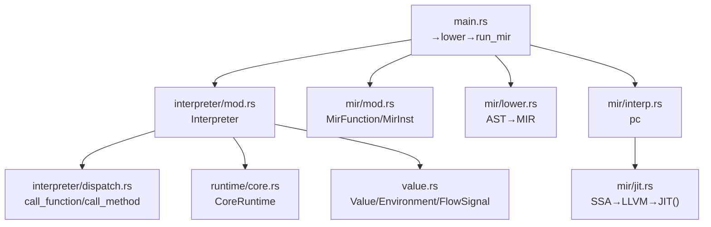
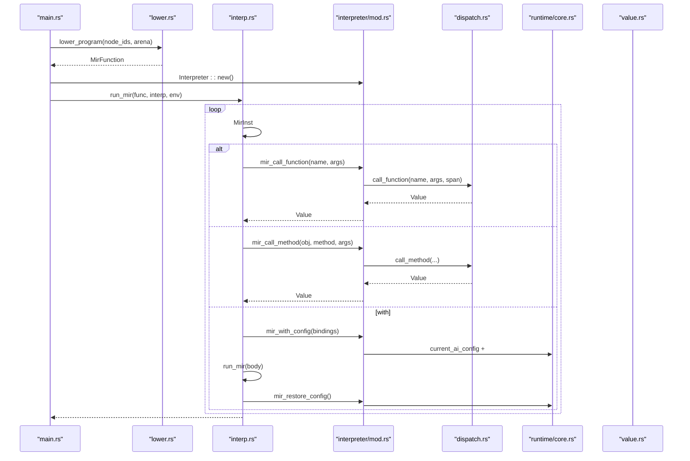
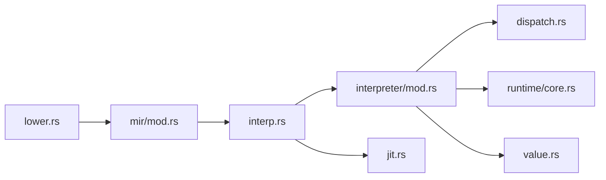

# MIR 

<cite>
****   
- [src/mir/interp.rs](file://src/mir/interp.rs)
- [src/mir/mod.rs](file://src/mir/mod.rs)
- [src/mir/lower.rs](file://src/mir/lower.rs)
- [src/mir/jit.rs](file://src/mir/jit.rs)
- [src/interpreter/mod.rs](file://src/interpreter/mod.rs)
- [src/interpreter/dispatch.rs](file://src/interpreter/dispatch.rs)
- [src/value.rs](file://src/value.rs)
- [src/runtime/core.rs](file://src/runtime/core.rs)
- [src/main.rs](file://src/main.rs)
</cite>

## 
1. [](#)
2. [](#)
3. [](#)
4. [](#)
5. [](#)
6. [](#)
7. [](#)
8. [](#)
9. [](#)
10. [](#)

## 
 Mora  MIRMIR  AST → MIR lowering  pc  Interpreter “”I/OAI 

## 
MIR 
- src/mir: MIR loweringJIT  SSA/
- src/interpreter: /REPL with/config 
- src/value: 
- src/runtime/core: /AI worker 
- src/main:  MIR 




- [src/main.rs:386-405](file://src/main.rs#L386-L405)
- [src/interpreter/mod.rs:214-271](file://src/interpreter/mod.rs#L214-L271)
- [src/interpreter/dispatch.rs:31-65](file://src/interpreter/dispatch.rs#L31-L65)
- [src/runtime/core.rs:14-32](file://src/runtime/core.rs#L14-L32)
- [src/value.rs:142-263](file://src/value.rs#L142-L263)
- [src/mir/mod.rs:41-46](file://src/mir/mod.rs#L41-L46)
- [src/mir/lower.rs:12-19](file://src/mir/lower.rs#L12-L19)
- [src/mir/interp.rs:17-22](file://src/mir/interp.rs#L17-L22)
- [src/mir/jit.rs:24-53](file://src/mir/jit.rs#L24-L53)


- [src/main.rs:386-405](file://src/main.rs#L386-L405)
- [src/mir/mod.rs:1-30](file://src/mir/mod.rs#L1-L30)

## 
- MIR MirFunction MirInst ////I/O/
- Interpreter  CoreRuntimeRegistryRuntimeInfraRuntimeAiRuntimeSandboxRuntimePersistRuntimeOrchRuntime  facade
- Value  Task/Closure/TraitObject/Stream/Agent Environment  define/get/assign/borrow/move 
- dispatch.rs  call_function/call_method builtinsAIwebjsonfilememoryagentdocumentcompresscrush_jsontailcompose_promptRouter/McpServerexectoolplaneskillplanmoraai 
- JIT  feature "jit" SSA→LLVM→JIT  MIR 


- [src/mir/mod.rs:41-343](file://src/mir/mod.rs#L41-L343)
- [src/interpreter/mod.rs:214-271](file://src/interpreter/mod.rs#L214-L271)
- [src/value.rs:142-263](file://src/value.rs#L142-L263)
- [src/interpreter/dispatch.rs:31-65](file://src/interpreter/dispatch.rs#L31-L65)
- [src/mir/jit.rs:24-53](file://src/mir/jit.rs#L24-L53)

## 
MIR “ + pc” MirInst Interpreter  dispatch  AST with / AI JIT  with  SSA→LLVM→JIT 




- [src/main.rs:386-405](file://src/main.rs#L386-L405)
- [src/mir/lower.rs:12-19](file://src/mir/lower.rs#L12-L19)
- [src/mir/interp.rs:17-22](file://src/mir/interp.rs#L17-L22)
- [src/interpreter/mod.rs:536-552](file://src/interpreter/mod.rs#L536-L552)
- [src/interpreter/dispatch.rs:31-65](file://src/interpreter/dispatch.rs#L31-L65)
- [src/runtime/core.rs:14-32](file://src/runtime/core.rs#L14-L32)
- [src/value.rs:142-263](file://src/value.rs#L142-L263)

## 

### 
-  MirFunction n_regs Vec<Value> 
- pc  0  pc
- BinaryOp/ListLit/DictLit/Index/MethodCall/Pipe/Prompt  dst 
- Label/Jump/JumpIf/JumpIfNot/Return/Break/Continue  FlowSignal 

```mermaid
flowchart TD
Start([" run_mir"]) --> Init[" regs[n_regs]  pc=0"]
Init --> Loop{"pc < body.len() ?"}
Loop --> || End([" Value::Nil"])
Loop --> || Match[" MirInst"]
Match --> Const["Const/Var/BinaryOp/..."]
Match --> Call["Call/MethodCall/Pipe"]
Match --> Control["Jump/JumpIf/Return/Break/Continue"]
Match --> IO["Save/Load/ReadFile/WriteFile/AppendFile/ReadBytesFile/WriteBytesFile"]
Match --> Type["TypeAlias/EnumDef/StructDef"]
Match --> Trait["TraitDef/ImplDef/DynTrait"]
Match --> Macro["MacroDef"]
Match --> Tx["Transaction/Send/Receive/Rollback/Commit"]
Match --> Observe["Observe/Span/RecordTokens"]
Match --> Eval["Eval"]
Match --> Skill["SkillDef"]
Match --> Section["PromptSection/DocumentSection"]
Const --> Next["pc += 1"]
Call --> Next
Control --> Next
IO --> Next
Type --> Next
Trait --> Next
Macro --> Next
Tx --> Next
Observe --> Next
Eval --> Next
Skill --> Next
Section --> Next
Next --> Loop
```


- [src/mir/interp.rs:17-22](file://src/mir/interp.rs#L17-L22)
- [src/mir/mod.rs:41-343](file://src/mir/mod.rs#L41-L343)


- [src/mir/interp.rs:17-22](file://src/mir/interp.rs#L17-L22)
- [src/mir/mod.rs:41-343](file://src/mir/mod.rs#L41-L343)

### 
- Environment  values/exports/parent  define/get/assign/borrow/move
- Closure  EnvRef
- with  CoreRuntime.config_stack / current_ai_config
- /Task/Closure  mir_body  lowered  MirFunction run_mir


- [src/value.rs:462-581](file://src/value.rs#L462-L581)
- [src/value.rs:170-180](file://src/value.rs#L170-L180)
- [src/interpreter/mod.rs:584-614](file://src/interpreter/mod.rs#L584-L614)
- [src/mir/interp.rs:172-179](file://src/mir/interp.rs#L172-L179)

### 
- Call(dst, callee, args)  task_registryα.2 run_mir interp.mir_call_function
- MethodCall(dst, recv, method, args)  interp.mir_call_method
- Pipe(dst, lhs, rhs)  call_value(rhs, [lhs])
- Return(r)  r  NilMatchExpr/Eval 

```mermaid
sequenceDiagram
participant IR as "interp.rs"
participant Intp as "interpreter/mod.rs"
participant Disp as "dispatch.rs"
IR->>IR : Call(dst, callee, args)
alt  task_registry
IR->>IR :  env +  run_mir(task_func)
else 
IR->>Intp : mir_call_function(callee, arg_vals)
Intp->>Disp : call_function(name, args, span)
Disp-->>Intp : Value
Intp-->>IR : Value
end
IR->>IR : regs[dst] = result; pc+=1
```


- [src/mir/interp.rs:55-72](file://src/mir/interp.rs#L55-L72)
- [src/interpreter/mod.rs:536-552](file://src/interpreter/mod.rs#L536-L552)
- [src/interpreter/dispatch.rs:31-65](file://src/interpreter/dispatch.rs#L31-L65)


- [src/mir/interp.rs:55-72](file://src/mir/interp.rs#L55-L72)
- [src/interpreter/mod.rs:536-552](file://src/interpreter/mod.rs#L536-L552)

### 
- BinaryOp(dst, l, op, r)  eval_binary(lv, op, rv)
- /ListLit/DictLit  Value
- Index/IndexAssign  List/Dict/String 
- Pipe(lhs |> rhs)  lhs  rhs
- Prompt(parts)  AI


- [src/mir/interp.rs:49-124](file://src/mir/interp.rs#L49-L124)
- [src/mir/interp.rs:698-779](file://src/mir/interp.rs#L698-L779)

### 
- print/range/len/compose/partial/atom/swap/deref/type_of/is_instance/methods_of/compress/crush_json/batch_chat/tail/compose_prompt/Router::new/McpServer::new/exec/toolplane/skill/plan/mora/ai 
- call_method  trait  dyn Trait  vtable 
- AI 


- [src/interpreter/dispatch.rs:31-65](file://src/interpreter/dispatch.rs#L31-L65)
- [src/interpreter/dispatch.rs:200-400](file://src/interpreter/dispatch.rs#L200-L400)
- [src/interpreter/mod.rs:64-111](file://src/interpreter/mod.rs#L64-L111)

### I/O 
- /Save/Load/ReadFile/WriteFile/AppendFile/ReadBytesFile/WriteBytesFile  file.* 
- /JSON/web/json/compress/crush_json 
- record/replay CLI  infra.recorder 


- [src/mir/interp.rs:423-488](file://src/mir/interp.rs#L423-L488)
- [src/interpreter/dispatch.rs:200-400](file://src/interpreter/dispatch.rs#L200-L400)
- [src/main.rs:408-487](file://src/main.rs#L408-L487)

### AI 
- with  model/temperature/max_tokens/system 
- batch_chat AI 
- is_retryable_error + retry_sleep_ms  + jitter
- RouteConfig 


- [src/interpreter/mod.rs:584-614](file://src/interpreter/mod.rs#L584-L614)
- [src/interpreter/mod.rs:64-111](file://src/interpreter/mod.rs#L64-L111)
- [src/interpreter/dispatch.rs:250-272](file://src/interpreter/dispatch.rs#L250-L272)

### 
-  Err eprintln CLI REPL
- Transaction  child_env compensation 
- FlowSignal::Interrupt  Pregel HITL 


- [src/mir/interp.rs:323-343](file://src/mir/interp.rs#L323-L343)
- [src/value.rs:583-614](file://src/value.rs#L583-L614)
- [src/main.rs:386-405](file://src/main.rs#L386-L405)

###  REPL
- REPLrun_repl_with parse→typeck→lower→run_mir Nil 
- Eval 
- TraceCollector  set_trace_enabled


- [src/interpreter/mod.rs:659-734](file://src/interpreter/mod.rs#L659-L734)
- [src/mir/interp.rs:586-616](file://src/mir/interp.rs#L586-L616)
- [src/interpreter/mod.rs:621-623](file://src/interpreter/mod.rs#L621-L623)

###  Trait/Impl
- //TypeAlias/EnumDef/StructDef 
- Trait/ImplTraitDef/ImplDef  trait  Value::Task 
- DynTraitDynTrait { dst, src, ... }  TraitObject dispatch  vtable 


- [src/mir/interp.rs:137-170](file://src/mir/interp.rs#L137-L170)
- [src/mir/interp.rs:489-571](file://src/mir/interp.rs#L489-L571)
- [src/mir/interp.rs:181-198](file://src/mir/interp.rs#L181-L198)

### 
- WorkerWorker{name, body}  body child_env
- ChannelSend/Receive  CoreRuntime.worker_channels/receivers 
- Transaction


- [src/mir/interp.rs:380-392](file://src/mir/interp.rs#L380-L392)
- [src/mir/interp.rs:344-359](file://src/mir/interp.rs#L344-L359)
- [src/runtime/core.rs:28-32](file://src/runtime/core.rs#L28-L32)

### 
- Orchestrate MIR 
- SkillDef Skill Dictname/description/version/requires/tasks/verifytask/verify  mir_body  prelowered 


- [src/mir/interp.rs:572-584](file://src/mir/interp.rs#L572-L584)
- [src/mir/interp.rs:617-676](file://src/mir/interp.rs#L617-L676)

### 
- MatchExprarms  arm  output_reg
- self_match_pattern nil 


- [src/mir/interp.rs:273-297](file://src/mir/interp.rs#L273-L297)
- [src/mir/interp.rs:781-800](file://src/mir/interp.rs#L781-L800)

### JIT 
- feature "jit"  LLVM  MIR 
- SSA→LLVM IR→→JIT→native  typeinfer  RegType


- [src/mir/jit.rs:24-53](file://src/mir/jit.rs#L24-L53)
- [src/mir/interp.rs:221-239](file://src/mir/interp.rs#L221-L239)

## 
-  runtime core value dispatch 
- MIR  interpreter  call_function/call_method/import/with 
- lowering  ast_v2  common  MirFunction
- JIT  SSA  stub




- [src/mir/lower.rs:12-19](file://src/mir/lower.rs#L12-L19)
- [src/mir/mod.rs:24-32](file://src/mir/mod.rs#L24-L32)
- [src/mir/interp.rs:17-22](file://src/mir/interp.rs#L17-L22)
- [src/interpreter/mod.rs:214-271](file://src/interpreter/mod.rs#L214-L271)
- [src/interpreter/dispatch.rs:31-65](file://src/interpreter/dispatch.rs#L31-L65)
- [src/runtime/core.rs:14-32](file://src/runtime/core.rs#L14-L32)
- [src/value.rs:142-263](file://src/value.rs#L142-L263)
- [src/mir/jit.rs:24-53](file://src/mir/jit.rs#L24-L53)


- [src/mir/lower.rs:12-19](file://src/mir/lower.rs#L12-L19)
- [src/mir/mod.rs:24-32](file://src/mir/mod.rs#L24-L32)
- [src/interpreter/mod.rs:214-271](file://src/interpreter/mod.rs#L214-L271)

## 
- Vec<Value> O(1)  n_regs 
- with// Environment EnvRef 
- dispatch  print/range/len
- JIT with  JIT JIT 
- I/O  AI//batch_chat
- TraceCollector 

[]

## 
- 
  - index_value/index_assign_value 
  - Transaction  compensation “Transaction rolled back”
  - Orchestrate  MIR  BSP 
  - JIT  feature "jit"  LLVM 
- 
  - REPL 
  -  TraceCollector 
  -  CoreRuntime.config_stack  worker_channels/receivers 


- [src/mir/interp.rs:698-779](file://src/mir/interp.rs#L698-L779)
- [src/mir/interp.rs:323-343](file://src/mir/interp.rs#L323-L343)
- [src/mir/interp.rs:572-584](file://src/mir/interp.rs#L572-L584)
- [src/mir/jit.rs:55-63](file://src/mir/jit.rs#L55-L63)
- [src/interpreter/mod.rs:621-623](file://src/interpreter/mod.rs#L621-L623)

## 
MIR  pc  Interpreter  dispatch traitI/OAI with  config_stack  JIT  JIT I/O/AI 

[]

## 

### 
- “”
- “”

### 
-  MirInst  run_mir match  lowering /
-  Interpreter facade  infra/ai/sandbox/persist/orch 
-  dispatch.rs  name 

[]