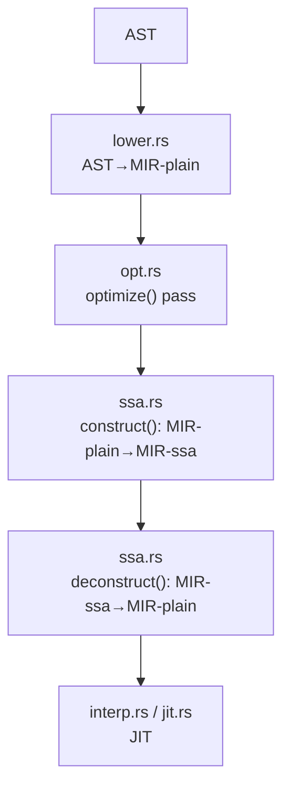
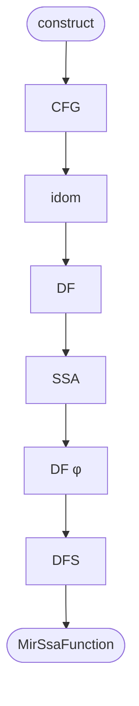
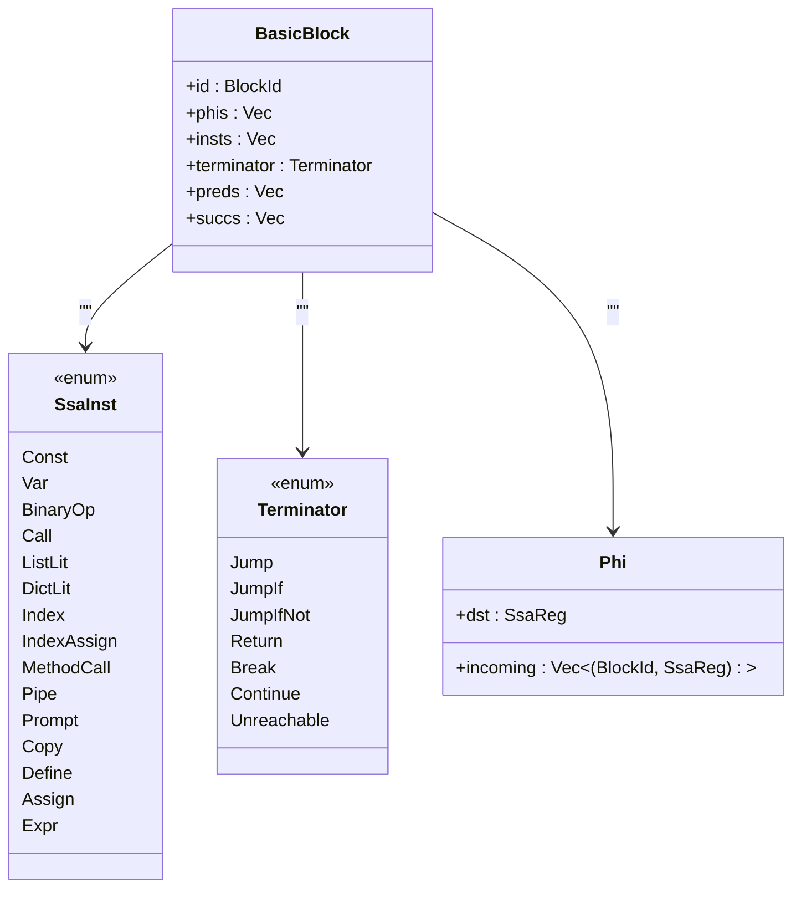
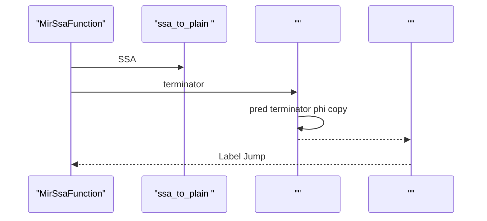
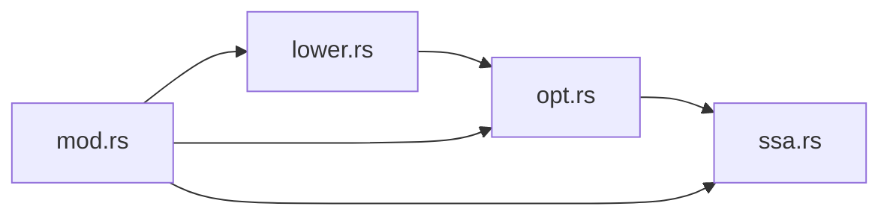

# SSA 

<cite>
****   
- [src/mir/ssa.rs](file://src/mir/ssa.rs)
- [src/mir/opt.rs](file://src/mir/opt.rs)
- [src/mir/mod.rs](file://src/mir/mod.rs)
- [src/mir/lower.rs](file://src/mir/lower.rs)
- [tests/mir_ssa_debug.rs](file://tests/mir_ssa_debug.rs)
</cite>

## 
1. [](#)
2. [](#)
3. [](#)
4. [](#)
5. [](#)
6. [](#)
7. [](#)
8. [](#)
9. [](#)
10. [](#)

## 
 Mora SSA
- φ 
-  pass
- SSA  JIT 
-  pass 
- 

## 
Mora MIR src/mir 
- MIR 
- AST → MIR  lowering 
- SSA  deconstructα.3
-  passα.3 ~ α.7
- /JIT 




- [src/mir/lower.rs:1-30](file://src/mir/lower.rs#L1-L30)
- [src/mir/opt.rs:19-49](file://src/mir/opt.rs#L19-L49)
- [src/mir/ssa.rs:137-263](file://src/mir/ssa.rs#L137-L263)
- [src/mir/ssa.rs:947-1357](file://src/mir/ssa.rs#L947-L1357)


- [src/mir/mod.rs:1-30](file://src/mir/mod.rs#L1-L30)
- [src/mir/lower.rs:1-30](file://src/mir/lower.rs#L1-L30)
- [src/mir/opt.rs:1-49](file://src/mir/opt.rs#L1-L49)
- [src/mir/ssa.rs:1-136](file://src/mir/ssa.rs#L1-L136)

## 
- MIR  IR
- SSA φ SsaInstTerminator RegType
-  pass  OptLevel  pass SSA  MIR-plain


- [src/mir/mod.rs:34-352](file://src/mir/mod.rs#L34-L352)
- [src/mir/ssa.rs:21-98](file://src/mir/ssa.rs#L21-L98)
- [src/mir/ssa.rs:100-135](file://src/mir/ssa.rs#L100-L135)
- [src/mir/opt.rs:19-49](file://src/mir/opt.rs#L19-L49)

## 
 AST  MIR-plain  SSA 

```mermaid
sequenceDiagram
participant Parser as ""
participant Lower as "lower.rs"
participant Opt as "opt.rs"
participant SSA as "ssa.rs"
participant Exec as "/JIT"
Parser->>Lower :  AST
Lower-->>Opt : MirFunction (MIR-plain)
Opt->>SSA : construct(func) → MirSsaFunction
Opt->>Opt : (CP/DCE/GVN/CopyProp)
Opt->>Opt : (LICM/LSR/TailCallOpt)
Opt->>SSA : deconstruct(ssa) → MirFunction
Opt-->>Exec :  MIR-plain
```


- [src/mir/lower.rs:12-30](file://src/mir/lower.rs#L12-L30)
- [src/mir/opt.rs:19-49](file://src/mir/opt.rs#L19-L49)
- [src/mir/ssa.rs:137-263](file://src/mir/ssa.rs#L137-L263)
- [src/mir/ssa.rs:947-1357](file://src/mir/ssa.rs#L947-L1357)

## 

### SSA MIR-plain → MIR-ssa
-  Label /
-  idom DF
- φ  defs  DF φ 
- DFS 
- RegType  typeinfer  JIT 




- [src/mir/ssa.rs:137-263](file://src/mir/ssa.rs#L137-L263)
- [src/mir/ssa.rs:559-694](file://src/mir/ssa.rs#L559-L694)
- [src/mir/ssa.rs:696-774](file://src/mir/ssa.rs#L696-L774)
- [src/mir/ssa.rs:776-864](file://src/mir/ssa.rs#L776-L864)


- [src/mir/ssa.rs:137-263](file://src/mir/ssa.rs#L137-L263)
- [src/mir/ssa.rs:559-694](file://src/mir/ssa.rs#L559-L694)
- [src/mir/ssa.rs:696-774](file://src/mir/ssa.rs#L696-L774)
- [src/mir/ssa.rs:776-864](file://src/mir/ssa.rs#L776-L864)

### φ 
-  b t  φ  t 
-  idom 

```mermaid
flowchart TD
Init[" worklist = "] --> Loop{"worklist ?"}
Loop --> || Pop[" b"]
Pop --> ForDF[" b  DF(b)"]
ForDF --> InsertPhi[" φ(dst, incoming=[])"]
InsertPhi --> Enqueue[""]
Enqueue --> Loop
Loop --> || Done[""]
```


- [src/mir/ssa.rs:658-694](file://src/mir/ssa.rs#L658-L694)
- [src/mir/ssa.rs:731-774](file://src/mir/ssa.rs#L731-L774)


- [src/mir/ssa.rs:658-694](file://src/mir/ssa.rs#L658-L694)
- [src/mir/ssa.rs:731-774](file://src/mir/ssa.rs#L731-L774)

### 
-  rename_stack
- 
- Define Define  Assign 




- [src/mir/ssa.rs:21-98](file://src/mir/ssa.rs#L21-L98)
- [src/mir/ssa.rs:776-864](file://src/mir/ssa.rs#L776-L864)


- [src/mir/ssa.rs:776-864](file://src/mir/ssa.rs#L776-L864)

### DeconstructMIR-ssa → MIR-plain
-  φ  plain  dst_p terminator  copy  dst_p
-  incoming  φNil
-  BlockId  body 
- Copy Assign(tmp, src) + Var(dst, tmp)




- [src/mir/ssa.rs:947-1357](file://src/mir/ssa.rs#L947-L1357)


- [src/mir/ssa.rs:947-1357](file://src/mir/ssa.rs#L947-L1357)

###  Pass 

#### CP
-  dst 
- Const Copy/Assign/Expr BinaryOp  Const
-  DCE  GVN 


- [src/mir/opt.rs:73-149](file://src/mir/opt.rs#L73-L149)

#### DCE
- terminatorphi incoming
-  CallDefineAssignExprPrompt 


- [src/mir/opt.rs:155-263](file://src/mir/opt.rs#L155-L263)

#### GVN
-  BinaryOp() 
- 


- [src/mir/opt.rs:265-365](file://src/mir/opt.rs#L265-L365)

#### Copy Propagation
-  Copy(dst, src)  src
-  terminator  phi incoming 


- [src/mir/opt.rs:737-795](file://src/mir/opt.rs#L737-L795)

#### LICM
-  back edge natural loop pre-header
-  loop  loop 
-  pre-header  loop 


- [src/mir/opt.rs:367-735](file://src/mir/opt.rs#L367-L735)

#### Loop Strength Reduction
-  iv = iv_in + step x = y * iv
-  x' = x + y


- [src/mir/opt.rs:797-927](file://src/mir/opt.rs#L797-L927)

#### Tail Call Optimization
-  Call/MethodCall Return 
-  Unreachable Return


- [src/mir/opt.rs:929-990](file://src/mir/opt.rs#L929-L990)

### 
- OptLevel::None MIR-plain
- OptLevel::BasicSSA  + CP + DCE + GVN + CopyProp
- OptLevel::Aggressive+ LICM + LSR + TailCallOpt
-  MORA_OPT 0/1/


- [src/mir/ssa.rs:100-135](file://src/mir/ssa.rs#L100-L135)
- [src/mir/opt.rs:19-49](file://src/mir/opt.rs#L19-L49)

## 
- lower.rs  AST → MIR-plain MirFunction
- opt.rs  ssa::construct  SSA  pass ssa::deconstruct  MIR-plain
- ssa.rs  SSA / opt.rs 
- mod.rs  MIR 




- [src/mir/mod.rs:24-32](file://src/mir/mod.rs#L24-L32)
- [src/mir/lower.rs:12-30](file://src/mir/lower.rs#L12-L30)
- [src/mir/opt.rs:19-49](file://src/mir/opt.rs#L19-L49)
- [src/mir/ssa.rs:137-263](file://src/mir/ssa.rs#L137-L263)


- [src/mir/mod.rs:24-32](file://src/mir/mod.rs#L24-L32)
- [src/mir/lower.rs:12-30](file://src/mir/lower.rs#L12-L30)
- [src/mir/opt.rs:19-49](file://src/mir/opt.rs#L19-L49)
- [src/mir/ssa.rs:137-263](file://src/mir/ssa.rs#L137-L263)

## 
- 
  - O(B^2) B ~20
  - O(B·E)E 
  - φ  O(D·|DF|)D 
  -  DFSO()
  -  pass O(×pass)
- 
  -  HashSet/HashMap  CFG 
  -  Lengauer-Tarjan
- 
  -  DCE 
  - GVN  CopyProp 
  - LICM 
  - TailCallOpt 

[]

## 
- 
  -  Label 
  -  entry idom 
  - φ  DF  worklist 
  -  Define Assign 
  - Deconstruct  label_positions 
- 
  -  tests/mir_ssa_debug.rs  MIRSSA 


- [tests/mir_ssa_debug.rs:1-30](file://tests/mir_ssa_debug.rs#L1-L30)

## 
Mora  SSA  MIR-plain  MIR-ssa  pass  pass  JIT  GVN 

[]

## 

### SSA  JIT 
- 
  - -
  - 
  - 
- JIT 
  - RegType
  -  IR  LLVM/

[]

###  pass 
- 
  - / MirSsaFunction  blocks/insts/phis
  -  SSA 
  - 
  -  CFG 
-  pass
  - DCEGVNCopyPropLICMTailCallOpt 


- [src/mir/opt.rs:73-149](file://src/mir/opt.rs#L73-L149)
- [src/mir/opt.rs:155-263](file://src/mir/opt.rs#L155-L263)
- [src/mir/opt.rs:265-365](file://src/mir/opt.rs#L265-L365)
- [src/mir/opt.rs:737-795](file://src/mir/opt.rs#L737-L795)
- [src/mir/opt.rs:367-735](file://src/mir/opt.rs#L367-L735)
- [src/mir/opt.rs:929-990](file://src/mir/opt.rs#L929-L990)

### 
- 
  -  tests/mir_ssa_debug.rs 
  -  pass 
- 
  - /
  - 
  -  Profiling 


- [tests/mir_ssa_debug.rs:1-30](file://tests/mir_ssa_debug.rs#L1-L30)