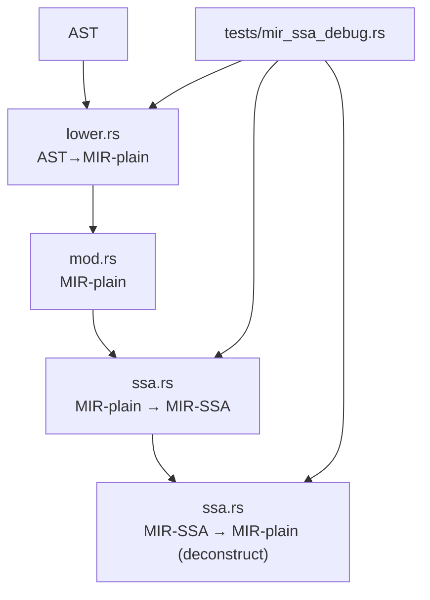
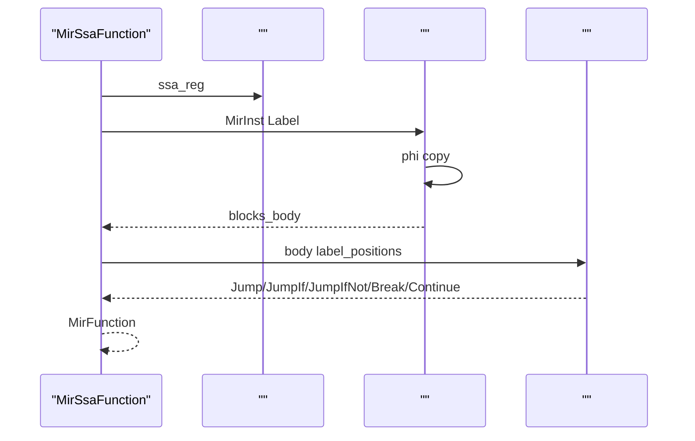
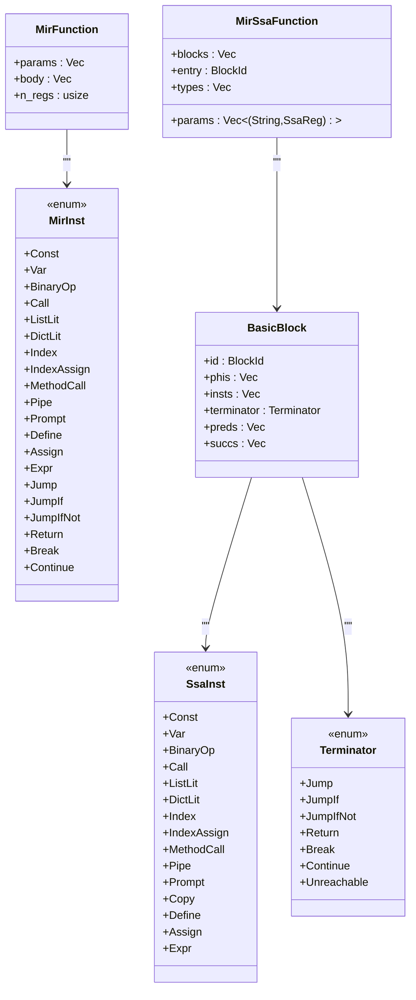
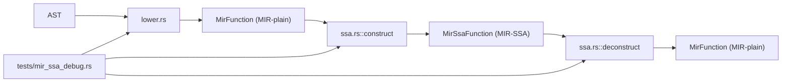

# SSA 

<cite>
****   
- [src/mir/ssa.rs](file://src/mir/ssa.rs)
- [src/mir/mod.rs](file://src/mir/mod.rs)
- [src/mir/lower.rs](file://src/mir/lower.rs)
- [tests/mir_ssa_debug.rs](file://tests/mir_ssa_debug.rs)
</cite>

## 
1. [](#)
2. [](#)
3. [](#)
4. [](#)
5. [](#)
6. [](#)
7. [](#)
8. [](#)
9. [](#)
10. [](#)

## 
 MIR-plain  MIR-SSA 
- Label  terminator 
-  immediate dominator 
- Dominance Frontier φ 
- DFS 
- deconstruct SSA  MIRphi → copyBlockId → Label

 src/mir/ssa.rs MIR-plain AST lowering φ  SSA IR

## 
MIR AST→MIR loweringSSA  deconstructSSA  ssa.rsMIR  mod.rsAST→MIR  lowering  lower.rs tests/mir_ssa_debug.rs



**** 
- [src/mir/lower.rs:1-120](file://src/mir/lower.rs#L1-L120)
- [src/mir/mod.rs:40-352](file://src/mir/mod.rs#L40-L352)
- [src/mir/ssa.rs:137-263](file://src/mir/ssa.rs#L137-L263)
- [tests/mir_ssa_debug.rs:1-30](file://tests/mir_ssa_debug.rs#L1-L30)

****
- [src/mir/mod.rs:40-352](file://src/mir/mod.rs#L40-L352)
- [src/mir/lower.rs:1-120](file://src/mir/lower.rs#L1-L120)
- [src/mir/ssa.rs:137-263](file://src/mir/ssa.rs#L137-L263)
- [tests/mir_ssa_debug.rs:1-30](file://tests/mir_ssa_debug.rs#L1-L30)

## 
- MirFunctionMIR 
- MirInstMIR 
- MirSsaFunctionSSA 
- BasicBlock φ terminator/
- SsaInstSSA 
- Terminatorbreak/continue

 SSA  CFG φ  MIR

****
- [src/mir/mod.rs:40-352](file://src/mir/mod.rs#L40-L352)
- [src/mir/ssa.rs:26-98](file://src/mir/ssa.rs#L26-L98)

## 
SSA 
1.  MIR-plain body Label  terminator 
2.  BasicBlock  insts  terminator
3.  terminator  succs preds CFG
4. 
5.  SSA  φ 
6. DFS  CFG
7. deconstruct  SSA  MIR-plainphi → copyBlockId → Label

```mermaid
flowchart TD
Start([""]) --> Scan[" body<br/> Label  terminator"]
Scan --> Split["<br/> BasicBlock"]
Split --> CFG[" succs/preds<br/> CFG"]
CFG --> DomTree["<br/>"]
DomTree --> DF[""]
DF --> CollectDefs[" defs"]
CollectDefs --> PhiInsert[" φ "]
PhiInsert --> Rename["DFS <br/>"]
Rename --> End([""])
```

**** 
- [src/mir/ssa.rs:265-321](file://src/mir/ssa.rs#L265-L321)
- [src/mir/ssa.rs:323-557](file://src/mir/ssa.rs#L323-L557)
- [src/mir/ssa.rs:559-656](file://src/mir/ssa.rs#L559-L656)
- [src/mir/ssa.rs:658-694](file://src/mir/ssa.rs#L658-L694)
- [src/mir/ssa.rs:696-774](file://src/mir/ssa.rs#L696-L774)
- [src/mir/ssa.rs:776-864](file://src/mir/ssa.rs#L776-L864)

****
- [src/mir/ssa.rs:265-321](file://src/mir/ssa.rs#L265-L321)
- [src/mir/ssa.rs:323-557](file://src/mir/ssa.rs#L323-L557)
- [src/mir/ssa.rs:559-656](file://src/mir/ssa.rs#L559-L656)
- [src/mir/ssa.rs:658-694](file://src/mir/ssa.rs#L658-L694)
- [src/mir/ssa.rs:696-774](file://src/mir/ssa.rs#L696-L774)
- [src/mir/ssa.rs:776-864](file://src/mir/ssa.rs#L776-L864)

## 

### Label  terminator 
- find_label_targets  Label  label→
- find_block_starts  0  Label  terminator  Jump/JumpIf/JumpIfNot/Break/Continue 
- split_into_ssa  terminator  insts  Terminator SsaInst

```mermaid
flowchart TD
A[" body"] --> B[" Label "]
B --> C[" starts={0} ∪ Labels"]
C --> D{" i"}
D --> | terminator| E["i+1  starts"]
D --> || F[" starts"]
E --> G[""]
F --> G
G --> H[""]
H --> I["split_into_ssa  insts + terminator"]
```

**** 
- [src/mir/ssa.rs:265-321](file://src/mir/ssa.rs#L265-L321)
- [src/mir/ssa.rs:323-557](file://src/mir/ssa.rs#L323-L557)

****
- [src/mir/ssa.rs:265-321](file://src/mir/ssa.rs#L265-L321)
- [src/mir/ssa.rs:323-557](file://src/mir/ssa.rs#L323-L557)

###  immediate dominator
- compute_dominators Dom(entry) = {entry}Dom(b) = {b} ∪ ⋂_{p∈preds(b)} Dom(p)
-  Dom(b)  d idom(b)

```mermaid
flowchart TD
Start([""]) --> Init[" dom_sets[b]"]
Init --> Loop{"changed?  iter<100"}
Loop --> || ForEach[" bid"]
ForEach --> Preds{"preds ?"}
Preds --> || NextBid[" bid"]
Preds --> || Intersect[" pred  Dom"]
Intersect --> Update["new_dom = {bid} ∪ "]
Update --> Compare{"new_dom != dom_sets[bid]?"}
Compare --> || SetChanged[" dom_sets  changed"]
Compare --> || NextBid
SetChanged --> Loop
NextBid --> Loop
Loop --> || Idom[" Dom  idom"]
Idom --> End([""])
```

**** 
- [src/mir/ssa.rs:559-656](file://src/mir/ssa.rs#L559-L656)

****
- [src/mir/ssa.rs:559-656](file://src/mir/ssa.rs#L559-L656)

###  φ 
- compute_dominance_frontier  idom 
- collect_definitions  Define SSA 
- φ insert_phi_nodes  defs  dom_frontier visited  φ 

```mermaid
flowchart TD
A[" dom_frontier"] --> B[" defs: reg→[blocks]"]
B --> C["worklist=defs "]
C --> D{"pop bid"}
D --> || E[""]
D --> || F["visited.insert(bid)"]
F --> G["block_defs =  regs"]
G --> H{"for reg in block_defs"}
H --> I["for target in dom_frontier[bid]"]
I --> J{"(target,reg)  phi?"}
J --> || K[" phi(target, reg)"]
K --> L{"target  worklist?"}
L --> || M["push target to worklist"]
L --> || N[""]
J --> || N
M --> D
N --> D
E --> D
```

**** 
- [src/mir/ssa.rs:658-694](file://src/mir/ssa.rs#L658-L694)
- [src/mir/ssa.rs:696-774](file://src/mir/ssa.rs#L696-L774)

****
- [src/mir/ssa.rs:658-694](file://src/mir/ssa.rs#L658-L694)
- [src/mir/ssa.rs:696-774](file://src/mir/ssa.rs#L696-L774)

### DFS 
- rename_variables  rename_stack[orig_reg] 
-  φ  φ.dst 
-  rename_reads 
- 
- DFS 

```mermaid
flowchart TD
Start([""]) --> Init["stack=[entry], visited={}"]
Init --> Pop{"pop bid"}
Pop --> || Continue[""]
Pop --> || Enter["visited.insert(bid)"]
Enter --> PhiPush{" phi(dst)?"}
PhiPush --> || PushVersions[" dst  push  rename_stack"]
PhiPush --> || InstLoop[" insts"]
PushVersions --> InstLoop
InstLoop --> ReadRename["rename_reads(inst) "]
ReadRename --> WriteRename[" dst  push  rename_stack"]
WriteRename --> TermHandle{" terminator "}
TermHandle --> SuccPush["push succs to stack"]
SuccPush --> Pop
Continue --> Pop
```

**** 
- [src/mir/ssa.rs:776-864](file://src/mir/ssa.rs#L776-L864)

****
- [src/mir/ssa.rs:776-864](file://src/mir/ssa.rs#L776-L864)

### SSA → MIR-plain
- deconstruct  ssa_reg → plain_reg  n 
- φ  φ  plain  terminator  copyAssign(tmp, src) + Var(dst_p, tmp)
- SsaInst  MirInstCopy 
-  body Label  body 



**** 
- [src/mir/ssa.rs:964-1357](file://src/mir/ssa.rs#L964-L1357)

****
- [src/mir/ssa.rs:964-1357](file://src/mir/ssa.rs#L964-L1357)

### 


**** 
- [src/mir/mod.rs:40-352](file://src/mir/mod.rs#L40-L352)
- [src/mir/ssa.rs:26-98](file://src/mir/ssa.rs#L26-L98)

****
- [src/mir/mod.rs:40-352](file://src/mir/mod.rs#L40-L352)
- [src/mir/ssa.rs:26-98](file://src/mir/ssa.rs#L26-L98)

## 
- AST→MIRlower.rs  AST  MIR  MirFunction
- MIR→SSAssa.rs  construct  MirFunction MirSsaFunction
- SSA→MIRssa.rs  deconstruct  SSA  MirFunction JIT 
- tests/mir_ssa_debug.rs parse→lower→construct→deconstruct



**** 
- [src/mir/lower.rs:1-120](file://src/mir/lower.rs#L1-L120)
- [src/mir/ssa.rs:137-263](file://src/mir/ssa.rs#L137-L263)
- [tests/mir_ssa_debug.rs:1-30](file://tests/mir_ssa_debug.rs#L1-L30)

****
- [src/mir/lower.rs:1-120](file://src/mir/lower.rs#L1-L120)
- [src/mir/ssa.rs:137-263](file://src/mir/ssa.rs#L137-L263)
- [tests/mir_ssa_debug.rs:1-30](file://tests/mir_ssa_debug.rs#L1-L30)

## 
-  CFG ~20 
-  φ  visited 
-  DFS  O( + φ )
- deconstruct  SSA 

[]

## 
-  Label  terminator 
-  entry Dom 
- φ  defs  Definedom_frontier 
-  rename_reads Define  src 
- deconstruct  ssa_to_plain copy  terminator 

****
- [src/mir/ssa.rs:265-321](file://src/mir/ssa.rs#L265-L321)
- [src/mir/ssa.rs:559-656](file://src/mir/ssa.rs#L559-L656)
- [src/mir/ssa.rs:696-774](file://src/mir/ssa.rs#L696-L774)
- [src/mir/ssa.rs:776-864](file://src/mir/ssa.rs#L776-L864)
- [src/mir/ssa.rs:964-1357](file://src/mir/ssa.rs#L964-L1357)

## 
 SSA φ  MIR

[]

## 
- 
  - [find_label_targets:265-273](file://src/mir/ssa.rs#L265-L273), [find_block_starts:275-321](file://src/mir/ssa.rs#L275-L321), [split_into_ssa:323-557](file://src/mir/ssa.rs#L323-L557)
  - [compute_dominators:559-656](file://src/mir/ssa.rs#L559-L656), [compute_dominance_frontier:658-694](file://src/mir/ssa.rs#L658-L694)
  - φ [collect_definitions:696-709](file://src/mir/ssa.rs#L696-L709), [insert_phi_nodes:731-774](file://src/mir/ssa.rs#L731-L774), [rename_variables:776-864](file://src/mir/ssa.rs#L776-L864)
  - [deconstruct:964-1357](file://src/mir/ssa.rs#L964-L1357)
- [debug_mir_dump:4-29](file://tests/mir_ssa_debug.rs#L4-L29)

****
- [src/mir/ssa.rs:265-321](file://src/mir/ssa.rs#L265-L321)
- [src/mir/ssa.rs:559-656](file://src/mir/ssa.rs#L559-L656)
- [src/mir/ssa.rs:658-694](file://src/mir/ssa.rs#L658-L694)
- [src/mir/ssa.rs:696-774](file://src/mir/ssa.rs#L696-L774)
- [src/mir/ssa.rs:776-864](file://src/mir/ssa.rs#L776-L864)
- [src/mir/ssa.rs:964-1357](file://src/mir/ssa.rs#L964-L1357)
- [tests/mir_ssa_debug.rs:4-29](file://tests/mir_ssa_debug.rs#L4-L29)