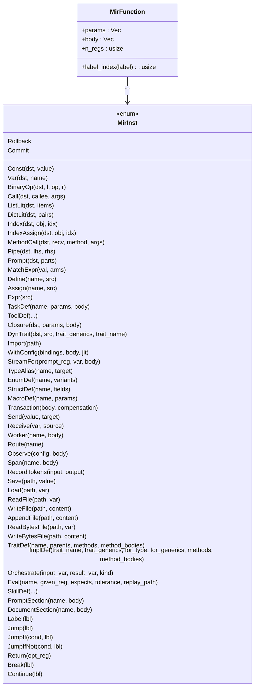
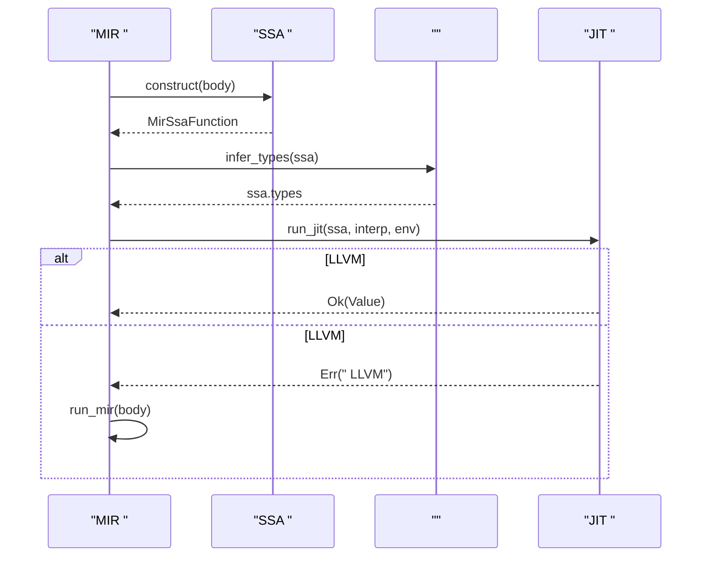
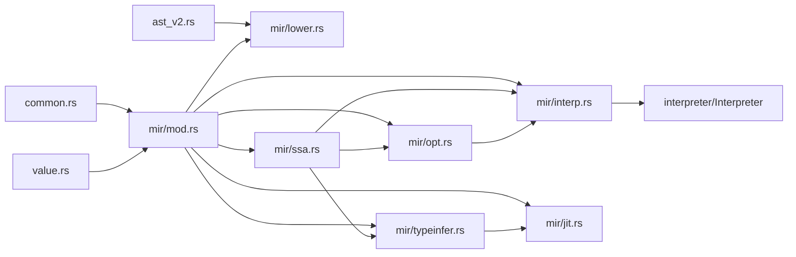

# 

<cite>
****
- [src/mir/mod.rs](file://src/mir/mod.rs)
- [src/mir/lower.rs](file://src/mir/lower.rs)
- [src/mir/ssa.rs](file://src/mir/ssa.rs)
- [src/mir/opt.rs](file://src/mir/opt.rs)
- [src/mir/typeinfer.rs](file://src/mir/typeinfer.rs)
- [src/mir/jit.rs](file://src/mir/jit.rs)
- [src/mir/interp.rs](file://src/mir/interp.rs)
- [src/ast_v2.rs](file://src/ast_v2.rs)
- [tests/mir_ssa_debug.rs](file://tests/mir_ssa_debug.rs)
</cite>

## 
1. [](#)
2. [](#)
3. [](#)
4. [](#)
5. [](#)
6. [](#)
7. [](#)
8. [](#)
9. [](#)
10. [](#)

## 
 Mora  AST  MIRSSA JIT MIR 

## 
Mora  src/mir 
- 
- AST → MIR lowering 
- SSA  deconstruct 
-  pass 
-  JIT 
- JIT 

```mermaid
graph TB
subgraph ""
A["AST v2<br/>/"]
end
subgraph ""
B["MIR <br/>"]
C["SSA <br/> + Phi + "]
D[" Pass <br/>CP/DCE/GVN/CopyProp/LICM/LSR/TailCall"]
E["<br/>RegType "]
F["JIT <br/>SSA→LLVM IR→native"]
end
subgraph ""
G["MIR <br/>pc "]
end
A --> B
B --> C
C --> D
D --> C
C --> E
E --> F
C --> G
D --> G
```


- [src/mir/mod.rs:1-352](file://src/mir/mod.rs#L1-L352)
- [src/mir/lower.rs:1-200](file://src/mir/lower.rs#L1-L200)
- [src/mir/ssa.rs:1-200](file://src/mir/ssa.rs#L1-L200)
- [src/mir/opt.rs:1-120](file://src/mir/opt.rs#L1-L120)
- [src/mir/typeinfer.rs:1-120](file://src/mir/typeinfer.rs#L1-L120)
- [src/mir/jit.rs:1-77](file://src/mir/jit.rs#L1-L77)
- [src/mir/interp.rs:1-120](file://src/mir/interp.rs#L1-L120)


- [src/mir/mod.rs:1-352](file://src/mir/mod.rs#L1-L352)
- [src/mir/lower.rs:1-200](file://src/mir/lower.rs#L1-L200)
- [src/mir/ssa.rs:1-200](file://src/mir/ssa.rs#L1-L200)
- [src/mir/opt.rs:1-120](file://src/mir/opt.rs#L1-L120)
- [src/mir/typeinfer.rs:1-120](file://src/mir/typeinfer.rs#L1-L120)
- [src/mir/jit.rs:1-77](file://src/mir/jit.rs#L1-L77)
- [src/mir/interp.rs:1-120](file://src/mir/interp.rs#L1-L120)

## 
- MIR // trait /I/O
- LoweringAST → MIR ASTv2 MIR Label + Jump/JumpIf/JumpIfNot/Break/Continue
- SSA  MIR-plain  Phi  SSA  MIR-plainPhi  copy 
-  Pass
-  RegType  JIT 
- JIT SSA → LLVM IR → native  LLVM 
- pc  Interpreter 


- [src/mir/mod.rs:1-352](file://src/mir/mod.rs#L1-L352)
- [src/mir/lower.rs:1-200](file://src/mir/lower.rs#L1-L200)
- [src/mir/ssa.rs:1-200](file://src/mir/ssa.rs#L1-L200)
- [src/mir/opt.rs:1-120](file://src/mir/opt.rs#L1-L120)
- [src/mir/typeinfer.rs:1-120](file://src/mir/typeinfer.rs#L1-L120)
- [src/mir/jit.rs:1-77](file://src/mir/jit.rs#L1-L77)
- [src/mir/interp.rs:1-120](file://src/mir/interp.rs#L1-L120)

## 
 AST  MIR SSA JIT/

```mermaid
sequenceDiagram
participant Parser as "/AST v2"
participant Lower as "Lowering (AST→MIR)"
participant Interp as "MIR "
participant SSA as "SSA "
participant Opt as " Pass"
participant TypeInf as ""
participant JIT as "JIT "
Parser->>Lower :  NodeId  Arena
Lower-->>Interp : MirFunction()
Note over Interp :  with jit 
Interp->>SSA : construct(MirFunction)
SSA-->>Opt : MirSsaFunction
Opt-->>SSA :  MirSsaFunction
SSA-->>Interp : deconstruct(MirSsaFunction)
Interp-->>Interp :  MIR
Interp->>TypeInf : infer_types(MirSsaFunction)
TypeInf-->>JIT :  ssa.types
JIT-->>Interp :  native 
Interp-->>Parser :  Value
```


- [src/mir/lower.rs:1-200](file://src/mir/lower.rs#L1-L200)
- [src/mir/ssa.rs:1-200](file://src/mir/ssa.rs#L1-L200)
- [src/mir/opt.rs:1-120](file://src/mir/opt.rs#L1-L120)
- [src/mir/typeinfer.rs:1-120](file://src/mir/typeinfer.rs#L1-L120)
- [src/mir/jit.rs:1-77](file://src/mir/jit.rs#L1-L77)
- [src/mir/interp.rs:1-120](file://src/mir/interp.rs#L1-L120)

## 

### 
- 
  - ConstVarBinaryOpCallListLitDictLitIndexIndexAssignMethodCallPipePromptMatchExpr 
  - DefineAssignExpr 
  - LabelJumpJumpIfJumpIfNotReturnBreakContinue
  - TaskDefToolDefClosureDynTraitImportWithConfigStreamForworkerI/Otrait/implorchestrateevalskill/prompt/document section 
- 
  - usize lowering MirFunction.n_regs 
  -  Vec<Value> pc 




- [src/mir/mod.rs:1-352](file://src/mir/mod.rs#L1-L352)


- [src/mir/mod.rs:1-352](file://src/mir/mod.rs#L1-L352)

### AST → MIR Lowering 
-  lower_program  lower_expr/lower_stmt emit  MirInst
- 
  - If/Else JumpIfNot  Jump 
  - For loop_stack  Break/Continue 
  - Match arm body  MirFunction MatchExpr 
- 
  - TaskDef/ToolDef/Closure/DynTrait/WithConfig/StreamFor  lower  MirFunction
  - ////I/O/trait/impl/orchestrate/eval/skill/prompt/document section  MirInst

```mermaid
flowchart TD
Start([": lower_program"]) --> LoopStmts[""]
LoopStmts --> LowerExpr["lower_expr(expr)"]
LowerExpr --> EmitInst["emit  MirInst"]
EmitInst --> NextExpr{"?"}
NextExpr --> || LowerExpr
NextExpr --> || LowerStmt["lower_stmt(stmt)"]
LowerStmt --> ControlFlow{"?"}
ControlFlow --> |If/Else| PatchLabels[""]
ControlFlow --> |For| LoopUnroll["+loop_stack"]
ControlFlow --> |Match| NestedFunc["arm body  MirFunction"]
ControlFlow --> || EmitStmt["emit "]
PatchLabels --> NextStmt[""]
LoopUnroll --> NextStmt
NestedFunc --> NextStmt
EmitStmt --> NextStmt
NextStmt --> Done([":  MirFunction"])
```


- [src/mir/lower.rs:1-200](file://src/mir/lower.rs#L1-L200)
- [src/mir/lower.rs:200-500](file://src/mir/lower.rs#L200-L500)
- [src/mir/lower.rs:500-800](file://src/mir/lower.rs#L500-L800)


- [src/mir/lower.rs:1-200](file://src/mir/lower.rs#L1-L200)
- [src/mir/lower.rs:200-500](file://src/mir/lower.rs#L200-L500)
- [src/mir/lower.rs:500-800](file://src/mir/lower.rs#L500-L800)

### SSA 
-  Label  terminator  CFGpred/succ
-  idom  dominance frontier
- Phi  Phi 
- DFS 
- Deconstruct SSA  MIR-plainPhi  copy BlockId  Label 

```mermaid
flowchart TD
S([": MirFunction"]) --> Split[""]
Split --> CFG[" pred/succ "]
CFG --> Dom[" idom"]
Dom --> DF[""]
DF --> Phi[" Phi "]
Phi --> Rename["(DFS)"]
Rename --> SSAOut[": MirSsaFunction"]
SSAOut --> Decon["Deconstruct: SSA→MIR-plain"]
Decon --> PlainOut[": MirFunction"]
```


- [src/mir/ssa.rs:1-200](file://src/mir/ssa.rs#L1-L200)
- [src/mir/ssa.rs:200-600](file://src/mir/ssa.rs#L200-L600)
- [src/mir/ssa.rs:600-1000](file://src/mir/ssa.rs#L600-L1000)
- [src/mir/ssa.rs:1000-1357](file://src/mir/ssa.rs#L1000-L1357)


- [src/mir/ssa.rs:1-200](file://src/mir/ssa.rs#L1-L200)
- [src/mir/ssa.rs:200-600](file://src/mir/ssa.rs#L200-L600)
- [src/mir/ssa.rs:600-1000](file://src/mir/ssa.rs#L600-L1000)
- [src/mir/ssa.rs:1000-1357](file://src/mir/ssa.rs#L1000-L1357)

###  Pass 
- Basic
  - CP Const  BinaryOp  Copy/Assign/Expr 
  - Copy Propagation Copy(dst, src)  src
  - DCE
  - GVN
- Aggressive
  - LICM pre-header
  - LSR/ opt.rs
  - Tail Call Optimization opt.rs

```mermaid
flowchart TD
In([": MirSsaFunction"]) --> CP[""]
CP --> CopyProp[""]
CopyProp --> DCE[""]
DCE --> GVN[""]
GVN --> Agg{"?"}
Agg --> || LICM[""]
LICM --> LSR[""]
LSR --> Tail[""]
Tail --> Out([":  MirSsaFunction"])
Agg --> || Out
```


- [src/mir/opt.rs:1-120](file://src/mir/opt.rs#L1-L120)
- [src/mir/opt.rs:120-400](file://src/mir/opt.rs#L120-L400)
- [src/mir/opt.rs:400-800](file://src/mir/opt.rs#L400-L800)
- [src/mir/opt.rs:800-990](file://src/mir/opt.rs#L800-L990)


- [src/mir/opt.rs:1-120](file://src/mir/opt.rs#L1-L120)
- [src/mir/opt.rs:120-400](file://src/mir/opt.rs#L120-L400)
- [src/mir/opt.rs:400-800](file://src/mir/opt.rs#L400-L800)
- [src/mir/opt.rs:800-990](file://src/mir/opt.rs#L800-L990)

### RegType 
-  SSA  JIT 
-  + Phi 
- 
  - Const  Value  RegType
  - BinaryOp int/float/bool/Any
  - ListLit DictLit  Any
  - Index  list<T>/dict[K,V] 
  - Copy/Define/Assign/Expr 
  - Phi  incoming Any 


- [src/mir/typeinfer.rs:1-120](file://src/mir/typeinfer.rs#L1-L120)
- [src/mir/typeinfer.rs:120-303](file://src/mir/typeinfer.rs#L120-L303)

### JIT 
- SSA → LLVM IR → O3→ JIT  → native 
-  feature "jit"  LLVM  fallback
-  typeinfer  ssa.types SSA  LLVM 
-  with jit  native 




- [src/mir/jit.rs:1-77](file://src/mir/jit.rs#L1-L77)
- [src/mir/typeinfer.rs:1-120](file://src/mir/typeinfer.rs#L1-L120)
- [src/mir/interp.rs:200-250](file://src/mir/interp.rs#L200-L250)


- [src/mir/jit.rs:1-77](file://src/mir/jit.rs#L1-L77)
- [src/mir/typeinfer.rs:1-120](file://src/mir/typeinfer.rs#L1-L120)
- [src/mir/interp.rs:200-250](file://src/mir/interp.rs#L200-L250)

### 
- pc  MirInst pc
- Define/Assign  Environmentwith / AI config
- TaskDef Closure DynTrait /worker/send/receiveI/O  file trait/impl orchestrate/eval/skill/prompt/document section 


- [src/mir/interp.rs:1-120](file://src/mir/interp.rs#L1-L120)
- [src/mir/interp.rs:120-400](file://src/mir/interp.rs#L120-L400)
- [src/mir/interp.rs:400-800](file://src/mir/interp.rs#L400-L800)
- [src/mir/interp.rs:800-970](file://src/mir/interp.rs#L800-L970)

## 
- 
  - mir/mod.rs  lower/ssa/opt/interp/jit/typeinfer 
  - lower.rs  ast_v2.rs  AST  flow 
  - ssa.rs  common::BinaryOp  value::Value
  - opt.rs  ssa  common::BinaryOp
  - typeinfer.rs  ssa  value::Value
  - jit.rs  ssa  interpreter/Environment
  - interp.rs  interpreter::Interpretervalue::Environmentflow::eval_binary
- 
  - Interpreter.mir_call_function/call_value 
  -  LLVM inkwell JIT




- [src/mir/mod.rs:1-352](file://src/mir/mod.rs#L1-L352)
- [src/mir/lower.rs:1-200](file://src/mir/lower.rs#L1-L200)
- [src/mir/ssa.rs:1-200](file://src/mir/ssa.rs#L1-L200)
- [src/mir/opt.rs:1-120](file://src/mir/opt.rs#L1-L120)
- [src/mir/typeinfer.rs:1-120](file://src/mir/typeinfer.rs#L1-L120)
- [src/mir/jit.rs:1-77](file://src/mir/jit.rs#L1-L77)
- [src/mir/interp.rs:1-120](file://src/mir/interp.rs#L1-L120)
- [src/ast_v2.rs:1-200](file://src/ast_v2.rs#L1-L200)


- [src/mir/mod.rs:1-352](file://src/mir/mod.rs#L1-L352)
- [src/mir/lower.rs:1-200](file://src/mir/lower.rs#L1-L200)
- [src/mir/ssa.rs:1-200](file://src/mir/ssa.rs#L1-L200)
- [src/mir/opt.rs:1-120](file://src/mir/opt.rs#L1-L120)
- [src/mir/typeinfer.rs:1-120](file://src/mir/typeinfer.rs#L1-L120)
- [src/mir/jit.rs:1-77](file://src/mir/jit.rs#L1-L77)
- [src/mir/interp.rs:1-120](file://src/mir/interp.rs#L1-L120)
- [src/ast_v2.rs:1-200](file://src/ast_v2.rs#L1-L200)

## 
-  with jit  JIT
- 
  - 
  - 
  - GVN 
  - LICM/LSR 
  - 
-  JIT  LLVM 
- JIT 

[]

## 
- 
  - JIT  LLVM 17  --features jit 
  - / RegType::Any JIT 
  -  natural loop  pre-header 
- 
  -  tests/mir_ssa_debug.rs  MIRSSA  deconstructed MIR
  -  with jit  JIT  LLVM 
  -  MORA_OPT 0=1=>=2=


- [src/mir/jit.rs:1-77](file://src/mir/jit.rs#L1-L77)
- [src/mir/typeinfer.rs:1-120](file://src/mir/typeinfer.rs#L1-L120)
- [src/mir/ssa.rs:1-200](file://src/mir/ssa.rs#L1-L200)
- [tests/mir_ssa_debug.rs:1-30](file://tests/mir_ssa_debug.rs#L1-L30)

## 
Mora AST → MIR → SSA →  →  → JIT/ JIT 

[]

## 

###  passes
- 
  -  AST v2  ast_v2.rs  ExprKind/StmtKind
  -  MIR  MirInst  mir/mod.rs
  -  lowering  AST → MIR  mir/lower.rs
  -  mir/interp.rs
-  pass
  -  opt.rs  optimize 
  -  pass  SSA  deconstruct 
- 
  -  typeinfer.rs  merge/infer 
-  JIT 
  -  jit.rs  SSA → LLVM IR  RegType  LLVM 
  -  inkwell 


- [src/ast_v2.rs:1-200](file://src/ast_v2.rs#L1-L200)
- [src/mir/mod.rs:1-352](file://src/mir/mod.rs#L1-L352)
- [src/mir/lower.rs:1-200](file://src/mir/lower.rs#L1-L200)
- [src/mir/interp.rs:1-120](file://src/mir/interp.rs#L1-L120)
- [src/mir/opt.rs:1-120](file://src/mir/opt.rs#L1-L120)
- [src/mir/typeinfer.rs:1-120](file://src/mir/typeinfer.rs#L1-L120)
- [src/mir/jit.rs:1-77](file://src/mir/jit.rs#L1-L77)